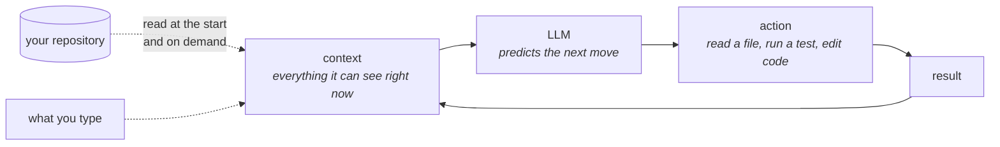
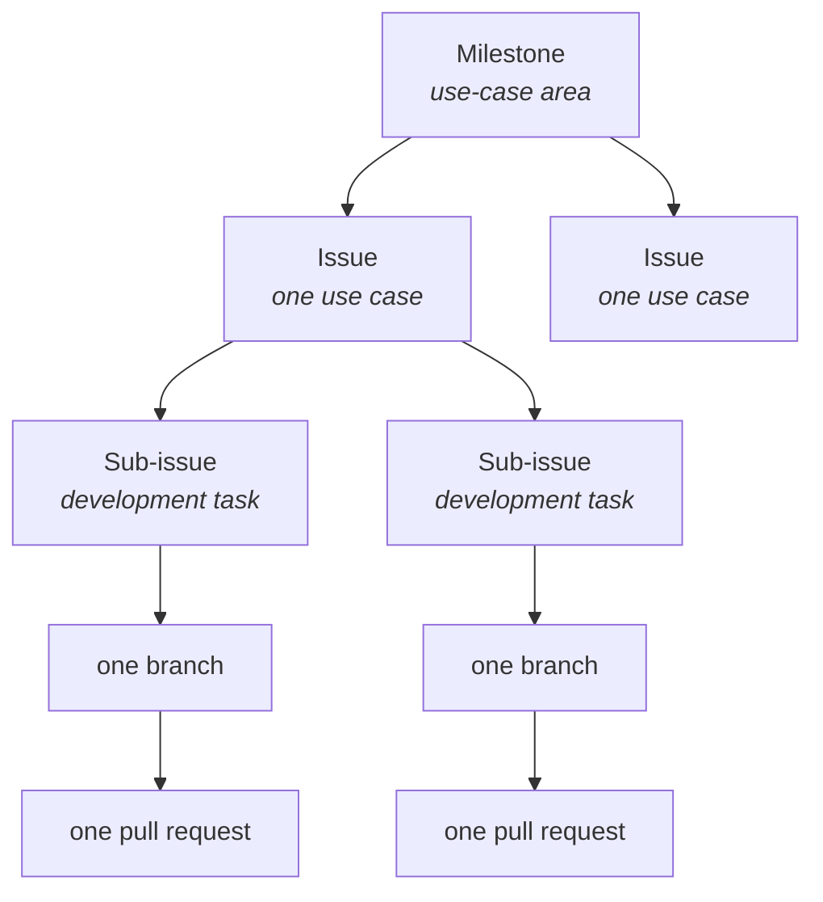
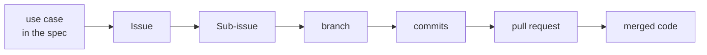

# The AI-Augmented Team

**Slides:** [The AI-Augmented Team](../slides/ai-augmented-team.html) (the fast version).

> **Purpose (one line):** set your team up so the work is legible to every member, including the one that forgets everything between sessions: put what governs the project in the repository, and make every unit of work traceable from requirement to merged code.

## 1. Learning objectives

By the end of this module, a student can:

1. Explain from the machinery (the language model, the context, the context window, and the agent loop) why an agent has no memory between sessions, and why a decision made in a meeting or in Slack never reaches it.
2. Map a team's work onto GitHub's artifacts: the milestone is a use-case area, the issue is a use case, the sub-issue is a development task, and each sub-issue has exactly one accountable assignee.
3. Judge whether an issue is well-formed, using its acceptance criteria as the test; rewrite one that is not; and predict what an agent does with one that stays vague.
4. Size a branch by the test that it leaves `main` green and is small enough for a human to review, and distinguish the unit of merge from the unit of done.
5. Own a use case across the whole stack, and explain why splitting one by layer across teammates leaves the integration defect with no owner.
6. Write the project charter an agent needs (`AGENTS.md`, with a one-line `CLAUDE.md` beside it), and say which conventions belong at the root and which belong next to the code.
7. Trace a merged line of code back to the requirement that asked for it, and name what a team contract must fix.

## 2. Where it fits

- **Prerequisites:** [SE and What AI Changes](se-and-ai.md), which established that you are accountable for what the agent writes. This module is about the machinery that makes that accountability possible.
- **Leads into:** requirements as the contract in weeks 3 and 4, where you write the use cases this module tells you how to track, and [Requirements Traceability](traceability.md) in week 8, which takes the chain sketched here and makes it a standing discipline.
- **How it's taught:** one lecture day, then practiced every week for the rest of the term. Your team's repository, board, and contract are stood up in the first [studio](../studio.md).
- **Course outcome it delivers:** [working in a team using GitHub as the single source of truth](../syllabus.md#learning-outcomes) (outcome 3), and it opens [maintaining living traceability](../syllabus.md#learning-outcomes) (outcome 8).

## 3. Motivation

**The problem, on Project Pulse.** Open [`CLAUDE.md`](https://github.com/Washingtonwei/project-pulse/blob/main/CLAUDE.md) at the root of the Project Pulse repository and you will find this instruction, written for an agent to read:

> The **glossary** fixes vocabulary. Use the defined term in code identifiers and UI text, never a synonym.

That is a team decision. Somebody decided that the person being evaluated is called one specific thing everywhere: in the database column, in the Java field, in the Vue component, and on the screen. It is exactly the kind of decision a team makes once, in a meeting, in ten seconds, and never writes down.

Suppose it had stayed in that meeting. A teammate asks an agent to add a peer-evaluation endpoint. The agent has never attended a meeting. It reads the code it can see, finds no rule, picks a reasonable word, and ships `reviewee` into a codebase that says `evaluatee` everywhere else. Nothing fails. The tests pass. The pull request looks fine. Six weeks later somebody writes a query that silently returns nothing, and the fix is a migration.

The rule is in `CLAUDE.md` because that is the only place the agent will ever look.

**A real failure it prevents.** On September 23, 1999, the Mars Climate Orbiter fired its main engine to enter orbit and was never heard from again. The NASA mishap investigation board found the cause: ground software supplied by the contractor produced impulse figures in pound-seconds, and the navigation software at the Jet Propulsion Laboratory consumed them as newton-seconds. The spacecraft came in far too low and broke up. Roughly 125 million dollars of spacecraft, lost to a units mismatch between two competent teams.

Nobody wrote bad code. Each team's software was correct under its own assumption. The failure was that the assumption lived in one team's head and never reached the other team's, and the interface between them carried numbers without carrying what the numbers meant. That is the failure this module is about, and adding an agent to the team makes it more likely rather than less, because the agent has no hallway, no standup, and no memory of last Tuesday.

## 4. Core concepts

### 4.1 The new teammate has amnesia

Week 1 defined an agent as a language model wired to tools. Open that definition up, because the memory question is settled by the machinery rather than by how clever the model is.

**The brain is a large language model.** An LLM is a very large statistical model of text. It was trained on an enormous corpus by repeatedly predicting the next chunk of text (a **token**, roughly a word-piece) given everything before it, and the parameters that survived training encode a great deal about how code, English, and Java conventions tend to go. Two things follow. It knows Spring Boot in general, because Spring Boot is all over its training data. It knows nothing whatsoever about your project, because your project was not.

**The model is a function, not a process.** You give it text, it returns text, it stops. It is not sitting there between your messages, and nothing carries over: no variables, no notes, no recollection of the last thing it told you.

Which raises an obvious question. If the model remembers nothing, why does a chat conversation seem to?

**Because the whole conversation is re-sent every turn.** Your first message, its reply, your second message, all of it, resubmitted as one block of text each time you press enter. What looks like memory is re-reading. The block of text handed to the model on a given turn is its **context**, and the size limit on that block is the **context window**, measured in tokens. Anything that is not in the context on this turn does not exist on this turn.

**The agent is the loop around the model.** A coding agent adds tools and a cycle: read files, run a command, look at what came back, decide the next move, repeat, all of it accumulating in the context.



Now the property that matters, and it is duller than intelligence: **when the session ends, the context is discarded.** Tomorrow's session starts empty and rebuilds its context from scratch, out of exactly two sources: what you type, and what it can read from disk. The repository is the second one. It is the only part of yesterday that is still there tomorrow.

So the question "does the agent know about our decision?" is never a question about intelligence. It is a question about whether the decision is somewhere the agent reads.

**And "the agent" is not even a stable thing.** Halfway through a Thursday you hit your plan's usage limit, and rather than wait until Monday you finish the task in Codex, or Gemini CLI, or whatever your teammate has installed. That it cannot see the old session is obvious. Less obvious: it does not read the same instruction file either. It starts from nothing and assembles a context out of what it finds in your repository.

What transfers is what you committed. The half-finished change you never committed is invisible; the decision you talked through at turn nine is gone; the issue's acceptance criteria, the branch, the diff so far, and the charter are still there. So the discipline is the same one, one notch tighter: **before you run out, get the state out of the session and into the repository.** A comment on the issue, a commit on the branch even of unfinished work, and any decision you reached in conversation written into the charter (4.11 covers that file, and how to make one serve every tool).

### 4.2 What the agent can see

| It can read | It cannot read |
|---|---|
| Files in the repository, including your specification and your charter | What was said out loud in your team meeting |
| The issue and pull request text you point it at | The client's tone of voice when they said "obviously" |
| Command output it runs itself (tests, builds, `git log`) | Whatever a teammate has not written down yet |
| Its own edits, within one session | Anything from its previous session |

Everything in the right-hand column is knowledge your team has. None of it reaches the agent. The human cost is the same one step slower: a teammate who was sick on Tuesday is in the position the agent is in permanently.

This is the thesis of the module:

> **The repository is the team's shared memory, and it is the only memory the agent has.**

Single source of truth stops being a filing rule when you read it that way. A decision that lives only in Slack is a decision your agent will contradict, confidently, next week.

**"But could we just connect Slack to the agent?"** Yes, technically. Agents take tools through connectors (the Model Context Protocol is the common standard), Slack has a documented API, and Slack connectors already exist. You could give an agent your channel history this afternoon.

It would not help, and why it would not is worth more than the thesis it appears to threaten. **Read access is not a source of truth.**

- **A chat log has no notion of current.** Git replaces; chat accumulates. A decision made in September and reversed in October sit in the stream looking exactly alike. Your repository holds one current version of the rule, and its history is a separate thing you go looking for.
- **Retrieval returns the argument, not the conclusion.** Ask a connected agent what your team decided about time zones and you get the four messages where people disagreed, a joke, and somebody's lunch plan. The message that actually settled it carries no marking that distinguishes it from the three that did not.
- **It does not fit.** A semester of Slack is far larger than any context window, so something has to select a handful of messages, and which handful is close to a lottery.
- **Nothing in Slack was reviewed.** A change to your charter arrives as a pull request that a teammate approved. A message in Slack arrives because somebody typed it at midnight.

So connecting Slack gives your agent more text, not better context. That distinction runs through the whole course, and week 5 is built on it.

### 4.3 GitHub as that memory

Three artifacts carry the work. They are commonly confused, and the difference matters.

| Artifact | What it is | What it represents |
|---|---|---|
| GitHub **Project** | A board that displays issues in columns | The team's current state, at a glance |
| GitHub **Issue** | A unit of customer value, with acceptance criteria | One **use case** |
| GitHub **Sub-issue** | A unit of implementation work under an issue | One **development task** |

A Project board **does not contain the work.** It is a view. Delete the board and you lose a convenience; delete the issues and you lose the project.

The hierarchy, and the reason for each level:



The unit at the issue level is the **use case**, not a "user story." Weeks 3 and 4 cover why: a use case names the actor, the trigger, the main success scenario, and the extensions, so it carries the flows you have to test. Project Pulse is keyed the same way, one row per use case in [`docs/traceability.md`](https://github.com/Washingtonwei/project-pulse/blob/main/docs/traceability.md), and its charter states the consequence plainly: citation is at the use-case level, so a use case has to stay small enough that "this one passes" is a meaningful statement.

Every sub-issue has exactly one assignee. Not because engineers work alone (pair on the hard ones), but because one person has to answer for the result. On a team where the agent wrote most of the diff, the assignee is not the person who typed it. **The assignee is the person who signs it**, which is week 1's accountability rule arriving somewhere concrete.

### 4.4 What makes an issue well-formed

An issue is well-formed when someone who was not in the room can tell whether the work is done. That is what **acceptance criteria** are for, and it is the only test worth remembering.

Two real issues from Project Pulse, both written by people on the project.

[**Issue #33, "Make Project Pulse Mobile-Friendly for Student and Instructor Workflows"**](https://github.com/Washingtonwei/project-pulse/issues/33) runs to 124 lines and carries background, a summary, the exact pages in scope, the current behavior, the proposed approach, explicit **non-goals** ("no new features, no visual redesign, no native app"), and eight checkboxed acceptance criteria including this one:

> - [ ] No horizontal scrolling on common phone widths (~375px)

That is checkable by someone who has never met the author. It names a number.

[**Issue #37, "Show an error on invalid credentials"**](https://github.com/Washingtonwei/project-pulse/issues/37) is three sentences and a screenshot: the login page shows nothing when credentials are wrong, the console shows the error, and the suggested fix is a pop-up saying "invalid credentials."

Everything in #37 is true and none of it is a specification. Does "invalid credentials" mean a wrong password, an unknown account, or a locked one, and does the message distinguish them? (It had better not, for security reasons, but that is a decision the issue does not make.) Toast, inline under the field, or both? How long does it stay? Notice too the shape of the third sentence: it proposes a solution instead of stating a requirement, handing the design decision to whoever reads it first.

Issue #33 is not longer because its author was more thorough. It is longer because its author was answering the question *how would a stranger know this was done?*

### 4.5 The failure is silent

Here is why 4.4 is an engineering concern rather than a project-management preference.

**A vague issue does not stop an agent.** It has no mechanism for stopping. Hand it issue #37 and it will not reply "insufficient detail": it infers the missing acceptance criteria, commits to them silently, and writes clean, tested, confident code against its own invention. You get a two-second toast reading "Invalid credentials", because that is the median answer on the internet, and no signal at all that a decision was made on your behalf.

Compare the two failure modes:

| | A vague issue given to a person | A vague issue given to an agent |
|---|---|---|
| What happens | They ask you a question | It picks an answer |
| When you find out | Immediately, in Slack | At review, if the reviewer is paying attention |
| What it looks like | An interruption | Finished work |

The second row is the whole problem. Under-specification used to announce itself as friction. With an agent it arrives as a completed pull request, which is the shape work takes when it is going well.

So "keep the board current" and "write acceptance criteria" are not administrative hygiene on an AI-augmented team. They are the mechanism that stops your agent from designing your product for you. This is the delegation boundary from week 1 applied to the artifact instead of the task: the acceptance criteria are what you keep human so that the implementation is safe to delegate.

### 4.6 What a branch should be

Should a branch be an issue or a sub-issue? The answer is worth more than the rule it produces.

**A branch is not a unit of work. It is a unit of integration.** One branch means one pull request means one merge into `main`. So the real question is what a pull request should be, and that has a settled answer built on two constraints:

1. **Small enough that a human actually reviews it.** Review quality falls off a cliff after a few hundred lines. A 900-line pull request does not get reviewed; it gets approved.
2. **`main` stays green and deployable after every merge.** Not "the feature is finished," but "nothing is broken and the build passes."

From those two:

> **A branch is the smallest change that leaves `main` green and is worth reviewing on its own.**

Usually that is one sub-issue. Sometimes it is a whole use case. The size is a judgment you make, not a mapping you look up, and three clauses keep the judgment honest.

**Do not split a small use case.** Much of any real system is CRUD. `UC-RUB-view-rubric` in Project Pulse is one Vue call, one controller method, one service method, and five tests that differ only in who is logged in. Splitting that into three sub-issues produces ceremony, not engineering. One sub-issue, one branch, done. Split when a use case runs to more than a day's work.

**Every merge leaves `main` green and deployable.** A backend endpoint that nothing calls yet satisfies this. A half-applied schema migration does not. This is the clause that makes short branches safe, and it is the one to be strict about.

**The use case is the unit of *done*; the branch is the unit of *merge*.** This is the distinction teams get wrong. Merging your pull request does not mean the use case works. The issue closes when the use case works end to end and its tests pass, which usually takes several merges.

**Splitting for merge is not splitting for ownership, and confusing the two is the classic way a senior design team fails.** You saw it in week 1: "I'll take the front end", "I'll take login." It feels efficient in September and it is fatal by November, because the use case now has no owner. The defect that only appears when the front end meets the back end belongs to nobody, "done" requires two people to agree they are finished, and neither of them learns the stack.

So:

> **One developer owns a use case end to end: front end, back end, tests, and the pipeline that ships it.**

You are not the front-end person, the database person, or the tester. Every one of you is full stack, on your own use cases, all term. This is a course requirement, not a preference: the layer specialist is the most comfortable role on a student team and the least employable one, and it is how a team arrives in November with six parts and no product.

The owner may still cut three branches, because three reviewable merges beat one enormous one. Same person, sequential, each leaving `main` green. What you do not do is hand the layers to different people. Parallelism happens **across use cases, not inside one**: six people means up to six use cases moving at once, each with an owner who can answer for it.

**Why short branches, and not one long one per feature?** Because the longer a branch lives, the more `main` moves underneath it, and the merge gets worse every day. A week-old branch on a six-person team is a guaranteed conflict. Professional teams keep branches alive for hours to a couple of days for exactly this reason. Aim to merge within two days; if you cannot, the task was too big.

**And this matters more now, not less.** An agent will hand you a 1,200-line diff across nine files in twenty minutes. Generation got cheap; review capacity did not. **The size of a pull request is set by how much a human can actually review, and that number did not change when the agent arrived.**

### 4.7 The pull request is the first read

There is a second reason branches matter now, and it is bigger than merge conflicts.

**Review used to be a second opinion. It is now the first read.** When a human typed the code, the author had already been forced to understand every line by the act of writing it: typing was a slow, involuntary review, and the reviewer was genuinely second. When an agent writes it, that first pass is gone. The author read the prompt and the agent's summary. Nobody has read the diff. The reviewer is not checking someone's work; they are reading the code for the first time on behalf of the whole team.

**And the signals reviewers rely on have stopped carrying information.** Experienced reviewers skim for fluency: consistent naming, sensible structure, tests present, doc comments. Those were never the point, but they correlated with care, because producing them took effort only a careful person spent. Agent output has all of them for free. Fluent, well-structured, confidently wrong code is cheap now, and the heuristics we evolved to triage human code are calibrated on a world that no longer exists.

Put those together and the merge gate is the **last structural point at which a human is required to look at all**. Push straight to `main` and there is no such point. That is the real argument for branching on an AI-augmented team, and it is not about conflicts.

Which makes **"LGTM"** the characteristic failure of this era of software engineering. It was always lazy. It is now the mechanism by which code that nobody has read, written by something that cannot be asked what it meant, becomes your team's problem in November.

What to do instead, in order:

1. **Read the issue before the diff.** A diff can only be judged against what was asked for. If you cannot state the acceptance criteria after reading the issue, stop and fix the issue.
2. **Ask what the agent assumed.** Every under-specified detail got decided by something. Find two of those decisions and check they are the ones your team would have made.
3. **Look where nobody prompted.** The agent optimizes the path it was asked about. Check the extensions, the empty case, the error path, and what happens on the second click.
4. **Apply the explanation test.** The assignee has to be able to say why any line is there, what it does on empty input, and what breaks if you remove it. If they cannot, the pull request is not ready, whoever or whatever wrote it.

This is why the size limit in 4.6 is not a style preference. A four-hundred-line pull request can get all four. A twelve-hundred-line one gets "LGTM", and everybody involved knows it.

### 4.8 A worked example

`UC-TEA-assign-students` in Project Pulse: the course admin assigns students to teams. It is big enough to split, and the [traceability matrix](https://github.com/Washingtonwei/project-pulse/blob/main/docs/traceability.md) names its real artifacts.

**Milestone:** `TEA`, the team-management use-case area.

**Issue #41, `UC-TEA-assign-students`.** Acceptance criteria: an admin can add a student to a team in their section; a student already on another team in that section is moved rather than duplicated; a student outside the section is rejected with a message naming why; the roster reflects the change without a page reload.

**Maya owns it**, all of it. She is a full-stack owner of one use case, not the team's backend person. She cuts three branches because three reviewable merges beat one large one, and each merge leaves `main` green.

| Sub-issue | Branch | What merges | State of `main` after |
|---|---|---|---|
| #42 Assign endpoint, service, and the not-in-section rejection | `feat/42-assign-student-backend` | `TeamController.assignStudentToTeam`, `TeamService.assignStudentToTeam`, `TeamServiceTest`, `TeamIntegrationTest.assignStudentToTeamNotInSameSection` | Green. The endpoint exists and nothing calls it yet. |
| #43 API function and the assign control | `feat/43-assign-student-ui` | `apis/team.assignStudentToTeam`, the control in `Teams.vue`, the error state when the back end rejects | Green. An admin can now do the thing. |
| #44 End-to-end coverage | `test/44-assign-student-e2e` | Cypress spec for the happy path and the rejection | Green, and now verified. |

What Maya does on #42:

1. Claims it and moves the card to In progress.
2. `git switch -c feat/42-assign-student-backend` off `main`.
3. Works the task, agent or not. Commits carry the number: `feat: reject assignment when student is outside the section (#42)`.
4. Opens a pull request whose description says **`Closes #42`** and names the acceptance criteria it satisfies.
5. **Devon reviews**, and Devon does not own this use case. He is the outside reader, which is the whole value of review. Not the diff first: the **issue** first, then the diff against it.
6. Merge. GitHub closes #42 and the board moves the card. Issue #41 stays open at one of three.

Then Maya does the same for #43 and #44. When the third merges, #41 closes and the use case is built, tested, and shipped by one accountable person. Meanwhile Devon and Priya own their own use cases end to end, and Maya reviews theirs.

**Now the contrast.** `UC-RUB-view-rubric` gets none of this. One person, one sub-issue, one branch, one pull request, an hour. Reaching for three sub-issues there would be following a rule instead of thinking.

Four things the example does on purpose. **One owner across the whole stack**, so the integration defect has somebody's name on it. The **branch name carries the number**, so six months later `git log` on a strange line leads to the branch, the branch to #42, #42 to #41, and #41 to the use case, and that chain survives everyone forgetting. The **split is by deployable slice**, so each piece merges without breaking `main`. And the **reviewer is not the owner**, because the point of review is a reader who was not there when the decisions were made.

**An honest note about the running example.** Project Pulse uses no Projects board and no milestones. It carries a traceability document instead, which is the same idea with more machinery than your team needs in September. You will use the board. What Project Pulse demonstrates is the discipline underneath both: every unit of work has an identifier, and that identifier connects a requirement to the code satisfying it.

### 4.9 The traceability chain

When each unit of work is one sub-issue, one branch, one pull request, the connections come for free:



Which means the team can answer, without asking anyone:

- Which commits implemented this requirement?
- Which pull request completed this use case, and who reviewed it?
- Which acceptance criteria were satisfied, and by what?
- This line of code is strange. What asked for it?

That last question matters most on an AI-augmented team. When most of the code was typed by a human, "why is this here?" has a witness. When most of it was generated, the witness is gone: the person who merged it read it once, and the agent that wrote it has forgotten the session. The chain replaces the witness. Week 8 makes this a standing discipline; for now, build the habit of referencing the issue in the branch name and the pull request description.

GitHub automates part of it. A pull request whose description says `Closes #42` closes issue 42 on merge, and the board moves the card.

### 4.10 The board's vocabulary

The columns on your board carry the planning vocabulary, worth naming once so the words are not mysterious later:

- **Backlog**: everything agreed to and not started. Ordered, not a pile.
- **In progress**: someone is working on it right now. If the column holds twelve cards and the team has six people, it is a lie.
- **Done**: merged and satisfying its acceptance criteria, not "the code is written."
- **Iteration** (or **sprint**): the fixed span of time you pull work into. Yours is one week, and it ends at the Monday activity report.

That is the whole vocabulary you need until the project has enough work to plan properly.

### 4.11 Onboarding the AI teammate

You would not hand a new hire a repository URL and nothing else. You would give them the project overview, how to run it, the conventions, and the workflow. The agent needs the same, in a file, because it re-onboards itself every single session.

Different agents look for different filenames, and this bites twice: your six teammates will not all run the same tool, and **you** will not run the same tool all term, because you will hit a usage limit on a Thursday and finish the task in something else.

`AGENTS.md` is the convergence point. Around two dozen tools read it, including Codex, Gemini CLI, Cursor, GitHub Copilot's coding agent, Zed, Aider, Windsurf, Devin, and Junie. Nested files work the way you would hope: an agent reads the nearest one in the directory tree. **Claude Code is the notable exception.** It reads `CLAUDE.md` and does not read `AGENTS.md`.

**Do not maintain two copies.** Two files that say the same thing are two files that will stop saying the same thing, which is the failure this whole module is about, aimed at your own feet.

Write **`AGENTS.md`** as the real file, and add a `CLAUDE.md` that is one line long:

```markdown
@AGENTS.md
```

Claude Code expands that import at session start, so every tool reads the same instructions from one source. Anything Claude-specific goes underneath the import line, which is the one thing a symlink cannot do. Three details that will cost you an hour if you get them wrong: match the filename's capitals, because `@agents.md` resolves on Windows and macOS and fails on Linux and in CI; the path resolves relative to the file containing the import, so `backend/CLAUDE.md` picks up `backend/AGENTS.md`; and an `@` inside backticks or a fenced block is left as literal text, which is why the line above displays rather than imports. Verify it once with `/context` and check that `CLAUDE.md` appears under Memory files.

**Why not a symlink?** `ln -s AGENTS.md CLAUDE.md` does work, and it is the tidier answer on macOS and Linux. On Windows it needs Administrator privileges or Developer Mode, and a repository cloned without symlink support checks the file out as a text file containing the path `AGENTS.md`, which the agent then reads as your entire project charter. On a mixed team, use the import.

**What does not transfer.** Instructions are portable; tooling is not. Project Pulse's `.claude/commands/` holds `/design`, `/implement`, `/spec-build`, and `/sync-check`, the project's workflow gates written as commands the agent can run. They are Claude Code's format, so switching tools means running those workflows by hand or rebuilding them. You meet the gates themselves in week 7; know what the directory is when you see it, and know the cost before you plan a week around a tool you might run out of.

Project Pulse is a worked example, and the instructive part is that it is not one file. It is Claude-only (it is developed with Claude Code, so there is no `AGENTS.md`), but the layering is what to copy:

| File | What it carries |
|---|---|
| [`CLAUDE.md`](https://github.com/Washingtonwei/project-pulse/blob/main/CLAUDE.md) (root) | What the product is, how to start all three services, the build and test commands, the monorepo layout, and the spec-driven workflow the agent must follow |
| `backend/CLAUDE.md` | Java and Spring conventions, the package map, how tests are organized |
| `frontend/CLAUDE.md` | Vue conventions, where the per-domain API modules live |
| `docs/CLAUDE.md` | The identifier schemes and anchor rules for the specification itself |

Conventions live next to the code they govern, so an agent working in the backend does not have to load the frontend's rules to find its own. The root file carries what is true about the whole project.

What belongs in yours, in week 2:

1. **What the product is**, in three sentences, and who the client is.
2. **How to run it**, exactly. The commands, in order, that take a clean machine to a running app.
3. **How to run the tests**, and what passing means.
4. **Conventions** you have actually agreed on: naming, formatting, where things go.
5. **The workflow the agent must follow**: work from an issue, one branch per sub-issue, never push to `main`, open a pull request.
6. **The things it must not do.** Short and specific.

Write it thin in week 2. It grows every time the agent gets something wrong in a way that was your fault for not saying.

### 4.12 The team contract, and why it lives in the repository

Your **team contract** is the human half of the same idea, and it goes in your repository as `docs/team-contract.md`, committed and signed by all six of you, each in their own commit. [The template and the clause-by-clause guidance are here](../team-contract.md).

Not a document somewhere else. It is a set of decisions about how your team operates, exactly the kind of thing made once and forgotten, so it belongs where the rest of your team's memory lives. One of its clauses is your AI usage guidelines, which your agent should be able to read.

What it fixes:

| Clause | Why it is there |
|---|---|
| **Recurring weekly meeting time** | The clause every other clause depends on |
| Primary communication channel, and expected response time | So "I did not see it" stops being an argument |
| Decision-making process | How you break a tie without a two-week standoff |
| Task assignment process | How work gets claimed, so nothing is owned by everyone |
| Git workflow and review | Branch naming, who reviews, what blocks a merge. Conventions live in `AGENTS.md`, not here |
| AI usage guidelines | What your team delegates, and what a human signs before merge |
| What happens when someone does not deliver | Agreed in week 2, while nobody is angry |

Fix the meeting time first. The most reliable predictor of a struggling senior design team is not weak technical skill; it is a team that never found a time to meet. Teams that lock a recurring slot in week 2 and defend it tend to do well, and teams that schedule week to week around whoever is busiest tend to drift, miss checkpoints, and discover in November that nobody owns anything.

The rest of professional practice, what your team owes each other and what happens when it breaks down, is Wednesday's lecture.

## 5. The AI-native lens

Every module from here on closes by asking the same four questions about its own activity. They are the course's standing framework for the delegation boundary, and the answers differ sharply by topic.

- **Delegate to AI:** drafting the boilerplate of an issue from a rough description, decomposing an approved use case into candidate development tasks, writing the first pass of a charter's build-and-test section by reading the repository, and summarizing what changed in a pull request.
- **Keep human:** the acceptance criteria, always. Also what counts as one use case, what is out of scope, and the decision to merge. The agent can propose a task breakdown; whether that breakdown covers the use case is a judgment about the product, not about the code.
- **Context to supply:** the client's constraints and vocabulary, the decisions your team made and why, the conventions that are not yet visible in the code, and what you already tried that failed. If it is not in the repository or in the prompt, it does not exist.
- **How to verify:** read the agent's task breakdown against the use case's extensions, not just its main flow. Ask what it assumed. When you cannot tell whether a criterion was met, the criterion was not written well enough, and that is your defect rather than the agent's.

## 6. Risks and mitigations

| Risk (classic + AI-introduced) | Human judgment that catches it | Mitigation |
|---|---|---|
| **Decisions live in Slack.** Classically this costs the teammate who was absent a day. With an agent it produces confident code that contradicts a decision nobody restated. | Noticing that an answer you are about to type in Slack is a decision, not a reply. | Decisions go in the repository: the specification, the charter, or an issue comment. Slack is for coordination, not for the record. |
| **The board decays.** Cards sit in "In progress" for three weeks, the team stops trusting it, then stops updating it. With an agent the board is also part of the context, so a stale board misinforms the agent as well as the team. | Looking at the board during the weekly meeting and asking whether it is true. | Update the board at the meeting, out loud, together. A card that has not moved in a week is a conversation, not a chore. |
| **Under-specified issues get implemented anyway.** The agent invents the acceptance criteria and produces work that looks finished. | Reading the issue before reading the diff, and asking what the agent had to assume. | No issue is picked up without acceptance criteria a stranger could check. Reviewers review the issue first. |
| **Review degrades into approval.** Classically a rubber-stamped review costs one missed bug. With an agent the reviewer is the *first* human to read the code, so a rubber stamp means nobody read it at all, and the output is fluent enough to look reviewed. | Noticing that you are about to approve a diff you could not explain a line of. | Cap pull requests at a size a person can actually read. Apply the explanation test to the assignee, not the agent. |

## 7. Hands-on (studio + optional individual assignment)

**Studio (team, own project)**

- **Goal:** stand up your team's shared memory in one hour, and fix the meeting time you will defend all term.
- **In studio (own project):** introduce yourselves and fix the recurring weekly slot. Read your client brief together. Draft and sign `docs/team-contract.md` and commit it. Create the repository, the Projects board with its columns, and the Slack channel. Open your first two issues from the brief, each with acceptance criteria a stranger could check.
- **Deliverable and assessment:** this is [Checkpoint 0](../project.md#checkpoints), verified in the room by your TA rather than presented. The contract is checked for a named meeting time and six signatures; the issues are checked for acceptance criteria, not for volume.

**Individual assignment (Project Pulse):** none. The individual work due this week, [Hello, Project Pulse](../assignments/hello-project-pulse.md), belongs to week 1 and includes opening a well-formed issue, which is the same skill on a codebase you did not write.

## 8. Summary / key takeaways

- The repository is the team's shared memory, and it is the only memory the agent has. A decision that lives only in Slack is one your agent will contradict.
- The board displays the work; the issues hold it. The issue is a use case, the sub-issue is a development task, and its one assignee is the person who signs it, not the one who typed it.
- One developer owns a use case end to end, front end to pipeline. Splitting by layer across teammates leaves the integration defect with no owner and teaches nobody the stack. Parallelism happens across use cases, not inside one.
- A branch is a unit of integration: the smallest change that leaves `main` green and is worth reviewing on its own. It is the unit of merge, and the use case is the unit of done.
- An issue is well-formed when a stranger can tell whether the work is done. A vague one does not stall an agent, it makes the agent design your product silently, and review is now the first read rather than a second opinion, which is what makes "LGTM" dangerous.
- Onboard the agent the way you onboard a person, in a file it re-reads every session: what the product is, how to run it, the conventions, and the workflow it must follow.

## 9. Key papers and further reading

- Melvin E. Conway, ["How Do Committees Invent?"](https://www.melconway.com/Home/Committees_Paper.html), *Datamation*, April 1968. The origin of Conway's Law: a system's structure mirrors the communication structure of the organization that built it. Worth reading now that one of your communicators is an agent.
- Frederick P. Brooks Jr., *The Mythical Man-Month*, 1975. Chapters 2 and 7 on why communication cost grows faster than team size, and why the answer is written, shared artifacts rather than more meetings.
- NASA, *Mars Climate Orbiter Mishap Investigation Board Phase I Report*, November 10, 1999. The units failure and the recommendations, which are almost entirely about communication between teams.
- Gergely Orosz, ["Scaling engineering teams via writing things down: RFCs"](https://blog.pragmaticengineer.com/scaling-engineering-teams-via-writing-things-down-rfcs/). How working engineering organizations make decisions durable and reviewable.
- [`AGENTS.md`](https://agents.md/), the vendor-neutral convention for the file agents read on entering a repository. Skim the format, then write yours.
- Claude Code, [How Claude remembers your project](https://code.claude.com/docs/en/memory). The `AGENTS.md` section covers the one-line import and why the symlink is the wrong choice on Windows.
- [Project Pulse](https://github.com/Washingtonwei/project-pulse), `main` branch. Read the root `CLAUDE.md` and one of the nested ones, then compare [issue #33](https://github.com/Washingtonwei/project-pulse/issues/33) with [issue #37](https://github.com/Washingtonwei/project-pulse/issues/37).

## 10. Self-check

1. Your team agrees in Wednesday's meeting that dates are stored in UTC and rendered in the viewer's local time. Name three places that decision could be written so an agent will find it, and say which one you would choose and why.
2. Rewrite Project Pulse issue #37 so a stranger could tell whether the work is done. You will have to make at least two decisions the original left open; name them.
3. Your teammate opens a pull request with 400 lines of agent-written code and the description "fixes the evaluation bug." What is the first thing you ask for, and why is it not a code question?
4. A sub-issue on your board is assigned to two people and has three branches. What went wrong one step earlier?
5. Your `AGENTS.md` says "follow existing conventions." Why is that line nearly worthless, and what would you replace it with?
6. Your team splits `UC-RUB-view-rubric` (one Vue call, one controller method, one service method, five tests) into four sub-issues on four branches. Nothing is technically wrong. What has the team lost, and what would you have done instead?
7. A teammate's branch has been open for nine days and now conflicts with `main` in five files. Name the decision, made nine days ago, that caused this.
8. A teammate wires your Slack workspace into the agent and argues the team no longer needs to write decisions down. Give the two strongest reasons they are wrong, and name the one thing their change genuinely does improve.

## Related

- [SE and What AI Changes](se-and-ai.md): where accountability for agent output was established.
- [Requirements Traceability](traceability.md): the chain in 4.9, made a standing discipline in week 8.
- [The Method](../method.md): the full spec-driven, agent-assisted method this workflow serves.
- [Senior Design Project](../project.md): what your team owes and when, including the checkpoints.
- [Friday Studio](../studio.md): how the studio hour runs.
