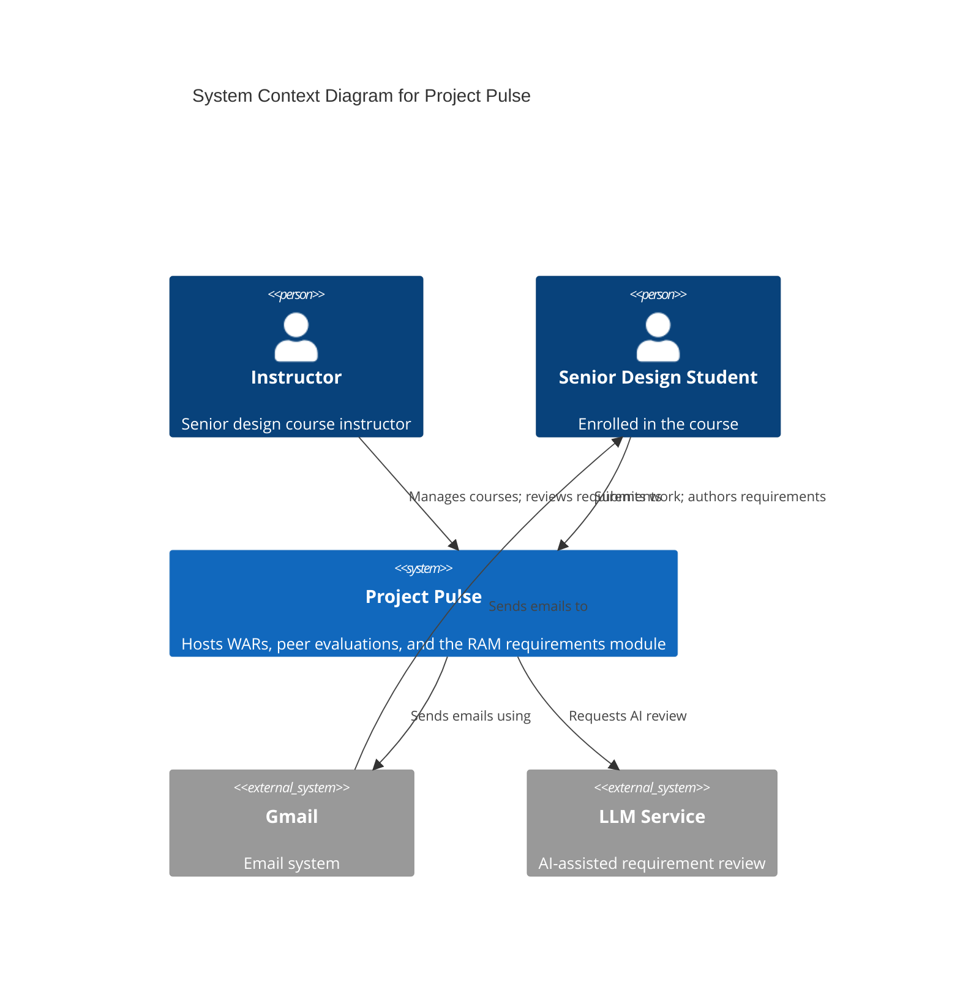

# Software Architecture, Just Enough

**Slides:** [Software Architecture](../slides/architecture.html) (the fast version).

> **Purpose (one line):** decide, before the code exists, the few things about your system that will be expensive to change, derive them from the quality attributes your client cares about rather than from the feature list, and write them down as a map the whole team and its agents build against.

## 1. Learning objectives

By the end of this module, a student can:

1. Define architecture as the set of decisions that are expensive to change, and use the reversibility test to sort a decision into "decide now" or "defer to the design of one use case area."
2. Explain why the same features can be delivered by many structures, and why quality attributes and constraints, not functionality, choose among them.
3. Identify a project's architecturally significant requirements, rank them by importance and difficulty, and cite them by their existing specification identifiers.
4. Draw C4 context and container diagrams in mermaid that stand on their own: titled, keyed, and readable with the colors removed.
5. Decompose a system by domain, mapping use case areas to components, and explain why layering belongs inside a domain module rather than above it.
6. Choose between one deployable and several for a given set of requirements, name the requirement that would force the other choice, and resist a distributed design no requirement asks for.
7. Record a key decision with its driving requirement, context, rejected alternative, and trade-off.
8. Draw a trust boundary on a context diagram and explain how a system can leak data that no feature ever touched.
9. Judge an agent's proposed architecture by asking which requirement forces each part of it.

## 2. Where it fits

- **Prerequisites:** [Requirements as the Contract](spec-driven-requirements.md), where your team wrote the quality attributes and constraints this module turns into decisions, and [Context Engineering](context-engineering.md), which treated the specification as the context an agent works from. The architecture-of-record joins it as the second half of that context.
- **Leads into:** the design-of-record in week 7, which takes one use case area from this map and designs it against real code, and the proving slice at [Checkpoint 2](../project.md#checkpoints), which shows whether the map was right. Security, which enters here, threads on through implementation, static analysis, and CI/CD.
- **How it's taught:** two lecture days in week 6. Your team drafts its architecture-of-record in the Oct 2 studio from the [architecture template](https://github.com/tcu-cosc-40943/course-templates/blob/main/design/architectural-design.md), and revises it all term as use cases are built.
- **Course outcome it delivers:** [making and defending design and architecture decisions](../syllabus.md#learning-outcomes) (outcome 2), with the alternatives considered and the reasoning behind the choice.

## 3. Motivation

**Two teams, one specification.** Give two teams the same use cases for Project Pulse: submit a weekly activity report, submit a peer evaluation, manage sections and teams, author requirements. Both teams deliver every use case. Both pass every functional test.

Team A builds seven services, one per area, each with its own database, talking over HTTP behind an API gateway, deployed to a Kubernetes cluster. Team B builds one Spring Boot application with a Vue front end bundled inside it, one relational database, deployed as one container.

Nothing in the use cases tells them apart. Both are correct. And yet one of them is a disaster for the client, and you can tell which only by asking questions the use cases never raise. Who runs this after you graduate? (One instructor, with no operations staff.) How many users? (About 75 per term.) What is the worst thing that can happen? (A student's evaluations leak to another student, which is a federal privacy problem.) What will change most often? (Features, added by next year's students who have never seen the code.)

Those are quality attributes and constraints, and they are what Project Pulse's actual [architecture-of-record](https://github.com/Washingtonwei/project-pulse/blob/main/docs/design/architectural-design.md) leads with: security and privacy first, then maintainability, then usability, then low operational burden. Team B's system is Project Pulse's real one. Team A's is what an agent proposes when nobody tells it those four things.

**This is the central idea of the module,** and it is the one beginners get backwards. You do not derive an architecture from the feature list. Functionality tells you what components you need. Quality attributes tell you how to arrange them.

## 4. Core concepts

### 4.1 What architecture is, and what it is not

There are many definitions. The most useful one for a working team is Grady Booch's: architecture is **the significant design decisions that shape a system, where significant is measured by cost of change.**

That definition does two things. It tells you what to spend time on now: the decisions that are hard to undo once code is built on them. And it tells you what to leave alone: everything cheap to change later, which is most things.

| Hard to reverse: decide now | Cheap to reverse: decide per use case area, against real code |
|---|---|
| One deployable or several | Class and method names |
| Where the data lives, and what kind of store | Endpoint paths and payload shapes |
| How users prove who they are, and who issues the credential | Table columns, lengths, and indexes |
| Which external systems you depend on, and how | Which validation library |
| How the code is divided into modules | How a screen is laid out |
| Where the trust boundary sits | Error message wording |

This is the **reversibility test**, and it is the architecture version of a rule you met in [Context Engineering](context-engineering.md#48-the-two-directions-you-can-be-wrong): pin down what would be expensive to get wrong, and leave the rest to be derived when it is built. A decision that fails the test, one that is local and cheap to change, belongs in the design-of-record for one use case area in week 7, not here.

**Breadth-complete, depth-shallow.** The architecture-of-record names *every* part of the system, so the map is whole: no use case area without a home, no external system discovered in November. But it describes each part only to the level of its responsibility, so nothing is designed before anyone has built against it. This is the method's answer to the two classic failures of up-front design: a map with holes, which lets two people build the same thing twice, and a map that is too detailed, which commits you to guesses. See [The Method](../method.md), Principle 2.

**It evolves with the specification.** Requirements and architecture are not a sequence where one finishes before the other starts. Bashar Nuseibeh called this the Twin Peaks model: each one informs the other, in alternation. You will see it the first time you draw your context diagram and discover an external system no use case mentions, which sends you back to your specification with a question for your client. That is the process working, not failing.

### 4.2 Quality attributes choose the architecture

Recall the two kinds of requirement from week 4. **Functional requirements** say what the system does; your use cases carry them. **Quality attributes** say how well; section 9 of your specification carries them, each with a number and a way to measure it.

Any reasonable structure can deliver the functional requirements. You assign responsibilities to components and the features work. Quality attributes are different in two ways:

- **They are delivered by the shape of the system, not by any one component.** No class makes Project Pulse secure. Security comes from where the trust boundary is, how every request is authenticated, and how every query is scoped to the caller's team. Change the shape and the property changes.
- **They conflict.** Every decision that buys one attribute costs another. One deployable buys low operational burden and costs independent scaling. Encrypting a field buys confidentiality and costs searchability. A team that claims its architecture maximizes everything has not made any decisions.

This is the argument of Bass, Clements, and Kazman's *Software Architecture in Practice*, the standard text in the field: **the same features can be built on many architectures, and what separates a good one from a bad one, given that both work, is how well it meets its quality attributes.**

### 4.3 Architecturally significant requirements

Not every quality attribute shapes the architecture. "Error messages shall name the field that failed validation" is a real requirement, and it is met by one line in one component. The **architecturally significant requirements** are the few where a wrong guess costs a redesign rather than a bug fix. They are almost always quality attributes and constraints.

To find them, rank each candidate on two axes, as the SEI's utility tree does:

- **Importance to the client.** What happens if you miss it? A privacy breach is high; a page that loads in 1.5 seconds instead of 1 is low.
- **Difficulty to achieve.** Does the obvious design meet it, or does it force something unusual? Handling 75 users is low difficulty; handling 75,000 concurrent is high.

The significant few are the ones high on both, plus any hard constraint (a mandated platform, a regulation, an existing system you must integrate with). Project Pulse ranks seven, and they are worth reading as a set:

| Rank | Requirement | Specification handles | Importance × difficulty |
|---|---|---|---|
| 1 | Confidentiality of student records, which are regulated under FERPA | `SEC-authorization`, `SEC-ferpa`, `CO-ferpa` | High × High |
| 2 | Low operational burden: one instructor, no operations team | `AVL-uptime`, plus the no-operations-team constraint | High × Medium |
| 3 | Maintainability: student contributors extend the code every year | `MNT-feature-locality`, `MNT-service-layer` | High × Medium |
| 4 | No lost authored work under concurrent editing | `ROB-no-overwrite`, `ROB-edit-loss-bound` | High × Medium |

(The remaining three, single self-hosted authentication, responsive graph queries at cohort scale, and graceful degradation when the language model is unavailable, rank lower. The full table is in Project Pulse's architecture-of-record, under Architecture Decisions.)

Two rules for your own table. **Reuse the identifiers your specification already has**; an ASR is not a new kind of requirement, it is a label on an existing one, and a new ID space would give each requirement two names. And **include at least one security requirement.** Every system your team builds this year stores something about a real person. If no `SEC-*` makes your list, its protection was never designed, and it will be added later, which is where security defects come from.

### 4.4 Drawing it: C4, and why abstractions come before notation

Most architecture diagrams fail the same way. Someone draws boxes and arrows on a whiteboard, the team nods, someone photographs it, and six months later a new member finds the photo and cannot tell what any box is, what any arrow means, or whether any of it is still true. The diagram only ever worked with its author standing next to it.

Simon Brown's **C4 model** fixes this by agreeing on the *things* before agreeing on the shapes. It has four abstractions, nested:

- A **software system** is the thing your team builds, the whole of it.
- A system is made of **containers**. A container is anything that has to run, or store data, for the system to work: a single-page app in the browser, a backend application, a database, a file store. (Not a Docker container, although it often ends up in one.)
- A container is made of **components**: groups of related functionality behind a clear responsibility.
- A component is implemented by **code**.

Each level has a diagram, and each diagram is a zoom level on a map. Zoomed out, you see the system and the world around it; zoomed in, you see what runs where. You do not need all four, and you draw them in whatever order the conversation needs.

**Level 1, the system context diagram,** shows your system as one box, the people who use it, and every external system it depends on. It answers "what is this, who uses it, and what does it talk to?" for anyone, including your client. From Project Pulse:

**Level 2, the container diagram,** opens the system box and shows what runs and what stores data, with the technology of each and how they talk to each other. It is the overall shape of the architecture and the main technology choices on one page. Project Pulse's has four containers: the Vue single-page app, the Spring Boot REST API application, the relational database, and Azure Blob Storage for uploaded files, with Gmail and the language model service outside.

**Level 3, the component view,** shows the components inside one container. In the architecture-of-record you give it as a **table**, not a diagram: one row per use case area, the component that owns it, its one-sentence responsibility, and what it depends on (section 4.5). A component diagram showing controllers and services is design, and it belongs in the design-of-record for that area in week 7.

**Level 4, code,** is a class diagram. Almost nobody should draw one by hand; your IDE and your agent can produce it from the code whenever it is needed, and a hand-drawn one is out of date the day after it is committed.

**Rules that make a diagram stand on its own:**

- **A title that says what it is and what kind:** "System Context Diagram for Project Pulse," not "Architecture."
- **Every box carries a name, a type, a technology where it applies, and a one-line responsibility.** "API" is not a description. "REST API Application [Java / Spring Boot]: course-management and RAM APIs" is.
- **Every arrow is labelled with what it does, and, on a container diagram, how** ("Sends email using [SMTP]"). An unlabelled arrow means "these are related somehow," which everyone already assumed.
- **Remove the colors and the shapes, and it should still make sense,** because the text carries the meaning. Shape and color supplement a diagram that already works; icons supplement text and never replace it. A diagram made of cloud-provider icons tells you which services were bought and nothing about why.
- **A key,** whenever you use anything beyond plain boxes and arrows.
- **Beware acronyms,** especially domain ones. `WAR` is obvious to anyone on Project Pulse and to no one else.

**Why mermaid.** Every diagram in this course is text in a fenced mermaid block, for the same reason as the rest of your specification: text diffs in git, a reviewer can see what changed, and your agent can read it. A PNG exported from a drawing tool is invisible to the agent and silently stale. Mermaid's C4 syntax is still marked experimental and its automatic layout is sometimes awkward; if a diagram becomes unreadable, a plain `flowchart` with the same labels is an acceptable substitute. The labels are the diagram.

### 4.5 Decomposing by domain: from use case areas to components

Where do the components come from? From the functional side: **your use case areas.** Each area is a coherent part of the business, with its own vocabulary and its own rules, and that is exactly what a component should be. The template's section 5.2 asks for one row per area, plus a row for each cross-cutting component that no single area owns, such as authentication, email, or file storage.

Here is how that looks in Project Pulse, against the packages on the `main` branch:

| Use case area | Package in `backend/src/main/java/team/projectpulse/` |
|---|---|
| `WAR` weekly activity reports | `activity` |
| `EVA` peer evaluations | `evaluation` |
| `RUB` rubrics | `rubric` |
| `SEC` course sections | `section` |
| `TEA` teams | `team` |
| `STU` students, `INS` instructors | `student`, `instructor` |
| `ACC` accounts | `user` |
| Ten RAM areas (documents, artifacts, links, glossary, collaboration, and more) | five packages under `ram/`: `document`, `requirement`, `usecase`, `glossary`, `collaboration` |
| Cross-cutting | `security` (authentication), `system` (email, the response envelope, clocks, scheduling) |

Two lessons are in that table. First, the mapping is mostly one area to one package, and where it is not, several related areas share one component. That is fine. The rule is that **every area has a home**, not that each has its own. Second, the cross-cutting components are named explicitly. If they are not, each area builds its own email sender and its own permission check, and you have six of each by November.

**Domain first, layers inside.** Look inside one of those packages. `activity` holds `Activity`, `ActivityController`, `ActivityRepository`, `ActivityService`, `ActivitySecurityService`, and its converters and DTOs: the whole vertical slice for weekly activity reports, from the HTTP endpoint to the database, in one place.

That is a choice, and the alternative is common enough that you have probably seen it: **layered packaging**, with all controllers in one package, all services in another, and all repositories in a third. The Spring PetClinic sample application exists in both forms, which makes it the cleanest comparison available: [`spring-framework-petclinic`](https://github.com/spring-petclinic/spring-framework-petclinic) is packaged by layer (`web`, `service`, `repository`), while [`spring-petclinic`](https://github.com/spring-projects/spring-petclinic) is packaged by domain (`owner`, `vet`, `system`).

Layering is a good idea. Separating presentation from business logic from data access lets you think about one concern at a time, test the logic without a database, and replace one layer without rewriting the others. The mistake is making it the **top-level** division. In a layered package tree, one feature is spread across three packages, and the most common change on any real project, "change how this one feature works," touches all three. As the application grows, each layer gets large enough on its own that you need to divide it again anyway, and the natural way to divide it is by domain. So divide by domain first and layer inside each domain, which is what Project Pulse's `KD-7` records and what its quality scenario `QS-3` measures: a new domain package can be added with zero changes to any other.

**The same argument applies to teams.** Divide a system by layer and the team divides by layer too: a front-end person, a back-end person, a database person. Melvin Conway observed in 1968 that systems end up mirroring the communication structure of the organizations that build them, and it works in both directions. This is why your [project](../project.md) makes every member full stack and assigns work by use case: a defect where two layers meet belongs to nobody when the layers belong to different people.

David Parnas made the deeper version of this argument in 1972: divide a system so that each module hides a decision that is likely to change. A use case area is a good module because the business rules inside it change together, and a change to one area should not ripple into another.

### 4.6 One deployable or several

This is the one decision every team must make, and the one the [template](https://github.com/tcu-cosc-40943/course-templates/blob/main/design/architectural-design.md) requires as `KD-deployment-shape` at Checkpoint 1.

**A monolith** is one codebase, one build, and one deployable unit. Project Pulse builds its Vue single-page app into the Spring Boot jar, ships one Docker image, and runs it on one Azure Web App. Its `KD-1` records why: an instructor-scale deployment with no operations team, where "delivery speed and operational simplicity matter more than scaling parts independently." The rejected alternative, separate services or a separately hosted front end, takes one sentence to dismiss: the network and operations complexity is unjustified at this scale. The trade-off is stated as plainly: the application scales only as a whole.

**Microservices** divide the system into separately deployed services, each organized around one business capability, each owning its own data, communicating over the network. They buy real things:

- **Independent scaling.** Scale only the service under load, not the whole system.
- **Independent deployment.** Ship one service without redeploying the others.
- **Independent teams.** Each team owns a service end to end, in whatever language suits it.
- **Failure isolation.** If recommendations crash, checkout still works.

Here is what those look like at the scale where they pay off. On November 11, 2019, Alibaba's Tmall ran its annual Singles' Day sale and reported a peak of **544,000 orders per second**. At that load, the checkout path and the product-browsing path have completely different traffic shapes, and scaling them together would waste enormous amounts of hardware. Hundreds of engineering teams need to ship without coordinating every release. That is the problem microservices solve.

**Now count what they cost.** Every call between services is a network call that can be slow, fail, or partly succeed, so you need timeouts, retries, circuit breakers, and a plan for each. A transaction that spanned three tables now spans three services, and it is no longer a transaction. A bug report now needs tracing across services to locate. Every service needs its own pipeline, monitoring, and on-call. None of this is free, and all of it is work that does not deliver a single use case.

**Monolith first.** Martin Fowler's observation, from watching many projects, is that almost every successful microservice system started as a monolith that grew too big and was split, and almost every system built as microservices from the start ended up in serious trouble. The reason is that you cannot draw good service boundaries until you understand the domain, and you understand the domain by building it. A monolith lets you move a boundary by moving a package. Microservices make you move it by migrating data between databases.

It also goes the other way at scale. In 2023 Amazon's Prime Video team described moving an audio and video monitoring service from a distributed design, separate serverless components coordinated over the network, into a single process, and reported that infrastructure costs fell by over 90%. The distributed design was not wrong in principle; it was wrong for that workload, and nobody had checked.

**The middle option is the one to aim for: a modular monolith.** One deployable, but divided inside by domain, with each module owning its own slice of the code (section 4.5) and talking to the others through their service interfaces rather than reaching into their tables. You get the simple operations of a monolith and most of the maintainability of services, and if one module ever does need to scale separately, the boundary is already drawn. This is what Project Pulse is.

**For your project,** the question is not "which is better?" It is "which requirement would force several deployables?" Write that requirement down. If your specification has no such requirement, if nothing in it needs one part to scale, deploy, or fail independently of the rest, you have your answer and your rejected alternative. Your client's system will serve tens or hundreds of users, and next spring someone will have to run it.

### 4.7 A catalog of patterns, and which ones you will meet

An **architectural pattern** is a reusable solution to a problem that keeps occurring in a given context. Patterns work at different levels, solve different problems, and combine freely: one system is usually several at once. Three show up in every project in this course.

**Layered** (presentation, domain logic, data access) is inside every component you build, as section 4.5 described. A request enters at the controller, the service applies the business rules, the repository talks to the database, and each layer knows only the one below it.

**Model-view-controller** is how the user interface is organized, on both sides. In Spring, a controller receives the request and returns data for a view; in Vue, a component's template is the view over reactive state. The problem it solves: the user interface changes more often than anything else in an application, so keep it separate from the data and rules it displays.

**Pipes and filters** passes data through a chain of independent processing steps, each taking input and producing output for the next. Machine learning pipelines are the familiar example. The one you will use daily is less obvious: **Spring Security is a filter chain.** Every HTTP request passes through an ordered series of filters (CORS, authentication, authorization, and more) before it reaches your controller, and each filter can pass it on or reject it. Section 4.9 is about what happens when a request reaches the end of that chain without matching any rule.

The rest of the catalog you should recognize by name and by the problem it solves, so you can tell when an agent reaches for one without a reason:

| Pattern | The problem it solves | You need it when |
|---|---|---|
| **Broker** | Clients should not need to know where services are or which instance answers | Many services, located and replaced dynamically |
| **Publish-subscribe** (event-driven) | Producers and consumers of events should not know about each other; work can happen later | Work that can be done asynchronously, traffic spikes to absorb, many independent consumers of one event |
| **Message queue** (the usual implementation of the two above) | Decouple the sender from the receiver in time, and order and throttle the work | A job that takes longer than a user will wait, or bursts the database cannot absorb |
| **Source-replica** | One database cannot serve all the reads, or must survive a failure | Read load far above write load, or an availability target one server cannot meet |
| **Main-worker** | A large job can be split into identical independent pieces | Batch computation that can be parallelized |
| **API gateway** | Many services behind one entry point, with cross-cutting concerns in one place | You have already chosen microservices |

Read the right-hand column as a set of requirements. If your specification contains none of them, your system uses none of these patterns, and that is a correct architecture, not an unambitious one.

### 4.8 Writing a decision down

A decision that lives only in the heads of the people who made it will be re-argued every time someone new joins, and it will eventually be reversed by someone who never knew why it was made. Michael Nygard proposed the fix in 2011, as the architecture decision record: a short, numbered, never-edited note per decision. The course template uses the same idea, as `KD-<slug>` entries in section 6.2, each in this form:

- **Driving requirements:** the ASRs that forced it, by identifier.
- **Context:** the facts about this project that made it a question at all.
- **Decision:** what you chose, in one or two sentences.
- **Rejected:** what you did not choose, and why not.
- **Trade-off:** what this choice costs, stated plainly.

The **rejected alternative** is the part that does the work. A decision without one is a description: "we use a relational database" tells a reader nothing they could not learn from the code. "We use one relational database, not a relational one plus a graph database for the requirement links, because a second datastore is a second thing to back up, migrate, and secure, and a team's graph is small enough for SQL" tells them what not to propose next year, and under what conditions it would become the right proposal after all. That example is Project Pulse's `KD-3`.

The **trade-off** is the part that shows you understood the decision. Every real decision costs something. If you cannot say what yours costs, you have not yet understood it.

**A decision that turns out wrong is not erased.** It is marked superseded, and a new decision is added that says what replaced it and why. The history of why you changed your mind is as valuable as the decision itself.

### 4.9 Security as a quality attribute: the trust boundary

Security is not a feature you add. It is a property of the whole system's shape, and it begins at the context diagram with one line: the **trust boundary**, between what you control and what you do not. Every request that crosses it, from a browser, from another system, from the internet at large, must be authenticated, authorized, and treated as possibly hostile. Every piece of sensitive data that crosses it outward is a disclosure you must be able to justify.

Section 7.1 of the template asks three questions at Checkpoint 1: **how does a user prove who they are, what may each role see and do, and where does sensitive data live?** The second question has a part people miss. Roles are not enough. A student is allowed to read weekly activity reports, but only their own team's. Project Pulse enforces that twice, once at the route with an authorization manager that checks team membership, and again in the query itself, scoped to the caller's team. The route check alone is not enough if a request can name another team's object ID.

**The trust boundary is drawn around the whole application, not around the API.** Project Pulse learned this on September 6, 2026. Its security rules protected every route under `/api/v1/**`. Spring Boot Actuator's management endpoints live at `/actuator/**`, outside that prefix, so they fell through to the last rule in the chain, `.anyRequest().permitAll()`. With the `env` endpoint exposed and its masking turned off, any anonymous caller could fetch one URL and read the production database and mail credentials in plain text. They were stored in Azure Key Vault and had never been committed to git. Every item on the usual secrets checklist was satisfied, and the secrets leaked anyway, through an endpoint no feature used and no use case mentioned.

Nobody wrote a rule that made actuator public. It was the absence of a rule. The fix, in [pull request #61](https://github.com/Washingtonwei/project-pulse/pull/61), made it structural: any API route without an explicit rule is now **denied** by default, so a new endpoint fails closed until someone writes its rule, and the actuator endpoints get rules of their own. The final `permitAll()` is still there, because the same jar serves the Vue app's files to every browser, which is a direct consequence of `KD-1`. That is the lesson for your context diagram: an architecture decision about deployment shaped the security surface, and the boundary has to be drawn around everything the deployable exposes, including what came with the framework. The incident, the exposed values, and the credential rotation are recorded as `TD-1` in Project Pulse's [architecture-of-record](https://github.com/Washingtonwei/project-pulse/blob/main/docs/design/architectural-design.md), and the full case is taught in week 12 with observability.

**Secrets never appear in the architecture document or the repository.** Say where they will live (environment variables, a vault) and who can read them, never what they are.

## 5. The AI-native lens

- **Delegate to AI:** drawing C4 diagrams in mermaid from your use case list and your specification's interfaces; checking that every use case area has a component and every external system appears on the container diagram; drafting the rejected alternative for a decision you have already made, then arguing with it; explaining an unfamiliar pattern in terms of your own system.
- **Keep human:** the ranking of the architecturally significant requirements and every key decision. They depend on facts about your client that are in no file: who will run this, what they already know, how much they can spend, what they are afraid of.
- **Context to supply:** the specification's quality attributes and constraints, the numbers especially, and the facts that make scale small. An agent that does not know you have 75 users will design for 75,000, because that is what most architecture writing it learned from is about.
- **How to verify:** for every container, every pattern, and every decision the agent proposes, ask which requirement in your ASR table forces it. If the answer is none, cut it. Then check the other direction: does every ASR drive at least one decision?

**The failure to expect is over-engineering, and it arrives looking like expertise.** Ask an agent for an architecture for a client project and you will often get microservices, a message queue, Kubernetes, a cache, and an API gateway, each described in fluent, correct detail. Every one is a real answer to a problem your client does not have, and each adds something that can fail at 2 a.m. with nobody left to fix it after you graduate. This is the [Napkin](se-and-ai.md#the-napkin-six-prompts)'s "stack" and "bottleneck" prompts, taken slowly: a boring default unless there is a reason, and the reason has to be a requirement you can cite.

## 6. Risks and mitigations

| Risk (classic and AI-introduced) | Human judgment that catches it | Mitigation |
|---|---|---|
| **Over-engineering.** A distributed design, or infrastructure, that no requirement asks for. The AI-introduced half is speed: an agent produces a complete, confident, well-diagrammed distributed design in a minute, and it looks like more work than yours did. | Asking which requirement forces each part, and noticing when none does | Every container and every decision cites an ASR. A part with no citation is cut or becomes an explicit future option in section 11. |
| **Architecture by feature list.** Components invented from nouns in the use cases, and the quality attributes never consulted. | Noticing that the ASR table is empty, or that no decision cites it | Write the ASR table first. Every decision names its driver. |
| **The map with holes.** A use case area or an external system nobody placed, found when someone starts building it. | Checking the component table against the use case file, row by row | The two checks at the end of template section 5.2, run before every checkpoint. |
| **Up-front over-design.** Components designed down to classes and endpoints before any code exists. | Asking whether this detail would be expensive to change later | The reversibility test. Detail that fails it goes to the week 7 design-of-record. |
| **The stale diagram.** The architecture changed; the document did not. | A reviewer asking, during a pull request that adds a container or an external system, whether the architecture document changed too | Keep the diagrams as text in the repository, next to the code, and change them in the same pull request. |
| **Security left for later.** No `SEC-*` among the ASRs, no trust boundary on the diagram, and authorization added one endpoint at a time. | Asking what happens to a request that matches no rule | Deny by default. Draw the boundary around everything the deployable exposes, framework endpoints included. |

## 7. Hands-on (studio)

**Studio (team, own project), Fri Oct 2**

- **Goal:** draft your team's architecture-of-record, breadth-complete and depth-shallow, from your specification. This is the second half of [Checkpoint 1](../project.md#checkpoints); your TA reviews the first half, the specification, with you during the same hour.
- **In studio:** fill template sections 1 through 6 and section 7.1, starting from the ranked ASR table, because every other section cites it. Use your agent to draw the diagrams; keep the ranking and the decision for the team. The preparation, the order to draft in, and the timing are on the [studio page](../studio.md#week-6-oct-2-checkpoint-1-and-your-architecture-of-record).
- **Deliverable and assessment:** the document, merged to `main` by 11:59 pm Friday. Your TA checks it over the weekend against the six-point checklist on the studio page and replies by Sunday evening with one issue in your repository. The check reads whether every use case area and every external system has a home, whether each decision cites the requirement that forced it and names what it rejected, and whether the security section answers its three questions. It does not reward length: a short document that names everything is the goal.

There is no individual assignment for this module. The Project Pulse architecture-of-record is your worked example: read its Quality Goals, its ASR table, and `KD-1`, `KD-3`, and `KD-7` before you write your own.

## 8. Summary / key takeaways

- Architecture is the decisions that are expensive to change. Decide those now; leave the rest to be designed against real code.
- The same features fit many structures. Quality attributes and constraints choose among them, so build the architecture from those, not from the feature list.
- The architecturally significant requirements are the few where a wrong guess costs a redesign. Reuse their existing identifiers, and include at least one security requirement.
- A diagram has to stand on its own: titled, keyed, every box and arrow described in words. Keep it in mermaid, in the repository, next to the code it describes.
- Divide the system by domain first, from your use case areas, and layer inside each domain. Name the cross-cutting components, or every area builds its own.
- Start with one deployable, divided inside by domain. Several deployables need a requirement that forces them, and at your scale there usually is not one.
- A decision without a rejected alternative is a description. A decision without a trade-off has not been understood.
- Draw the trust boundary around everything the system exposes, and deny what no rule allows. Project Pulse leaked its production credentials through an endpoint no feature ever used.
- When an agent proposes an architecture, ask of every part which requirement forces it.

## 9. Key papers and further reading

- Len Bass, Paul Clements, and Rick Kazman, *Software Architecture in Practice*, 4th ed. (Addison-Wesley, 2021). The standard text: quality attributes, quality scenarios, tactics, and the utility tree behind section 4.3.
- [arc42](https://arc42.org), the template your architecture-of-record follows, with examples for every section; and [the C4 model](https://c4model.com), Simon Brown's own explanation of the four levels and the notation rules.
- Martin Fowler, [*MonolithFirst*](https://martinfowler.com/bliki/MonolithFirst.html) (2015), and James Lewis and Martin Fowler, [*Microservices*](https://martinfowler.com/articles/microservices.html) (2014), which defined the term and is candid about its costs.
- Michael Nygard, [*Documenting Architecture Decisions*](https://cognitect.com/blog/2011/11/15/documenting-architecture-decisions) (2011), the origin of the architecture decision record.
- Bashar Nuseibeh, "Weaving Together Requirements and Architectures," *IEEE Computer* 34(3), 2001. The Twin Peaks model in four pages.
- David Parnas, "On the Criteria to Be Used in Decomposing Systems into Modules," *Communications of the ACM* 15(12), 1972. Still the best argument for dividing a system by what is likely to change.
- Project Pulse's [architecture-of-record](https://github.com/Washingtonwei/project-pulse/blob/main/docs/design/architectural-design.md) and [software architecture primer](https://github.com/Washingtonwei/project-pulse/blob/main/docs/guides/software-architecture-primer.md), the worked example throughout.
- [The Method](../method.md), Principle 2, for how the architecture-of-record fits the spec-driven, agent-assisted method.

## 10. Self-check

1. Your teammate says the architecture should specify every REST endpoint so the agent has less to guess. Apply the reversibility test and say where endpoint shapes belong instead.
2. Two designs deliver every use case in your specification. What do you compare to choose between them, and where in your specification do you find it?
3. Your client says "it has to be fast." Is that an architecturally significant requirement? Say what you would need to find out before you could answer.
4. An agent proposes separate services for users, orders, and notifications, each with its own database, for a system with 200 users. Name the requirement that would justify it, and write the rejected-alternative line you would put in `KD-deployment-shape` if your specification has no such requirement.
5. Your context diagram shows the system, three kinds of user, and nothing else. What question should your team ask the client before Checkpoint 1, and why is the answer an architecture question?
6. A teammate packages the backend as `controllers`, `services`, and `repositories`. Describe the most common change on your project, and say how many packages it touches under that layout and under a domain layout.
7. Your component table has a row for every use case area and none for email, although four use cases send email. What will happen by November?
8. Project Pulse's security rules covered every route under `/api/v1/**`, and the production credentials leaked anyway. Explain how, and say which line of the fix makes the same mistake impossible for a new endpoint.
9. A key decision in your document reads: "We use PostgreSQL." Say what is missing, and rewrite it.
10. Your team reversed `KD-deployment-shape` in November because one part really did need to scale on its own. What happens to the original entry, and why does it stay in the document?

## Related

- [Requirements as the Contract](spec-driven-requirements.md): where your quality attributes and constraints were written.
- [Context Engineering](context-engineering.md): the specification as the agent's context; the architecture-of-record is the other half.
- [The Method](../method.md): breadth-complete, depth-shallow architecture in the whole method.
- [Senior Design Project](../project.md#checkpoints): what Checkpoint 1 and Checkpoint 2 review.
- [Friday Studio](../studio.md): how the studio hour runs.
- [Schedule](../schedule.md): when this is taught.
