# Software Architecture, Just Enough

**Slides:** [Software Architecture](../slides/architecture.html) (the fast version).

> **Purpose (one line):** decide, before the code exists, the few things about your system that will be expensive to change, derive them from the quality attributes your client cares about rather than from the feature list, and write them down as a map the whole team and its agents build against.

## 1. Learning objectives

By the end of this module, a student can:

1. Define architecture as the set of decisions that are expensive to change, and use the reversibility test to sort a decision into "decide now" or "defer to the design of one use case area."
2. Explain why the same features can be delivered by many structures, and why quality attributes and constraints, not functionality, choose among them.
3. Identify a project's architecturally significant requirements, rank them by importance and difficulty, and cite them by their existing specification identifiers.
4. Name the four views an arc42 architecture-of-record describes, the question each answers, and why two of them wait for code.
5. Draw C4 context and container diagrams in mermaid that stand on their own: titled, keyed, and readable with the colors removed.
6. Decompose a system by domain, mapping use case areas to components, and explain why layering belongs inside a domain module rather than above it.
7. Choose between one deployable and several for a given set of requirements, name the requirement that would force the other choice, and resist a distributed design no requirement asks for.
8. Name a system's trust boundary and explain how a system can leak data that no feature ever touched.
9. Name the crosscutting concepts every component must share, write the first ones before an agent builds a second component, and keep each rule's reasoning in the architecture-of-record with a one-line instruction in the charter.
10. Record a key decision with its driving requirement, context, rejected alternative, and trade-off.
11. Judge an agent's proposed architecture by asking which requirement forces each part of it.

## 2. Where it fits

- **Prerequisites:** [Requirements as the Contract](spec-driven-requirements.md), where your team wrote the quality attributes and constraints this module turns into decisions, and [Context Engineering](context-engineering.md), which treated the specification as the context an agent works from. The architecture-of-record joins it as the second half of that context.
- **Leads into:** the design-of-record in week 7, which takes one use case area from this map and designs it against real code, and the proving slice at [Checkpoint 2](../project.md#checkpoints), which shows whether the map was right. Before the week 8 studio hands an agent its first build work, your architecture-of-record doc's section 8 (Crosscutting Concepts) names the conventions every component shares ([4.10](#410-crosscutting-concepts-what-every-component-does-the-same-way)). Security, which enters here, threads on through implementation, static analysis, and CI/CD.
- **How it's taught:** two lecture days in week 6. Your team drafts its architecture-of-record in the week 6 studio from the [architecture template](https://github.com/tcu-cosc-40943/course-templates/blob/main/design/architectural-design.md), and revises it all term as use cases are built.
- **Course outcome it delivers:** [making and defending design and architecture decisions](../syllabus.md#learning-outcomes) (outcome 2), with the alternatives considered and the reasoning behind the choice.

## 3. Motivation

**Two teams, one specification.** Give two teams the same use cases for Project Pulse: submit a weekly activity report, submit a peer evaluation, manage sections and teams, author requirements. Both teams deliver every use case. Both pass every functional test.

Team A builds seven services, one per area, each with its own database, talking over HTTP behind an API gateway, deployed to a Kubernetes cluster. Team B builds one Spring Boot application with a Vue front end bundled inside it, one relational database, deployed as one container.

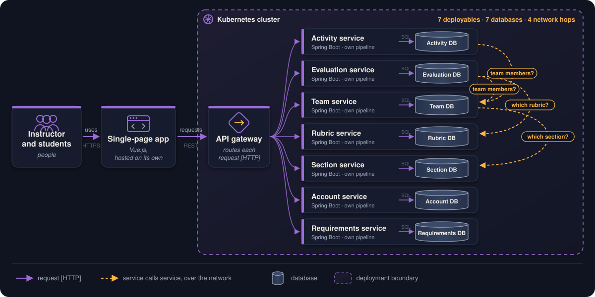

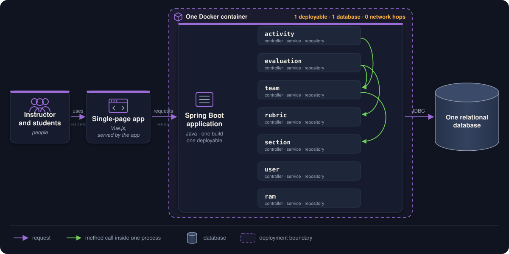

Both figures show the container view, and each carries its own key. Gmail, the language model service, and file storage are left out of both, because both designs use them the same way. Count the arrows that cross a network in each.

Nothing in the use cases tells them apart. Both are correct. And yet one of them is a disaster for the client, and you can tell which only by asking questions the use cases never raise. Who runs this after you graduate? (One instructor, with no operations staff.) How many users? (About 75 per term.) What is the worst thing that can happen? (A student's evaluations leak to another student, which is a federal privacy problem.) What will change most often? (Features, added by next year's students who have never seen the code.)

Those are quality attributes and constraints, and they are what Project Pulse's actual [architecture-of-record](https://github.com/Washingtonwei/project-pulse/blob/main/docs/design/architectural-design.md) leads with: security and privacy first, then maintainability, then usability, then low operational burden. Team B's system is Project Pulse's real one. Team A's is what an agent proposes when nobody tells it those four things.

**This is the central idea of the module,** and it is the one beginners get backwards. You do not derive an architecture from the feature list. Functionality tells you what components you need. Quality attributes tell you how to arrange them.

## 4. Core concepts

### 4.1 What architecture is, and what it is not

There are many definitions. The most useful one for a working team is Grady Booch's: architecture is **the significant design decisions that shape a system, where significant is measured by cost of change.**

That definition does two things. It tells you what to spend time on now: the decisions that are hard to undo once code is built on them. And it tells you what to leave alone: everything cheap to change later, which is most things.

| Hard to reverse: decide now | Cheap to reverse: decide per use case area, against real code |
|---|---|
| One deployable or several | Class and method names |
| Where the data lives, and what kind of store | Endpoint paths and payload shapes |
| How users prove who they are, and who issues the credential | Table columns, lengths, and indexes |
| Which external systems you depend on, and how | Which validation library |
| How the code is divided into modules | How a screen is laid out |
| Where the trust boundary sits | Error message wording |

This is the **reversibility test**, and it is the architecture version of a rule you met in [Context Engineering](context-engineering.md#48-the-two-directions-you-can-be-wrong): pin down what would be expensive to get wrong, and leave the rest to be derived when it is built. A decision that fails the test, one that is local and cheap to change, belongs in the design-of-record for one use case area in week 7, not here.

**Breadth-complete, depth-shallow.** The architecture-of-record names *every* part of the system, so the map is whole: no use case area without a home, no external system discovered halfway through the build. But it describes each part only to the level of its responsibility, so nothing is designed before anyone has built against it. This is the method's answer to the two classic failures of up-front design: a map with holes, which lets two people build the same thing twice, and a map that is too detailed, which commits you to guesses. See [The Method](../method.md), Principle 2.

**It evolves with the specification.** Requirements and architecture are not a sequence where one finishes before the other starts. Bashar Nuseibeh called this the Twin Peaks model: the two are developed together, and each pass between them makes both more detailed. They still stay two documents, one describing the problem and the other the solution, which is why your team keeps a specification and a separate architecture-of-record. You will see it the first time you draw your context diagram and discover an external system no use case mentions, which sends you back to your specification with a question for your client. That is the process working, not failing.


### 4.2 Quality attributes choose the architecture

Recall the two kinds of requirement from week 4. **Functional requirements** say what the system does; your use cases carry them. **Quality attributes** say how well; [section 9 of your specification](spec-driven-requirements.md#426-quality-attributes-specification-section-9) carries them, each with a number and a way to measure it.

Here are the attributes that most often shape an architecture, each with the question it asks, Project Pulse's answer from its [specification](https://github.com/Washingtonwei/project-pulse/blob/main/docs/requirements/software-requirements-specification.md), and the structure that answer pushes toward. The last column is a map of the rest of this module.

| Attribute | The question it asks | Project Pulse's answer | What it pushes in the architecture |
|---|---|---|---|
| **Security** | Who may see or change what, and what must never leak? | `SEC-authorization`: a student reaches only the work of their own team. `SEC-llm-proxy`: the language model's credentials never reach the browser. | A trust boundary around the whole application, every request authenticated, every query scoped to the caller's team, and the language model called only from the server ([4.9](#49-security-as-a-quality-attribute-the-trust-boundary)) |
| **Maintainability** | How cheaply can someone who did not write it change it? | `MNT-feature-locality`: a new feature is a self-contained module that edits no sibling module. | Packages divided by domain, with the layers inside each ([4.6](#46-decomposing-by-domain-from-use-case-areas-to-components)) |
| **Availability** | How much downtime is acceptable, and when? | `AVL-uptime`: up 99% of each term, with deadlines prioritized. | 99% of a term allows about a day of downtime, so one instance is enough. 99.99% would allow about 16 minutes, and would demand redundant instances and database replicas ([4.8](#48-a-catalog-of-patterns-and-which-ones-you-will-meet)). |
| **Performance** | How fast, at what percentile, under what load? | `PER-report-load`: the instructor dashboard and report views in 500 ms at the 95th percentile. | At this load, one application and one database, with calls between modules made in-process. Every network hop added spends part of the 500 ms. |
| **Scalability** | How much load, and how fast does it grow? | `SCA-cohort-load`: about 75 users, with up to 100 people editing at once near a deadline. | One deployable is enough ([4.7](#47-one-deployable-or-several)). Uploaded files are the only store that grows, so they go to object storage, not the database (`CO-blob-source-material`). |
| **Robustness** | What happens when something fails? | `ROB-edit-loss-bound`: a crash loses at most 10 seconds of edits. `AVL-llm-degradation`: when the language model is down, everything else keeps working. | The browser saves to the server at least every 10 seconds. The language model sits behind one server-side proxy, so its failure is contained in one place. |
| **Operability** | Who deploys and runs it, with what staff? | One instructor and no operations team. This is a constraint, `CO-no-ops-team`, not a quality attribute in your specification's section 9, and it pushes the structure as hard as any of them. | One container on one Azure Web App, a staging slot for safe releases, and nothing to orchestrate (`KD-modular-monolith`, [4.7](#47-one-deployable-or-several)) |

Read the availability row twice. The adjective "available" says nothing about structure; the number decides it. At 99%, the simplest deployment passes. At 99.99%, it fails, and the architecture changes.

Any reasonable structure can deliver the functional requirements. You assign responsibilities to components and the features work. Quality attributes are different in two ways:

- **They are delivered by the shape of the system, not by any one component.** No class makes Project Pulse secure. Security comes from where the trust boundary is, how every request is authenticated, and how every query is scoped to the caller's team. Change the shape and the property changes.
- **They conflict.** Every decision that buys one attribute costs another. One deployable buys low operational burden and costs independent scaling. Encrypting a field buys confidentiality and costs searchability. A team that claims its architecture maximizes everything has not made any decisions.

This is the argument of Bass, Clements, and Kazman's *Software Architecture in Practice*, the standard text in the field: **the same features can be built on many architectures, and what separates a good one from a bad one, given that both work, is how well it meets its quality attributes.**

### 4.3 Architecturally significant requirements

Not every quality attribute shapes the architecture. Usability is the clearest case. `USE-wcag-aa` and `USE-keyboard-operable` matter to every user, but they are met screen by screen, in the design of each view; getting one wrong early costs a redesign of a page, not of the system. The same holds for single requirements: "Error messages shall name the field that failed validation" is met by one line in one component. The **architecturally significant requirements** (ASRs) are the few where a wrong guess costs a redesign rather than a bug fix. They are almost always quality attributes and constraints.

An ASR is a specific requirement, not an attribute category. One attribute can produce several ASRs, or none: Project Pulse's availability requirements feed two of its seven ASRs (ranks 2 and 7), and its usability requirements feed none.

To find them, rank each candidate on two axes, as the Software Engineering Institute's utility tree does:

- **Importance to the client.** What happens if you miss it? A privacy breach is high; a page that loads in 1.5 seconds instead of 1 is low.
- **Difficulty to achieve.** Does the obvious design meet it, or does it force something unusual? Handling 75 users is low difficulty; handling 75,000 concurrent is high.

The significant few are the ones high on both, plus any hard constraint (a mandated platform, a regulation, an existing system you must integrate with). Project Pulse ranks seven, and they are worth reading as a set:

| Rank | Requirement | Specification handles | Importance × difficulty | Drives |
|---|---|---|---|---|
| 1 | Confidentiality of student records, which are regulated under FERPA | `SEC-authorization`, `SEC-ferpa`, `CO-ferpa` | High × High | `KD-ram-module`, `KD-self-issued-jwt`, and the two-layer ownership and membership authorization |
| 2 | Low operational burden: one instructor, no operations team | `AVL-uptime`, `CO-no-ops-team` | High × Medium | `KD-modular-monolith`, `KD-relational-graph` |
| 3 | Maintainability: student contributors extend the code every year | `MNT-feature-locality`, `MNT-service-layer` | High × Medium | `KD-ram-module`, `KD-no-codegen`, `KD-vertical-slices` |
| 4 | No lost authored work under concurrent editing | `ROB-no-overwrite`, `ROB-edit-loss-bound` | High × Medium | `KD-section-locking`, plus autosave |

The **Drives** column is the bridge to the rest of the architecture: each ASR names the key decisions it forced, and each decision in [4.11](#411-writing-a-decision-down) names the ASRs that forced it. Row 4 teaches something too. `ROB-no-overwrite` is written for real-time collaborative editing, which Project Pulse's specification defers past the MVP. So the MVP meets it with the simpler mechanism: one person edits a section at a time. A significant requirement does not call for the most elaborate way to meet it.

(The remaining three, single self-hosted authentication, responsive graph queries at cohort scale, and graceful degradation when the language model is unavailable, rank lower. The full table is in Project Pulse's architecture-of-record, under Architecture Decisions.)

Two rules for your own table. **Reuse the identifiers your specification already has**; an ASR is not a new kind of requirement, it is a label on an existing one, and a new ID space would give each requirement two names. And **include at least one security requirement.** Every system your team builds this year stores something about a real person. If no `SEC-*` makes your list, its protection was never designed, and it will be added later, which is where security defects come from.

### 4.4 The architecture-of-record: an arc42 document

Everything from here to the end of the core concepts goes into one document, your team's **architecture-of-record**. See its shape before you fill it in.

Your [template](https://github.com/tcu-cosc-40943/course-templates/blob/main/design/architectural-design.md) follows **arc42**, a free template for documenting software architecture by Gernot Starke and Peter Hruschka. arc42 fixes what to write: twelve sections, each answering one question about the system, in an order any reader who knows arc42 can find their way around. It does not fix how to draw. That is the job of C4, Simon Brown's notation for architecture diagrams, in [4.5](#45-describing-it-views-and-c4-to-draw-them). Your template keeps all twelve sections in arc42's order, numbering, and titles, and adds numbered subsections only where Checkpoint 1 needs a fixed place to look, such as 8.1 for security. Project Pulse's [architecture-of-record](https://github.com/Washingtonwei/project-pulse/blob/main/docs/design/architectural-design.md) is a worked example of every one.

| Section | The question it answers | Where its content comes from |
|---|---|---|
| 1. Introduction and Goals | What must the system achieve, and for whom? | 1.1 and 1.3 link to your specification, use cases, and vision and scope. 1.2 ranks your top three quality goals ([4.2](#42-quality-attributes-choose-the-architecture)) |
| 2. Architecture Constraints | What are we not free to choose? | The `CO-*` and `OE-*` identifiers from your specification, listed, not restated |
| 3. Context and Scope | What is the system, who uses it, and what does it talk to? | A C4 context diagram ([4.5](#45-describing-it-views-and-c4-to-draw-them)) |
| 4. Solution Strategy | Which few moves shape everything else? | Three to five one-line bullets, each citing the decision that explains it |
| 5. Building Block View | What is it made of, and what does each part own? | A C4 container diagram, and a component table from your use case areas ([4.5](#45-describing-it-views-and-c4-to-draw-them), [4.6](#46-decomposing-by-domain-from-use-case-areas-to-components)) |
| 6. Runtime View | How do the parts carry out one use case? | A sequence diagram, once that use case is built |
| 7. Deployment View | Where does each part run, and how does a change get there? | Your pipeline, once it exists |
| 8. Crosscutting Concepts | What must every component do the same way? | 8.1 is security: the trust boundary ([4.9](#49-security-as-a-quality-attribute-the-trust-boundary)). 8.2 holds the rest ([4.10](#410-crosscutting-concepts-what-every-component-does-the-same-way)) |
| 9. Architecture Decisions | What was decided, and what forced it? | The ASR table ([4.3](#43-architecturally-significant-requirements)) and the key decisions ([4.7](#47-one-deployable-or-several), [4.11](#411-writing-a-decision-down)) |
| 10. Quality Requirements | How will you know a quality attribute holds? | 10.1 links to section 9 of your specification; 10.2 adds quality scenarios, each naming the test that verifies it |
| 11. Risks and Technical Debt | What might go wrong, and which shortcuts did we take on purpose? | Technical risks only; business risks stay in vision and scope |
| 12. Glossary | What do our terms mean? | Your project glossary, linked |

Read the last column. Five of the twelve sections (1, 2, 10, 11, and 12) overlap your requirements documents, which already own the stakeholders, the constraints, the quality attributes, the business risks, and the glossary. The architecture-of-record cites them and adds only what the architecture needs, because a fact written in two places is soon wrong in one. What is left is the architecture itself: the ranked quality goals, the diagrams, the components, the decisions, and the trust boundary.

**The order is by topic, not by when you write it.** Template sections 6 and 7 describe code and a pipeline that do not exist yet, so they wait ([4.5](#45-describing-it-views-and-c4-to-draw-them) explains why). Each section of the template says when it is due, and [Hands-on](#7-hands-on-studio), below, says what Friday covers.

### 4.5 Describing it: views, and C4 to draw them

The ASR table says what the architecture has to achieve. The rest of the document shows the shape that achieves it, and no single drawing can show that shape. A house is built from a floor plan, a wiring plan, and a site plan, each drawn for a different trade, and nobody expects one sheet to serve all three. Software is described the same way: one system, several **views**, each answering one question for one reader. Philippe Kruchten made this argument in 1995 with his "4+1" view model, and arc42 inherits it.

Four of arc42's twelve sections are views:

| Template section | The question it answers | Who needs the answer | Drawn at | Drawn as |
|---|---|---|---|---|
| 3. Context and Scope | What is this system, who uses it, and what does it talk to? | Anyone, your client included | Checkpoint 1 | A C4 system context diagram |
| 5. Building Block View | What is it made of, and what does each part own? | Your team and its agents | Checkpoint 1 | A C4 container diagram and a component table |
| 6. Runtime View | How do the parts cooperate to carry out one use case? | Whoever builds or debugs that use case | Checkpoint 2 | A sequence diagram |
| 7. Deployment View | Where does each part run, and how does a change get there? | Whoever runs the system | Checkpoint 3 | Where each container runs, as a diagram or a short list |

Read the "Drawn at" column. The first two views describe what the system is and what it is made of. Those are the decisions you are making now, and your specification is enough to draw them. The other two describe things that do not exist yet. A sequence diagram of code nobody has written describes a guess, and so does a deployment view before there is a pipeline to deploy with. So the runtime view waits for the proving slice at Checkpoint 2, and the deployment view waits for the pipeline at Checkpoint 3. This is the reversibility test of [4.1](#41-what-architecture-is-and-what-it-is-not) applied to diagrams, and the Twin Peaks spiral in practice: each view is drawn once a pass down the peaks has made it knowable.

**Drawing a view a stranger can read.** Most architecture diagrams fail the same way. Someone draws boxes and arrows on a whiteboard, the team nods, someone photographs it, and six months later a new member finds the photo and cannot tell what any box is, what any arrow means, or whether any of it is still true. The diagram only ever worked with its author standing next to it.

Simon Brown's **C4 model** fixes this by agreeing on the *things* before agreeing on the shapes. It has four abstractions, nested:

- A **software system** is the thing your team builds, the whole of it.
- A system is made of **containers**. A container is anything that has to run, or store data, for the system to work: a single-page app in the browser, a backend application, a database, a file store. (Not a Docker container, although it often ends up in one.)
- A container is made of **components**: groups of related functionality behind a clear responsibility.
- A component is implemented by **code**.

The name comes from the four diagrams, one per level: Context, Containers, Components, and Code. The first level's abstraction is the software system, but its diagram is called the context diagram, because it shows the system among the people and systems around it.

Each level has a diagram, and each diagram is a zoom level on a map. Zoomed out, you see the system and the world around it; zoomed in, you see what runs where. You do not need all four, and you draw them in whatever order the conversation needs. The levels line up with your template's views: level 1 draws template section 3, and levels 2 and 3 draw section 5. C4 also defines a dynamic diagram and a deployment diagram for the other two views; for the runtime view, a mermaid `sequenceDiagram` does the same job, and it is what Project Pulse uses.

**Level 1, the system context diagram,** shows your system as one box, the people who use it, and every external system it depends on. It answers "what is this, who uses it, and what does it talk to?" for anyone, including your client, and it is section 3 of your template. From Project Pulse:

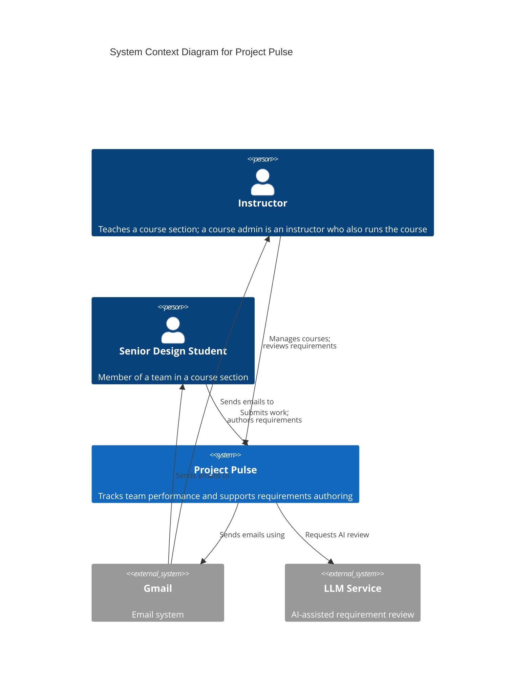
```mermaid
C4Context
    title System Context Diagram for Project Pulse

    Person(instructor, "Instructor", "Teaches a course section; a course admin is an instructor who also runs the course")
    Person(student, "Senior Design Student", "Member of a team in a course section")

    System(pulse, "Project Pulse", "Tracks team performance and supports requirements authoring")

    System_Ext(gmail, "Gmail", "Email system")
    System_Ext(llm, "LLM Service", "AI-assisted requirement review")

    Rel_R(instructor, pulse, "Manages courses;<br/>reviews requirements")
    Rel_R(student, pulse, "Submits work;<br/>authors requirements")
    Rel_R(pulse, gmail, "Sends emails using")
    Rel_D(gmail, student, "Sends emails to")
    Rel_D(gmail, instructor, "Sends emails to")
    Rel_D(pulse, llm, "Requests AI review")

    UpdateLayoutConfig($c4ShapeInRow="2", $c4BoundaryInRow="1")
```

**Level 2, the container diagram,** opens the system box and shows what runs and what stores data, with the technology of each and how they talk to each other. It is the overall shape of the architecture and the main technology choices on one page, and it goes in template section 5.1. Project Pulse's has four containers: the Vue single-page app, the Spring Boot REST API application, the relational database, and Azure Blob Storage for uploaded files, with Gmail and the language model service outside:

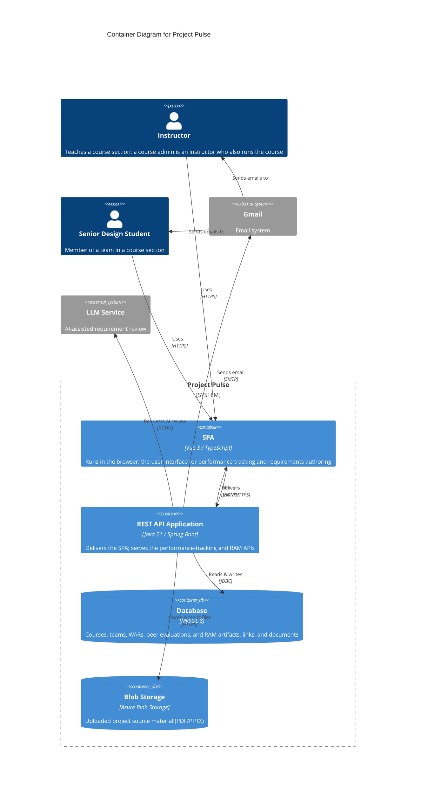
```mermaid
C4Container
    title Container Diagram for Project Pulse

    Person(instructor, "Instructor", "Teaches a course section; a course admin is an instructor who also runs the course")
    Person(student, "Senior Design Student", "Member of a team in a course section")

    System_Boundary(pulse, "Project Pulse") {
        Container(spa, "SPA", "Vue 3 / TypeScript", "Runs in the browser; the user interface for performance tracking and requirements authoring")
        Container(api, "REST API Application", "Java 21 / Spring Boot", "Delivers the SPA; serves the performance-tracking and RAM APIs")
        ContainerDb(db, "Database", "MySQL 8", "Courses, teams, WARs, peer evaluations, and RAM artifacts, links, and documents")
        ContainerDb(blob, "Blob Storage", "Azure Blob Storage", "Uploaded project source material (PDF/PPTX)")
    }

    System_Ext(gmail, "Gmail", "Email system")
    System_Ext(llm, "LLM Service", "AI-assisted requirement review")

    Rel_R(instructor, spa, "Uses", "HTTPS")
    Rel_R(student, spa, "Uses", "HTTPS")
    Rel_U(api, spa, "Delivers", "HTTPS")
    Rel_D(spa, api, "API calls", "JSON/HTTPS")
    Rel_D(api, db, "Reads & writes", "JDBC")
    Rel_D(api, blob, "Stores & reads files", "HTTPS")
    Rel_R(api, gmail, "Sends email", "SMTP")
    Rel_R(api, llm, "Requests AI review", "HTTPS")
    Rel_D(gmail, student, "Sends emails to")
    Rel_D(gmail, instructor, "Sends emails to")
```

Every arrow carries a protocol (HTTPS, JDBC, SMTP), which is arc42's technical context. The SPA and the REST API are two containers although they ship in one jar, because a container is something that runs: the SPA runs in the browser, the API on the server, and the "Delivers" arrow shows the API handing the SPA to the browser. The Gmail and LLM boxes are the same two external systems as on the context diagram, now attached to the one container that talks to them. Blob Storage is a separate container because uploaded files grow and the database should not (`CO-blob-source-material`), and that is the kind of reason every container on your own diagram needs.

**Level 3, the component view,** shows the components inside one container. In the architecture-of-record you give it as a **table**, not a diagram: one row per use case area, the component that owns it, its one-sentence responsibility, and what it depends on (template section 5.2, and [4.6](#46-decomposing-by-domain-from-use-case-areas-to-components) below). A table is what your template asks for, because it can be checked row by row against your use cases.

Project Pulse's architecture-of-record draws this level as three C4 component diagrams: the shared foundation, performance tracking, and the RAM module. Here is the shared foundation inside the REST API application:

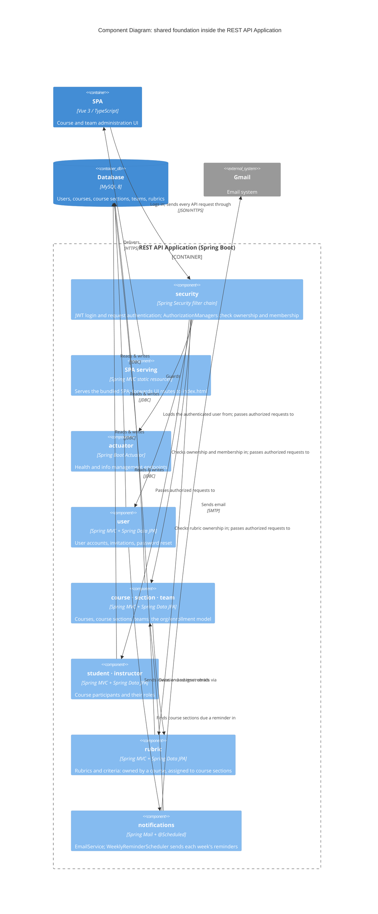
```mermaid
C4Component
    title Component Diagram: shared foundation inside the REST API Application

    Container(spa, "SPA", "Vue 3 / TypeScript", "Course and team administration UI")

    Container_Boundary(api, "REST API Application (Spring Boot)") {
        Component(security, "security", "Spring Security filter chain", "JWT login and request authentication; AuthorizationManagers check ownership and membership")
        Component(web, "SPA serving", "Spring MVC static resources", "Serves the bundled SPA; forwards UI routes to index.html")
        Component(actuator, "actuator", "Spring Boot Actuator", "Health and info management endpoints")
        Component(user, "user", "Spring MVC + Spring Data JPA", "User accounts, invitations, password reset")
        Component(org, "course · section · team", "Spring MVC + Spring Data JPA", "Courses, course sections, teams: the org/enrollment model")
        Component(people, "student · instructor", "Spring MVC + Spring Data JPA", "Course participants and their roles")
        Component(rubric, "rubric", "Spring MVC + Spring Data JPA", "Rubrics and criteria: owned by a course, assigned to course sections")
        Component(notify, "notifications", "Spring Mail + @Scheduled", "EmailService; WeeklyReminderScheduler sends each week's reminders")
    }

    ContainerDb(db, "Database", "MySQL 8", "Users, courses, course sections, teams, rubrics")
    System_Ext(gmail, "Gmail", "Email system")

    Rel(web, spa, "Delivers", "HTTPS")
    Rel(spa, security, "Logs in; sends every API request through", "JSON/HTTPS")
    Rel(security, user, "Loads the authenticated user from; passes authorized requests to")
    Rel(security, org, "Checks ownership and membership in; passes authorized requests to")
    Rel(security, people, "Passes authorized requests to")
    Rel(security, rubric, "Checks rubric ownership in; passes authorized requests to")
    Rel(org, rubric, "Owns and assigns rubrics")
    Rel(security, actuator, "Guards")
    Rel(user, notify, "Sends invitation and reset emails via")
    Rel(notify, org, "Finds course sections due a reminder in")
    Rel(user, db, "Reads & writes", "JDBC")
    Rel(org, db, "Reads & writes", "JDBC")
    Rel(people, db, "Reads & writes", "JDBC")
    Rel(rubric, db, "Reads & writes", "JDBC")
    Rel(notify, gmail, "Sends email", "SMTP")
```

This diagram shows two things a table cannot. First, **every way into the container**: API requests from the SPA, the static files that deliver the SPA, the actuator management endpoints, and the reminder schedule, which fires on a clock with no request at all. Together they are the container's attack surface, and the September 2026 credential leak in [4.9](#49-security-as-a-quality-attribute-the-trust-boundary) came through one of them. Second, **which way the dependencies run**: requests reach the org model, rubrics, and users only through `security`, and `notifications` is reached by `user` for invitation and reset emails. A component diagram that opens a box to show its controllers and services is design, and it belongs in the design-of-record for that area in week 7.

**Level 4, code,** is a class diagram. Almost nobody should draw one by hand; your IDE and your agent can produce it from the code whenever it is needed, and a hand-drawn one is out of date the day after it is committed.

**Rules that make a diagram stand on its own:**

- **A title that says what it is and what kind:** "System Context Diagram for Project Pulse," not "Architecture."
- **Every box carries a name, a type, a technology where it applies, and a one-line responsibility.** "API" is not a description. "REST API Application [Java / Spring Boot]: course-management and RAM APIs" is.
- **Every arrow is labelled with what it does, and, on a container diagram, how** ("Sends email using [SMTP]"). An unlabelled arrow means "these are related somehow," which everyone already assumed.
- **Remove the colors and the shapes, and it should still make sense,** because the text carries the meaning. Shape and color supplement a diagram that already works; icons supplement text and never replace it. A diagram made of cloud-provider icons tells you which services were bought and nothing about why.
- **A key,** whenever you use anything beyond plain boxes and arrows.
- **Beware acronyms,** especially domain ones. `WAR` is obvious to anyone on Project Pulse and to no one else.

**Why mermaid.** Every diagram in this course is text in a fenced mermaid block, for the same reason as the rest of your specification: text diffs in git, a reviewer can see what changed, and your agent can read it. A PNG exported from a drawing tool is invisible to the agent and silently stale. Mermaid's C4 syntax is still marked experimental and its automatic layout is sometimes awkward; if a diagram becomes unreadable, a plain `flowchart` with the same labels is an acceptable substitute. The labels are the diagram. (The other figures in this module are illustrations drawn for the lecture; what your team commits is mermaid.)

**The two views that wait.** Project Pulse's [architecture-of-record](https://github.com/Washingtonwei/project-pulse/blob/main/docs/design/architectural-design.md) has all four views, and its last two show what the wait buys. Here they are, as they stand on `main`.

Its **runtime view** traces sign-in and one authorized request:

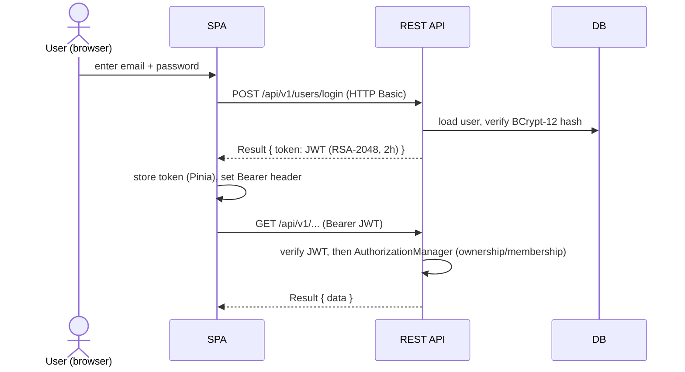
```mermaid
sequenceDiagram
    actor U as User (browser)
    participant SPA
    participant API as REST API
    participant DB
    U->>SPA: enter email + password
    SPA->>API: POST /api/v1/users/login (HTTP Basic)
    API->>DB: load user, verify BCrypt-12 hash
    API-->>SPA: Result { token: JWT (RSA-2048, 2h) }
    SPA->>SPA: store token (Pinia), set Bearer header
    SPA->>API: GET /api/v1/... (Bearer JWT)
    API->>API: verify JWT, then AuthorizationManager (ownership/membership)
    API-->>SPA: Result { data }
```

Every participant is a container from the container diagram, and the second-to-last step is the authorization check that [4.9](#49-security-as-a-quality-attribute-the-trust-boundary) returns to: a valid token is not enough, the request must also concern something the caller owns or belongs to.

Its **deployment view** shows where each container runs:

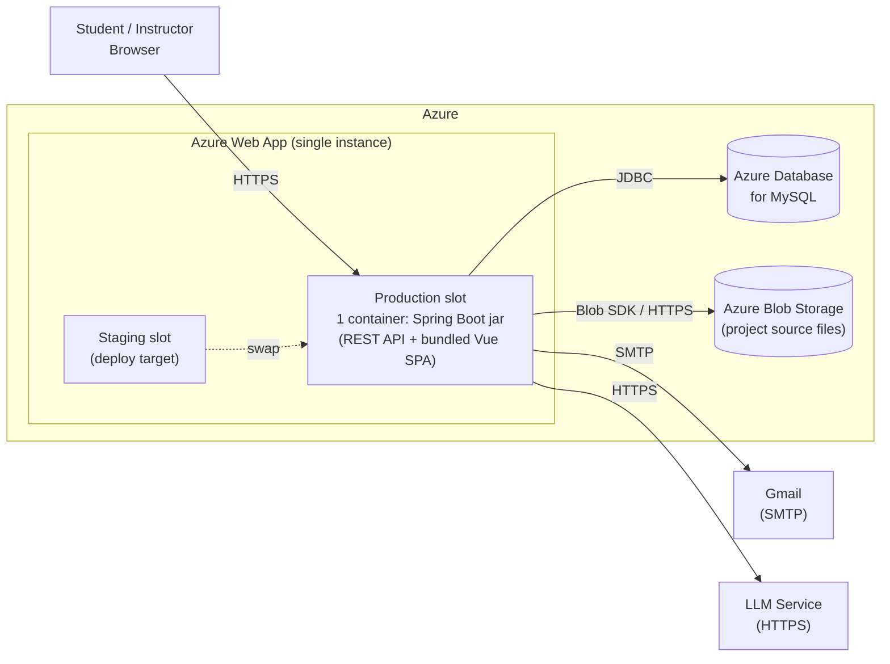
```mermaid
flowchart LR
    browser["Student / Instructor<br/>Browser"]
    subgraph azure["Azure"]
        subgraph webapp["Azure Web App (single instance)"]
            slot["Production slot<br/>1 container: Spring Boot jar<br/>(REST API + bundled Vue SPA)"]
            staging["Staging slot<br/>(deploy target)"]
        end
        db[("Azure Database<br/>for MySQL")]
        blob[("Azure Blob Storage<br/>(project source files)")]
    end
    gmail["Gmail<br/>(SMTP)"]
    llm["LLM Service<br/>(HTTPS)"]

    browser -->|HTTPS| slot
    slot -->|JDBC| db
    slot -->|Blob SDK / HTTPS| blob
    slot -->|SMTP| gmail
    slot -->|HTTPS| llm
    staging -. swap .-> slot
```

The SPA and the REST API share one container in production, because the jar serves the Vue app (`KD-modular-monolith`). Releases go to the staging slot and are swapped into production, and the text beside the diagram adds that schema changes ship as Flyway migrations at deploy time. It is a plain `flowchart`, not C4 syntax, which is the substitute allowed above.

The sequence names an endpoint and a token lifetime, and the deployment names a staging slot: facts that exist only once the code and the pipeline do. At Checkpoint 1 your team knows none of those things yet, and that is fine.

Blob Storage and the LLM service appear on both diagrams, but no code calls either of them yet: the map runs ahead of the code.

### 4.6 Decomposing by domain: from use case areas to components

Where do the components come from? From the functional side: **your use case areas.** Each area is a coherent part of the business, with its own vocabulary and its own rules, and that is exactly what a component should be. The template's section 5.2 asks for one row per area, plus a row for each cross-cutting component that no single area owns, such as authentication, email, or file storage.

In code, each component becomes a top-level package in Java (a module or a folder in other languages), created when the first use case in its area is built, so your component table is also the first draft of your package tree. It is not a Vue component, which is a piece of the user interface. Here is how that looks in Project Pulse, against the packages on the `main` branch:

| Use case area | Package in `backend/src/main/java/team/projectpulse/` |
|---|---|
| `WAR` weekly activity reports | `activity` |
| `EVA` peer evaluations | `evaluation` |
| `RUB` rubrics | `rubric` |
| `SEC` course sections (not the `SEC-*` security requirements, which share the prefix) | `section` |
| `TEA` teams | `team` |
| `STU` students, `INS` instructors | `student`, `instructor` |
| `ACC` accounts | `user` |
| The RAM areas (documents, artifacts, links, glossary, collaboration, AI, and more) | five packages under `ram/`: `document`, `requirement`, `usecase`, `glossary`, `collaboration` |
| Cross-cutting | `security` (authentication), `system` (email, the response envelope, clocks, scheduling), `course` (the root of the org model, which no use case area owns) |

The mapping is mostly one area to one package, and where it is not, several related areas share one component. That is fine: the rule is that **every area has a home**, not that each has its own. The cross-cutting components are named explicitly, too. If they are not, each area builds its own email sender and its own permission check, and you have six of each by the time the last area ships.

**Domain first, layers inside.** Look inside one of those packages. `activity` holds `Activity`, `ActivityController`, `ActivityRepository`, `ActivityService`, `ActivitySecurityService`, and its converters and data transfer objects (DTOs): the whole vertical slice for weekly activity reports, from the HTTP endpoint to the database, in one place. The layers are still there, as separate classes rather than separate packages. (This is the same "vertical" as the proving slice at Checkpoint 2: that slice is one use case built through every layer, and a domain package is where all of one area's slices live.)

Picture a layer cake: the layers run across every package, and each package is one slice cut straight down through all of them.


The alternative is to package **by layer**: every controller in one folder, every service in another, and so on down. Here are both on the same code. On the left is Project Pulse's backend as it is on `main`; on the right, a made-up version in which only the folders move and no code changes.

<div class="grid" markdown>

```text title="By domain: Project Pulse on main"
team/projectpulse/
├── activity/
│   ├── Activity.java
│   ├── ActivityCategory.java
│   ├── ActivityController.java
│   ├── ActivityRepository.java
│   ├── ActivitySecurityService.java
│   ├── ActivityService.java
│   ├── ActivitySpecs.java
│   ├── ActivityStatus.java
│   ├── converter/        2 files
│   └── dto/              1 file
├── evaluation/           16 files
├── rubric/               18 files
├── course/  section/  team/
├── student/  instructor/  user/
├── ram/                  102 files
└── security/  system/  seed/
```

```text title="By layer: the same files, rearranged"
team/projectpulse/
├── controller/           19 files
│   ├── ActivityController.java  ◀
│   └── …
├── service/              30 files
│   ├── ActivityService.java  ◀
│   ├── ActivitySecurityService.java  ◀
│   └── …
├── repository/           32 files
│   ├── ActivityRepository.java  ◀
│   ├── ActivitySpecs.java  ◀
│   └── …
├── model/
│   ├── Activity.java  ◀
│   ├── ActivityCategory.java  ◀
│   ├── ActivityStatus.java  ◀
│   └── …
├── dto/                  37 files
│   ├── ActivityDto.java  ◀
│   └── …
└── converter/            50 files
    ├── ActivityDtoToActivityConverter.java  ◀
    ├── ActivityToActivityDtoConverter.java  ◀
    └── …
```

</div>

Follow weekly activity reports (◀). By domain, the feature is one folder. By layer, it is six, and each of those six also holds the pieces of every other feature.

This is the quality attribute from [4.2](#42-quality-attributes-choose-the-architecture) that no client will ask about: `MNT-feature-locality`, "adding or modifying one feature shall require no edits to unrelated feature modules." A demo looks the same either way. The difference arrives after launch, when the software is changed rather than written, and that is where 60 to 90 percent of its lifetime cost goes, by the historical data Sommerville collects. The client never sees maintainability, only its price, in how slowly each new feature arrives. Project Pulse ranks it third among its architecturally significant requirements because next year's students extend the code; yours matters because someone runs it after you graduate. Package layout is the first place it is won or lost.

Layering is a good idea. Separating presentation from business logic from data access lets you think about one concern at a time, test the logic without a database, and replace one layer without rewriting the others. The mistake is making it the **top-level** division. As the application grows, each layer gets large enough on its own that you need to divide it again anyway: at Project Pulse's size, `converter/` alone would hold 50 files. Martin Fowler's advice ([PresentationDomainDataLayering](https://martinfowler.com/bliki/PresentationDomainDataLayering.html), 2015) is to divide by domain at the top and layer inside each domain, which is what Project Pulse's `KD-vertical-slices` records. David Parnas gave the reason in 1972: a module should hide a decision that is likely to change, and the business rules inside one use case area change together.

**Packaging by domain gets you something packaging by layer cannot: package-private visibility.** A Java class without `public` is visible only inside its own package. In a layered tree, `ActivityRepository` has to be public, because `ActivityService` lives in another package. In a domain tree it can drop `public`, and then no other feature can read weekly activity reports behind the service's back, because the compiler refuses. Spring Data still finds a package-private repository. So make package-private the default, and make a class public only when another package needs it. One Java detail: `activity.dto` is a separate package from `activity`, and package-private visibility does not reach into it. That is one more reason to keep a domain package flat until it is too big to scan.

Project Pulse's quality scenario `QS-add-bounded-context` makes the rule checkable: a new feature package is added with zero changes to other feature packages, no feature reads a sibling's repositories, and no two features depend on each other in a cycle. A quick version you can run on your own backend is the **deletion test**: can you remove a feature by deleting its package? Delete `activity/` from Project Pulse and three files outside it stop compiling: two of `security`'s authorization managers and the data seeder. The seeder loads demo data for every feature and is exempt by design; the managers are debt, shown in the diagram below. The test finds candidates; a person decides which ones are debt. A rule written down precisely enough can be checked, and checking it is how you find out the code has drifted from the map.


*Redrawn from the mermaid C4 in Project Pulse's [architecture-of-record](https://github.com/Washingtonwei/project-pulse/blob/main/docs/design/architectural-design.md).*

No arrow runs between `activity` and `evaluation`, so either can change without touching the other; every arrow they send points into the shared foundation, drawn in grey. The two red arrows from `security` are the catch. Three of its authorization managers import the `activity` and `evaluation` security services, so the foundation depends on the features, which the rule forbids. Project Pulse records this under `TD-feature-locality`: the fix, moving those managers next to the feature they guard, is tracked as an open item, and a planned ArchUnit test will keep new violations out.

**The same argument applies to the dev teams.** Divide a system by layer and the team divides by layer too: a front-end person, a back-end person, a database person. Melvin Conway observed in 1968 that systems end up mirroring the communication structure of the organizations that build them, and it works in both directions. This is why your [project](../project.md) makes every member full stack and assigns work by use case: a defect where two layers meet belongs to nobody when the layers belong to different people.

### 4.7 One deployable or several

This is the one decision every team must make, and the one the [template](https://github.com/tcu-cosc-40943/course-templates/blob/main/design/architectural-design.md) requires as `KD-deployment-shape` at Checkpoint 1.

**A monolith** is one codebase, one build, and one deployable unit. Project Pulse builds its Vue single-page app into the Spring Boot jar, ships one Docker image, and runs it on one Azure Web App. Its `KD-modular-monolith` records why: an instructor-scale deployment with no operations team, where "delivery speed and operational simplicity matter more than scaling parts independently." The rejected alternative, separate services or a separately hosted front end, takes one sentence to dismiss: the network and operations complexity is unjustified at this scale. The trade-off is stated as plainly: the application scales only as a whole.

**Microservices** divide the system into separately deployed services, each organized around one business capability, each owning its own data, communicating over the network. They buy four things:

- **Independent scaling.** Scale only the service under load, not the whole system.
- **Independent deployment.** Ship one service without redeploying the others.
- **Independent teams.** Each team owns a service end to end, in whatever language suits it.
- **Failure isolation.** If recommendations crash, checkout still works.

Here is what those look like at the scale where they pay off. On November 11, 2019, Alibaba's Tmall ran its annual Singles' Day sale and reported a peak of [**544,000 orders per second**](https://www.thestar.com.my/tech/tech-news/2019/11/21/how-alibaba-powered-billions-of-transactions-on-singles-day-with-zero-downtime). At that load, the checkout path and the product-browsing path have completely different traffic shapes, and scaling them together would waste enormous amounts of hardware. Hundreds of engineering teams need to ship without coordinating every release. That is the problem microservices solve.

**Now count what they cost.** Every call between services is a network call that can be slow, fail, or partly succeed, so you need timeouts, retries, circuit breakers, and a plan for each. A transaction that spanned three tables now spans three services, and it is no longer a transaction. A bug report now needs tracing across services to locate. Every service needs its own pipeline, monitoring, and on-call. None of this is free, and all of it is work that does not deliver a single use case.

**Monolith first.** Martin Fowler's observation, from watching many projects, is that almost every successful microservice system started as a monolith that grew too big and was split, and almost every system built as microservices from the start ended up in serious trouble. The reason is that you cannot draw good service boundaries until you understand the domain, and you understand the domain by building it. A monolith lets you move a boundary by moving a package. Microservices make you move it by migrating data between databases.

It also goes the other way at scale. In 2023 Amazon's Prime Video team [described moving](https://web.archive.org/web/20240805183535/https://www.primevideotech.com/video-streaming/scaling-up-the-prime-video-audio-video-monitoring-service-and-reducing-costs-by-90) an audio and video monitoring service from a distributed design, separate serverless components coordinated over the network, into a single process, and reported that infrastructure costs fell by over 90%. The distributed design was not wrong in principle; it was wrong for that workload, and nobody had checked.

**The middle option is the one to aim for: a modular monolith.** One deployable, but divided inside by domain, with each module owning its own slice of the code ([4.6](#46-decomposing-by-domain-from-use-case-areas-to-components)) and talking to the others through their service interfaces rather than reaching into their tables. You get the simple operations of a monolith and most of the maintainability of services, and if one module ever does need to scale separately, the boundary is already drawn. This is what Project Pulse is.

![Three deployment shapes side by side. Monolith: one deployable with no boundaries inside and one database; to move a boundary, untangle the code first. Modular monolith, marked as the one to aim for and as Project Pulse: one deployable divided into domain packages (activity, team, evaluation) that call each other in-process, one database; to move a boundary, move a package. Microservices: separate deployables with a database each, calling each other over the network; to move a boundary, migrate data between databases, and each service needs its own pipeline, monitoring, and on-call](../slides/img/deployment-shapes.svg)

Team A from the [Motivation](#3-motivation) is the shape on the right; Team B is the one in the middle.

**For your project,** the question is not "which is better?" It is "which requirement would force several deployables?" Write that requirement down. If your specification has no such requirement, if nothing in it needs one part to scale, deploy, or fail independently of the rest, you have your answer and your rejected alternative. Your client's system will serve tens or hundreds of users, and after your team hands it off, someone will have to run it.

### 4.8 A catalog of patterns, and which ones you will meet

You have already met two architectural patterns: **layered**, inside every domain package in [4.6](#46-decomposing-by-domain-from-use-case-areas-to-components), and **microservices**, the right-hand shape in [4.7](#47-one-deployable-or-several). An **architectural pattern** is a reusable solution to a problem that keeps occurring in a given context. Patterns combine, so one system is usually several at once: Project Pulse is a modular monolith with layers inside each package. There are many more. Two are in almost any web application, Project Pulse included, starting with the one you already know.

**Layered** (presentation, domain logic, data access) is inside every component you build, as [4.6](#46-decomposing-by-domain-from-use-case-areas-to-components) described. A request enters at the controller, the service applies the business rules, the repository talks to the database, and each layer knows only the one below it.

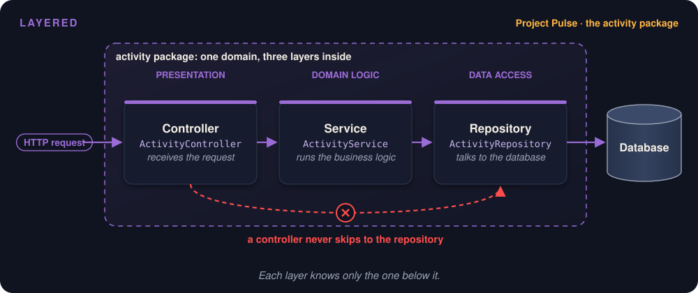

Each layer has one job, and most layering bugs are code in the wrong layer.

| Layer | Its job | Belongs here | Does not belong here |
|---|---|---|---|
| **Controller** | Translate between HTTP and the application | Routes; reading the request and checking its shape; converting between request and response objects and domain objects | Business rules, transactions, database access |
| **Service** | Carry out a use case | Business rules; deciding which data the caller may see; the transaction; errors in domain terms, such as "not found" or "not allowed" | Anything HTTP: request objects, status codes |
| **Repository** | Load and store data | Queries | Business rules |

The common mistakes, each of which an agent makes too unless your context says otherwise:

- **The fat controller.** A rule written in the controller is skipped by every other way in: a second endpoint, a scheduled job, a test that calls the service directly. In Project Pulse, the rule that a student must be on a team before submitting a weekly activity report lives in the service, so no endpoint can skip it.
- **The skipped layer.** A controller calls the repository directly because the service would only pass the call through. The next rule needs a home, and that home is the service.
- **The database row on the wire.** Returning the stored object straight to the client exposes every field it has and ties the API to the table design. Return a response object (a DTO) that carries only what the client needs.
- **HTTP in the service.** A service that reads a request or returns a status code can be called only from a controller, and every test of it needs a fake request.
- **Rules hidden in queries.** A query that quietly filters to "the current user's team" puts an access rule where no reviewer looks for one.

**Pipes and filters** passes data through a chain of independent processing steps, each taking input and producing output for the next. Machine learning pipelines are the familiar example. The one you will use daily is less obvious: **Spring Security is a filter chain.** Every HTTP request passes through an ordered series of filters (CORS, authentication, authorization, and more) before it reaches your controller, and each filter can pass it on or reject it. What the authorization filter does with a request that none of its rules matches is the subject of [4.9](#49-security-as-a-quality-attribute-the-trust-boundary).

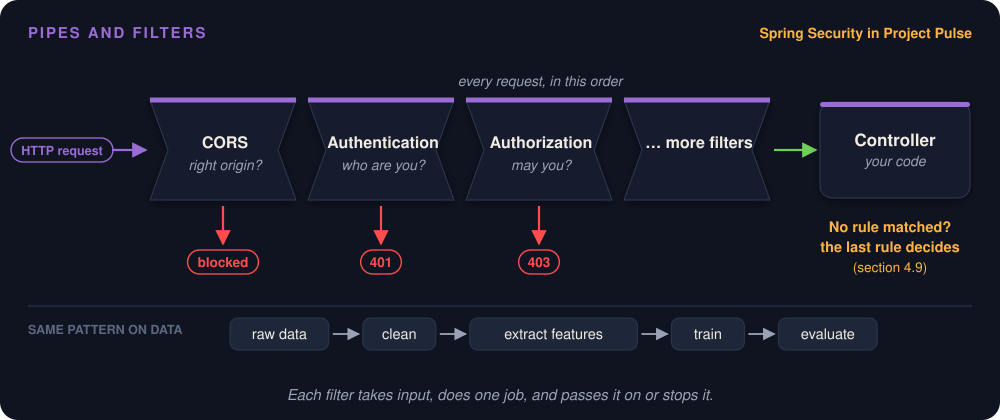

The rest of the catalog you should recognize by name and by the problem it solves, so you can tell when an agent reaches for one without a reason:

| Pattern | The problem it solves | You need it when |
|---|---|---|
| **Broker** | Clients should not need to know where services are or which instance answers | Many services, located and replaced dynamically |
| **Publish-subscribe** (event-driven) | Producers and consumers of events should not know about each other; work can happen later | Work that can be done asynchronously, traffic spikes to absorb, many independent consumers of one event |
| **Message queue** (the usual implementation of the two above) | Decouple the sender from the receiver in time, and order and throttle the work | A job that takes longer than a user will wait, or bursts the database cannot absorb |
| **Source-replica** | One database cannot serve all the reads, or must survive a failure | Read load far above write load, or an availability target one server cannot meet |
| **Main-worker** | A large job can be split into identical independent pieces | Batch computation that can be parallelized |
| **API gateway** | Many services behind one entry point, with cross-cutting concerns in one place | You have already chosen microservices |

Here is what each one looks like:

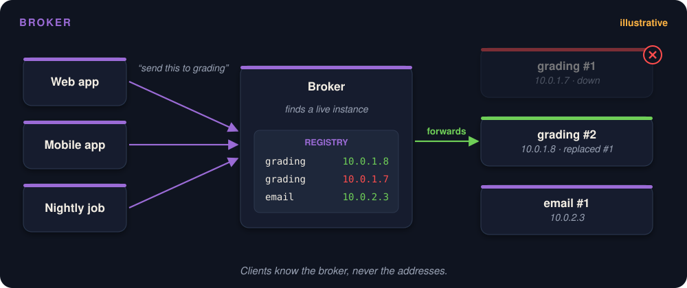

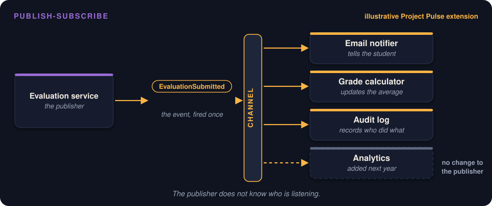

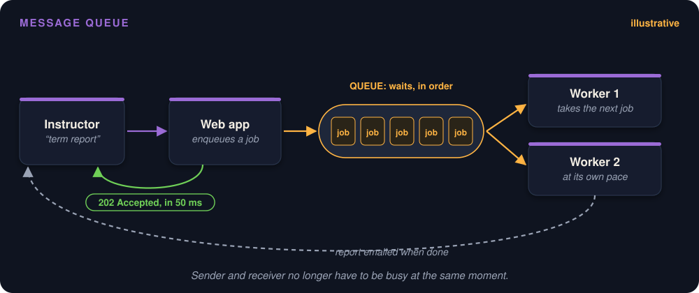

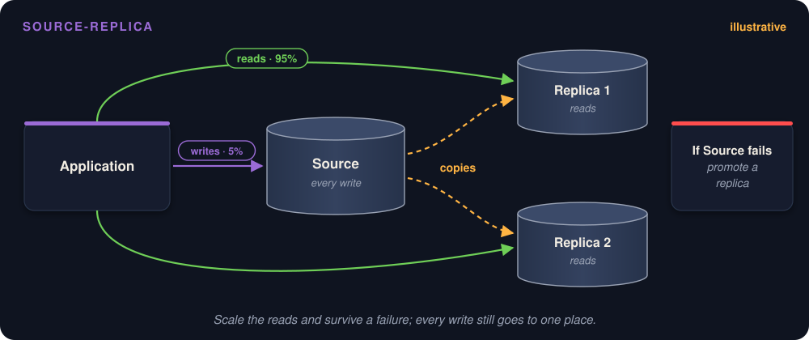

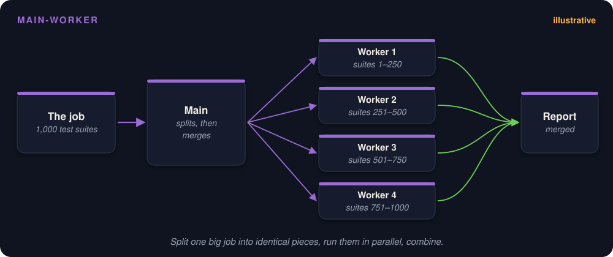

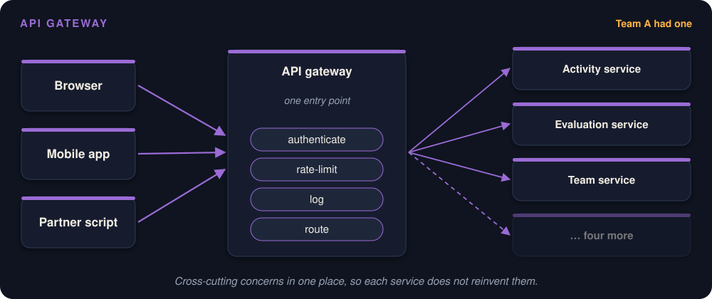

Read the table's right-hand column as a set of requirements. If your specification contains none of them, your system uses none of these patterns, and that is a correct architecture, not an unambitious one.

### 4.9 Security as a quality attribute: the trust boundary

Security is not a feature you add. It is a property of the whole system's shape, and it begins with one line you write down: the **trust boundary**, between what you control and what you do not. Every request that crosses it, from a browser, from another system, from the internet at large, must be authenticated, authorized, and treated as possibly hostile. Every piece of sensitive data that crosses it outward is a disclosure you must be able to justify.

Section 8.1 of the template names the trust boundary and then asks three questions at Checkpoint 1: **how does a user prove who they are, what may each role see and do, and where does sensitive data live?** The second question has a part people miss. Roles are not enough. A student is allowed to read weekly activity reports, but only their own team's. Project Pulse enforces that twice, once at the route with an authorization manager that checks team membership, and again in the query itself, scoped to the caller's team. The route check alone is not enough if a request can name another team's object ID.

**The trust boundary is the REST API application, and it covers every path that application answers, not only `/api/v1`.** The Vue app runs in the user's browser, outside the boundary, so every request is authenticated and authorized on the server. Project Pulse learned this on September 6, 2026. Its security rules protected every route under `/api/v1/**`. Spring Boot Actuator's management endpoints live at `/actuator/**`, outside that prefix, so they fell through to the last rule in the chain, `.anyRequest().permitAll()`. With the `env` endpoint exposed and its masking turned off, any anonymous caller could fetch one URL and read the production database and mail credentials in plain text. They were stored in Azure Key Vault and had never been committed to git. Every item on the usual secrets checklist was satisfied, and the secrets leaked anyway, through an endpoint no feature used and no use case mentioned.

Nobody wrote a rule that made actuator public. It was the absence of a rule. The fix, in [pull request #61](https://github.com/Washingtonwei/project-pulse/pull/61), made it structural: any route under the API base URL without an explicit rule is now **denied** by default, so a new API endpoint fails closed until someone writes its rule, and the actuator endpoints get rules of their own. The final `permitAll()` is still there, because the same jar serves the Vue app's files to every browser, which is a direct consequence of `KD-modular-monolith`. So deny by default covers only the API. A new path outside it, from a library or a framework feature someone switches on, still falls through to `permitAll()` exactly as actuator did, and needs a rule of its own. That is the lesson for your trust boundary: an architecture decision about deployment shaped the security surface, and the boundary has to cover everything the deployable exposes, including what came with the framework. The incident, the exposed values, and the credential rotation are recorded as `TD-actuator-exposure` in Project Pulse's [architecture-of-record](https://github.com/Washingtonwei/project-pulse/blob/main/docs/design/architectural-design.md), and the full case is taught in week 12 with observability.

**Secrets never appear in the architecture document or the repository.** Say where they will live (environment variables, a vault) and who can read them, never what they are.

### 4.10 Crosscutting concepts: what every component does the same way

Some decisions belong to no single component because they belong to all of them: what a failure looks like to the caller, what time it is, where input is checked, what gets logged. arc42 calls these **crosscutting concepts**, and they are section 8 of your template. arc42 leaves section 8 open, a list of whatever concepts your system needs. Your template fixes its first entry: 8.1 is security, the subject of [4.9](#49-security-as-a-quality-attribute-the-trust-boundary), because Checkpoint 1 asks for the trust boundary. Section 8.2 holds the rest.

They pass the reversibility test from [4.1](#41-what-architecture-is-and-what-it-is-not) in an unusual way. Any one convention is cheap to choose on the first day. It becomes expensive after forty endpoints have each chosen differently, because changing it then means touching all forty, and the front end that learned to cope with every variant.

**With an agent writing the code, they matter more.** Every agent session starts with no memory of the last one, so each behaves like a new teammate. Asked for an endpoint, it picks an error format that looks reasonable, and the next session picks a different one. [Context Engineering](context-engineering.md#3-motivation) opened on the same failure with time: the agent writes `LocalDateTime.now()`, correct Java and wrong for Project Pulse. A crosscutting concept is exactly what an agent cannot work out from the one file in front of it, because the rule lives in every other file.

**Error handling, in Project Pulse.** Every controller returns the same envelope, a `Result` with four fields (`flag`, `code`, `message`, `data`), and no controller builds its own error. Services throw exceptions, and one class turns each kind into that envelope ([`ExceptionHandlerAdvice.java`](https://github.com/Washingtonwei/project-pulse/blob/main/backend/src/main/java/team/projectpulse/system/exception/ExceptionHandlerAdvice.java), abridged):

```java
@RestControllerAdvice
public class ExceptionHandlerAdvice {

    @ExceptionHandler(ObjectNotFoundException.class)
    @ResponseStatus(HttpStatus.NOT_FOUND)
    Result handleObjectNotFoundException(ObjectNotFoundException ex) {
        return new Result(false, StatusCode.NOT_FOUND, ex.getMessage());
    }

    // ... one handler per kind of failure ...

    @ExceptionHandler(Exception.class)
    @ResponseStatus(HttpStatus.INTERNAL_SERVER_ERROR)
    Result handleOtherException(Exception ex) {
        return new Result(false, StatusCode.INTERNAL_SERVER_ERROR, "A server internal error occurs.", ex.getMessage());
    }
}
```

The Vue app unwraps every response, and every failure, in one place, and a new endpoint gets all of this just by throwing. Now read the last handler again. It is the fallback for every exception nobody anticipated, and it sends that exception's message to the browser as `data`. A database error's message can name tables and columns. A crosscutting concept spreads its flaws everywhere too, and this one belongs on the security side of the ledger in [4.9](#49-security-as-a-quality-attribute-the-trust-boundary).

**Time, in Project Pulse.** There are two kinds of time, and they read different clocks. **Calendar time** (active weeks, deadlines, reminders, audit timestamps) comes from one injected `Clock` bean, never from `LocalDateTime.now()`. Which clock depends on the profile: in development it is fixed at Sunday, August 20, 2023, 11:30 pm, half an hour before a week ends, which is exactly where deadline bugs live; in staging and production it is the real clock, in the time zone set by `app.timezone`. **Elapsed time** (when a login token expires, when an edit lock lapses) uses the real clock, `Instant.now()`, because a frozen clock would stop it: in development a token would never age and a lock would never lapse. A rule that said only "always use the injected clock" was not precise enough. The rule has to say which time.

**Where the rule lives: three places, one owner.** Project Pulse keeps its conventions in its architecture-of-record, under [Crosscutting Concepts](https://github.com/Washingtonwei/project-pulse/blob/main/docs/design/architectural-design.md#crosscutting-concepts), which calls itself their "one normative home": the charters "restate each rule only as a short working reminder and link back here; when a rule changes, change it here first, then its reminder." Its [backend charter](https://github.com/Washingtonwei/project-pulse/blob/main/backend/CLAUDE.md) says so ("The binding conventions every package follows are normative in the architecture-of-record's Architectural Conventions") and then carries the one-line rules an agent must follow, the `Clock` rule among them. The code shows each rule done. Do the same:

- **Write them before your agent builds its second component,** not after the first inconsistency. With an agent, the second component arrives the same afternoon.
- **Name the file that shows the rule done right.** An agent imitates the code it sees more reliably than it follows prose, so an entry in 8.2 points at the class, not only at a sentence.
- **Put the one-line instruction in your charter, and cite 8.2.** The charter is always in the agent's context; the architecture document is not. Section 8.2 owns the reasoning, the charter carries the rule, and the citation shows when the two drift apart.
- **Where a tool can check the rule, add the check,** such as a lint rule that rejects `LocalDateTime.now()` with no argument. A convention nothing checks is one you are trusting the agent to remember.

Which concepts first? Error handling and time; one or both is in almost every proving slice. The template's section 8.2 lists the others (validation, API conventions, configuration and secrets, logging, concurrency, auditing, testing) with the moment each usually starts to matter, so you add each one just before it does.

### 4.11 Writing a decision down

A decision that lives only in the heads of the people who made it will be re-argued every time someone new joins, and it will eventually be reversed by someone who never knew why it was made. Michael Nygard proposed the fix in 2011, as the architecture decision record: a short, numbered, never-edited note per decision. The course template uses the same idea, as `KD-<slug>` entries in section 9.2, each in this form:

- **Driving requirements:** the ASRs that forced it, by identifier.
- **Context:** the facts about this project that made it a question at all.
- **Decision:** what you chose, in one or two sentences.
- **Rejected:** what you did not choose, and why not.
- **Trade-off:** what this choice costs, stated plainly.

The **rejected alternative** is the part that does the work. A decision without one is a description: "we use a relational database" tells a reader nothing they could not learn from the code. "We use one relational database, not a relational one plus a graph database for the requirement links, because a second datastore is a second thing to back up, migrate, and secure, and a team's graph is small enough for SQL" tells them what not to propose next year, and under what conditions it would become the right proposal after all. That example is Project Pulse's `KD-relational-graph`.

The **trade-off** is the part that shows you understood the decision. Every decision costs something. If you cannot say what yours costs, you have not yet understood it.

**A decision that turns out wrong is not erased.** It is marked superseded, and a new decision is added that says what replaced it and why. The history of why you changed your mind is as valuable as the decision itself.

**Follow one requirement all the way down.** The ASR table points each requirement at its decisions, and each decision points back at its requirements. Lay those links end to end and the architecture can be checked in both directions. Forward: does every significant requirement reach something that proves it holds? Backward: does every part of the structure exist because a requirement asked for it? Here are two of Project Pulse's chains, from its [architecture-of-record](https://github.com/Washingtonwei/project-pulse/blob/main/docs/design/architectural-design.md) and its [traceability matrix](https://github.com/Washingtonwei/project-pulse/blob/main/docs/traceability.md):

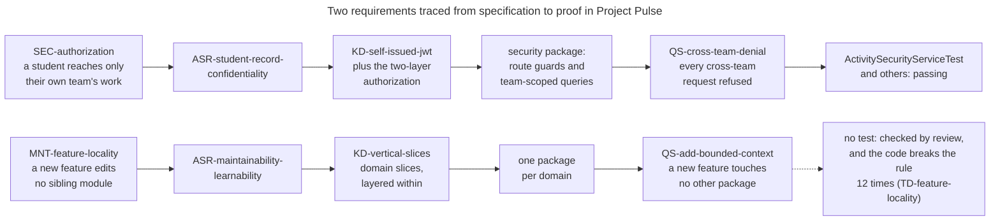
```mermaid
---
title: Two requirements traced from specification to proof in Project Pulse
---
flowchart LR
    s1["SEC-authorization<br/>a student reaches only<br/>their own team's work"] --> s2["ASR-student-record-<br/>confidentiality"]
    s2 --> s3["KD-self-issued-jwt<br/>plus the two-layer<br/>authorization"]
    s3 --> s4["security package:<br/>route guards and<br/>team-scoped queries"]
    s4 --> s5["QS-cross-team-denial<br/>every cross-team<br/>request refused"]
    s5 --> s6["ActivitySecurityServiceTest<br/>and others: passing"]

    m1["MNT-feature-locality<br/>a new feature edits<br/>no sibling module"] --> m2["ASR-maintainability-<br/>learnability"]
    m2 --> m3["KD-vertical-slices<br/>domain slices,<br/>layered within"]
    m3 --> m4["one package<br/>per domain"]
    m4 --> m5["QS-add-bounded-context<br/>a new feature touches<br/>no other package"]
    m5 -.-> m6["no test: checked by review,<br/>and the code breaks the rule<br/>12 times (TD-feature-locality)"]
```

The dashed arrow is the point of the second chain. Project Pulse's most important quality attribute is proved by tests that run on every build. Its maintainability rule is proved by nothing: the decision is recorded, the structure is drawn, and the code has drifted from both, because nothing fails when it does. The fix Project Pulse records is an architecture test (ArchUnit) that fails the build on a new violation. A chain with no test at the end is a decision you are trusting people to remember.

Your template asks for the first four links at Checkpoint 1. A quality scenario joins them at Checkpoint 2, the tests arrive as you build, and week 8 teaches the whole chain as traceability.

## 5. The AI-native lens

- **Delegate to AI:** drawing C4 diagrams in mermaid from your use case list and your specification's interfaces; checking that every use case area has a component and every external system appears on the container diagram; drafting the rejected alternative for a decision you have already made, then arguing with it; explaining an unfamiliar pattern in terms of your own system.
- **Keep human:** the ranking of the architecturally significant requirements and every key decision. They depend on facts about your client that are in no file: who will run this, what they already know, how much they can spend, what they are afraid of.
- **Context to supply:** the specification's quality attributes and constraints, the numbers especially, and the facts that make scale small; and, once an agent writes code, your crosscutting conventions ([4.10](#410-crosscutting-concepts-what-every-component-does-the-same-way)), cited from your charter. An agent that does not know you have 75 users will design for 75,000, because that is what most architecture writing it learned from is about.
- **How to verify:** for every container, every pattern, and every decision the agent proposes, ask which requirement in your ASR table forces it. If the answer is none, cut it. Then check the other direction: does every ASR drive at least one decision?

**The failure to expect is over-engineering, and it arrives looking like expertise.** Ask an agent for an architecture for a client project and you will often get microservices, a message queue, Kubernetes, a cache, and an API gateway, each described in fluent, correct detail. Every one is a real answer to a problem your client does not have, and each adds something that can fail at 2 a.m. with nobody left to fix it after you graduate. This is the [Napkin](se-and-ai.md#the-napkin-six-prompts)'s "stack" and "bottleneck" prompts, taken slowly: a boring default unless there is a reason, and the reason has to be a requirement you can cite.

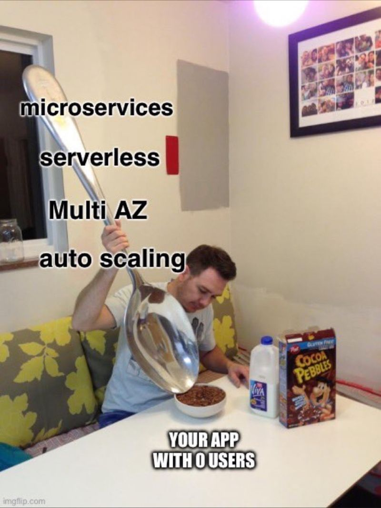

Every label on the spoon answers a problem someone has. Multi-AZ runs copies of a system in separate data centers so that one can burn down without an outage, which a 99.99% availability target needs. Project Pulse's `AVL-uptime` asks for 99%. (Meme made with imgflip, shared by Vishakha Sadhwani on LinkedIn, April 2026; the photo's original source is unknown.)

**The second failure is inconsistency:** every convention nobody wrote down gets reinvented by the next session ([4.10](#410-crosscutting-concepts-what-every-component-does-the-same-way)).

## 6. Risks and mitigations

| Risk (classic and AI-introduced) | Human judgment that catches it | Mitigation |
|---|---|---|
| **Over-engineering.** A distributed design, or infrastructure, that no requirement asks for. The AI-introduced half is speed: an agent produces a complete, confident, well-diagrammed distributed design in a minute, and it looks like more work than yours did. | Asking which requirement forces each part, and noticing when none does | Every container and every decision cites an ASR. A part with no citation is cut, or named in a decision's **Rejected** line with the requirement that would bring it back. |
| **Architecture by feature list.** Components invented from nouns in the use cases, and the quality attributes never consulted. | Noticing that the ASR table is empty, or that no decision cites it | Write the ASR table first. Every decision names its driver. |
| **The map with holes.** A use case area or an external system nobody placed, found when someone starts building it. | Checking the component table against the use case file, row by row | The two checks at the end of template section 5.2, run before every checkpoint. |
| **Up-front over-design.** Components designed down to classes and endpoints before any code exists. | Asking whether this detail would be expensive to change later | The reversibility test. Detail that fails it goes to the week 7 design-of-record. |
| **The stale diagram.** The architecture changed; the document did not. | A reviewer asking, during a pull request that adds a container or an external system, whether the architecture document changed too | Keep the diagrams as text in the repository, next to the code, and change them in the same pull request. |
| **Conventions reinvented every session.** Error formats, time handling, and validation differ between endpoints the agent wrote on different days, because nothing told it the rule. AI-introduced: each session starts with no memory of the last. | A reviewer asking which 8.2 entry this code follows | Write 8.2 before the second component, put a one-line rule in the charter citing it, and add a check wherever a tool can enforce it ([4.10](#410-crosscutting-concepts-what-every-component-does-the-same-way)). |
| **Security left for later.** No `SEC-*` among the ASRs, no trust boundary named, and authorization added one endpoint at a time. | Asking what happens to a request that matches no rule | Deny by default. Put the boundary around everything the deployable exposes, framework endpoints included. |

## 7. Hands-on (studio)

**Studio (team, own project, week 6)**

- **Goal:** draft your team's architecture-of-record, breadth-complete and depth-shallow, from your specification. This is the second half of [Checkpoint 1](../project.md#checkpoints); your TA reviews the first half, the specification, with you during the same hour.
- **In studio:** fill template sections 1 through 5, section 8.1, and section 9, starting from the ranked ASR table, because every other section cites it. Use your agent to draw the diagrams; keep the ranking and the decision for the team. The preparation, the order to draft in, and the timing are on the [studio page](../studio.md#week-6-oct-2-checkpoint-1-and-your-architecture-of-record).
- **Deliverable and assessment:** the document, merged to `main` by 11:59 pm Friday. Your TA checks it over the weekend against the six-point checklist on the studio page and replies by Sunday evening with one issue in your repository. The check reads whether every use case area and every external system has a home, whether each decision cites the requirement that forced it and names what it rejected, and whether the security section answers its three questions. It does not reward length: a short document that names everything is the goal.

There is no individual assignment for this module. The Project Pulse architecture-of-record is your worked example: read its Quality Goals, its ASR table, and `KD-modular-monolith`, `KD-relational-graph`, and `KD-vertical-slices` before you write your own.

## 8. Summary / key takeaways

- Architecture is the decisions that are expensive to change. Decide those now; leave the rest to be designed against real code.
- The same features fit many structures. Quality attributes and constraints choose among them, so build the architecture from those, not from the feature list.
- The architecturally significant requirements are the few where a wrong guess costs a redesign. Reuse their existing identifiers, and include at least one security requirement.
- The architecture-of-record follows arc42. Where your requirements documents already own a fact (stakeholders, constraints, quality attributes, business risks, glossary), it links instead of copying.
- An architecture is described in views, each for one reader. Draw context and building blocks from the specification now; draw the runtime and deployment views once there is code and a pipeline to describe.
- A diagram has to stand on its own: titled, keyed, every box and arrow described in words. Keep it in mermaid, in the repository, next to the code it describes.
- Divide the system by domain first, from your use case areas, and layer inside each domain. Name the cross-cutting components, or every area builds its own.
- Start with one deployable, divided inside by domain. Several deployables need a requirement that forces them, and at your scale there usually is not one.
- Draw the trust boundary around everything the system exposes, and deny what no rule allows. Project Pulse leaked its production credentials through an endpoint no feature ever used.
- Write down what every component must do the same way, error handling and time first, before an agent builds the second component. Each session is a new teammate that reinvents whatever is not written.
- A decision without a rejected alternative is a description. A decision without a trade-off has not been understood. Trace each significant requirement through its decision to the test that proves it; a chain with no test at the end is a decision you are trusting people to remember.
- When an agent proposes an architecture, ask of every part which requirement forces it.

## 9. Key papers and further reading

- Len Bass, Paul Clements, and Rick Kazman, *Software Architecture in Practice*, 4th ed. (Addison-Wesley, 2021). The standard text: quality attributes, quality scenarios, tactics, and the utility tree behind [4.3](#43-architecturally-significant-requirements).
- Grady Booch, "On Design," blog essay, 2006, quoted in Frank Buschmann, Kevlin Henney, and Douglas C. Schmidt, *Pattern-Oriented Software Architecture*, Vol. 5 (Wiley, 2007), p. 214. The cost-of-change definition in [4.1](#41-what-architecture-is-and-what-it-is-not).
- [arc42](https://arc42.org), the template your architecture-of-record follows, with examples for every section; and [the C4 model](https://c4model.com), Simon Brown's own explanation of the four levels and the notation rules.
- Martin Fowler, [*MonolithFirst*](https://martinfowler.com/bliki/MonolithFirst.html) (2015), and James Lewis and Martin Fowler, [*Microservices*](https://martinfowler.com/articles/microservices.html) (2014), which defined the term and is candid about its costs.
- Martin Fowler, [*PresentationDomainDataLayering*](https://martinfowler.com/bliki/PresentationDomainDataLayering.html) (2015). Domain modules at the top, each layered inside: the figure in [4.6](#46-decomposing-by-domain-from-use-case-areas-to-components).
- Melvin Conway, ["How Do Committees Invent?"](https://www.melconway.com/Home/Committees_Paper.html), *Datamation* 14(4), 1968, pp. 28–31. The origin of Conway's law in [4.6](#46-decomposing-by-domain-from-use-case-areas-to-components).
- Michael Nygard, [*Documenting Architecture Decisions*](https://cognitect.com/blog/2011/11/15/documenting-architecture-decisions) (2011), the origin of the architecture decision record.
- Philippe Kruchten, "The 4+1 View Model of Architecture," *IEEE Software* 12(6), 1995, pp. 42–50. The origin of describing one architecture through several views, which arc42 inherits.
- Bashar Nuseibeh, "Weaving Together Requirements and Architectures," *IEEE Computer* 34(3), 2001, pp. 115–117. The Twin Peaks model in three pages.
- [*Package by feature, not layer*](http://www.javapractices.com/topic/TopicAction.do?Id=205), javapractices.com (no author or date given). The package-private argument in [4.6](#46-decomposing-by-domain-from-use-case-areas-to-components), readable in five minutes.
- David Parnas, "On the Criteria to Be Used in Decomposing Systems into Modules," *Communications of the ACM* 15(12), 1972. Still the best argument for dividing a system by what is likely to change.
- Project Pulse's [architecture-of-record](https://github.com/Washingtonwei/project-pulse/blob/main/docs/design/architectural-design.md) and [software architecture primer](https://github.com/Washingtonwei/project-pulse/blob/main/docs/guides/software-architecture-primer.md), the worked example throughout.
- Ian Sommerville, *Software Engineering*, 10th ed. (Pearson, 2016), ch. 9, "Software evolution." The 60 to 90 percent evolution-cost figure in [4.6](#46-decomposing-by-domain-from-use-case-areas-to-components), with its sources.
- [The Method](../method.md), Principle 2, for how the architecture-of-record fits the spec-driven, agent-assisted method.

## 10. Self-check

1. Your teammate says the architecture should specify every REST endpoint so the agent has less to guess. Apply the reversibility test and say where endpoint shapes belong instead.
2. Two designs deliver every use case in your specification. What do you compare to choose between them, and where in your specification do you find it?
3. Your client says "it has to be fast." Is that an architecturally significant requirement? Say what you would need to find out before you could answer.
4. An agent proposes separate services for users, orders, and notifications, each with its own database, for a system with 200 users. Name the requirement that would justify it, and write the rejected-alternative line you would put in `KD-deployment-shape` if your specification has no such requirement.
5. Your context diagram shows the system, three kinds of user, and nothing else. What question should your team ask the client before Checkpoint 1, and why is the answer an architecture question?
6. A teammate packages the backend as `controllers`, `services`, and `repositories`. Describe the most common change on your project, and say how many packages it touches under that layout and under a domain layout.
7. Your component table has a row for every use case area and none for email, although four use cases send email. What will happen by the time the last area is built?
8. Project Pulse's security rules covered every route under `/api/v1/**`, and the production credentials leaked anyway. Explain how, and say which line of the fix makes the same mistake impossible for a new API endpoint. Which new paths does that line not cover, and what must happen when one appears?
9. A key decision in your document reads: "We use PostgreSQL." Say what is missing, and rewrite it.
10. Months later, your team reverses `KD-deployment-shape` because one part really does need to scale on its own. What happens to the original entry, and why does it stay in the document?
11. A teammate wants to fill in the runtime view before Checkpoint 1, with a sequence diagram for every use case, so the agent has a complete picture. What do you tell them, and when does that view get drawn?
12. Three agent sessions built three endpoints this week. One returns `{"error": "..."}`, one a bare 500 page, and one your team's envelope. What was missing before the first session, where does it go, and what does your charter say about it?
13. A teammate copies the stakeholder table from vision and scope into section 1.3 of the architecture-of-record "so the document is complete." What goes wrong within a month, and what should 1.3 say instead?
14. Your ASR table's top row is a `SEC-*` requirement. Trace it through its decision and its part of the structure to the test that proves it holds. Where does your chain stop today, and what does that tell you?
15. An agent's design for your project includes a message queue between the web app and the database. Say what requirement would justify it, where in your specification you would look for one, and what you write in the decision if you find none.

## Related

- [Requirements as the Contract](spec-driven-requirements.md): where your quality attributes and constraints were written.
- [Context Engineering](context-engineering.md): the specification as the agent's context; the architecture-of-record is the other half.
- [The Method](../method.md): breadth-complete, depth-shallow architecture in the whole method.
- [Senior Design Project](../project.md#checkpoints): what Checkpoint 1 and Checkpoint 2 review.
- [Friday Studio](../studio.md): how the studio hour runs.
- [Schedule](../schedule.md): when this is taught.
