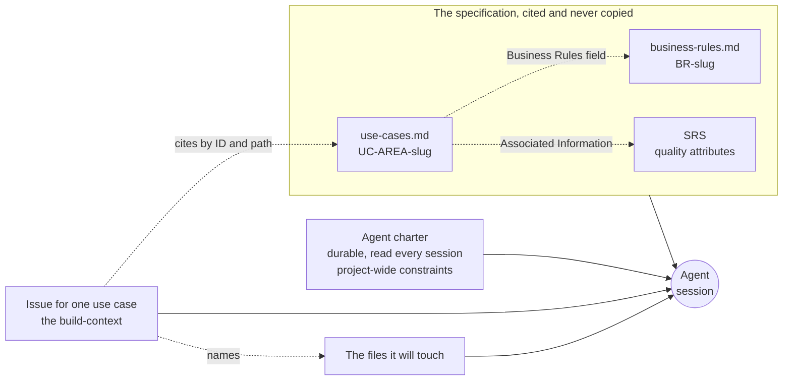

# Context Engineering

**Slides:** [Context Engineering](../slides/context-engineering.html) (the fast version).

> **Purpose (one line):** assemble, for one unit of work, the context an agent cannot infer, out of the specification you already wrote, and tell whether you have supplied enough by measuring the result rather than by how good the prompt felt.

## 1. Learning objectives

By the end of this module, a student can:

1. Explain why more context is not better context, given that the usable part of a context window is well short of the advertised number, and manage a filling session with `/context`, `/compact`, and `/clear`.
2. Explain how a coding agent locates code (searching on demand rather than from an index), and use an `@` file reference to skip a search you could have saved it.
3. Assemble a build-context for one use case that cites the specification by identifier and path rather than copying it, and explain why copying it creates a defect.
4. Apply three sufficiency tests, the questions test, the diff test, and the count, to decide whether the agent had enough to work from, and use plan mode to make the first of them cheap.
5. Place a task between the two failure directions, under-specified and over-specified, and say what each one costs.
6. Apply the pinning litmus: if guessing it wrong would violate a requirement, write it down; otherwise let the agent derive it.
7. Turn a defect the agent caused into the charter line that stops it recurring.

## 2. Where it fits

- **Prerequisites:** [The AI-Augmented Team](ai-augmented-team.md), which established that the repository is the only memory the agent has and told you to write the charter thin; and [Requirements as the Contract](spec-driven-requirements.md), which is where you wrote the specification this module treats as context.
- **Leads into:** architecture in week 6, where the quality attributes and constraints you assembled here become the inputs that drive design decisions, and [Requirements Traceability](traceability.md) in week 8, where the citation discipline practiced here becomes a standing check.
- **How it's taught:** two lecture days in week 5. Your team assembles its first build-context on its own project in the [week 8 studio](../studio.md#week-8-oct-16-your-first-build-context), just before it builds, and practices it alone first in [assignment 2](../assignments/spec-a-feature.md). The question it asks, "have I supplied enough?", recurs in every module after it.
- **Course outcome it delivers:** [collaborating with AI across the lifecycle, supplying the context it cannot infer](../syllabus.md#learning-outcomes) (outcome 6).

## 3. Motivation

**The problem, on Project Pulse.** Ask an agent to add any feature that records when something happened. It will write `LocalDateTime.now()`. That is correct Java, it compiles, it reads fine in review, and it is wrong here. Project Pulse's development profile runs on a clock frozen at August 20, 2023, 23:30 `America/Chicago`, so that the seeded weeks line up and a weekly activity report lands in the week the test expects. Code that calls the real system clock silently bypasses that and breaks dev and test behavior.

Nothing in the codebase makes this inferable. There is no comment at the call site, no compiler error, no failing lint. The only thing standing between the agent and that defect is one line someone wrote down in [`backend/CLAUDE.md`](https://github.com/Washingtonwei/project-pulse/blob/main/backend/CLAUDE.md):

> All time-dependent code must inject the `Clock` bean and use `LocalDateTime.now(clock)`, never `LocalDateTime.now()`.

That line is context engineering. It is not a cleverer prompt, and no prompt would have produced it.

**A real failure it prevents.** In February 2024 the British Columbia Civil Resolution Tribunal decided *Moffatt v. Air Canada* ([2024 BCCRT 149](https://www.canlii.org/en/bc/bccrt/doc/2024/2024bccrt149/2024bccrt149.html)). Jake Moffatt, booking a flight after his grandmother's death, asked the airline's website chatbot about bereavement fares and was told he could apply for the discount retroactively. Air Canada's actual published policy said the opposite, and it was on the same website. Air Canada's defence was that it could not be liable for what the chatbot said, submitting that the bot was a separate legal entity responsible for its own actions. The tribunal called that **"a remarkable submission"** and answered it in one sentence:

> While a chatbot has an interactive component, it is still just a part of Air Canada's website.

Two lessons, and the second is the one this module is about. You are accountable for what your agent says, which week 1 already established. And the failure was not a model failure. The correct answer existed, in writing, a few metres away in the same system, and nobody had put it where the agent would read it.

## 4. Core concepts

### 4.1 More text is not better context

Week 2 ended on a distinction this module is built on: connecting a chat history to your agent gives it more text, not better context. The same is true of your repository. An agent pointed at 266 backend classes and five requirements documents does not thereby know your project.

Week 2 explained the **context window** from the machinery: a fixed budget of text the model can attend to at once, re-sent every turn. What week 2 did not give you is the size of it, and the size is where the intuition goes wrong.

| Model | Advertised window |
|---|---|
| Claude Fable 5.1, Opus 5.5, Sonnet 5 | 1M tokens |
| GPT-5.x | about 1M |
| Gemini 3.1 Pro | 1M |
| Gemini 3 Pro, Llama 4 Scout | 10M |
| Claude Haiku 4.5 | 200K |

As of September 2026, and these move constantly. A million tokens is roughly a novel and a half, so the natural reaction is that the budget is effectively infinite and selection no longer matters.

It is not, for a reason that has nothing to do with the limit. **The advertised window is not the usable window.** No published benchmark shows retrieval and reasoning quality holding anywhere near those ceilings, and a working estimate is that you get **40 to 50 percent** of the advertised number before precision falls away. On a 1M model, plan for 400K to 500K. Two consequences follow.

**Selection is the work.** Somebody has to decide which of the thousands of available lines are the ones this task needs. If you do not decide, the agent decides, by searching, guessing, and reading whatever it stumbles into first. It is often a reasonable guess. It is never an accountable one.

**Relevance decays with volume.** Padding a request with everything you own makes the signal harder to find, not easier, and the cost lands on the most specific instruction rather than the most general one. This is why "I gave it the whole repository" is not an answer to "did it have what it needed?"

So context engineering is a **selection** problem, not an accumulation problem. The professional question is not "how much can I give it?" but "what does this task actually require, and where does that live?"

**Your session fills up, and you manage it with three commands.** Every long session accumulates: files read, commands run, dead ends explored. Claude Code, the course's baseline, gives you the same three moves most agents do, and Copilot CLI uses the same three commands.

| Command | What it does | When |
|---|---|---|
| `/context` | Reports how much of the window is left | When it starts forgetting things you told it, before you guess why |
| `/compact` | Summarizes the session so far and continues | Mid-task, when you need the history but not at full detail. `/compact focus on <topic>` keeps named detail and discards the rest |
| `/clear` | Wipes the conversation, keeps your authentication and configuration | Between unrelated tasks |

Claude Code compacts automatically as the window nears its limit, clearing old tool output first and then summarizing the conversation (Copilot CLI starts at about 80%), so this happens whether you ask for it or not. Two judgments follow from that, and they are the reason this is in a software engineering course rather than a tool manual. **Compaction is lossy**: a summary of your session is not your session, and the detail it drops is chosen for you. So when you finish a task, `/clear` rather than carrying a summary of unrelated work into the next one. And **anything that must survive does not belong in the session at all.** It belongs in the repository, which is week 2's thesis arriving with a mechanism attached.

### 4.2 How the agent finds things

Ask an agent a question about your repository and it does not read your repository. It **searches** it.

Claude Code does not build an index of your codebase. It runs the same tools you would: glob to find files by pattern, grep to find content, read to open the ones that look relevant, then repeats as what it learns changes what it looks for. Anthropic calls this **agentic search**. Early versions did use a local vector database, and the team found plain search beat it: exact matches instead of fuzzy ones, nothing to rebuild as the code changes, and no index quietly drifting out of date while you edit. Codex and the other coding agents work broadly the same way.

**So how does it decide what to search for?** Nothing retrieves the query. **The model writes it**, the same way it writes code, by predicting what string would plausibly appear in code that does this thing. It has two sources for that guess: what it knows generally, from training, about how code like this tends to be named (a Spring Boot service is `*Service.java`, a getter is `getX`, a repository extends `JpaRepository`), and what it has already read this session, meaning your charter, the directory listing, and the results of its own previous searches. Then it loops: query, look, refine. That refinement is the part a single-shot lookup cannot do, and it is the real reason plain search wins.

Take the defect in `getPeerEvaluationAverage`, where a student nobody evaluated is reported as `0.0`. Ask an agent why a student with no evaluations shows zero, and the search goes roughly like this:

| Turn | Move | Where the move came from |
|---|---|---|
| 0 | Reads `CLAUDE.md` | Automatic. Learns this is Spring Boot, that packages sit under `team.projectpulse.*`, and that RAM lives under `ram/` |
| 1 | `glob **/*Evaluation*` | Your word "evaluated", converted into the naming convention it expects |
| 2 | Narrows to `EvaluationService` | Of `EvaluationService`, `PeerEvaluation`, and `EvaluationController`, logic lives in the service in this architecture |
| 3 | `grep "average"` within it | Your second word |
| 4 | Reads `getPeerEvaluationAverage` | Finds `.average().orElse(0.0)` |

Four turns, and the reason it was four is that your words matched the code's words.

**Which is the part worth keeping.** The query is assembled out of your vocabulary, so your naming consistency *is* the hit rate. Ask the same question as "why does a peer review score show zero" and turn 1 searches for `peerReview`. Across Project Pulse that returns **0 results**, against **83** for `PeerEvaluation`, because the codebase says `PeerEvaluation` everywhere. The agent does not stop when a search misses. It widens, reads five wrong files, and reaches the same method with your window part full and your budget part spent.

So the glossary rule from week 3 is not tidiness, it is what makes the agent's first guess land. Project Pulse's own charter states it:

> The **glossary** fixes vocabulary. Use the defined term in code identifiers and UI text, never a synonym.

The sharpest case is an abbreviation. Project Pulse's requirements module is the package `ram/`, so an agent asked about "requirements authoring" searches for `requirementsAuthoring` and gets **0 results**. What repairs the link is a single line in the root charter spelling out that RAM means Requirements Authoring and Management. That is a charter doing search-enablement, and it is the same reason this course tells you to spell abbreviations out.

(All four counts were searched against Project Pulse `main` on 2026-09-20 and are worth re-running rather than trusting, which takes about a minute.)

This is the mechanism behind everything in 4.1, and it has a practical consequence you can act on today.

> **If you know which file the agent needs, point at it.** Most agents take an `@` file reference. `@backend/src/main/java/.../EvaluationService.java` puts that file in the context directly.

Naming the file is not a convenience. It **skips the search**. The alternative is the agent guessing a grep pattern, reading three files that turned out to be wrong, and arriving at the right one with your window already part full and your credits already part spent. Every wrong guess costs tokens you paid for and context you now cannot use for the answer.

So the cheapest context is the context you did not make it hunt for. That is also the honest answer to "how do I save tokens": not shorter prompts, but fewer wrong guesses. A precise pointer plus a precise question beats a vague question and a large window, every time.

**The limit of the tip.** Point at the file when you know it. When you do not, saying so and letting the agent search is correct, and pretending to know wastes more than the search would have. "Find where peer evaluation averages are computed" is a good use of agentic search. "Fix the bug in `@EvaluationService.java`" is a good use of a pointer. Knowing which situation you are in is the judgment.

### 4.3 The specification is the context

You spent weeks 3 and 4 writing a glossary, a vision and scope, use cases, business rules, and a specification. You wrote them for your client and your teammates. They turn out to be the exact artifacts an agent needs, and for the same reason: they are the project's knowledge, written down, in one place, reviewed.

This is the inversion that makes requirements engineering matter more in an AI-native team than it did before. A human developer with a thin user story fills the gaps from hallway conversation, the product owner's intuition, and "we all know how this works." An agent has none of those. The gaps do not get filled; they get **guessed**, fluently.

So the specification stops being documentation and becomes an input to the build. A vague requirement used to cost you a conversation. Now it costs you code.

### 4.4 The durable half and the per-task half

Context splits by lifespan, and the two halves are written differently.

| | Durable | Per-task |
|---|---|---|
| **Artifact** | The agent charter (`AGENTS.md`, with a one-line `CLAUDE.md`) | The issue for one use case |
| **Written** | Once, then grown when the agent gets something wrong | Every time, by whoever picks up the work |
| **Scope** | Everything true of the project: how to run it, conventions, what not to do | One unit of work: this use case, its rules, its acceptance criteria |
| **Read** | Every session, automatically | When you point the agent at it |

Week 2 covered the durable half: what goes in a charter, why conventions live next to the code they govern, and how to write one file that every tool reads. That is settled and is not repeated here.

This module owns the per-task half, and the discipline that keeps the two from rotting into each other.

### 4.5 A build-context is an assembly, not a copy

A **build-context** is everything the agent needs for one unit of work, gathered in one place. In this course that place is the issue, and the unit of work is one use case.

The rule that makes it work:

> **Cite the specification. Never copy it.**

An issue that pastes in the use case has created a second use case. One of them will be edited on Thursday and the other will not, and nothing will tell you which one the agent read. You have manufactured exactly the drift the whole method exists to prevent. Project Pulse's own root charter follows this discipline on itself, pointing at the architecture document rather than restating it: "When the architecture changes, update *that* doc; the summary below is just orientation for working in the code."

The same holds one level down. A use case already cites the business rules that govern it, by identifier, in its Business Rules field, and names the quality attributes that apply in its Associated Information. So the issue cites the use case and stops there. An issue that lists the rules again holds a second list of them, and that list drifts exactly as a pasted use case does. Constraints that bind the whole project (the stack, the hosting, the client's systems) are not per task at all; they belong in the charter.

So a build-context is one or two pointers plus the small amount of context that exists nowhere else yet:

What an issue carries in its own words is the residue: the decision made in this week's client meeting that has not reached the specification yet, the reason this use case is being built before that one, the file you already know it will have to touch. Everything else is a citation.

If you find yourself writing a paragraph that belongs in the specification, stop and write it in the specification. The issue then cites it. That is not extra work, it is the work.

### 4.6 What the code cannot answer

Some context is genuinely absent from a codebase, and no amount of reading recovers it. Four questions recur, each with a real answer from Project Pulse's charter files.

**How do I run it, and what is true about this environment?** The `Clock` rule from section 3. Also the dev credentials, the three services and their start order, and the fact that the development profile recreates the schema on every restart while production uses Flyway migrations.

**What must I not do?** Negative constraints are invisible in code, because code records what was built, never what was ruled out. The backend charter says it outright:

> Extend these packages, don't fork the architecture for RAM.

An agent's default, asked to add a module, is to build a clean new thing beside the old one. That instinct is not unreasonable. It is just wrong here, and only a human knows why.

**Which precedent do I copy, when the code disagrees with itself?** An agent imitates what it sees. When a codebase contains two conventions, it will copy the nearest one, confidently, and be consistent with the wrong half. Project Pulse's frontend charter handles this by naming its own inconsistency:

> **Naming convention for new pages**, use entity-first, PascalCase, multi-word names. NOTE: some existing pages use verb-first naming (e.g., `AddActivityForm.vue`, `EditStudentForm.vue`), these should be refactored to entity-first in the future.

**What does this word mean here, and who is allowed to do what?** Domain vocabulary and policy. The glossary fixes the first, the business rules fix the second, and both are cited rather than restated, which is why weeks 3 and 4 insisted on them.

### 4.7 When is it enough?

This is the question the course keeps asking, and it has a bad answer and three good ones.

The bad answer is introspection. How thorough the prompt felt, how long the issue is, and how confident you were are all uncorrelated with whether the agent had what it needed. Sufficiency is a property of the result, so it is measured on the result.

**The questions test.** A well-contexted agent asks few questions because it can find the answers. A badly contexted one asks none, because it cannot tell what it is missing, and invents instead. Silence is therefore ambiguous, and you disambiguate it by asking the agent to state its assumptions back before it writes any code. Assumptions you did not supply and did not intend are your gap list. Project Pulse writes the obligation into the charter itself, so the agent is told to push back rather than comply:

> The spec is authoritative but not infallible. When a step is ambiguous, an assumption breaks against the existing code, or requirements contradict, ask a clarifying question or challenge the spec; don't silently comply or silently invent.

A question from the agent is the cheapest defect report your project will ever receive. It arrives before the code exists.

**Your tool has a mode for this.** Asking for assumptions by hand works, and both Claude Code and Copilot CLI will do it for you. In Claude Code, Shift+Tab cycles the permission modes until the status bar reads **plan mode on**, or you type `/plan`. In Copilot CLI, Shift+Tab cycles standard, **plan**, and autopilot. Plan mode has the agent work out and show you what it intends to do before it touches a file; you then correct the plan rather than the code.

Use plan mode when the task is multi-step, when you are not certain the context is sufficient, or when the change is expensive to unpick. Skip it for a one-line fix, where reading the plan costs more than reading the diff. What makes it a context tool rather than a safety feature is what you do with the plan: **read it for things you never told it.** A plan that names a file you did not mention, or assumes a rule you never wrote down, has just shown you the gap. That is the questions test with the agent doing the asking.

**The diff test.** Compare what the agent produced against what you wrote. Every difference is one of two things: a defect in the code, or a gap in the context. Deciding which is the engineering judgment, and the failure mode is fixing the code and leaving the gap, so the next use case arrives with the same defect.

**The count.** Sufficiency claims are checkable on a repository, because a written rule leaves a trace in what gets built. Project Pulse's page-naming rule can be audited by listing two directories, one built before the charter existed and one built under it:

| Built | Pages | Convention |
|---|---|---|
| Foundation, before the charter | `AddActivityForm.vue`, `EditActivityForm.vue`, `CommentActivityForm.vue`, `EditStudentForm.vue`, `SubmitTeamsEvaluations.vue` | Verb-first |
| RAM, spec-first under the charter | `RamDocuments.vue`, `RamDocumentEditor.vue`, `RamGlossary.vue`, `RamUseCases.vue` | Entity-first, four of four |

The written line changed what got built, and the note warning that the old code disagreed is what stopped the agent copying the nearest precedent. That is what a sufficiency claim looks like when it is evidence rather than a feeling.

### 4.8 The two directions you can be wrong

Under-specifying and over-specifying are both failures, and they fail differently.

**Under-specified** gives you plausible and wrong. Week 1 named the mechanism: a wrong premise in, and the wrong thing arrives complete, tested, and more expensive to reverse than it was to build. The tell is that review finds nothing, because the code is good code. It answers a question you did not ask.

**Over-specified** gives you no leverage. An issue that dictates the class names, the method signatures, and the order of the statements is a design document, and you wrote it. The agent typed. You spent the expensive half of the work and delegated the cheap half, and there is nothing left to review because you already know what it says.

The line between them is the method's pinning litmus:

> If guessing it wrong would violate a requirement, the specification pins it. Otherwise the agent derives it.

Column lengths, indexing, nullability, and the internal shape of a service are derived. Key formats, status transitions, validation rules, and anything a business rule constrains are pinned. The [method](../method.md) states the rule in full; what matters here is that it is a test you can apply to a single line of an issue.

### 4.9 Context is earned, and the loop is the point

Week 2 told you to write the charter thin and said it would grow every time the agent got something wrong in a way that was your fault for not saying. This is the mechanism by which it grows, and it is the most important habit in the module.

Project Pulse's backend charter carries a Security section far longer than any other. It is not there because security is important in the abstract. Every rule in it is a scar. The charter records the defects in its own margins:

> It had drifted. `PATCH /users/{userId}` was bound to a manager that recognised only `/students/`, `/instructors/` and `/evaluations/evaluators/`, so it denied every request from the day it was written.

> Every cross-team defect found in September 2026 was one of the two missing: the glossary routes had neither; the document-section GET had a scoped query but no rule; the artifact and use-case lookups had a rule but no scoping.

And it converts the lesson into something an agent can act on rather than a principle it can agree with:

> **The smell to grep for:** a service method that accepts `Integer teamId` and never mentions it in the body.

That is the loop. The agent gets something wrong, you decide whether the fault was the code or the context, and when it was the context you bank the lesson where the next session will read it. A charter that never grows is a charter nobody is learning from.

One thing the loop eventually produces: when you have assembled the same shape of build-context three times, the assembly itself is worth packaging. Every agent supports some version of this, a custom command or a skill file that carries the steps so you stop retyping them. Week 7 takes that up, where the design and implementation gates give a packaged command something to do. Write them by hand first. A wrapper around a thing you have never done teaches the wrapper.

## 5. The AI-native lens

- **Delegate to AI:** drafting the issue from a use case, finding which files a change will touch when you genuinely do not know, and stating its assumptions back to you. Ask it to list what it would need to know before it starts; it is good at that and it costs nothing.
- **Keep human:** deciding what the task actually is, and every judgment about which half of a diff is the defect. Also the negative constraints, since nothing in the code records a decision not to do something.
- **Context to supply:** this module is that question, so the answer is recursive and worth stating plainly. Supply the environment facts, the negative constraints, the precedent to copy when the code disagrees with itself, and the vocabulary and policy, by citation wherever a citation exists.
- **How to verify:** the three tests in 4.7. Ask for assumptions before code, diff the result against what you wrote, and check that a rule you claim to have supplied shows up in what was built.

## 6. Risks and mitigations

| Risk (classic and AI-introduced) | Human judgment that catches it | Mitigation |
|---|---|---|
| **Charter rot.** The charter states a rule the project stopped following, and the agent applies it confidently for months. The AI-introduced half is scale: one stale line now shapes every use case rather than one developer's afternoon. | Noticing that the rule and the code disagree, which nobody is looking for because both look authoritative | Audit the charter against the code on a schedule, not on suspicion. Where the code genuinely disagrees, say so in the charter rather than quietly leaving both, as Project Pulse's naming note does. |
| **Context theater.** A long charter that reads well, cost a day, and earns nothing, because no line in it corresponds to a defect anyone had. It also crowds the budget that section 4.1 described. | Asking of each line, which mistake does this prevent? | A rule earns its place by naming the failure it stops. Write thin, grow on defects. |
| **The issue becomes the design.** Over-specification, disguised as diligence, so review has nothing left to examine. | Noticing that you already know what the code will say | Apply the pinning litmus per line: would guessing this wrong violate a requirement? |

## 7. Hands-on (studio and individual assignment)

**Studio (team, own project, week 8)**

- **Goal:** turn one of your own use cases into a build-context an agent could work from, and find out what your specification does not yet say.
- **In studio (own project):** in pairs, write the issue for one of your riskiest use cases as citations: the `UC-<AREA>-<slug>` it realizes, which already cites its `BR-*` rules and quality attributes, and the paths you expect it to touch. Then run the questions test: hand the issue and your repository to an agent in plan mode and ask it, before it writes anything, to state every assumption it would have to make. Each assumption you did not intend is a gap. Decide for each one whether it belongs in the specification, in the charter, or in the issue, and put it there. A rule the use case should have cited is a gap in the use case. The skeleton, the prompt, and the timing are on the [studio page](../studio.md#week-8-oct-16-your-first-build-context).
- **Deliverable and assessment:** one issue per pair on your team's board with its sorted gap list as a comment, and the pull requests that close the gaps before the agent builds from the issue. Assessed on whether the issue cites rather than copies, and on whether the gaps went to the right home.

**Individual assignment (Project Pulse)**, [*Spec a feature*](../assignments/spec-a-feature.md)

- **Task (AI-workflow-framed):** Project Pulse emails every student in a course section a submission reminder whether or not they have already submitted, and nothing exists to see who is missing or to nudge only them. Specify that feature as a use case in Project Pulse's own template, turn it into a build-context, then ask the agent for its assumptions and route every gap to its right home.
- **Deliverable and assessment (per student):** a pull request into your fork, adding the use case and any new business rule, with the gap analysis in the description. Graded on the decisions you defend and the edge cases you find, not on whether anything ran. The [assignment page](../assignments/spec-a-feature.md) has the specification and the due date.

## 8. Summary / key takeaways

- More context is not better context. The advertised window is not the usable one, so selection is the work, and "I gave it the whole repository" is not an answer.
- The agent searches your repository rather than reading it. Point at the file when you know which one it is; every wrong guess spends tokens and window you then cannot use for the answer.
- The specification you wrote for humans is the context the agent needs. A vague requirement used to cost a conversation; now it costs code.
- A build-context cites the specification and never copies it. A pasted use case is a second use case, and one of them goes stale.
- Sufficiency is measured on the result, not felt in the prompt: ask for assumptions before code, diff what was built against what you wrote, and check that the rule you supplied shows up in what got built.
- Both directions are failures. Under-specified arrives plausible and wrong; over-specified means you did the design and paid an agent to type it.
- The charter earns every line from a defect. If yours has not grown this month, nobody is learning from it.

## 9. Key papers and further reading

- [The Method](../method.md), the spec-driven, agent-assisted method this module serves. Principle 8, specify requirements and derive implementation, is the pinning litmus in 4.8.
- [Project Pulse's charter files](https://github.com/Washingtonwei/project-pulse/blob/main/CLAUDE.md), the worked example throughout: the root file, and `backend/CLAUDE.md`, `frontend/CLAUDE.md`, and `docs/CLAUDE.md` beside the code they govern.
- [How Claude Code works: the context window](https://code.claude.com/docs/en/how-claude-code-works#the-context-window), the reference for `/context`, `/compact`, and automatic compaction on the course's baseline agent, and [Claude Code's memory files](https://code.claude.com/docs/en/memory), for how it reads `CLAUDE.md` and `AGENTS.md`.
- For the free fallback: [Managing context in GitHub Copilot CLI](https://docs.github.com/en/copilot/concepts/agents/copilot-cli/context-management), including when it compacts without being asked, and [GitHub Copilot CLI custom instructions](https://docs.github.com/en/copilot), for which filenames it reads.
- *Moffatt v. Air Canada*, [2024 BCCRT 149](https://www.canlii.org/en/bc/bccrt/doc/2024/2024bccrt149/2024bccrt149.html), British Columbia Civil Resolution Tribunal, February 2024. The bereavement-fare chatbot decision in section 3, and worth reading in full: it is short, and the reasoning about who owns an agent's words is the whole argument.
- [Requirement Types](../requirement-types.md), for the nine kinds of requirement a build-context reaches through its use case, and which container each lives in.

## 10. Self-check

1. Your teammate says the agent "has the whole repository, so it has everything it needs." Give the two reasons that is not a sufficiency argument.
2. You paste a use case into the issue so the agent definitely sees it. Name the defect you just created, and say when it will surface.
3. An agent adds a timestamp to a new Project Pulse entity and writes `LocalDateTime.now()`. Tests pass on your machine. Where is the defect: the code, the specification, or the charter? Justify it.
4. You ask an agent for its assumptions before it writes code, and it lists none. Give the two possible explanations, and say how you would tell which one you are in.
5. Your issue specifies the service method names, their parameters, and the order of the calls. What have you lost, and which test in 4.8 would have caught it?
6. Your team's charter has not changed since week 2. Is that good news? Say what evidence would settle it.
7. An agent builds a use case correctly but scopes a query by a `teamId` that arrived in the request body. Your charter does not mention it. Write the line you would add, and say why the rule rather than the fix is what goes in the charter.
8. Your model advertises a 1M-token window and your task is nowhere near that size. Give the reason selection still matters, and the reason it would still matter even if quality held perfectly to 1M.
9. You have been in one session for two hours across three unrelated tasks, and the agent has started contradicting something you established early on. Say which of `/context`, `/compact`, and `/clear` you reach for, in what order, and what you should have done an hour ago.
10. A teammate sets plan mode as their permanent default and says it makes the agent safer. Say when they are right, when it is costing them, and what they should be reading the plan *for*.

## Related

- [The AI-Augmented Team](ai-augmented-team.md): the durable half, what a charter carries and which file every tool reads.
- [Requirements as the Contract](spec-driven-requirements.md): where the specification this module cites was written.
- [The Method](../method.md): the full spec-driven, agent-assisted method, including the pinning litmus.
- [Working with AI](../ai.md): course policy on agent use, and how to get the baseline agent.
- [Friday Studio](../studio.md): how the studio hour runs.
- [Schedule](../schedule.md): when this is taught.
