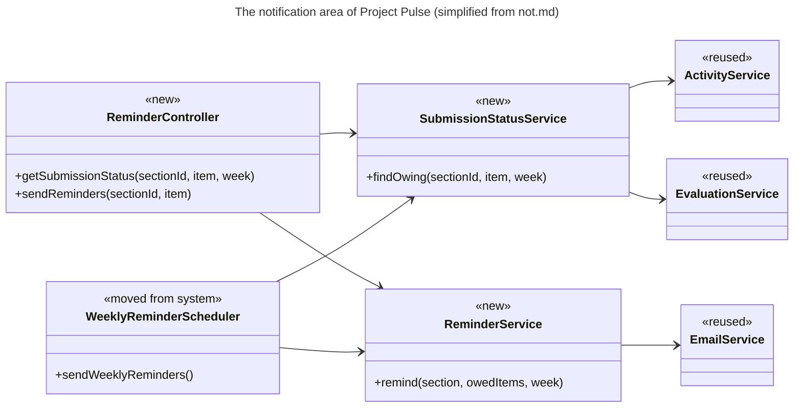
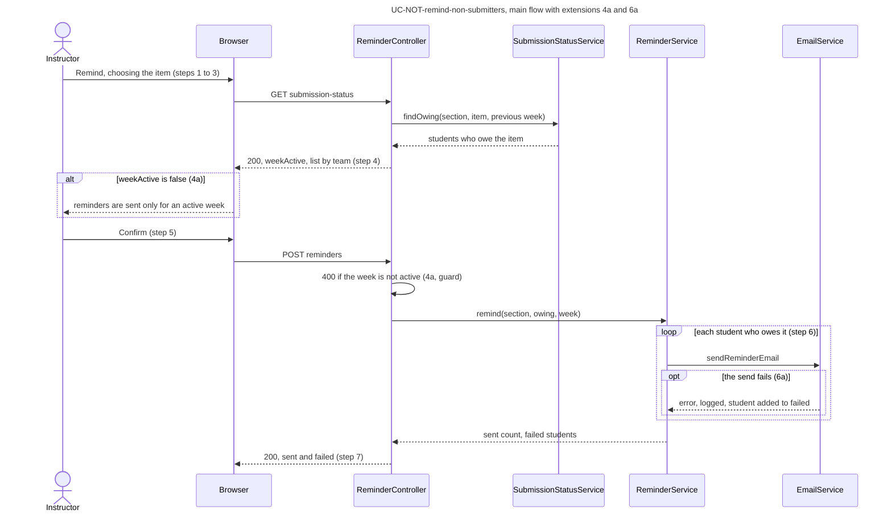
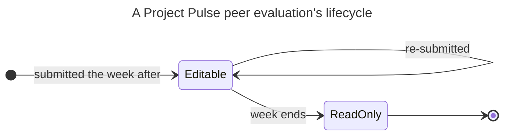
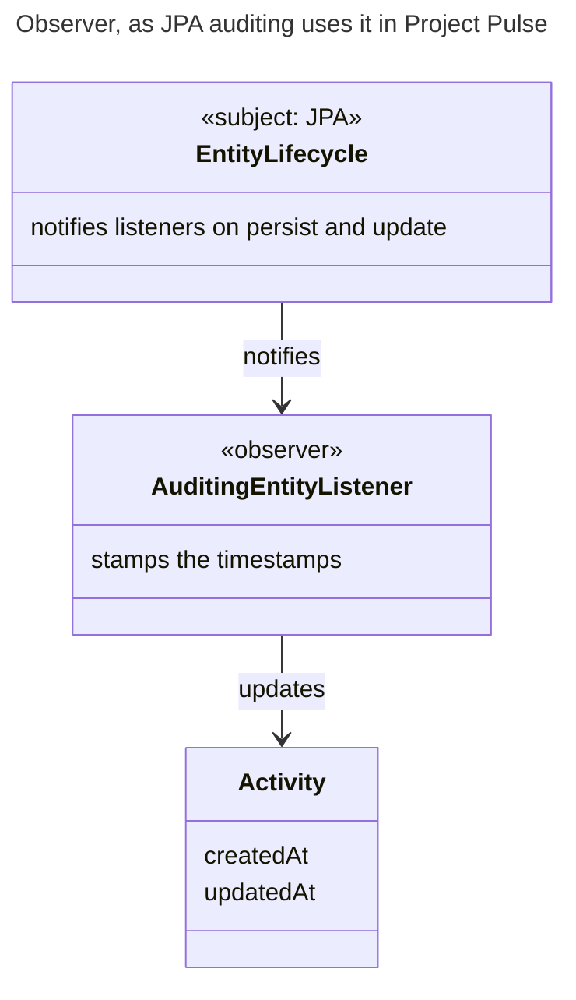

# Design-of-Record: The Last Document Before the Code

**Slides:** [Design-of-Record](../slides/design-of-record.html) (the fast version).

> **Purpose (one line):** design one use case area before anyone builds it, at the depth where an agent no longer has to guess anything that matters, and get that design reviewed and approved by someone who did not write it.

## 1. Learning objectives

By the end of this module, a student can:

1. Explain what a design-of-record is, where it sits between the use case and the code, and why it is written per use case area, before the code.
2. Decide how much to write by asking, of each detail, whether a wrong guess would break a requirement.
3. Run the challenge loop on a use case before designing it, and send each finding to the document that owns it.
4. Identify the classes an area needs from its use case and draw its class diagram, marking what is new and what is reused.
5. Read and draw a UML sequence diagram in mermaid, label every interaction with the use case step it implements, and decide when an object needs a state diagram.
6. Write an API contract complete enough that the front end and the back end can be built in separate sessions.
7. Record a design decision with what it rejected and why, and recognize when a known design pattern fits a problem and when it is gold-plating.
8. Write the test list for every flow of a use case before the code exists.
9. Run the questions test on a design and act on each item, then take the design through a pull request reviewed by a teammate who did not write it.
10. Choose a proving slice by architectural risk and say what it has to prove.

## 2. Where it fits

- **Prerequisites:** [Software Architecture, Just Enough](architecture.md), whose map this module takes one level down, inside one use case area; [Context Engineering](context-engineering.md), whose questions test this module applies to a design; and [Requirements as the Contract](spec-driven-requirements.md), whose use cases a design cites and never restates.
- **Leads into:** the week 8 studio, where your design becomes a build-context and your agent starts building, and [Checkpoint 2](../project.md#checkpoints), where the proving slice must run. [Traceability](traceability.md) picks up the design as the middle link between a use case and its code.
- **How it's taught:** two lecture days in week 7, then fall break. Your team writes the design-of-record for its proving slice's use case area out of class, from the [design-of-record template](https://github.com/tcu-cosc-40943/course-templates/blob/main/design/design-of-record.md), and merges it by pull request before the week 8 studio. The [schedule](../schedule.md) has the date.
- **Course outcome it delivers:** [making and defending design and architecture decisions](../syllabus.md#learning-outcomes) (outcome 2), with the alternatives considered and the reasoning behind the choice.

## 3. Motivation

**A use case is not enough to build from.** Many spec-driven tutorials stop at the requirements: write the specification, hand it to the agent, take the code. In assignment 2 you specified a reminder that emails only the students who have not submitted their weekly activity report or peer evaluation. Your use case says what the system does. It does not say how, and between the two sit decisions like these, each taken from the design we later wrote for it:

- Where "has not submitted" is computed: in one service that the reminder and both report pages share, or separately in each feature.
- Which part of the code owns the scheduler, given that the shared foundation may not depend on the activity and evaluation features.
- Whether a request to send a reminder may name the week, or the server always computes it.
- Whether the email goes out during the request, so the instructor sees who was not reached, or in the background.
- Whether to keep a log of the reminders sent.

Beyond those choices sits the shape of the code, which the use case also leaves open: which classes exist and which are reused (a new `SubmissionStatusService` beside the existing `EmailService`), which calls which and in what order, the exact endpoints and their errors (`POST /api/v1/sections/{sectionId}/reminders` takes only `{ item }` and returns `400` for an inactive week), and the tests that say the feature is done ("students who reported are not emailed"). The design pins these as a class diagram, sequence diagrams, an API contract, and a test list.

Hand an agent only the use case and it makes every one of these decisions silently, then returns a pull request spanning a controller, services, the scheduler, a dialog, and their tests. Ask it twice, in two fresh sessions, and it may decide them differently: two runs, two designs, neither of which you chose. You can review that line by line, but you are reviewing decisions you did not know were made, after they were built. Written as a design, the same decisions take a few pages, name what was rejected and why (see [`not.md`'s Key decisions](https://github.com/Washingtonwei/project-pulse/blob/main/docs/design/not.md#key-decisions)), and can be argued over before any code exists. Code review then checks the code against decisions already approved, instead of discovering them.

A design also keeps the why. Months later, when someone asks why the scheduler moved out of `system` or why the request carries no week, the code cannot say; the design can. Project Pulse's [traceability matrix](https://github.com/Washingtonwei/project-pulse/blob/main/docs/traceability.md) links the reminder's use case to its section of `not.md`, and from week 8 ([Traceability](traceability.md)) on to the code and tests that realize it. Skip the design and the chain from requirement to code has a hole in the middle, which the next agent session fills with a guess.

> ***You can use an eraser on the drafting table or a sledgehammer on the construction site.***
>
> Attributed to Frank Lloyd Wright, American architect

**This is the last document before the code.** After the design-of-record, an agent builds. Whatever the design leaves open, the agent decides, silently. This module is about writing the design so that the decisions that matter are made by you, once, and are on the record before the agent starts. The worked example throughout is the design we wrote for that reminder, Project Pulse's [`docs/design/not.md`](https://github.com/Washingtonwei/project-pulse/blob/main/docs/design/not.md).

## 4. Core concepts

### 4.1 What a design-of-record is

Everything you have written so far feeds this document: the requirements say what, the architecture draws the map, and each use case area gets its own design inside that map.

The ID-level version of this chain is the method's [traceability model](../method.md#the-traceability-model).

Software design is the step where you decide what components and classes will realize the requirements, and how they will talk to each other. The [method](../method.md) splits it into two levels:

| | Architecture-of-record (week 6) | Design-of-record (this week) |
|---|---|---|
| Covers | The whole system | One use case area |
| Answers | What the parts are and which decisions are expensive to change | How this area's use cases will run inside those parts |
| Stops at | Each component's responsibility | Anything an agent can derive without breaking a requirement |
| Written | Before any code | Before this area's code, against whatever code exists |
| How many | One | One per area, created when the area is first designed |

Four properties make it a design-of-record rather than any design document:

- **It is written before the code and approved before anyone builds from it.** A design document is code review before there is code.
- **It cites, never restates.** The use case says *what* the system does; the design says only *how*. A design that copies the use case's steps holds a second copy that will drift. It names `UC-NOT-remind-non-submitters` and labels each interaction with the step number instead.
- **One per area, revised in place.** An area gains use cases over the term. The overview, the class diagram, and the data model are edited when it does; sequence diagrams, contract rows, and test rows are appended per use case. It never becomes a stack of per-use-case sections.
- **It stays true.** If building the code forces a change (a different class boundary, an extra table), the design is updated in the same pull request. A design that describes code that no longer exists misleads the next agent that reads it.

The idea is old. Industry calls it an RFC (request for comments) or design doc: a written proposal, reviewed and approved before it is built, at places from the Internet Engineering Task Force to Sourcegraph and Oxide. Two things differ here. The draft is usually the agent's, made after your own sketch ([4.12](#412-sketch-first-then-the-agent-then-compare)), and the review is yours, which makes the review the skill. And it is a living document of the design as built, while the frozen, dated decisions live separately as the architecture's `KD-*` entries.

!!! trace "Trace: use case to design-of-record"
    The design-of-record's header names every `UC-*` and `FR-*` it realizes, and the traceability matrix's Design column points each use case at its area's design file. From week 8 the chain continues to code and tests.

### 4.2 How much to write

The question students ask first is the right one: how detailed? Project Pulse's [method](../method.md) answers it with Principle 8, *specify requirements, derive implementation*, applied to design:

> **If a wrong guess would break a requirement, a business rule, a quality attribute, or the contract between two parts of your team, pin it in the design. Otherwise, let the agent derive it while it builds.**

Applied to the reminder:

| Detail | Wrong guess breaks something? | So |
|---|---|---|
| What counts as "has not submitted" a peer evaluation | Yes: the instructor reminds the wrong students | Pinned, and promoted to a business rule (4.3) |
| Which week a WAR reminder is about | Yes: students are told to report the wrong week | Pinned: the previous week |
| Whether the reminder request carries the week | Yes: a client could ask for a closed week | Pinned: the server computes it |
| Whether sending waits for the mail server | Yes: the instructor would not learn who was missed | Pinned, with the rejected alternative |
| The Java name of the method that finds who owes | No | Named in the class diagram as a suggestion; the agent may rename it |
| The JSON field names in the response | Only if two sessions guess differently | The contract names the fields, not their types |
| Column types, indexes, getters | No | Derived |

**Greenfield changes the answer.** Project Pulse's [design guide](https://github.com/Washingtonwei/project-pulse/blob/main/docs/design/README.md) says to keep a design lean: link to the code rather than describe it. That assumes there is code to link to. For your proving slice there is none, so whatever the design leaves out, the agent invents. The guide already names the three sections that are never dropped for that reason (the API contract, the key decisions with their rejected alternatives, and the test list), and a greenfield design leans on them hardest. In an empty repository the components section also lists the files the agent should create, at the paths your architecture's conventions give them, since there is nothing yet to link to.

### 4.3 Firm the problem first: the challenge loop

Before designing the solution, check that the problem is sound. Read the use case against the code and the other documents, and look for steps that are ambiguous, assumptions the code contradicts, and requirements that disagree. The method calls this the **challenge loop**, and the agent is instructed to run it rather than comply silently. Doing it first is the RFC rhythm: review the problem, then review the solution.

Our first draft of the reminder use case looked complete. Reading Project Pulse's code found six things it did not settle:

| Finding | Where the fix went |
|---|---|
| "Has not submitted" already existed twice, and the two disagreed (below) | A new business rule, `BR-submission-owed`, cited by the reminder and by both reports |
| The scheduler checked whether the *current* week was active, but both items are about the *previous* week: the last active week's evaluation was never reminded, and the first active week reminded one that could not yet be submitted | `FR-NOT-weekly-reminder`, amended |
| Students on no team and deactivated accounts were emailed, though neither can submit | `BR-submission-owed` |
| Nothing said which week the WAR reminder covers | The client's ruling (the previous week), written into the use case |
| A peer evaluation is saved one teammate at a time, so a half-finished set is real | `BR-submission-owed`: owed until every active teammate, self included, is rated |
| The scheduler lives in `system`, part of the shared foundation, which may not depend on `activity` or `evaluation` (`MNT-feature-locality`) | The design, and a change to the architecture (4.10) |

The first row shows what happens when a question is never answered once, in writing. Project Pulse decided "has not submitted" in two places. The instructor's WAR page (`SectionsActivities.vue`) counts a student with no activity that week as missing, but it fetches only the first 200 activities and the first 100 students, so with 77 students filing several activities each, students who did submit show up as missing. The peer evaluation report (`EvaluationService.generateWeeklyPeerEvaluationReportForSection`) counts a student as done after rating anyone, but the back end saves one rating at a time, so a student who rated one of five teammates counts as done. The truncation is a plain bug; "anyone" is a term nobody defined. An ambiguity nobody resolves gets resolved twice, differently, by whoever builds next. A reminder built from the use case alone would have been a third answer.

Read the second column. **Most fixes went to the specification, not the design.** A finding about what the system must do is a requirements defect, and the design that discovered it is the wrong place to record it. Only the last one, how the code is arranged, belongs in the design. Project Pulse's traceability matrix marks a use case 🔬 *Problem-validated* once this loop has run and its fixes are merged, and 📐 *Designed* once the solution design is approved.

### 4.4 Finding the classes

There is no formula for identifying classes; it takes skill, domain knowledge, and more than one pass. Sommerville names three approaches, and they work best together:

- **Grammatical:** read the use case. Nouns are candidate classes and attributes; verbs are candidate operations. "The system *determines* the *week* … and *displays* the *students* who *owe* that *item*."
- **Domain:** start from the things the domain already has. Project Pulse's domain model already has `Section`, `Team`, `Student`, `Activity`, and `PeerEvaluation`, so none of those is new.
- **Scenario:** walk one flow and ask which object does each step. Whatever is left with no owner is a missing class.

Walking the reminder's main scenario leaves three jobs with no owner: deciding who owes what, sending a batch of reminders while surviving individual failures, and taking the instructor's request. That is three new classes, plus the scheduler that already existed:

**Mark every class new or reused.** "Reused" is the most valuable word in the diagram: it tells the agent to extend what exists instead of writing a parallel copy, which is the mistake that produced the two definitions in the first place. Show classes, their important operations, and their dependencies. Fields and getters belong to the code.

### 4.5 Sequence diagrams, and when to draw a state diagram

A **sequence diagram** shows the objects that take part in one scenario and the messages between them, in time order. It is the core of a design-of-record, because it shows the one thing no single file can: how the parts cooperate.

| Notation | Meaning |
|---|---|
| Participants across the top, a dashed **lifeline** down from each | The objects or components taking part |
| Time runs down the page | Read top to bottom |
| Solid arrow `->>` | A call: the caller waits for the answer |
| Dashed arrow `-->>` | A return |
| `alt … else … end` | Alternatives: exactly one branch happens, chosen by its condition |
| `opt … end` | An optional part that happens only if its condition holds |
| `loop … end` | Repetition |
| Thin bar on a lifeline (activation) | The time that object is busy; mermaid draws it with `activate` |

The rule this course adds: **label every message with the use case step it implements.** A reviewer can then check that every step is realized, and an arrow with no step is either a missing requirement or scope nobody asked for. Here is the on-demand reminder, simplified from `not.md`:

Draw one per use case for the main scenario, plus one for any extension that does more than return an error.

**A state diagram** shows how one object changes in response to events. Most objects do not need one; draw it only where the lifecycle is where the bugs live. A Project Pulse peer evaluation is a good example, partly because its states are easy to get wrong: `PeerEvaluation` has no status field at all. Its state is decided by the clock (`BR-evaluation-editable-until-close`):

An agent that does not see this diagram tends to add a `submitted` flag and a "finalize" button, because most evaluation systems it has read have one. Here the close of the window is the lock.

### 4.6 The API contract

Components are designed in parallel only if the places where they meet are fixed first. That was true before agents (a team splits work across people) and it matters more now: your front end and back end may be built by different agent sessions that never see each other's code. The contract is the only document both read.

The underlying idea is Parnas's **information hiding**: callers depend on what an interface promises, never on how it is built, so the inside can change without breaking them. Java's `HashMap` has been reimplemented more than once, and code written against its interface did not notice.

A contract row names five things:

| Endpoint or job | Caller (who may) | Request | Success | Errors, by extension |
|---|---|---|---|---|
| `POST /api/v1/sections/{sectionId}/reminders` | An instructor assigned to the course section, or the course admin who owns its course | `{ item }` only; **no week** | `200`: item, week, number sent, students not reached | Neither, or a student: `403`. Unknown item: `400`. Previous week inactive: `400`, "Reminders are sent only for an active week" (4a; the dialog already prevents it, this guards the route) |
| `WeeklyReminderScheduler.sendWeeklyReminders` | The clock, 08:00 America/Chicago | None | One email per student who owes something due today | Failures logged and skipped |

Three things to notice:

- **Every extension has an error.** If the use case has an extension and the contract has no response for it, someone will invent one.
- **A scheduled job is a contract too.** It has a trigger and a promise, and nothing calls it from the browser.
- **What is left out is a decision.** The request carries no week, because the server always reminds for the week currently due, and a week from the client could reopen a closed peer evaluation. That one omission closes a security hole and a business-rule bug at once.

Field types and exact JSON are left to the agent, unless another system depends on the format.

### 4.7 Design decisions, and design patterns

A design-of-record records only the decisions a reader could not recover from the code. Each one says what was chosen, **what was rejected, and why**, exactly like the architecture's key decisions in week 6. The difference is reach: a design decision is local to this area. A decision that affects the whole system is an architecture decision and goes in the architecture-of-record as a `KD-*` entry.

From `not.md`:

> **Where "has not submitted" lives.** `SubmissionStatusService` in `notification` owns it, and the scheduler, the on-demand reminder, and both report pages use it. Rejected: each page computing its own list, which is how the WAR page came to truncate at 200 activities. Rejected: the peer evaluation report calling into `notification` on the server, because `notification` already depends on `evaluation` and the call would make a cycle; the page fetches the list from the `notification` endpoint instead.

If you cannot name a rejected alternative, it probably was not a decision; leave it out.

**Design patterns** are named, reusable answers to design problems that keep recurring. The catalog that named them is Gamma, Helm, Johnson, and Vlissides's *Design Patterns* (1994), the "Gang of Four." Each pattern has four parts: a **name**, the **problem** it addresses, the **solution**, and its **consequences**, the trade-offs. The name is most of the value: "use an Observer" says in three words what would otherwise take a paragraph.

**Observer** is the classic. Intent: when one object changes state, every object that depends on it is notified automatically, without the changing object knowing who they are. Project Pulse uses it without anyone writing it by hand: `Activity` and `PeerEvaluation` declare `@EntityListeners(AuditingEntityListener.class)`, and JPA notifies that listener on every save so it can stamp `createdAt` and `updatedAt`. The entity does not know the listener exists.

Recognizing a problem as one a pattern solves is the skill:

| When you need to | Pattern | In Project Pulse |
|---|---|---|
| Tell several objects that another one changed | Observer | JPA auditing listeners |
| Give a cluster of classes one simple interface | Facade | Each `*Service` in front of its repositories |
| Swap an algorithm without changing its callers | Strategy | The injected `Clock`: fixed in `dev`, the system clock in `prod` |
| Build a query from optional criteria | Specification | `ActivitySpecs` in `ActivityService.findByCriteria` |
| Convert between two interfaces | Adapter | The `Converter<S,T>` beans between entities and DTOs |

**A pattern no requirement needs is gold-plating.** Agents reach for patterns readily, because pattern-heavy code is everywhere in what they learned from. Ask what problem it solves in this area. "It is more flexible" is not an answer unless something in your specification needs the flexibility.

### 4.8 The data model change

Show only what this area **adds**: new tables or entities, new columns, the migration that creates them, as an ER diagram if there is more than one new table. The domain model is owned by your specification; link it rather than redraw it.

The reminder adds nothing, and the design says so with the reason: a reminder leaves no record, so there is no table. Rejected: a reminder log showing "last reminded at", which would add a table, a migration, and seed data to guard against a double send that the confirmation step already guards. "No change" with a reason is a decision a reviewer can check. A blank section is not.

### 4.9 The test list, before the code

The design ends with one row per flow: the main scenario and every extension of every use case it realizes, each with its level and what it asserts. No code.

| Use case, flow | Level | Asserts |
|---|---|---|
| UC-NOT main, peer evaluation | integration | A student who rated two of three teammates is listed and emailed; one who rated all, self included, is not |
| UC-NOT 4a | integration | Previous week inactive: `400`, and no email sent |
| UC-NOT 6a | unit | One failed send does not stop the others; that student is in `failed` |
| FR-NOT last active week | unit | In the inactive week after the last active week, the last evaluation's reminder is still sent |

This list is the **definition of done** the reviewer approves. Writing it now does two things. A missing extension shows up as a missing row, before anyone codes around it. And the agent, which will write tests later, is told which tests count. An agent asked to "add tests" afterward tests what it built, which by then is not evidence of anything. `not.md` has eighteen rows. Testing gets its own module in week 9.

### 4.10 When the design changes the architecture

Week 6's map was drawn before any area was designed, and Twin Peaks predicts what happens next: designing an area against real code finds where the map was wrong. The reminder did. Its scheduler lived in `system`, part of the shared foundation, and deciding who owes a report needs `activity` and `evaluation`, which the foundation may not depend on.

The design moved the reminders into a new feature slice, `notification`, and **changed the architecture-of-record in the same pull request**: a new component on the performance-tracking view, and new owners in the subsystems tables. Rejected: leaving the scheduler in `system` and recording the violation as technical debt. Rejected: splitting reminders between `activity` and `evaluation`, which would send a student who owes both two emails.

The rule: the template's "Changes to the architecture-of-record" section lists each change, and the change itself is made, not proposed for later. A design that silently disagrees with the architecture leaves two maps, and the agent follows whichever one it reads last.

### 4.11 Is it enough? The questions test, one level down

Week 5 asked how you know the context is sufficient, and answered with the [questions test](context-engineering.md#47-when-is-it-enough): make the agent state its assumptions before it writes code. The design-of-record is where that test pays most, because it is the last chance to fix a gap on paper.

1. Start a **fresh** agent session in plan mode, so it carries nothing from the session that drafted the design.
2. Give it only the use case, the business rules it cites, your architecture's crosscutting concepts (template section 8), and the design.
3. Ask: *"List every point you would still have to guess to implement this use case. For each, say what you would guess and whether a wrong guess could violate a requirement. Do not write code."*
4. For each item, either fix the design, or keep the guess and write one line on why a wrong guess breaks no requirement.

**The design is ready when nothing on the list could break a requirement.** The list, with your answer to each item, goes in the pull request description. That turns "we think it is complete" into evidence a reviewer can read.

**What it found on the reminder.** We ran it on `not.md` before approving it. A fresh session, reading only the documents, returned **three contradictions and sixteen guesses**, all now answered in the [pull request](https://github.com/Washingtonwei/project-pulse/pull/89):

| Found | Example | Answer |
|---|---|---|
| 3 contradictions inside the design | The sequence diagram returned `400` for an inactive week; the contract returned `200` with `weekActive: false` | All fixed in `not.md`. The status request always answers `200`; only the send request refuses |
| 7 guesses worth pinning | May a course admin who owns the course, but is not assigned to the section, send reminders? The design admitted only assigned instructors, though `BR-section-scoped-access` lets the admin in | Fixed: both routes admit either, with a test. Another fix went to the specification: a student does not owe an evaluation of a deactivated teammate |
| 9 guesses that break nothing | The email's wording and layout; the JSON shape of the list | Kept, each with one line on why |

Two lessons are in that table. The design was carefully written and still contradicted itself: the person who wrote it reads what they meant, and a fresh reader reads what is on the page. And one fix went to the specification, not the design, which is the challenge loop ([4.3](#43-firm-the-problem-first-the-challenge-loop)) happening again one level down.

### 4.12 Sketch first, then the agent, then compare

The order in which you produce the design matters as much as what is in it:

1. **Sketch it yourselves.** Before opening the agent, draw the main scenario's sequence diagram and write the contract rows by hand, from the use case and your architecture. Twenty minutes.
2. **Have the agent draft it**, in plan mode, from the template, the use case, its business rules, your crosscutting concepts, and the relevant code.
3. **Compare the two.** Where they differ, decide which is right and why. What the agent found that you missed goes in. What you knew that it could not is context your specification lacks, so fix the specification too.
4. **Run the questions test** (4.11), then open the pull request.

The reason is anchoring, the same reason the [Napkin](se-and-ai.md#the-napkin-six-prompts) has you answer before the agent does. Read a fluent, complete design first, and your own judgment shrinks to proofreading it. Sketch first, and the comparison shows you two things: where your understanding was thin, and where the agent filled a gap with something plausible that your client never said.

**When the agent asks, during step 2.** Drafting in plan mode, the agent will stop and ask (in Claude Code through AskUserQuestion, set up in [Context Engineering](context-engineering.md#47-when-is-it-enough)). Before you pick an option, decide whose question it is:

- **Yours, or already settled in the specification:** which existing class to extend, which crosscutting rule applies, who may call the route. Check the use case and its business rules first, then answer.
- **The client's:** what the business wants in a case nobody specified. Do not pick an option. Fix the use case or log it in `OPEN-ISSUES.md`, and let the design cite the result. This is the challenge loop ([4.3](#43-firm-the-problem-first-the-challenge-loop)) arriving as a multiple-choice question, and the same rule as the first client meeting: you cannot answer for the client ([Requirements as the Contract, 4.3](spec-driven-requirements.md#43-the-first-client-meeting)).

`not.md` shows why the first check matters. Its first draft let only a section's assigned instructors send reminders. Offered that as an option, a student would have accepted it, and it is wrong: `BR-section-scoped-access` already admits the course admin who owns the course (4.11). The options anchor you exactly as a finished draft does, so read all of them. And your answers stay in the terminal, so they do not replace the questions test: the written list in the pull request is the evidence.

### 4.13 The design gate

A design is approved by **merging a pull request**, not by the drafter agreeing with their own agent:

- The pull request carries the design, any specification fixes the challenge loop produced, and any change to the architecture (4.10).
- Its description carries the questions-test list (4.11).
- **A teammate who did not write it reviews and approves it.** Nobody starts an implementation branch from this design until it is merged.

Project Pulse's worked example went through exactly this gate, as [pull request #89](https://github.com/Washingtonwei/project-pulse/pull/89): the specification commit, the design commit, three more commits answering the questions test, and the list in the description.

**Reviewing a design is the skill being taught**, and the failure to watch for is the rubber stamp. A long, well-formatted, agent-drafted design invites approval on sight. Review against these questions instead:

- Does every extension of every use case have a sequence branch or at least a test row?
- Does every message in the sequence diagrams name a use case step? An arrow with no step is scope nobody asked for, or a requirement nobody wrote.
- Could the front end and the back end be built in separate sessions from the contract alone?
- Does every decision name what it rejected?
- Does anything here disagree with the architecture-of-record, and if so, was the architecture changed?
- Is every item on the questions-test list answered?

A useful review comment is one of those questions with a specific answer. "Looks good" is not a review.

### 4.14 The proving slice

Before your team builds every use case, build one, all the way through: its design-of-record, the code from the user interface to the database, and its tests. This is Phase B of the [method](../method.md), and its job is to **test the architecture**, not to deliver a feature. Boundaries that looked clean on the week 6 diagram meet real code, and the architecture is corrected while corrections are cheap. An architecture proven by a working slice beats one proven by inspection.

**Pick the slice by risk, not by convenience.** Choose the use case that exercises your highest-ranked architecturally significant requirements: the one that touches the external system you are least sure of, crosses the trust boundary, or carries your hardest quality attribute. A login screen or a list page proves nothing your architecture was unsure of. Your team already chose this use case: it is the riskiest one your TA reviewed with you in week 5's studio.

The slice is **vertical**: it cuts through every layer once, so each layer's conventions (the error format, the time handling, the authorization pattern from your architecture's section 8) are exercised in real code at least once. When the slice runs, every later use case copies its shape.

This week your team writes the slice's design-of-record. Week 8's studio turns it into the agent's build-context, the agent builds it in weeks 8 and 9, and it must run, not be described, at [Checkpoint 2](../project.md#checkpoints).

## 5. The AI-native lens

- **Delegate to AI:** drafting the design from your sketch, the use case, and the code, in plan mode; finding the existing classes and files an area should extend; filling contract rows' request and response fields; proposing a test row for each extension; drafting the rejected alternative for a decision you have already made; checking that every identifier the design cites exists in the document that owns it; running the questions test.
- **Keep human:** which details fall on which side of the wrong-guess line; every key decision; whether a challenge-loop finding is a requirements question for the client; and the approval, which belongs to a teammate who did not draft it.
- **Context to supply:** the use case and its business rules, your architecture's crosscutting concepts, the relevant existing code, and the fact that the agent should challenge the use case before designing it. Without the last one an agent designs exactly what it was given, including its contradictions.
- **How to verify:** read the sequence labels against the use case steps; build the test list against the extension list; run the questions test in a fresh session; and check that nothing in the design disagrees with the architecture.

**The failure to expect is scope nobody asked for.** An agent drafting a design adds what designs it has read usually have: an admin override, a retry queue, a `status` field, a "while we are here" notification. Each looks reasonable, none is in your use case, and once it is in the approved design the agent will build it and you will maintain it. The step labels on the sequence diagram are the cheapest place to catch it.

## 6. Risks and mitigations

| Risk (classic and AI-introduced) | Human judgment that catches it | Mitigation |
|---|---|---|
| **Gold-plating and scope creep.** Features, patterns, and fields no requirement asks for. AI-amplified: the agent adds them fluently, at no effort, and a long design looks thorough. | Asking, of every message and every class, which use case step or requirement needs it | Label every sequence message with its step; a pattern must name the problem it solves here |
| **The rubber stamp.** A teammate approves a long, polished design without reading it. AI-amplified: the drafts are long and polished by default. | A reviewer who works through the review questions in 4.13 | The questions-test list in the pull request, and review comments that answer specific questions |
| **The lean trap.** A greenfield design that links to code that does not exist, so the agent invents the contract. | Asking whether the front end and back end could be built in separate sessions from the design alone | Never drop the contract, the decisions, or the test list ([4.2](#42-how-much-to-write)) |
| **Analysis paralysis.** Every area designed in detail now, before the proving slice has tested the architecture. | Asking which area the next week of building needs | One area at a time, in fan-out order; the proving slice's first |
| **Cart before the horse.** Designing a solution to a problem the specification has not settled. | Running the challenge loop before the design | Fix the specification first, then design ([4.3](#43-firm-the-problem-first-the-challenge-loop)) |
| **The stale design.** The code changed during building and the design did not. | A reviewer asking, on the implementation pull request, whether the design still describes the code | Update the design in the same pull request as the code that changed it |

## 7. Hands-on (out of class, over fall break)

There is no studio this week: Friday is fall break.

**Team work: your proving slice's design-of-record**

- **Goal:** design the use case area of your proving slice, the riskiest use case your TA reviewed with you in week 5, to the depth where the questions test finds nothing that could break a requirement.
- **How:** copy the [design-of-record template](https://github.com/tcu-cosc-40943/course-templates/blob/main/design/design-of-record.md) to `docs/design/<area>.md` and follow its five steps: sketch, agent draft, compare, questions test, pull request. Change your architecture-of-record in the same pull request if the design requires it.
- **Deliverable and assessment:** the design merged to `main` through a pull request approved by a teammate who did not write it, with the questions-test list in the description, by the date on the [schedule](../schedule.md). Your TA reads it before the week 8 studio, which turns it into your agent's first build-context. Work over the break is optional; the two days after it are enough if your team starts the sketch before Friday.

There is no individual assignment for this module. Project Pulse's [`not.md`](https://github.com/Washingtonwei/project-pulse/blob/main/docs/design/not.md) is the worked example; read it, and the pull request that approved it, before writing your own.

## 8. Summary / key takeaways

- The design-of-record is the last document before the code. What it leaves open, the agent decides, silently and possibly differently on each run. It also keeps the why the code cannot.
- Pin what a wrong guess would break; let the agent derive the rest. In an empty repository, that means the contract, the decisions, and the tests are never dropped.
- Firm the problem before designing the solution. Most of what the challenge loop finds belongs in the specification, not the design.
- Mark every class new or reused, and label every sequence message with the use case step it implements.
- The API contract is how two sessions that never see each other's code build parts that fit. Every extension has a response.
- A decision names what it rejected. A pattern names the problem it solves here, or it is gold-plating.
- Write the test list before the code: it is the definition of done the reviewer approves.
- When the design finds the architecture wrong, change the architecture in the same pull request.
- Run the questions test in a fresh session. The design is ready when nothing on the list could break a requirement.
- When the agent asks, check the specification first, and never pick an option for the client.
- Sketch before the agent drafts. Approve by pull request, reviewed by someone who did not write it.
- The proving slice tests the architecture with the riskiest use case, built all the way through.

## 9. Key papers and further reading

- Sourcegraph, [*Requests for Comments (RFCs)*](https://github.com/sourcegraph/handbook/blob/main/content/company-info-and-process/communication/rfcs/index.md), company handbook; and Gergely Orosz, [*Scaling Engineering Teams via RFCs: Writing Things Down*](https://blog.pragmaticengineer.com/scaling-engineering-teams-via-writing-things-down-rfcs/), The Pragmatic Engineer. How industry runs the design gate.
- Ian Sommerville, *Software Engineering*, 10th ed. (Pearson, 2016), ch. 7, "Design and implementation." Object identification, sequence and state models, and design patterns, worked on a wilderness weather station.
- Martin Fowler, *UML Distilled*, 3rd ed. (Addison-Wesley, 2003), ch. 4, "Sequence Diagrams." The notation in a dozen pages, with advice on when not to use it.
- Erich Gamma, Richard Helm, Ralph Johnson, and John Vlissides, *Design Patterns: Elements of Reusable Object-Oriented Software* (Addison-Wesley, 1994). The catalog; read Observer, Facade, Strategy, and Adapter first.
- David Parnas, "On the Criteria to Be Used in Decomposing Systems into Modules," *Communications of the ACM* 15(12), 1972. Information hiding, the idea under every API contract.
- Joshua Bloch, "How to Design a Good API and Why it Matters," talk at OOPSLA 2006 (companion volume, pp. 506–507). Short, practical rules from the designer of the Java collections.
- Bashar Nuseibeh, "Weaving Together Requirements and Architectures," *IEEE Computer* 34(3), 2001, pp. 115–117. Twin Peaks, behind [4.10](#410-when-the-design-changes-the-architecture).
- Project Pulse's [`docs/design/not.md`](https://github.com/Washingtonwei/project-pulse/blob/main/docs/design/not.md) and its [design guide](https://github.com/Washingtonwei/project-pulse/blob/main/docs/design/README.md), the worked example and the rules it follows.
- [The Method](../method.md), Principle 8 and Phases B and C, for where the design-of-record and the proving slice sit in the whole method.

## 10. Self-check

1. Your teammate says the use case is finished, so the agent can build from it. Name three decisions the use case leaves open, and say what you would be reviewing if the agent made them.
2. A teammate's design for your proving slice says "see the code" under Components, and your repository has no code for that area yet. What goes wrong, and what should the section say?
3. For each of these details, decide whether it belongs in the design or is left to the agent, and say why: the HTTP status for an extension; the name of a private helper method; whether a deadline is checked in the browser or on the server; a column's length.
4. While designing, you find that two use cases define "active student" differently. Where does the fix go, and why not in the design?
5. Use the three class-identification approaches on one of your own use cases. Which class did only the scenario approach find?
6. A sequence diagram has an arrow labelled "send analytics event" that no use case step mentions. What are the two things it might be, and what do you do about each?
7. Your use case has four extensions; your contract has responses for two. What will the agent do about the other two?
8. Why does the reminder's `POST` request not carry a week? Name the business rule and the security principle it protects.
9. A design decision reads "We use a service class for this." What is missing? Rewrite it with a rejected alternative.
10. An agent proposes a Strategy pattern with three implementations for sending reminders, though your system only sends email. What do you ask, and what is the likely outcome?
11. Your design needs a component the architecture-of-record does not have. What do you change, and in which pull request?
12. You run the questions test, and the agent lists five guesses. Three could break a requirement. What happens to each of the five before the pull request opens?
13. Why should a fresh session run the questions test, rather than the session that drafted the design?
14. Drafting your design in plan mode, the agent asks whether a student who has left the team still owes peer evaluations, with three options. Whose question is it, what do you check first, and what do you do?
15. Your teammate approved your design in four minutes with "LGTM." Name two questions from [4.13](#413-the-design-gate) that review should have answered.
16. Your team proposes the login page as its proving slice because it is quick to build. What is wrong with that choice, and how do you choose instead?

## Related

- [Software Architecture, Just Enough](architecture.md): the map this module designs one area of.
- [Context Engineering](context-engineering.md): the questions test, applied here to a design.
- [Traceability](traceability.md): the design as the link between a use case and its code.
- [The Method](../method.md): Phases B and C, the proving slice and the fan-out.
- [Senior Design Project](../project.md#checkpoints): what Checkpoint 2 asks of the proving slice.
- [Schedule](../schedule.md): when this is taught, and when your design is due.
