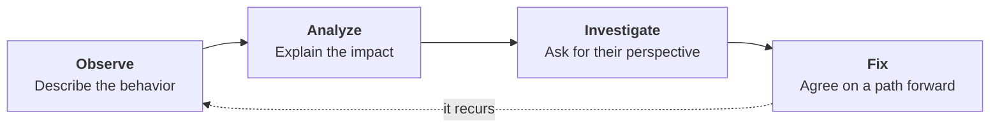

# Professionalism

**Slides:** [Professionalism](../slides/professionalism.html) (the fast version).

> **Purpose (one line):** run a team problem the way you run a defect: observe the behavior, analyze its impact on the project, investigate before you assume, and agree on a fix with an owner and a date.

## 1. Learning objectives

By the end of this module, a student can:

1. Tell an observation apart from a judgment, and state a teammate's missed commitment as evidence a stranger could check.
2. Run the four-step protocol (Observe, Analyze, Investigate, Fix) in a real conversation and close it with an owner, an action, and a date.
3. Pull the evidence for step one out of the team's own repository: assignments, commits, pull request timestamps, review comments, board cards.
4. Explain why commit volume is not a measure of contribution when an agent writes the code, and say what to measure instead.
5. Name the behavior in the two failure modes an AI-augmented team adds: agent output nobody read, and "the agent wrote it" offered as an excuse.
6. Say which problems the team handles itself, which go to the TA, and which go to the instructor immediately with no conversation first.
7. Receive the protocol when it is run on them, without defending.

## 2. Where it fits

- **Prerequisites:** [SE and What AI Changes](se-and-ai.md), which made you accountable for what the agent writes, and [The AI-Augmented Team](ai-augmented-team.md), which put the team's memory in the repository.
- **Leads into:** every remaining week. It is taught once and practiced until December.
- **How it's taught:** half of one lecture day in week 2, on the day your team is announced. The reference version (values, expectations, the full accountability process, and the FAQ) is the [Professionalism handbook](../professionalism.md), which you read on your own. Clause 7 of your [team contract](../team-contract.md) is where your team writes down its own version, and you sign that on Friday.
- **Course outcome it delivers:** [act as a professional teammate](../syllabus.md#learning-outcomes) (outcome 9), and it supports [giving and receiving engineering feedback](../syllabus.md#learning-outcomes) (outcome 7).

## 3. Motivation

Senior design teams rarely fail because nobody could code.

They fail like this. In week 4 somebody notices that a teammate has stopped showing up. Nobody says anything, because raising it feels like an accusation and everyone assumes somebody else will. In week 7 the team quietly routes around them, which works, so the problem stops being visible. In week 12 an integration nobody owns is late. In week 15, on the peer evaluation form, four people write some version of *X did nothing all semester*.

That is the first time it was ever said out loud, and it is eleven weeks too late to fix. The instructor's options in week 15 are all bad ones. In week 4 the options were good, and cheap: one uncomfortable ten-minute conversation.

**The failure mode is silence, and silence carries no signal.** Project Pulse, the system you spend the term reading, is a peer-evaluation application for exactly these teams, and it has a defect that makes the point better than any slide: `getPeerEvaluationAverage` in `EvaluationService` returns `0.0` for a student nobody evaluated ([`project-pulse`](https://github.com/Washingtonwei/project-pulse), `main`). A student with no data and a student everyone scored zero come out identical. Week 12 returns to that as a testing problem. Read it today as a team problem: when nobody says anything, the absence of a signal gets read as a verdict, and the person it lands on never got a chance to answer it.

This module is the ten-minute conversation in week 4, taught as an engineering procedure so that it is something you execute rather than something you work up the nerve for.

## 4. Core concepts

### 4.1 The golden rule

**Attack the problem, not the person.**

| Not this | This |
|---|---|
| "You're lazy." | "The backend endpoint wasn't done by Friday, as we agreed on the 12th." |
| "You don't care about this project." | "You've missed the last three meetings without telling anyone." |
| "Your code is sloppy." | "This pull request has failed CI four times on the same lint rule." |

The left column attacks personality, intelligence, or motivation. None of those is observable, none is arguable, and all three put the other person into defending themselves rather than fixing anything. The right column names behaviors, facts, and observable actions.

You already know how to do this. You do it in code review, where the target is the diff and never the author. A teammate is not harder than a diff; the move is the same one.

### 4.2 A team problem is a defect, so debug it

You have a procedure for a system behaving in a way you did not expect. Use it on the team.

Four steps, in order, and the order matters as much as the steps. Skipping to Fix produces "please do better." Skipping Investigate produces a fix for the wrong root cause. Skipping Observe produces an argument.

### 4.3 Observe: evidence, not impressions

This is the step people skip, because an impression feels like evidence from the inside.

> "You never do anything."

That is not an observation. It is a conclusion, it is unfalsifiable, and the only available response to it is denial. Compare:

> "Sub-issue #41 was assigned to you on Sep 14 and moved to In progress on the 16th. It's Oct 2 and the branch has no commits. The client demo needs it on the 9th."

Nothing there is arguable, because none of it is an opinion. It is four facts and a date, and every one of them came from the same place.

**Your repository already holds the evidence.** Monday's thesis was that the repository is the team's shared memory. It has a second consequence, which is that the repository is also the team's record. Six sources, all timestamped, none of them written to settle an argument:

| Source | What it shows |
|---|---|
| Issue and sub-issue assignment | Who took what, and when |
| The board's columns | What has been sitting in **In progress** since when |
| `git log` on a branch | Whether work started |
| Pull request opened and merged times | Whether work landed, and how long review took |
| Review comments | Who reads other people's code |
| The team channel | What was said, and what went unanswered |

A team that runs the workflow from [The AI-Augmented Team](ai-augmented-team.md) has this for free. A team that keeps its real plan in a group chat has nothing but impressions, and every conflict becomes one person's word against another's.

**Volume is not contribution, and with an agent it is not close.** A teammate can generate two thousand lines in a week and contribute nothing that survives review. A teammate who spends the week specifying use cases, reviewing pull requests, and unblocking three people may have the lightest `git log` on the team and be the reason it shipped. Commit counts and the contribution graph measure typing, and typing is the part the agent does now.

Measure commitments made against commitments met. That is why the examples above are about a specific assignment on a specific date, rather than about how much anybody has committed lately. (Week 11 takes software metrics apart properly; the short version is that any productivity proxy you can game gets gamed.)

### 4.4 Analyze: impact on the project, not on you

Connect the behavior to something the team is trying to do.

> "The delay meant the front end had nothing to integrate against, so the Checkpoint 2 slice missed the demo."

Not:

> "It's frustrating that I'm the only one doing anything."

The second version invites a debate about who is doing more, which nobody wins and which changes no code. The first describes a cost, and a cost is something two reasonable people can agree to avoid next time. Impact is usually one of four things: somebody was blocked, a checkpoint slipped, the client demo got riskier, or work that already existed got redone.

Keep your own feelings out of the sentence. Not because they do not matter, but because they are the one part of the sentence the other person is entitled to dispute.

### 4.5 Investigate: ask before you assume

Your evidence is a symptom. You do not yet know the cause, exactly as a stack trace tells you where it blew up and not why.

Ask, then stop talking:

- What's going on with #41?
- Is something blocking you?
- Did I misunderstand what you'd taken on?
- What would help?

The causes you will actually find, in rough order of frequency: the person misunderstood the task, they are blocked on somebody else's work and did not want to say so, they are overloaded in another course, or something happened in their life that has nothing to do with you.

**The most common one in this course is that they are stuck and embarrassed.** They took a use case they did not know how to build, could not get it working, and every day of silence has made the next day harder to break. That person does not need accountability. They need somebody to sit with them for an hour, and they will be the most reliable member of your team for the rest of the term. You cannot tell them apart from a teammate who has checked out without asking, which is the whole reason this step exists.

### 4.6 Fix: an owner, an action, and a date

A conversation that ends in "I'll try to do better" has produced nothing you can check.

End with all three:

| Weak | Checkable |
|---|---|
| "Communicate more." | "Reply in the team channel within 24 hours on weekdays." |
| "Get #41 done." | "Pull request open on #41 by Friday the 10th, even if it is incomplete and marked draft." |
| "Tell us if you're stuck." | "If you're blocked for more than a day, post it in the channel that day." |

Then **write it down**, in the issue or the channel. Same rule as every other decision your team makes: an agreement that lives only in one conversation did not happen, and you will need it if the behavior recurs. That is also the humane reason to record it. A teammate who agreed to a Friday deadline and hit it now has evidence, and nobody's memory of the term gets to overwrite it.

### 4.7 Five rules

1. **Talk early.** Within 48 hours of noticing.
2. **Use evidence.**
3. **Connect it to project goals.**
4. **Ask before assuming.**
5. **End with an agreement.**

Rule 1 carries the other four. Everything in this module gets harder in proportion to how long you wait, because a two-day-old missed deadline is a scheduling question and a two-month-old pattern is an accusation about character. Waiting does not make the conversation easier. It makes it bigger.

### 4.8 The situations you will actually hit

Six patterns account for most of what goes wrong on a student team. You will recognise them, and you will probably recognise yourself in at least one.

| | The tell |
|---|---|
| **The Ghost** | Three unanswered messages, nine days, an empty branch |
| **The Nine-Minute Tax** | Always late. Five people wait. Forty-five minutes of your team, every week |
| **"Yeah, I'll take that"** | Volunteers for everything in the meeting, delivers none of it |
| **Merged, Unread** | The agent wrote it, they pasted it, nobody read it, their name is on it |
| **The Rubber Stamp** | "LGTM" on nine hundred lines, forty seconds after the pull request opened |
| **The Hero** | Silent for three weeks, then two thousand lines at 11pm before the demo |

A seventh shows up in the first studio: **"I'll take the front end."** Claiming a layer instead of a use case, which leaves the integration defect owned by nobody. [The AI-Augmented Team](ai-augmented-team.md) says why that fails.

**Now notice what just happened.** Those are six labels for six people, which is precisely what 4.1 tells you never to open with. The archetype is a tool for *spotting* a pattern in yourself or your team. It is not the sentence you say. Call somebody a Ghost to their face and you will get a fight instead of a fix.

Convert each one to a behavior, and it becomes sayable:

| Instead of the label | Say |
|---|---|
| The Ghost | "You've missed two meetings and #41 hasn't started. What's going on?" |
| The Nine-Minute Tax | "The last four meetings started late waiting for you. Can you make 4:00, or should we move it?" |
| "Yeah, I'll take that" | "You took three tasks last meeting and none of them have branches. Which one is actually yours?" |
| Merged, Unread | "Walk me through why this method swallows the exception here." |
| The Rubber Stamp | "This was approved in forty seconds and the defect was on line 300. What would you want a reviewer to do for your code?" |
| The Hero | "Two thousand lines the night before means nobody can review it, so we shipped unreviewed code to a client demo." |

The lateness line is the one to study, because it ends with an offer. *"Can you make 4:00, or should we move it?"* runs step three inside a single sentence: it assumes there may be a real reason and gives them somewhere to put it. Sometimes the finding is that the meeting is at a bad time and nobody wanted to be the one to say so.

Three more, which are less about a person and more about a team:

| Situation | Open with |
|---|---|
| **The dominator** | One person decides everything and the rest have stopped proposing. "The last four architecture calls were made outside the meeting. I want the next one discussed." |
| **Repeat findings** | The same review comment on every pull request. "This is the third pull request with the same finding. What's making it hard to catch before you push?" |
| **Scope creep** | The client keeps adding and nobody says no. Not a teammate problem: take it to your TA and the instructor early. |

Two of the six are new, and they are the ones this course has to teach because they did not exist five years ago.

**Merged, Unread.** The behavior is not "you used AI." Everyone here uses AI, and the course requires it. The behavior is *submitting code you cannot explain*, and clause 6 of your team contract is where your team writes that down: every member can explain any line submitted under their name, and no agent output is merged that nobody has read. The observation is a question asked in review, not an accusation made in a meeting. If the author can walk you through it, there was never a problem. If they cannot, you have your finding, and it is about review discipline rather than about the tool.

**"The agent wrote it."** Week 1's rule settles this: you are accountable for what the agent writes. Putting your name on a pull request is claiming the work, and the claim does not come apart later because the defect turned out to be embarrassing. Worth naming out loud in week 2, before it happens, so nobody discovers in October that it was never going to work.

### 4.9 Escalation, and the two exceptions

Three levels, and almost everything ends at the first:

1. **The team conversation.** Run the protocol. Most problems end here, and a team that handles its own problems is the definition of a functioning team.
2. **Your TA.** If it recurs after an agreement. Your TA is with your team all semester, reads your repository, and can usually see what happened. Bring the evidence and the agreement that was not kept.
3. **The instructor.** A written improvement plan, then a professionalism review if that does not work. The [handbook](../professionalism.md) carries the full process, including what it can affect in your grade.

**The instructor's expectation:** before you ask for intervention, have had at least one respectful conversation using this protocol, and be able to say what was agreed and what happened next.

**Two exceptions, where none of the above applies.** Academic integrity concerns, harassment, discrimination, threats, or anything unsafe go to the instructor immediately. Do not run the protocol, do not wait 48 hours, and do not raise it with the person first.

### 4.10 Receiving it

Half of this module is being on the other end, and it is the harder half.

Somebody brings you an observation. Everything in you wants to explain why it was not your fault. Do not, at least not first. Ask what they observed. Say what actually happened, without decorating it. Agree the action. If they are right, say so plainly and move on: owning a miss costs about four seconds of discomfort and buys the one thing you cannot get any other way, which is teammates who believe what you tell them.

And if you are the one who is behind, say so on day two rather than in week ten. Being stuck is ordinary, and every engineer on your team has been stuck this month. Going quiet is the only move here that cannot be recovered from, because it converts a technical problem, which your team can help with, into a trust problem, which it cannot.

## 5. Hands-on

**In class, in pairs, three minutes.** A teammate on your team took a use case three weeks ago, has missed two meetings, and has not answered the channel in nine days. Write the *first sentence* you say to them. Trade with your partner and find the judgment hiding in theirs.

Everybody writes a version of "you never do anything" the first time. The exercise is not the conversation; it is noticing how naturally a conclusion arrives dressed as an observation.

**In Friday's studio.** Clause 7 of your [team contract](../team-contract.md): who raises a missed commitment, how soon, and what happens the second time. Write it while nobody is angry, because that is the only time anybody writes a fair one. Your TA checks it for something specific rather than for a restatement that problems should be avoided.

**All term.** The first time somebody misses something that matters, you have 48 hours.

## 6. Summary

- Attack the problem, not the person. Behaviors and facts, never personality, intelligence, or motivation.
- A team problem is a defect: **Observe, Analyze, Investigate, Fix**, in that order.
- An impression is not an observation. The evidence is in your repository, timestamped and neutral: assignments, commits, pull request times, review comments, board cards.
- Volume is not contribution, and an agent makes volume free. Measure commitments met.
- State impact on the project, not on your feelings.
- Ask before assuming. The most common cause is a teammate who is stuck and embarrassed.
- Finish with an owner, an action, and a date, written down.
- Talk within 48 hours. Waiting makes the conversation bigger, not easier.
- Code you cannot explain is the behavior, not the tool. "The agent wrote it" is not available as a defense.
- Academic integrity, harassment, discrimination, threats, and safety go straight to the instructor.

## 7. Further reading

- Douglas Stone, Bruce Patton, and Sheila Heen, *Difficult Conversations: How to Discuss What Matters Most* (Penguin, 1999). The source of the observation-versus-judgment distinction this module runs on.
- Kim Scott, *Radical Candor* (St. Martin's, 2017). Care personally, challenge directly. The failure mode it names, "ruinous empathy," is the week-4 silence in section 3.
- Bruce W. Tuckman, "Developmental Sequence in Small Groups," *Psychological Bulletin* 63(6), 1965. Forming, storming, norming, performing. Worth knowing that the storming phase is normal and not a sign your team is broken.
- Adapted for TCU senior design from Carnegie Mellon materials on difficult conversations and feedback.

## 8. Self-check

1. Rewrite as an observation: "Priya has completely checked out of this project."
2. Your teammate's contribution graph is the emptiest on the team. Name two ways that is consistent with them being the most valuable member.
3. A pull request adds 900 lines and passes CI. What single question in review tells you whether the author read it?
4. You agreed on Tuesday that a pull request would be open by Friday. It is Monday and there is none. Which step do you go back to, and why is it not Fix?
5. Which of these skips the protocol entirely: a teammate who has ghosted for two weeks, a teammate who submitted a classmate's code as their own, a teammate who dominates every design call?
6. Why does an agreement have to be written down somewhere the whole team can see?

## Related

- [Professionalism handbook](../professionalism.md): the values, expectations, accountability process, and FAQ. The reference version of what this module teaches.
- [Team Contract](../team-contract.md): clause 7 is this module, in your team's own words.
- [The AI-Augmented Team](ai-augmented-team.md): why the evidence in section 4.3 exists at all.
- [Senior Design Project](../project.md#conflict): how conflict is handled in the course.
