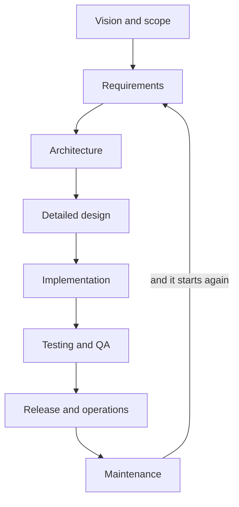
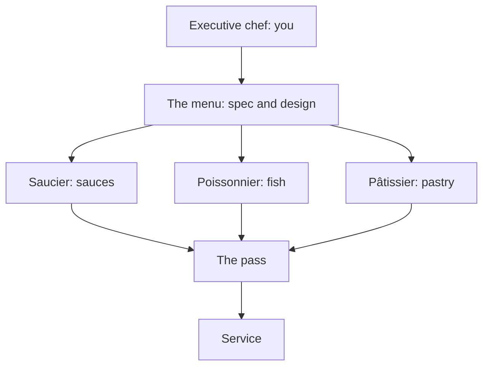

# SE and What AI Changes

> **Purpose (one line):** say what is left for a software engineer when the agent can write the code, and act on the answer: place a task on the delegation boundary, and size an unfamiliar problem in twenty minutes well enough to defend it against the agent's version.

**Slides:** [SE and What AI Changes](../slides/se-and-ai.html) (the fast version) and [Fifteen Weeks to Demo Day](../slides/fifteen-weeks-to-demo-day.html) (the week-1 failure story).

## 1. Learning objectives

By the end of this module, a student can:

1. Give a standard definition of software engineering and say what the word *engineering* is doing in it.
2. State what software engineering is responsible for beyond writing code, and which of those AI has and has not absorbed.
3. Explain how a project fails completely with no defective code in it, and which decisions in that failure an agent cannot own.
4. Name the three constraints that define project success and explain why failing to renegotiate them, rather than failing to build, is the common cause of missed delivery.
5. Judge whether a stated need is a requirement (a capability or constraint, agreed, verifiable) and rewrite one that fails the test so it can be verified.
6. Use the time-horizon result to predict which tasks an agent will finish and which it will fail, and answer "AI made this course obsolete" with evidence in both directions.
7. Give the causes the layoff evidence supports, separate AI-washing from actual displacement, and say what thinned the entry-level rung.
8. Classify work as execution, judgment, or agency, and explain why an amplifier collapses the price of the first while raising the value of the other two.
9. State who is accountable for work an agent wrote, and apply the explanation test to decide whether a piece of it is ready to submit.
10. Place a given task on the delegation boundary and justify the placement using the delegation test (if guessing it wrong would violate a requirement, it stays human).
11. Distinguish automation bias from agenda capture, name the tell for each, and apply a recovery move.
12. Produce a Napkin for an unfamiliar one-paragraph brief in twenty minutes: shape, the hard part, the bottleneck, stack, three kill risks as mechanisms, and a feasibility verdict.

## 2. Where it fits

- **Prerequisites:** none. This is the course opener.
- **Leads into:** The AI-Augmented Team in week 2 (onboarding the agent as a teammate), requirements as the contract in weeks 3-4, and architecture in week 6, where the Napkin's six questions get the slow, derived treatment.
- **How it's taught:** two lecture days, then revisited at every new topic all term. It owns the [Napkin drill](../studio.md#the-napkin-drill) you will run six times in studio.
- **Course outcome it delivers:** [sizing up an unfamiliar problem and defending that judgment against the agent's version](../syllabus.md#learning-outcomes) (outcome 10), and it opens [collaborating with AI across the lifecycle](../syllabus.md#learning-outcomes) (outcome 6).

## 3. Motivation

**You have been taught the pieces.** Three years of algorithms, data structures, databases, networks, operating systems, and enough LeetCode to get through a phone screen. Every one of those courses handed you a problem that was already specified, already scoped, already known to be solvable, and graded you on whether your code produced the right answer.

None of that is the job.

The job is a client who does not know what they want, six teammates who each heard something different in the same meeting, a deadline someone else committed to, a codebase you did not write, and a question nobody can answer from the code: *is this the right thing to build?* This is the course where you find out whether you can do it.

**And you are worried about the job market.** You should be, a little. Technology employers announced [139,156 job cuts in the first half of 2026](https://www.challengergray.com/blog/challenger-report-june-layoffs-cool-to-45849-down-53-from-may-ai-leads-reasons-for-fourth-consecutive-month/), 83% more than the same period in 2025, during a year when total announced cuts across all US sectors *fell* by about 40%. The losses are concentrated exactly where you are trying to get hired, and the entry-level rung thinned. Meanwhile the AI models really are extraordinary at writing code. Both are true, and neither means what the headlines say. Core concepts answers the question, once a few definitions are in place.

The short version: the skills that just lost their value are the ones you can do in four minutes, and the skills that gained value are the ones that take four hours or four months. This course teaches the second kind.

**The failure this module is arranged against** is the ordinary one: six competent people, a real client, fifteen weeks, and nothing usable at the end, with nobody writing bad code. The requirements are a mood rather than a contract, so the agent (a language model working directly in your repository, defined properly below) fills the gaps silently and six people build six different products at speed. [Fifteen Weeks to Demo Day](../slides/fifteen-weeks-to-demo-day.html) walks it end to end.

Every decision in that chain (what "done" means, which architecture survives contact with the other five, whether a generated feature was ever asked for) is human. An agent given that specification implements it faster, with better test coverage, and just as wrongly.

## 4. Core concepts

### What software engineering is

The standard definition, from IEEE Standard 610.12:

> Software engineering is the application of a systematic, disciplined, quantifiable approach to the development, operation, and maintenance of software.

Read it for what it excludes. It does not mention writing code. "Development, operation, and maintenance" is the whole life of a system, and the typing is a slice of the first word.

**Why the word "engineering" is there at all.** It was coined provocatively at a NATO conference in Garmisch in 1968, when projects were failing at a rate nobody could explain: late, over budget, unreliable, sometimes abandoned after years. The organizers picked the word to argue that software should be held to the standards of an established engineering discipline rather than treated as a craft where results depend on who happens to be writing.

Fifty-eight years later that argument is still not settled, which is why this course exists. Civil engineers had the same fight and finished it. We are still having it, now with a participant that can produce a bridge design in nine seconds.

The three commitments the word carries:

- **Systematic:** there is a process, and it does not depend on who is in the room.
- **Disciplined:** the process is followed when it is inconvenient, which is the only time it matters.
- **Quantifiable:** claims about the system are measured rather than asserted. "It is fast" is not an engineering statement. "The dashboard renders in under 400 milliseconds at the ninetieth percentile with 200 concurrent users" is.

### Programmer or software engineer?

Both are real jobs, neither superior. They are responsible for different things.

| | Programmer | Software engineer |
|---|---|---|
| **Given** | A specified problem | A dissatisfied client and a budget |
| **Produces** | Code that works | A system that solves the right problem and keeps solving it |
| **Time horizon** | This function, this sprint | The second year, the next maintainer, the handover |
| **Success is** | It runs and passes the tests | It is used, and it survives change |
| **Fails by** | Writing a bug | Building the wrong thing correctly |
| **Hardest part** | The algorithm | The conversation |

The last row is the one students disbelieve and then discover. The hardest part of your senior design project will not be technical. It will be finding out what your client actually needs when they cannot tell you, and getting six people to agree on it.

### The software development life cycle (SDLC)

The life cycle is the sequence of activities a system goes through from idea to retirement. Processes arrange it differently (waterfall runs it once, agile every two weeks), but the activities are the same:

Count the boxes. **Implementation is one of eight**, it is the box you have been graded on for three years, and it is the box agents are strongest at. Every other box is a meeting, a decision, or a document, and each can sink a project on its own:

- **Vision and scope:** what the system is for, and what it will deliberately not do. Get it wrong and everything downstream is wasted effort executed well.
- **Requirements:** what the client said, turned into something a team can build against and a tester can check.
- **Architecture:** the structures that have to survive the second year, the ones expensive to reverse.
- **Detailed design:** how each part behaves, worked out before anyone commits it to code.
- **Testing and QA:** whether behavior matches intent, a different question from whether the code runs.
- **Release and operations:** deployment, monitoring, and the 3 a.m. page.
- **Maintenance:** most of the money. A long-lived system can cost several times its original development to maintain.

The arrow from maintenance back to requirements is the point. It is a loop, not a line, and you will be standing in it for the next nine months.

### What "success" means, and how teams fail at it

Success is conventionally three constraints that trade against each other: **scope** (what must be built), **schedule** (when by), and **resources** (what it costs, including how many people). The classic picture, drawn by Martin Barnes for a 1969 course on contract control and known since as the iron triangle, puts quality in the middle:

<svg viewBox="0 0 640 400" role="img" aria-label="The iron triangle: scope at the apex, resources and schedule at the base, quality in the middle" style="width:100%;max-width:520px">
<text x="320" y="34" text-anchor="middle" fill="var(--md-default-fg-color)" style="font:700 22px sans-serif">Scope</text>
<text x="320" y="57" text-anchor="middle" fill="var(--md-default-fg-color--light)" style="font:400 15px sans-serif">features, functionality</text>
<polygon points="320,84 550,330 90,330" fill="none" stroke="var(--md-primary-fg-color)" stroke-width="3" stroke-linejoin="round"/>
<text x="320" y="258" text-anchor="middle" fill="var(--iron-quality)" style="font:700 26px sans-serif">Quality</text>
<text x="90" y="360" text-anchor="middle" fill="var(--md-default-fg-color)" style="font:700 22px sans-serif">Resources</text>
<text x="90" y="382" text-anchor="middle" fill="var(--md-default-fg-color--light)" style="font:400 15px sans-serif">cost, budget</text>
<text x="550" y="360" text-anchor="middle" fill="var(--md-default-fg-color)" style="font:700 22px sans-serif">Schedule</text>
<text x="550" y="382" text-anchor="middle" fill="var(--md-default-fg-color--light)" style="font:400 15px sans-serif">time</text>
</svg>

Quality sits inside because it is not a fourth dial you get to set. Fix all three corners and you have fixed quality too, as the residue. It is the only thing left to spend, so it is what gets spent, silently, by tired people at 2 a.m. in week fourteen.

A project whose scope, schedule, and resources are all fixed has nothing left to trade, and is already failing; it just does not know yet. When your client asks for the demo a month earlier, the honest responses are all trades: defer requirements to a later release, shorten the test cycle, or add people, which is slower before it is faster (Brooks's law: adding people to a late project makes it later). "Yes" without a trade is a promise to spend quality.

**There is no agreed definition of success.** In Scott Ambler's [2013 survey](https://ambysoft.com/surveys/success2013.html), 58% of practitioners valued being on schedule, 36% on budget, 14% building to specification, and only 8% all three. Your client, your teammates, and your instructor may each be using a different definition without knowing it, so ask early which corner your client cares about. They will not volunteer it and they will grade you on it.

Now the failure mode. Projects rarely fail because a team could not build the thing. They fail because the constraints were set unrealistically and **the team never renegotiated them**, and nobody wanted to say so. The MVP shrinks quietly instead, and the client finds out in December.

This is why the course has four checkpoints and a scoped MVP rather than one deadline. A checkpoint is a scheduled chance to renegotiate while it is still cheap. Use them for that, not to report that things are fine.

### What a requirement is

Pin the word down now, because it gets used loosely all term.

> A **requirement** is a statement of a capability the system must provide, or a constraint it must satisfy, that has been agreed with the people who can accept or reject the system, and that is specific enough that you can tell whether it has been met.

All three parts have to hold. Anything inferred from a hallway conversation is not agreed, it is a guess, and verifiability is the part that does the work. Apply it out loud: *what would I observe if this were satisfied, and what if it were not?* If you cannot answer both halves, you are holding a wish.

| A wish | A requirement |
|---|---|
| "The system should be user-friendly." | "A student who has never seen the system can submit a weekly activity report in under two minutes without asking for help, in a test with five students." |
| "It needs to be fast." | "A dashboard page returns in under 400 ms at the ninetieth percentile with 200 concurrent users." |
| "Instructors manage rubrics." | "Only a user with the instructor role can publish a rubric. Publication is irreversible and is recorded in the audit log with the actor and timestamp." |

Weeks 3 and 4 are requirements in full, including why a wrong-but-met contract is the most dangerous artifact in engineering. For now, one consequence: **a requirement is what an agent can be held to.** Ask for a "user-friendly" anything and the agent builds something, confidently, and you have no grounds to reject it. Give it the second column and it has a target and you have a basis.

### What agents can do now

**First, the word.** An **agent** is a language model wired to tools. It can read and write the files in your repository, run commands and tests, read what came back, and try again. That loop is the difference between a chatbot you paste code into and something that works inside your project, and it is what this course means every time it says "agent".

**Now the capability, honestly.** Distrust anyone entirely optimistic or entirely dismissive.

!!! info "As of August 2026, and this section dates fastest"

    **The benchmark.** [SWE-bench](https://arxiv.org/abs/2310.06770) (Jimenez et al., ICLR 2024) hands a model a real issue from a real open-source repository at the commit before the fix, and asks for a patch that passes the project's own tests. Not a puzzle: the actual job of a maintainer on a Tuesday. **SWE-bench Verified** is the 500-problem subset OpenAI had developers hand-screen in 2024, after the original was found to contain issues unsolvable from the description alone. Verified is the number people quote.
    
    In 2023 the best system resolved about 2% of it. Today frontier models resolve the large majority of Verified, with the top few within a couple of points of each other. It is close to saturated, which is why the field keeps building harder ones. Standings move monthly and sit on the [public leaderboard](https://www.swebench.com/); the ceiling is the point, not the winner.
    
    Frontier systems come from several labs at once (Anthropic, OpenAI, Google), and open-weight models (parameters anyone can download and run) sit on the same leaderboard rather than in a separate league. Not one company's trick, and not going to be withdrawn.

Now the part the benchmark headlines leave out.

**Agents fall off a cliff as tasks get longer.** METR, a research group that evaluates AI systems, measures capability by how long a human expert would take. Fitting a curve gives a model's **time horizon**, the task length at which it succeeds half the time. Measuring the frontier models of early 2025, METR reported "almost 100% success rate on tasks taking humans less than 4 minutes, but ... <10% of the time on tasks taking more than around 4 hours." Task length is the single strongest predictor of failure.

**Read those as a shape, not constants.** METR also found the horizon doubling roughly every seven months, so the March 2025 figures have slid right since and will slide again before you are promoted. The shape holds: success collapses as tasks get longer, and the work that survives each slide is the work to the right of the frontier. Look up current figures rather than quoting these.

| How long a human would take | Agents | Examples |
|---|---|---|
| Under 4 minutes | Nearly always succeed | Write this function. Fix this stack trace. Rename this across the repo. Explain this file. |
| Hours to months | Rarely succeed alone | Decide what to build. Choose an architecture. Find out what the client meant. Keep a design coherent across six people and fifteen weeks. |

Nobody is paid a salary for four-minute tasks. A semester-long project for a real client is the second row, over and over, and so is every job you are about to apply for.

### The layoffs, what caused them, and what happened to entry level

You have read that software engineering is over. Here is what the evidence supports.

**Cause one, the hangover.** Companies hired through 2020 and 2021 as though pandemic demand were the new baseline. Marc Andreessen [puts the range at 25% to 75% overstaffed](https://fortune.com/2026/03/31/marc-andreessen-ai-layoffs-silver-bullet-excuse-overhiring) and calls the AI explanation a "silver bullet excuse" for cleaning house. A company that doubled a division in 2021 and trimmed it in 2026 is correcting a five-year-old mistake.

**Cause two, AI is a convenient explanation.** "We are becoming more efficient with AI" is a better story for shareholders than "we hired badly." Sam Altman, who has every incentive to claim the opposite, [calls it AI washing](https://fortune.com/article/sam-altman-ai-washing-tech-layoffs/): "there's some AI washing where people are blaming AI for layoffs that they would otherwise do, and then there's some real displacement by AI of different kinds of jobs." Watch the numbers: AI was named in about 5% of announced US cuts across all of 2025 and about 23% through the first half of 2026. The tools improved over those months; they did not improve fourfold. When the explanation moves faster than the thing it explains, the explanation is doing other work.

**Cause three, expensive bets that lost.** Meta's Reality Labs lost about $13.7 billion in 2022 and about $16.1 billion in 2023 pursuing the metaverse, and when that had to be recovered it was recovered from headcount. No AI was involved. Learn this early: *you can lose your job because of a decision made three levels above you, in a meeting you were not in, about a product you never worked on.* Technical excellence does not protect you. Understanding what the business is trying to do gives you a better chance of seeing it coming.

**And the part that is genuinely about AI.** The entry-level rung really is thinner. The tasks a company used to hand a new graduate to build their judgment (small well-specified changes, test writing, boilerplate) are exactly the four-minute tasks agents now do for nothing. Refusing to use the tools does not solve that. Arriving already able to do the four-hour work does: scope a problem, run a client conversation, choose an architecture and defend it, review code you did not write, direct agents rather than compete with them.

**The worry worth having is one level down.** Not that AI replaces software engineers, but that one senior engineer with agents replaces several juniors. Those junior roles were the training ground: small specified tasks were how people built the judgment that made them senior. Remove the rung and the ladder still works for everyone already above it, and for nobody below. Nobody in the industry is responsible for fixing that, so it does not get fixed by default. Ask about it in interviews: how does this team make seniors now?

### Kent Beck did the math

Kent Beck created Extreme Programming and popularized test-driven development. He wrote this the day he first used a language model seriously, in April 2023:

> The value of 90% of my skills just dropped to $0. The leverage for the remaining 10% went up 1000x.

The line gets quoted as doom. Read the second half: a thousandfold increase in the value of some of his skills. Which ones? He answered later. The 10% is:

- Having a vision
- Breaking that vision into milestones
- Managing the design
- Controlling complexity

Compare that against the METR table. Beck named the four-hour column two years before anyone measured it, from the inside, by noticing which of his own skills the model could not do. Those four are four lines of this course's syllabus.

**This is the argument of the whole module.** AI did not make software engineering knowledge irrelevant. It collapsed the value of implementation-level skill and multiplied the value of the highest-level engineering skills, precisely the ones traditional courses treated as soft or unteachable.

### AI is an amplifier

> You will not be replaced by AI. You will be replaced by someone who can use AI.

That is not a threat, because **AI is an amplifier**. It multiplies whatever judgment you bring, and the sign matters as much as the size. Bring a clear specification and a sense of what good looks like, and you get a great deal of good work quickly. Bring nothing and you get nothing, faster: zero multiplied is still zero. Bring a wrong premise, and the amplifier neither stalls nor argues. The wrong thing arrives complete, tested, documented, and spread through the codebase before anyone questions it, which is worse than having built nothing, because undoing it costs more than building it did.

### Execution, judgment, and agency

A job is not one thing. It is three, and AI is doing something different to each.

**Execution** is carrying out a task somebody already defined: write this function, analyze this data, generate this document. If your value is mostly execution, you are competing with something that improves every few months and gets cheaper as it does.

**Judgment** is deciding what to do, what not to do, and whether something is wrong even when it looks right. An agent can assist with it but does not carry the consequences of the decision, which is the whole difference.

**Agency** is moving something from zero to one without being told how: defining the problem, setting direction, adapting when it breaks, delivering something real. An agent helps you execute faster. It does not decide what is worth doing.

> Execution is abundant. Judgment is scarce. Agency is the differentiator.

**Taste is the trainable core of judgment:** knowing what good looks like without a rubric. Which abstraction will hurt in six months, which test is theater, which explanation is fluent and hollow. It is what lets you *reject* work, and without it you approve whatever arrives. It is built by making decisions rather than generating answers, by catching the agent when it is wrong, and by seeing enough good and bad work to tell them apart.

Agency is the harder one to build in a classroom, which is why this course is not a classroom for most of its hours. A real client, a problem nobody has scoped, and something that has to work in December is the only reliable way to get it.

**And the risk underneath all of it:** AI makes it easy to look competent without being competent. Polished output, shallow thinking, confidence growing faster than competence. The gap does not show up in a demo. It shows up in the first interview question that goes one level deeper than the artifact you brought.

### What the market pays for

**Execution is abundant, judgment is scarce.** That is a claim about what employers pay for, so test it. Read a senior engineering posting at Amazon, Google, or any mid-size product company and count how much of it is about producing code. Very little. What recurs instead: reviewing code and setting the standards it is held to; scoping a project through launch; communicating with users, other teams, and senior management; mentoring, and knowing when to adopt a technology rather than build one.

Every one is a life-cycle activity from the diagram above, and not one is typing. These postings predate agents that could code well, which is what makes them useful: the industry was already paying a premium for the part AI has not absorbed. The premium got larger.

**New in 2026:** postings name the tools (Claude Code, Cursor, GitHub Copilot), ask for evidence you have shipped real work with them rather than tried them, and increasingly ask for judgment about when *not* to. "Familiar with AI coding tools" is now what "familiar with version control" was in 2010: written not because it impresses but because its absence disqualifies. You can satisfy it honestly in December, with a client MVP built with an agent in the workflow and your contribution visible in the git history.

### The team you will run

The kitchen brigade, the command structure Auguste Escoffier built for professional kitchens in the 1890s, is the closest model for how software teams are about to work.

The executive chef does not cook most of the food. The chef decides what the restaurant is for, writes the menu, sets the standard, and stands at **the pass**, where every plate is inspected before it leaves. Nothing reaches a customer the chef has not seen.

Map it onto your team. The menu is your specification and design of record; the stations are agents, many at once; the pass is code review, and you are standing at it; service is the client demo in December.

Two things the metaphor gets right that "AI will write the code" gets wrong:

**The chef's authority comes from being able to taste.** A chef who cannot tell a good plate from a bad one is not a chef, however good the brigade. You cannot direct work you cannot evaluate; you will just approve whatever arrives, quickly, which is automation bias (trusting output because a machine produced it) with extra steps. This is why the exams are closed to agents and every assignment is graded on judgment rather than output.

**The pass does not scale by wishing.** If the brigade plates faster than the chef can taste, the answer is not to stop tasting. That is the central operational problem of an AI-augmented team, and week 2 takes it up directly.

The future team is a few engineers with excellent judgment directing a lot of machine capacity, which is to say that when you graduate you are expected to be the chef. But Escoffier's brigade also *produced* chefs. The commis worked the stations for years, and that is where the palate came from. If every station is an agent, the metaphor stops explaining where the next chef comes from, and so does the industry.

### You sign it

An agent can write the code. It cannot be the author of it. The commit carries your name, the pull request carries your approval, and the outage carries your explanation. "The agent wrote it" is not a defense in this course and is not one in any job you will take.

The standard is not "no AI", it is **reviewed and good**. Work an agent drafted is fine if you read it, checked it against the specification, and would defend every line of it. What is not fine is fluent output nobody examined, shipped because it looked finished. The problem with slop is not that a machine produced it, it is that nobody engineered it, and the name on it belongs to the person who chose not to.

The operational form is the **explanation test** in the [academic integrity policy](../syllabus.md#academic-integrity): submitting work you cannot explain is the violation. If you cannot say why a line is there, what it does on empty input, and what breaks when you remove it, you did not review that work, you forwarded it. Reviewing what an agent wrote is engineering, it takes real time, and it is where part of the time you saved on typing goes. [Working with AI](../ai.md) carries the rest as course policy.

### What changed in SE in the era of AI

Three things, and they pull in different directions.

**Transformation got cheap.** The cost of turning an approved design into code fell by an order of magnitude. Anything whose difficulty was mostly typing is now nearly free.

**The cost of being wrong went up.** When code took a week, a bad requirement was caught by the friction of building it. When code takes a minute, the wrong thing gets built completely, tested, and merged before anyone notices the premise was wrong. Speed removes the accidental checkpoints that slow work used to provide.

**The economics of rigor inverted.** Teams skipped living traceability (keeping every requirement connected to the code that implements it and the test that proves it), current design documents, and consistent glossaries because the *upkeep* cost human hours, not because the practices lacked value. That cost has collapsed, so the question is no longer "is this rigor worth the effort?" but "now that upkeep is cheap, which discarded rigor is worth reinstating?" It is the reasoning behind several later choices that would have looked like bureaucratic overhead in 2019.

The guardrail: cheap generation is not cheap trust. Reinstate a practice when it has value, was skipped for labor reasons, and a check can keep it honest. Practices failing that last test come back only behind human sign-off, which is exactly where judgment gets taught.

### The delegation boundary

The recurring question of this course, asked fresh at every topic: **what do we hand the agent here, and what stays human?**

| Stays human | Goes to the agent |
|---|---|
| Requirements quality, scope, vocabulary | Use case to design-of-record |
| Business constraints, domain knowledge | Approved design to code and tests |
| Quality attributes, and what "good enough" means | Cross-document consistency checks |
| Architectural decisions that are hard to reverse | Mechanical artifact transformations |
| "Is this even a good idea?" | Drafting, refactoring, explaining unfamiliar code |

Three terms from that table, each with its own week later. A **use case** is one goal a user pursues through the system, written as the steps that get them there. A **design of record** is the approved description of how a slice is built (components, sequences, API contracts, schema): the version that wins when documents disagree, and what an agent is handed before it writes code. **Quality attributes** are what a system must *be* rather than do (speed, security, availability), often called non-functional requirements.

The delegation test: **if guessing it wrong would violate a requirement, the human pins it. Otherwise the agent derives it.** Both extremes are wrong. "Delegate everything" produces a fast, well-tested implementation of a question nobody answered; "keep everything human" throws away the one advance that makes the rigor affordable.

The left column is Beck's 10% and the four-hour column, written out as tasks. Not a coincidence: it is the same boundary described three ways. Remember whichever of the three you find easiest to apply under pressure.

### Agenda capture: losing control of the conversation

**The failure.** After several turns the engineer is no longer directing the work. They are answering the agent's questions, following its reasoning, and building things that do not matter yet. You lost the wheel.

**Where the name comes from.** *Agenda-setting* in media theory (McCombs and Shaw, 1972) and *regulatory capture* in economics (Stigler, 1971): both describe authority reversing while the org chart stays the same, which is what has happened to you by turn twelve.

**Distinguish it from automation bias.** Automation bias is trusting output that is wrong. Agenda capture is competent output on the wrong problem. There is no error signal anywhere: every step looks fine, and the cost shows up only at the end, when the thing you sat down to do is not done.

**Why it happens.**

1. *The agent always has a next move.* It never stalls or says "you decide." Every turn ends in a proposal, and a proposal is a default, so your role degrades from choosing the work to approving it. Approving is cheap.
2. *Whoever asks the questions owns the frame.* Answering them feels productive, but the set of questions defines the problem and you did not write it. Novices are most exposed: an expert has a prior about what matters and resists the pull, a student has none.
3. *The agent goes depth-first; seniority is breadth-first.* Survey, size, prune, then dig. The model picks a thread and pulls, holding no cost model, no deadline, and no stake. "Interesting" and "important right now" are indistinguishable to it.
4. *Accumulated context is a commitment device.* Fifteen turns in, abandoning the thread feels wasteful even when it is correct. The sunk cost is real and it is inside the session.

**Not unique to AI, but worse with it.** A dominant pair-programming partner does the same, minus the fatigue, the social friction that signals a redirect, and the limit on plausible next steps. There is no natural stopping point, so you have to supply one.

**The tell, and the moves.**

- *Tell:* you have stopped asking questions of your own, either because you are busy answering the agent's or because it asked none and you are just approving what arrives. The early warning is the ratio of questions you ask to questions you answer inverting.
- *Move 1:* answer the agent's question only if the answer changes what you would do next. Otherwise say so and return to the goal.
- *Move 2:* kill the session rather than redirect it. The context that captured you is the same context you would be arguing against.
- *Move 3:* write the goal down before opening the chat, so drift is checkable rather than a feeling.

**What catches it is something written down before the session opens.** Not a longer prompt and not more vigilance, both of which fail the moment the conversation gets interesting, but an external thing to check the thread against: *does this touch the hard part or the bottleneck I named?* Committing to that answer before the agent can set the agenda is the whole trick. The next section is one way to do it in twenty minutes.

### The Napkin: six prompts

Given an unfamiliar problem, produce a defensible rough judgment in twenty minutes. This is the delegation boundary at project scale: an agent produces a fluent plan, stack, and risk list in seconds, so the human differentiator is judging whether it is any good. Two uses: sizing a problem you have never seen, and, written before a session, making agenda capture visible in one you know well.

1. **Shape.** What kind of system is this really (a CRUD application, meaning create, read, update, and delete over a database; a data pipeline; real-time; integration glue; machine learning)? One sentence, then three to five boxes.
2. **The hard part.** The one thing that makes this not a weekend project. Every project has one that dominates, and naming it is most of the skill.
3. **Bottleneck.** Where it breaks first: under load, under scale, or under a five-person team.
4. **Stack.** What you would build it with, one sentence of why. Boring default unless there is a reason.
5. **Kill risks.** Top three, each stated as a mechanism, not a category.
6. **Verdict.** Feasible for this team in this time, yes or no, and what you would cut first.

A seventh prompt, **Delegate** (what goes to the agent, what stays human), waits until the first six run smoothly.

**The sequence is fixed:** individual silently (about 5 minutes), team reconcile (about 10), then the agent's napkin, then diff (about 5). Prompt first and you anchor on the agent's answer and learn nothing. The diff is where the learning happens; protect it when time runs short.

**What the agent needs before it drafts one:** the client's real constraints (budget, incumbent systems, deadline, who will operate it), the team's actual skills, and the definition of done. Asked to plan a project, it invents all three plausibly and silently.

**How to run the diff.** Interrogate differences in both directions. Where it named something you missed, ask whether the mechanism is real. Where you named something it missed, ask why, which is usually context you hold that never made it into the prompt. That is **context engineering** (working out what the agent cannot infer, then supplying it deliberately) arriving in week 1.

**What scores:** a mechanism, not a category. "Scope creep, integration issues, communication problems" is risk bingo and scores nothing. "The client's system exports CSV nightly, so nothing is real-time and the dashboard requirement is dead on arrival" is the target.

**Honest framing.** One semester does not manufacture ten years of pattern library. The drill offers the frame, six rounds with fast feedback, and the habit of noticing when your own estimate was wrong.

## 5. Risks and mitigations

A **risk** has not gone wrong yet, would cost you if it did, and can still be acted on. That last clause separates it from a problem, which has already happened and is now work. Size a risk by likelihood and cost, then avoid, reduce, or accept it on purpose; naming one you then do nothing about is not risk management. Barry Boehm's 1991 top-ten list is the ancestor of every table like this one.

Every module carries one, naming the classic failure for its topic and the one AI introduces, because spotting what could go wrong is the human skill that gets scarcer as code gets cheaper.

| Risk (classic + AI-introduced) | Human judgment that catches it | Mitigation |
|---|---|---|
| Building the wrong thing correctly, now completely and with tests, before anyone questions the premise. | Asking what problem this solves for whom, before asking how to build it. | The Napkin before the session; an approved specification before implementation starts; the approval gates you meet in week 3. |
| Skill atrophy. Delegating the parts that build judgment, not just the parts that cost time. | Noticing you cannot evaluate the output you just accepted. | Individual Project Pulse assignments graded on judgment; exams without an agent; the diff step run before prompting, never after. |
| Approving faster than you can evaluate. The brigade outruns the pass and review becomes a rubber stamp. | Can I explain why this change is correct without rereading it? | Small reviewable changes; the explanation test in the [academic integrity policy](../syllabus.md#academic-integrity); pull requests that argue for the change rather than describe it. |

## 6. Hands-on (studio + individual assignment)

**Studio (team, own project)**

- **Goal:** every student has a running copy of **Project Pulse** (the Vue.js and Spring Boot application this course uses as its running example) and has completed one AI-assisted task on real code.
- **In studio:** guided onboarding, not own-project work, because teams are still being assigned. Environment setup, run Project Pulse once, first AI-assisted task with a TA watching.
- **Deliverable and assessment:** Project Pulse running locally, shown to a TA. Ungraded; it gates the week 2 work.

**Individual assignment (Project Pulse)**: Hello, Project Pulse

- **Task (AI-workflow-framed):** set up and run Project Pulse, have the agent explain one package and catch a claim the code does not support, open a well-formed issue, and submit a small pull request. [Full assignment](../assignments/hello-project-pulse.md).
- **Deliverable and assessment (per student):** the issue and the pull request. Graded on whether the issue names a real problem precisely enough to act on, and whether the pull request explains why the change is right. Not on size.

## 7. Summary / key takeaways

- Software engineering is the systematic, disciplined, quantifiable approach to the whole life of a system. Implementation is one of eight activities, and the one agents are best at.
- A requirement is a capability or constraint, agreed, and specific enough to verify. Anything failing that test is a wish, and an agent handed a wish builds something confident and wrong.
- Agent success collapses as tasks get longer. Beck named the same boundary from the inside: implementation skill lost its value; vision, milestones, design, and complexity control gained a thousandfold.
- The layoffs are mostly a pandemic over-hiring correction, partly a convenient story, partly somebody else's failed bet. The AI-driven part is the thinning of entry-level work, and the response is to arrive able to do the four-hour work.
- You will not be replaced by AI, you will be replaced by someone who can use AI. AI is an amplifier: zero multiplies into zero, and a wrong premise into a wrong system that is complete, tested, and expensive to reverse.
- A job is execution, judgment, and agency. AI commoditizes the first, the part you have been graded on for three years. Taste, knowing what good looks like without a rubric, is the trainable core of the second.
- An agent can write it; you sign it. The standard is reviewed and good, not "no AI", and work you cannot explain is work you forwarded rather than reviewed.
- Scope, schedule, and resources trade against each other, and quality is what gets spent when a team will not renegotiate. Checkpoints make renegotiation cheap and scheduled.
- The delegation test: if guessing it wrong would violate a requirement, it stays human.
- Automation bias is wrong output you trusted; agenda capture is right output on the wrong problem. The second has no error signal, so you need an external checkpoint.
- The Napkin is that boundary at project scale: six prompts, twenty minutes, a defensible verdict. Write yours before you prompt, then diff both directions. A named mechanism beats a named category.
- A project fails completely with no defective line of code in it, when the specification was a mood and nobody was at the wheel. That is what this course is arranged against.

## 8. Key papers and further reading

- Peter Naur and Brian Randell, eds., *Software Engineering* (NATO conference report, Garmisch, 1968). Where the term was coined, and still a startling read: the problems they name are the problems you will have this semester.
- Fred Brooks, "No Silver Bullet" (1987) and *The Mythical Man-Month* (1975), the source of Brooks's law. The essence/accident distinction is the sharpest tool for asking what AI actually removed.
- Kent Beck, "90% of My Skills Are Now Worth $0" (2023), and the follow-up "More What, Less How." The argument above, in the words of the person who noticed it first.
- METR, ["Measuring AI Ability to Complete Long Software Tasks"](https://arxiv.org/abs/2503.14499) (Kwa, West, Becker et al., NeurIPS 2025), plus the [March 2025 post](https://metr.org/blog/2025-03-19-measuring-ai-ability-to-complete-long-tasks/) carrying the four-minute and four-hour figures. Read the methodology, not just the graph.
- Carlos Jimenez et al., ["SWE-bench"](https://arxiv.org/abs/2310.06770) (ICLR 2024) and OpenAI's [Introducing SWE-bench Verified](https://openai.com/index/introducing-swe-bench-verified/) (2024). What "resolved" means, and why a hand-screened subset was needed before the number could be trusted.
- Ian Sommerville, *Software Engineering*, chapter 1. The standard textbook framing of the life cycle.
- Nancy Leveson, *Engineering a Safer World* (2011), chapters 1-2. Failures as control-structure failures rather than component failures: this module's thesis in another vocabulary.
- CMU 17-313, *Foundations of Software Engineering*: the introductory lecture.

## 9. Self-check

1. Name three responsibilities of software engineering that an agent cannot discharge, and say why for each.
2. Give the IEEE definition of software engineering and explain what work each of the three adjectives is doing.
3. Rewrite each of these as a requirement that passes the verifiability test: "the app should be secure"; "reports should load quickly"; "students shouldn't be able to cheat on peer evaluations."
4. A teammate says "the agent wrote it, so the bug is not mine." What is wrong with that claim, precisely?
5. Your client asks for the December demo two weeks earlier. Name the three trades available to you, and say which corner of the triangle each one spends.
6. You are twelve turns into a session and have written a lot of working code. What two checks tell you whether you are still working on what you sat down to do?
7. Rewrite this kill risk as a mechanism: "there is a risk of integration problems with the client's system."
8. A feature appears in your demo that the client never asked for, and nobody on the team remembers deciding to build it. Where in the chain from business need to shipped code should that have been caught, and what artifact would have caught it?
9. Place each of these on the delegation boundary and justify it with the delegation test: choosing whether Project Pulse stores peer evaluations as immutable records or editable rows; renaming a misspelled method across the repository; deciding what "submitted on time" means when a student's browser clock is wrong; writing integration tests against an approved API contract.
10. Someone tells you that AI has made software engineering courses obsolete. Using the METR time-horizon result, give the strongest one-paragraph rebuttal you can, and then give the strongest counter-argument against yourself.

## Related

- [Requirements Traceability](traceability.md): how a requirement stays connected to the code that implements it and the test that proves it.
- [Schedule](../schedule.md): when this module is taught, and what follows it.
- [Friday Studio](../studio.md): the Napkin drill as you will actually run it.
- [Working with AI](../ai.md): the delegation boundary and these two failure modes, stated as course policy.
- [Senior Design Project](../project.md): the client project all of this is in service of.
