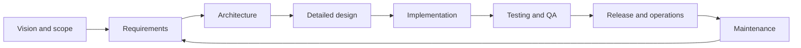
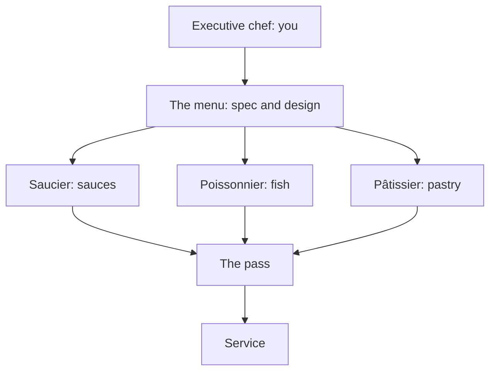

# SE and What AI Changes

> **Purpose (one line):** decide what to hand an agent and what to keep, and defend a twenty-minute judgment about an unfamiliar problem against the agent's version of it.

**Slides:** [SE and What AI Changes](../slides/se-and-ai.html) (the fast version) and [Fifteen Weeks to Demo Day](../slides/fifteen-weeks-to-demo-day.html) (the week-1 failure story).

## 1. Learning objectives

By the end of this module, a student can:

1. State what software engineering is responsible for beyond writing code, and name which of those responsibilities AI has and has not absorbed.
2. Give a standard definition of software engineering and say what the word *engineering* is doing in it.
3. Define a requirement, and separate a requirement from a wish by applying the verifiability test.
4. Place a given task on the delegation boundary and justify the placement using the reversibility test (if guessing it wrong would violate a requirement, it stays human).
5. Produce a Napkin for an unfamiliar one-paragraph brief in twenty minutes: shape, the hard part, the bottleneck, stack, three kill risks as mechanisms, and a feasibility verdict.
6. Distinguish automation bias from agenda capture, name the tell for each, and apply a recovery move.
7. Explain how a project fails completely with no defective code in it, and identify which decisions in that failure an agent cannot own.
8. State the three constraints that define project success and explain why failing to renegotiate them, rather than failing to build, is the common cause of missed delivery.

## 2. Where it fits

- **Prerequisites:** none. This is the course opener.
- **Leads into:** The AI-Augmented Team in week 2 (onboarding the agent as a teammate), then requirements as the contract in weeks 3-4, and architecture in week 6, where the Napkin's six questions get the slow, derived treatment.
- **How it's taught:** two lecture days in week 1, then revisited at every new topic all term. It owns the [Napkin drill](../studio.md#the-napkin-drill) you will run six times in studio.
- **Course outcome it delivers:** [sizing up an unfamiliar problem and defending that judgment against the agent's version](../syllabus.md#learning-outcomes) (outcome 10), and it opens [collaborating with AI across the lifecycle](../syllabus.md#learning-outcomes) (outcome 6).

## 3. Motivation

**You have been taught the pieces.** Three years of algorithms, data structures, databases, networks, operating systems, and enough LeetCode to get through a phone screen. Every one of those courses handed you a problem that was already specified, already scoped, already known to be solvable, and graded you on whether your code produced the right answer.

None of that is the job.

The job is a client who does not know what they want, six teammates who each heard something different in the same meeting, a deadline someone else committed to, a codebase you did not write, and a question nobody can answer from the code: *is this the right thing to build?* Software engineering is where the pieces meet, plus everything the pieces never taught you. This is the course where you find out whether you can do it.

**And you are worried about the job market.** You should be, a little, and you deserve a straight answer rather than reassurance. More tech jobs were cut in the first half of 2026 than in all of 2025, roughly half of those announcements named AI as a reason, and entry-level postings thinned more than any other kind. Meanwhile the models really are extraordinary at writing code. Both of those things are true, and neither means what the headlines say it means. §4 takes the question seriously and answers it.

The short version: the skills that just lost their value are the ones you can do in four minutes, and the skills that gained value are the ones that take four hours or four months. This course teaches the second kind.

**The failure this module is arranged against.** Not a spectacular one. The ordinary one, which is the one that will happen to you: six competent people, a real client, fifteen weeks, and nothing usable at the end. Nobody writes bad code. The requirements are a mood rather than a contract, so the agent fills the gaps silently and six people build six different products at speed. "Almost done" is never checked against anything, integration waits until week ten, and when time runs out the only thing left to spend is quality. [Fifteen Weeks to Demo Day](../slides/fifteen-weeks-to-demo-day.html) walks that failure end to end.

Every decision in that chain (what "done" means, which architecture survives contact with the other five, whether a generated feature was ever asked for) is a human responsibility. An agent given that specification will implement it, faster, with better test coverage, and just as wrongly.

## 4. Core concepts

### What software engineering is

The standard definition, from IEEE Standard 610.12:

> Software engineering is the application of a systematic, disciplined, quantifiable approach to the development, operation, and maintenance of software.

Ian Sommerville's is shorter and says the same thing: an engineering discipline concerned with all aspects of software production, from early system specification through to maintaining the system after it has gone into use.

Read those definitions for what they exclude. Neither one mentions writing code. "Development, operation, and maintenance" is the whole life of a system, and the typing is a slice of the first word.

**Why the word "engineering" is there at all.** It was coined on purpose, at a NATO conference in Garmisch in 1968, and the choice was deliberately provocative. Projects were failing at a rate nobody could explain: late, over budget, unreliable, and sometimes abandoned after years of work. The conference organizers picked the word to argue that building software should be held to the standards of an established engineering discipline rather than treated as a craft where results depend on who happens to be writing.

Fifty-eight years later that argument is still not settled, which is why this course exists. Civil engineers had the same fight and finished it. We are still having it, now with a new participant that can produce a bridge design in nine seconds.

The three commitments the word carries:

- **Systematic:** there is a process, and it does not depend on who is in the room.
- **Disciplined:** the process is followed when it is inconvenient, which is the only time it matters.
- **Quantifiable:** claims about the system are measured rather than asserted. "It is fast" is not an engineering statement. "The dashboard renders in under 400 milliseconds at the ninetieth percentile with 200 concurrent users" is.

### Programmer or software engineer?

Both are real jobs and one is not superior to the other. They are responsible for different things.

| | Programmer | Software engineer |
|---|---|---|
| **Given** | A specified problem | A dissatisfied client and a budget |
| **Produces** | Code that works | A system that solves the right problem and keeps solving it |
| **Time horizon** | This function, this sprint | The second year, the next maintainer, the handover |
| **Success is** | It runs and passes the tests | It is used, and it survives change |
| **Fails by** | Writing a bug | Building the wrong thing correctly |
| **Hardest part** | The algorithm | The conversation |

The last row is the one students disbelieve and then discover. The hardest part of your senior design project will not be a technical problem. It will be finding out what your client actually needs when they cannot tell you, and getting six people to agree on it.

### The software development life cycle

The life cycle is the sequence of activities a system goes through from idea to retirement. Different processes arrange it differently (waterfall runs it once, agile runs it every two weeks, and you will meet both), but the activities are the same:

Count the boxes. **Implementation is one of eight**, and it is the box you have been graded on for three years. It is also the box agents are strongest at.

Every other box is a meeting, a decision, or a document, and every one of them can sink a project on its own:

- **Vision and scope** decides what the system is for, and what it will deliberately not do. Get this wrong and everything downstream is wasted effort executed well.
- **Requirements** turns what the client said into something a team can build against and a tester can check.
- **Architecture** picks the structures that have to survive the second year, the ones that are expensive to reverse later.
- **Detailed design** works out how each part actually behaves before anyone commits to it in code.
- **Testing and QA** establishes whether behavior matches intent, which is a different question from whether the code runs.
- **Release and operations** is where software meets reality: deployment, monitoring, and the 3 a.m. page.
- **Maintenance** is most of the money. Software costs more to maintain than to build, and for a long-lived system maintenance can cost several times the original development.

The arrow from maintenance back to requirements is the point. It is a loop, not a line, and you will be standing in the loop for the next nine months.

### What a requirement is

The word gets used loosely all term, so pin it down now.

> A **requirement** is a statement of a capability the system must provide, or a constraint it must satisfy, that has been agreed with the people who can accept or reject the system, and that is specific enough that you can tell whether it has been met.

Three parts, and a statement missing any of them is not a requirement yet:

1. **A capability or a constraint.** What it must do, or the conditions it must do it under.
2. **Agreed.** Somebody with authority accepted it. A thing you inferred from a hallway conversation is a guess.
3. **Verifiable.** There is an observation that settles the question.

The verifiability test is the one that does the work. Apply it out loud: *what would I observe if this were satisfied, and what would I observe if it were not?* If you cannot answer both halves, you are holding a wish.

| A wish | A requirement |
|---|---|
| "The system should be user-friendly." | "A student who has never seen the system can submit a weekly activity report in under two minutes without asking for help, in a test with five students." |
| "It needs to be fast." | "A dashboard page returns in under 400 ms at the ninetieth percentile with 200 concurrent users." |
| "Instructors manage rubrics." | "Only a user with the instructor role can publish a rubric. Publication is irreversible and is recorded in the audit log with the actor and timestamp." |
| "Handle errors gracefully." | "If the peer-evaluation service is unreachable, the submission is queued locally and the student is shown a message naming the delay, and no submission is lost." |

Requirements are the entire subject of weeks 3 and 4, where you will write them for your own client and learn why the wrong-but-met contract is the most dangerous artifact in engineering. For now, one consequence matters: **a requirement is what an agent can be held to.** An agent asked to build a "user-friendly" anything will build something and it will be confident. An agent given the second column has a target it can hit and you have a basis to reject its work.

### What agents can actually do now

The honest version, and you should distrust anyone who gives you a version that is entirely optimistic or entirely dismissive.

!!! info "As of August 2026, and this section dates fastest"

    **The benchmark.** SWE-bench Verified hands a model a real issue from a real open-source repository, with the repository at the commit before the fix, and asks for a patch that passes the project's own test suite. It is not a puzzle; it is the actual job of a maintainer on a Tuesday.

    In 2023 the best scores were in the single digits. Today frontier models resolve the large majority of the set, and the top few are separated by about two points. The benchmark is close to saturated, which is why the field keeps building harder ones.

    **The capability is real.** These models will read an unfamiliar codebase, locate the defect, write the patch, write the test, and explain the change. Frontier systems come from several labs at once (Anthropic, OpenAI, Google) and the strongest open-weight models from Alibaba's Qwen and Moonshot's Kimi lines are close behind, which means this is not one company's trick and it is not going to be withdrawn.

Now the part that matters more, and that the benchmark headlines leave out.

**Agents fall off a cliff as tasks get longer.** METR measures agent capability in a unit that translates: how long would a human expert take on this task? On that scale, agents succeed on nearly every task a person would finish in under four minutes, and on under ten percent of tasks that would take a person more than four hours. Task length is the single strongest predictor of whether an agent will fail.

That finding is the shape of this entire course:

| Human-minutes | Agents | Examples |
|---|---|---|
| Under 4 minutes | Nearly always succeed | Write this function. Fix this stack trace. Rename this across the repo. Explain this file. |
| Hours to months | Rarely succeed alone | Decide what to build. Choose an architecture. Find out what the client meant. Keep a design coherent across six people and fifteen weeks. |

Nobody is paid a salary for four-minute tasks. A semester-long project for a real client is the second row, over and over, and so is every job you are about to apply for.

### The layoffs, and what actually caused them

You have read that software engineering is over. Here is what the evidence supports.

**Cause one, the hangover.** Companies hired through 2020 and 2021 as though pandemic demand were the new baseline. It was not. Marc Andreessen has estimated that large technology firms ended up overstaffed by somewhere between a quarter and three quarters. The 2023 layoffs were openly described as post-pandemic rightsizing. Much of what followed hits the same functions, and a company that doubled a division in 2021 and trimmed it in 2026 is correcting a five-year-old mistake.

**Cause two, AI is a convenient explanation.** "We are becoming more efficient with AI" is a better story for shareholders than "we hired badly." Sam Altman, who has every incentive to claim the opposite, has said that almost every company doing layoffs blames AI whether or not it is really about AI. Watch the timing: the share of announced cuts attributed to AI climbed far faster than the technology itself improved over the same months. When the explanation moves faster than the thing it explains, the explanation is doing other work.

**Cause three, expensive bets that lost.** Meta's Reality Labs lost about $13.7 billion in 2022 and about $16.1 billion in 2023 pursuing the metaverse. That money was a strategic decision made by executives, and when it had to be recovered it was recovered from headcount. No AI was involved. This happens constantly and it is worth understanding early: *you can lose your job because of a decision made three levels above you, in a meeting you were not in, about a product you never worked on.* Being technically excellent does not protect you from it. Being the person who understands what the business is trying to do gives you a better chance of seeing it coming.

**And the part that is genuinely about AI.** The entry-level rung really is thinner. The tasks a company used to hand a new graduate to build their judgment (small well-specified changes, test writing, boilerplate) are exactly the four-minute tasks agents now do for nothing. That is a real problem for your cohort, and it is not solved by refusing to use the tools.

It is solved by arriving already able to do the four-hour work: to scope a problem, run a client conversation, choose an architecture and defend it, review code you did not write, and direct agents rather than compete with them. That is a description of this course, and by December you will have done all of it on a real project for a real client.

### Kent Beck did the math

Kent Beck invented Extreme Programming and test-driven development, and has been writing software for about fifty years. This is what he wrote the day he first used a language model seriously, in April 2023:

> The value of 90% of my skills just dropped to $0. The leverage for the remaining 10% went up 1000x.

The line gets quoted as doom. Read the second half again. He is describing a thousandfold increase in the value of some of his skills, and the interesting question is which ones. He answered that later. The 10% is:

- Having a vision
- Breaking that vision into milestones
- Managing the design
- Controlling complexity

Compare that list against the METR table above. Beck named the four-hour column a year before anyone measured it, from the inside, by noticing which of his own skills the model could not do. Vision, milestones, design, and complexity control are not four-minute tasks, and they are four lines of this course's syllabus.

**This is the argument of the whole module.** AI did not make software engineering knowledge irrelevant. It collapsed the value of implementation-level skill and multiplied the value of the highest-level engineering skills, which are precisely the ones traditional courses treated as soft, unteachable, or something you would pick up on the job.

Two consequences worth stating plainly:

> You will not be replaced by AI. You will be replaced by someone who can use AI.

And the reason that sentence is not a threat: **AI is an amplifier**. It multiplies whatever judgment you bring to it. Bring a clear specification and a sense of what good looks like, and you get a great deal of good work quickly. Bring vagueness, and you get a great deal of confident, well-tested, wrong work just as quickly. An amplifier multiplies zero into zero, and it does it at speed.

### What the market pays for

That claim is testable against what companies actually hire for. Read a senior engineering posting at Amazon, Google, or any mid-size product company and count how much of it is about producing code. Very little. What recurs instead:

- Code review, coding standards, source control, build processes, testing, and operations, named as "the full software development life cycle"
- Taking a project from scoping requirements through launch
- Communicating with users, other technical teams, and senior management to collect requirements and describe designs
- Mentoring, and influencing engineering practice across a team
- Knowing when to use an existing technology and when to build a tailored one
- Disagreeing constructively

Every one of those is a life-cycle activity from the diagram above, and not one of them is typing. These postings were written before agents could code well, which is what makes them useful now: the industry was already paying a premium for the part that AI has not absorbed. The premium got larger.

**What is new in 2026 postings.** AI-assisted development has moved from a perk to a requirement. Postings now name the tools (Claude Code, Cursor, GitHub Copilot), ask for evidence that you have shipped real work with them rather than tried them, and increasingly ask for judgment about when *not* to use them. "Familiar with AI coding tools" is now the line "familiar with version control" was in 2010: nobody writes it because it is impressive, they write it because its absence is disqualifying.

You can satisfy that line honestly in December. A client MVP built by a team with an agent in the workflow, with your specific contribution visible in the git history and defensible in an interview, is the evidence.

### The team you will run

The kitchen brigade is Escoffier's invention, and it is the closest available model for how software teams are about to work.

The executive chef does not cook most of the food. The chef decides what the restaurant is for, writes the menu, sets the standard, and stands at **the pass**, the counter where every plate is inspected before it leaves the kitchen. Stations do the cooking. Nothing reaches a customer that the chef has not seen.

Map it onto the team you are about to be on. The menu is your specification and your design of record. The stations are agents, and there can be a lot of them working at once. The pass is code review, and you are standing at it. Service is the client demo in December.

Two things this metaphor gets right that "AI will write the code" gets wrong:

**The chef's authority comes from being able to taste.** A chef who cannot tell a good plate from a bad one is not a chef, no matter how good the brigade is. This is why the exams in this course are closed to agents, and why every assignment is graded on judgment rather than output. You cannot direct work you are unable to evaluate. You will simply approve whatever arrives, quickly, which is automation bias with extra steps.

**The pass is not optional and it does not scale by wishing.** If the brigade produces plates faster than the chef can taste them, the answer is not to stop tasting. That is the central operational problem of an AI-augmented team and week 2 takes it up directly.

The future team is a small number of engineers with excellent judgment directing a large amount of machine capacity. When you graduate, you are the chef.

### What "success" means, and how teams fail at it

Success on a software project is conventionally three constraints: **scope** (what must be built), **schedule** (when by), and **resources** (how much it costs, including how many people). They trade against each other, and the classic picture puts quality in the middle:

<svg viewBox="0 0 640 400" role="img" aria-label="The iron triangle: scope at the apex, resources and schedule at the base, quality in the middle" style="width:100%;max-width:520px">
<text x="320" y="34" text-anchor="middle" fill="var(--md-default-fg-color)" style="font:700 22px sans-serif">Scope</text>
<text x="320" y="57" text-anchor="middle" fill="var(--md-default-fg-color--light)" style="font:400 15px sans-serif">features, functionality</text>
<polygon points="320,84 550,330 90,330" fill="none" stroke="var(--md-primary-fg-color)" stroke-width="3" stroke-linejoin="round"/>
<text x="320" y="258" text-anchor="middle" fill="var(--iron-quality)" style="font:700 26px sans-serif">Quality</text>
<text x="90" y="360" text-anchor="middle" fill="var(--md-default-fg-color)" style="font:700 22px sans-serif">Resources</text>
<text x="90" y="382" text-anchor="middle" fill="var(--md-default-fg-color--light)" style="font:400 15px sans-serif">cost, budget</text>
<text x="550" y="360" text-anchor="middle" fill="var(--md-default-fg-color)" style="font:700 22px sans-serif">Schedule</text>
<text x="550" y="382" text-anchor="middle" fill="var(--md-default-fg-color--light)" style="font:400 15px sans-serif">time</text>
</svg>

Quality sits inside because it is not a fourth dial you get to set. Fix all three corners and you have fixed quality too, as the residue. It is the only thing left to spend, so it is what gets spent, silently, by tired people at 2 a.m. in week fourteen.

Each corner is one of three things on a given project, and naming which is the first useful act of project management:

- A **constraint**: fixed, and you must work inside it.
- A **driver**: a success objective with little room to move.
- A **degree of freedom**: something you can actually adjust to protect the other two.

A project where all three corners are constraints has no degrees of freedom and is already failing; it just does not know yet. When your client asks for the demo a month earlier, the honest responses are all trades: defer requirements to a later release, shorten the test cycle, or add people (which is slower before it is faster). "Yes" without a trade is a promise to spend quality.

**There is no agreed definition of success**, which is worth knowing before your first client meeting. A 2013 survey by Scott Ambler asked practitioners what makes a project successful: 58% said on schedule, 36% said on budget, and only 14% said built to specification. Just 8% named all three together. Your client, your teammates, and your instructor may each be using a different one of these definitions without realizing it. Ask early which corner your client actually cares about, because they will not volunteer it and they will grade you on it.

The interesting part is the failure mode. Projects rarely fail because a team could not build the thing. They fail because the three constraints were set unrealistically at the start and **the team never renegotiated them**, so it tried to deliver under constraints that stopped being achievable in week three. Nobody wanted to be the one to say so. The MVP demo shrinks quietly instead, and the client finds out in December.

This is why the course has four checkpoints and a scoped MVP rather than one deadline. A checkpoint is a scheduled opportunity to renegotiate while renegotiating is still cheap. Use them for that, not just to report that things are fine.

### What actually changed

Three things, and they pull in different directions.

**Transformation got cheap.** The cost of turning an approved design into code fell by an order of magnitude. Anything whose difficulty was mostly typing is now nearly free.

**The cost of being wrong went up.** When code took a week, a bad requirement was caught by the friction of building it. When code takes a minute, the wrong thing gets built completely, tested, and merged before anyone notices the premise was wrong. Speed removes the accidental checkpoints that slow work used to provide.

**The economics of rigor inverted.** Teams skipped living traceability, current design documents, and consistent glossaries because the *upkeep* cost human hours, not because the practices lacked value. That cost has collapsed. So the question is no longer "is this rigor worth the effort?" but "now that upkeep is cheap, which discarded rigor is worth reinstating?" This is the reasoning behind several choices later in the course that would have looked like bureaucratic overhead in 2019.

The guardrail: cheap generation is not cheap trust. A practice is worth reinstating when it has value, was skipped for labor reasons, and a check can keep it honest. Practices failing that last test are reinstated only behind human sign-off, and that is exactly where judgment gets taught.

### The delegation boundary

The recurring question of this course, asked fresh at every topic: **what do we hand the agent here, and what stays human?**

| Stays human | Goes to the agent |
|---|---|
| Requirements quality, scope, vocabulary | Use case to design-of-record |
| Business constraints, domain knowledge | Approved design to code and tests |
| Quality attributes, and what "good enough" means | Cross-document consistency checks |
| Architectural decisions that are hard to reverse | Mechanical artifact transformations |
| "Is this even a good idea?" | Drafting, refactoring, explaining unfamiliar code |

The test: **if guessing it wrong would violate a requirement, the human pins it. Otherwise the agent derives it.** Both extremes are wrong answers. "Delegate everything" produces a fast, well-tested implementation of a question nobody answered; "keep everything human" throws away the one advance that makes the rigor affordable.

Notice that the left column is Beck's 10% and the four-hour column, written out as tasks. That is not a coincidence. It is the same boundary described three ways, and if you only remember one of the three, remember whichever one you find easiest to apply under pressure.

### The Napkin: six prompts

Given an unfamiliar problem, produce a defensible rough judgment in twenty minutes. This is the delegation boundary at project scale: an agent will produce a fluent plan, stack, and risk list for any prompt in seconds, so the human differentiator is judging whether it is any good.

1. **Shape.** What kind of system is this really (CRUD app, pipeline, real-time, integration glue, ML)? One sentence, then three to five boxes.
2. **The hard part.** The one thing that makes this not a weekend project. Every project has one that dominates, and naming it is most of the skill.
3. **Bottleneck.** Where it breaks first: under load, under scale, or under a five-person team.
4. **Stack.** What you would build it with, one sentence of why. Boring default unless there is a reason.
5. **Kill risks.** Top three, each stated as a mechanism, not a category.
6. **Verdict.** Feasible for this team in this time, yes or no, and what you would cut first.

A seventh prompt, **Delegate** (what goes to the agent, what stays human), is held in reserve until the first six run smoothly.

**The sequence is fixed:** individual silently (about 5 minutes), team reconcile (about 10), then the agent's napkin, then diff (about 5). Students who prompt first anchor on the agent's answer and learn nothing. The diff step is where the learning happens; protect it when time runs short.

**What scores.** Credit goes to naming a mechanism over naming a category. "Scope creep, integration issues, communication problems" is risk bingo and scores nothing. "The client's system exports CSV nightly, so nothing is real-time and the dashboard requirement is dead on arrival" is the target.

**Honest framing for students.** One semester does not manufacture ten years of pattern library. What the drill offers is the frame, six calibrated rounds with fast feedback, and the habit of noticing when your own estimate was wrong.

### Agenda capture: losing control of the conversation

**The failure.** After several turns of dialogue the engineer is no longer directing the work. They are answering the agent's questions, following its reasoning, and building things that do not matter yet. Plain-language version: you lost the wheel.

**Distinguish it from automation bias.** Automation bias is trusting output that is wrong. Agenda capture is competent output on the wrong problem. There is no error signal anywhere, which is why it is hard to catch: every individual step looks fine, and the cost only shows up at the end, when the thing you sat down to do is not done.

**Why it happens.**

1. *The agent always has a next move.* It never stalls or says "I do not know what matters here, you decide." Every turn ends in a proposal, and a proposal is a default. The human's role degrades from choosing the work to approving it, and approving is cheap.
2. *Whoever asks the questions owns the frame.* Answering clarifying questions feels productive and each answer is locally reasonable, but the set of questions defines the problem, and the human did not write it. Novices are the most exposed: an expert has a prior about what matters and resists the pull, a student has none, so the agent's agenda becomes theirs by default.
3. *The agent goes depth-first; seniority is breadth-first.* Survey, size, prune, then dig. The model picks a thread and pulls, because it holds no cost model, no deadline, and no stake. "Interesting" and "important right now" are indistinguishable to it.
4. *Accumulated context is a commitment device.* Fifteen turns in, abandoning the thread feels wasteful even when abandoning is correct. The sunk cost is real and it is inside the session.

**Not unique to AI, but worse with it.** A dominant pair-programming partner does the same. What is new: no fatigue, no social friction to signal a redirect, and an inexhaustible supply of plausible next steps. There is no natural stopping point, so the human has to supply one.

**What the human has to bring.** Two things, and the second is the trainable one. First, a clear and strongly held motivation for what this session is for. Second, the capability to steer: to notice drift, to stop, and to change the subject. Without the first there is nothing to steer toward, and the rabbit hole is not really the agent's doing.

**The tell, and the moves.**

- *Tell:* watch the ratio of questions you ask to questions you answer. When it inverts, you have lost the wheel.
- *Move 1:* answer the agent's question only if the answer changes what you would do next. Otherwise say so and return to the goal.
- *Move 2:* kill the session rather than redirect it. The context that captured you is the same context you would be arguing against.
- *Move 3:* write the goal down before opening the chat, so drift is checkable rather than a feeling.

**The Napkin is the pre-commitment device.** A napkin written before the session gives an external thing to check the conversation against ("does this thread touch the hard part or the bottleneck I named?"). The drill therefore has two uses: sizing an unfamiliar problem, and making agenda capture visible in a familiar one. The second is probably the more frequent use in practice.

## 5. The AI-native lens

- **Delegate to AI:** producing a first napkin for comparison, summarizing an unfamiliar domain, enumerating candidate risks, drafting the boring parts of any artifact.
- **Keep human:** which risks actually matter for *this* client, whether the problem is worth solving, the feasibility verdict, and what to cut first. These require a stake in the outcome, which the model does not have.
- **Context to supply:** the client's real constraints (budget, incumbent systems, deadline, who will operate it), the team's actual skills, and the definition of done. An agent asked to plan a project will invent all three plausibly and silently.
- **How to verify:** diff its napkin against yours and interrogate the differences in both directions. Where it named something you missed, ask whether the mechanism is real. Where you named something it missed, ask why it did not: usually because you hold context that never made it into the prompt, which is the context-engineering lesson arriving early.

## 5.5. Risks and mitigations

| Risk (classic + AI-introduced) | Human judgment that catches it | Mitigation |
|---|---|---|
| Building the wrong thing correctly. AI amplifies it: the wrong thing now gets built completely and tested before anyone questions the premise. | Asking what problem this solves for whom, before asking how to build it. | The Napkin before the session; the specification before `/implement`; the approval gate. |
| Risk bingo. Naming risk categories that apply to every project and therefore inform no decision. | Can I state the mechanism, and would a reader who knows this domain agree it is the top-three concern? | Rubric credits mechanisms over categories; briefs are specific enough that generic answers are visibly wrong. |
| Skill atrophy. Delegating the parts that build judgment, not just the parts that cost time. | Noticing you cannot evaluate the output you just accepted. | Individual Pulse assignments graded on judgment; exams without an agent; the diff step run before prompting, never after. |
| Approving faster than you can evaluate. The brigade outruns the pass, and review becomes a rubber stamp with a green check on it. | Can I explain why this change is correct without rereading it? | Small reviewable changes; the explanation test in the [academic integrity policy](../syllabus.md#academic-integrity); pull requests that argue for the change rather than describe it. |

## 6. Hands-on (studio + individual assignment)

**Studio (team, own project)**

- **Goal:** every student has a running Project Pulse and has completed one AI-assisted task on real code.
- **In studio (own project):** week 1 is guided onboarding, not own-project work, because teams are still being assigned. Environment setup, run Project Pulse once, first AI-assisted task with a TA watching.
- **Deliverable and assessment:** Pulse running locally, shown to a TA. Ungraded; it gates the week 2 work.

**Individual assignment (Project Pulse)**: Hello, Project Pulse

- **Task (AI-workflow-framed):** set up and run Pulse, explore it with the agent, open a well-formed issue for a real smell you found, and submit a small pull request.
- **Deliverable and assessment (per student):** the issue and the pull request. Graded on whether the issue names a real problem precisely enough to act on, and whether the pull request explains why the change is right. Not on size.

## 7. Summary / key takeaways

- Software engineering is the systematic, disciplined, quantifiable approach to the whole life of a system. Implementation is one of eight life-cycle activities, and it is the one agents are best at.
- A requirement is a capability or constraint, agreed with someone who can accept the system, and specific enough to verify. Anything failing the verifiability test is a wish, and an agent handed a wish will build something confident and wrong.
- Agents succeed on nearly all four-minute tasks and under ten percent of four-hour ones. Kent Beck named the same boundary from the inside: implementation skill lost its value, and vision, milestones, design, and complexity control gained a thousandfold.
- The layoffs are mostly a pandemic over-hiring correction, partly a convenient story, and partly somebody else's failed strategic bet. The genuinely AI-driven part is the thinning of entry-level work, and the response is to arrive able to do the four-hour work.
- You will not be replaced by AI, you will be replaced by someone who can use AI. AI is an amplifier, and an amplifier multiplies zero into zero.
- Scope, schedule, and resources trade against each other, and quality is what gets spent when a team will not renegotiate them. Checkpoints exist to make that renegotiation cheap and scheduled.
- The delegation test: if guessing it wrong would violate a requirement, it stays human.
- Automation bias is wrong output you trusted; agenda capture is right output on the wrong problem. The second has no error signal, so you need an external checkpoint.
- A project fails completely with no defective line of code in it, when the specification was a mood and nobody was at the wheel. That is the failure mode this whole course is arranged against.

## 8. Key papers and further reading

- Peter Naur and Brian Randell, eds., *Software Engineering: Report on a Conference Sponsored by the NATO Science Committee* (Garmisch, 1968). Where the term was coined, and still a startling read: the problems they name are the problems you will have this semester.
- Fred Brooks, "No Silver Bullet: Essence and Accidents of Software Engineering" (1987). The essence/accident distinction is the sharpest available tool for asking what AI actually removed.
- Kent Beck, "90% of My Skills Are Now Worth $0" (2023), and the follow-up "More What, Less How." The argument of §4 in the words of the person who noticed it first.
- METR, "Measuring AI Ability to Complete Long Tasks" (2025 onward). The time-horizon methodology behind the four-minute and four-hour numbers. Read the methodology section, not just the graph.
- Ian Sommerville, *Software Engineering*, chapter 1. The standard textbook framing of the life cycle.
- Nancy Leveson, *Engineering a Safer World* (2011), chapters 1-2. Why failures are control-structure failures rather than component failures, which is this module's thesis in a different vocabulary.
- CMU 17-313, *Foundations of Software Engineering*: the introductory lecture.

## 9. Self-check

1. Name three responsibilities of software engineering that an agent cannot discharge, and say why for each.
2. Give the IEEE definition of software engineering and explain what work each of the three adjectives is doing.
3. Rewrite each of these as a requirement that passes the verifiability test: "the app should be secure"; "reports should load quickly"; "students shouldn't be able to cheat on peer evaluations."
4. A teammate says "the agent wrote it, so the bug is not mine." What is wrong with that claim, precisely?
5. Your client asks for the December demo two weeks earlier. Name the three trades available to you, and say which corner of the triangle each one spends.
6. You are twelve turns into a session and have written a lot of working code. What two checks tell you whether you are still working on what you sat down to do?
7. Rewrite this kill risk as a mechanism: "there is a risk of integration problems with the client's system."
8. A feature appears in your demo that the client never asked for, and nobody on the team remembers deciding to build it. Where in the chain from business need to shipped code should that have been caught, and what artifact would have caught it?
9. Someone tells you that AI has made software engineering courses obsolete. Using the METR time-horizon result, give the strongest one-paragraph rebuttal you can, and then give the strongest counter-argument against yourself.

## Related

- [Requirements Traceability](traceability.md): how a requirement stays connected to the code that implements it and the test that proves it.
- [Schedule](../schedule.md): when this module is taught, and what follows it.
- [Friday Studio](../studio.md): the Napkin drill as you will actually run it.
- [Working with AI](../ai.md): the delegation boundary and these two failure modes, stated as course policy.
- [Senior Design Project](../project.md): the client project all of this is in service of.
