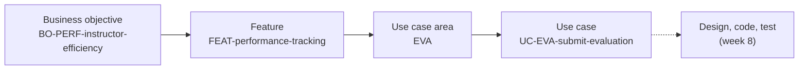
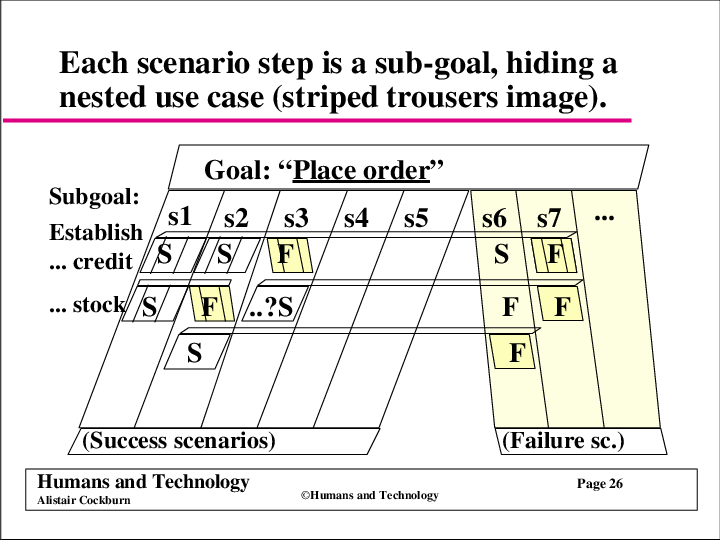

# Requirements as the Contract

**Slides:** week 3, [Requirements as the Contract](../slides/spec-driven-requirements.html); week 4, [Writing the Specification](../slides/writing-the-specification.html) (the fast versions).

> **Purpose (one line):** find out what your client actually needs, and write it down so that your team and your agent both build the same thing.

!!! note "This module is still being written"
    Written so far: elicitation, business objectives and success metrics, the glossary, identifiers, scope, features and the first trace, and use cases. Business rules, quality attributes, and the specification arrive before Wednesday's lecture in week 4.

## 1. Learning objectives

By the end of week 3, a student can:

1. Run a first client meeting that produces business objectives, success metrics, and a scope line instead of a wish list.
2. Distinguish what a client says from what a client will commit to, and use a question that tells them apart.
3. Write a business objective and a success metric that someone else could verify a year later.
4. Build a project glossary that binds one word to one concept, and explain what breaks in a codebase without one.
5. Assign name-based identifiers to requirement items, and explain why numbered identifiers fail under an agent.

By the end of week 4, a student can:

1. Pitch a use case at the user goal level, and defend the level with the boss, elementary business process, and size tests.
2. Explain why a team plans with user stories but has its agent build against use cases.
3. Write a main success scenario a tester could test without asking a question, and find its extensions step by step.
4. Review a use case against the course style guide, then compare that review with an agent's.

## 2. Where it fits

- **Prerequisites:** [The AI-Augmented Team](ai-augmented-team.md), whose thesis is that the repository is the team's shared memory and the only memory the agent has. Requirements are the first thing you put in it.
- **Leads into:** [Traceability](traceability.md). Every traceable node in this course is born here: if there is no specification, there is nothing to trace.
- **How it's taught:** two weeks. Week 3 has a single lecture day, Wednesday, on eliciting from a real client, and its studio drafts your glossary and vision and scope. Week 4 has two: Monday on use cases, Wednesday on business rules, quality attributes, and the specification. Its studio writes your use case list and your first full use cases. You keep every one of these documents alive all term.
- **Course outcome it delivers:** [turning a client's problem into a specification that serves as the development contract](../syllabus.md#learning-outcomes) (outcome 1).

## 3. Motivation

**The problem, on Project Pulse.** Project Pulse began as a complaint: submitting weekly activity reports through shared spreadsheets and peer evaluations through uploaded Excel files was slow and error-prone. That complaint is a paragraph. What it became is [`docs/requirements/`](https://github.com/Washingtonwei/project-pulse/tree/main/docs/requirements): about 66,000 words across a vision and scope, a glossary, use cases, business rules, and a specification. The use cases alone run to 43,700. Nothing in that folder is decoration. It is what makes the difference between a team that builds the thing and a team that builds a thing.

You are holding a one-page brief. Your client is holding the rest, mostly without knowing they are holding it.

**A real failure it prevents.** On 29 October 2018 and 10 March 2019, two Boeing 737 MAX aircraft crashed, killing 346 people. The Maneuvering Characteristics Augmentation System read a single angle-of-attack sensor and pushed the nose down. **The software did what the requirements said.** The requirements were wrong: the hazard analysis understated the failure mode, the single-sensor dependency survived review, and pilots were not told the system existed.

Strip away the airplane and every link in that chain is an artifact this module owns.

| The failure | The artifact that should have caught it |
|---|---|
| The requirement was wrong | Vision and scope; the use case's failure paths |
| Hazard analysis understated the failure mode | Quality attributes, risk analysis |
| Single-sensor dependency survived review | Architecturally significant requirement; design review |
| Pilots were not told the system existed | Scope: is the operator inside the system boundary? |
| It shipped meeting its specification | Verification against validation |

A system can pass every test and still be the wrong system. Verification asks whether you built the thing right; validation asks whether you built the right thing. MCAS passed the first and failed the second.

Here is why that matters more now, not less. **An agent asked to implement MCAS from that specification would have implemented it faster, with better test coverage, and just as fatally.** Cheap generation does not touch a wrong requirement. It ships it sooner.

## 4. Core concepts

### 4.1 A brief is not a set of requirements

Gerhard, a senior manager at Contoso Pharmaceuticals, is meeting Cynthia, who manages the IT department. This conversation is read out loud in class, and it is worth reading again slowly.

> **Gerhard:** "We need to build a chemical tracking information system. The system should keep track of all the chemical containers we already have in the stockroom and in laboratories. That way, the chemists can get some chemicals from someone down the hall instead of always buying a new container. This should save us a lot of money. Also, the Health and Safety Department needs to generate government reports on chemical usage and disposal with a lot less work than it takes them today. Can you build this system in time for the compliance audit in five months?"
>
> **Cynthia:** "I see why this project is important, Gerhard. But before I can commit to a schedule, we'll need to understand the requirements for the chemical tracking system."
>
> Gerhard was confused. **"What do you mean? I just told you my requirements."**
>
> **Cynthia:** "Actually, you described some general business objectives for the project. That doesn't give me enough information to know what software to build or how long it might take. I'd like to have one of our business analysts work with some users to understand their needs for the system."
>
> Gerhard protested. **"The chemists are busy people. They don't have time to nail down every detail before you can start programming. Can't your people figure out what to build?"**
>
> **Cynthia:** "If we just make our best guess at what the users need to do with the system, we can't do a good job. We're software developers, not chemists. I've learned that if we don't take the time to understand the problem, nobody is happy with the results."
>
> Gerhard insisted. **"We don't have time for all that. I gave you my requirements. Now just build the system, please. Keep me posted on your progress."**
>
> Karl Wiegers and Joy Beatty, *Software Requirements*, 3rd edition, chapter 1.

Read Gerhard generously, because the scene collapses if you do not. He is not a fool and he is not a villain. He knows the business, the audit date is real, and every sentence he says is reasonable from where he is sitting. He also genuinely believes he gave her his requirements.

He did not. He described **business objectives**, which is a different thing and a valuable one. What nobody in that room yet knows: who is allowed to request a hazardous chemical, what happens when a container is half empty, whether "the stockroom" is one place or six, what the safety office's report has to contain, and which of those the system is responsible for.

Three things in the scene are worth naming, because you will meet all three this week.

**"Can't your people figure out what to build?"** You will hear a politer version of this on Thursday: *just do what you think is best*, or *you are the technical people*. It is an invitation to guess, and it always arrives sounding like trust.

**"We're software developers, not chemists."** Cynthia can say this out loud. An agent handed the same gap cannot. Ask it to build a chemical tracking system from Gerhard's paragraph and it produces something complete, confident, and plausible, with nothing in the output marking which parts came from him and which it invented. She declines to guess; it has no mechanism for declining.

**Gerhard wins the argument.** He is senior, he is paying, and he ends the conversation. Cynthia is right and still has to go and do the work without his blessing. That is the ordinary case, and it is why the rest of this module is about how to run the meeting rather than how to win it. Your leverage is not authority. It is a read-back your client cannot help correcting.

Your client is Gerhard. This is not a criticism of your client. Knowing the business and knowing what software to build are two different kinds of expertise, and only one of them is in the room already.

### 4.2 What "the requirements" actually means

So what did Cynthia want that Gerhard had not given her? The definition is deliberately broad:

> Requirements are defined during the early stages of a system development as a specification of what should be implemented. They are descriptions of how the system should **behave**, or of a system **property** or **attribute**. They may be a **constraint** on the development process of the system.
>
> Sommerville and Sawyer, *Requirements Engineering: A Good Practice Guide* (1997)

Read the three nouns. **Behavior** is what the system does, and it is the only one most teams write down. A **property or attribute** is what the system must *be*, and what its data has to look like: fast, available, auditable, five digits then an optional hyphen. A **constraint on the development process** is not about the running system at all. It restricts how you are permitted to build it.

That breadth is the point. **"The requirements" is not one kind of statement. It is an umbrella over several kinds of information that only mean something together**, which is why §4.9 lists nine of them and why they end up in four different documents. A team that hears only the first noun ships a feature list. Project Pulse's specification carries `CO-ferpa` (comply with FERPA when storing and transmitting student educational records) and `CO-server-side-llm-proxy` (every call to the language model routes through the server, so credentials never reach the browser). Neither is a behavior anyone would demo, and either one discovered in November is a rewrite.

Week 1 gave you the test for whether one sentence qualifies: [a capability or a constraint, agreed with the people who can accept the system, and specific enough to verify](se-and-ai.md#what-a-requirement-is). This definition tells you what that sentence is allowed to be *about*. You need both.

**Why write any of it down.** Three reasons, and they are not the same reason:

- **Understand** precisely what the software has to do. Being told is not the same act as understanding.
- **Communicate** that understanding precisely to everyone who builds, tests, or accepts it. On your team that is five other people, three of whom were not in the meeting, and an agent that was in no meeting at all.
- **Control** production, so that what ships matches the specification, including after the specification changes. It will change.

The third is the one teams skip, and it is what makes the word *contract* in this module's title honest. A requirement nobody can hold you to is not a contract, and neither is one you can quietly edit in December to match what you happened to build.

### 4.3 The first client meeting

You get an hour and roughly one first impression. Three roles, agreed before you walk in:

| Role | Does |
|---|---|
| **Lead** | Asks the questions and keeps the agenda moving. One person, not four. |
| **Scribe** | Writes. Does not ask. Captures the client's exact words, especially the nouns. |
| **Observer** | Watches for what is not said: hesitation, the topic the client keeps returning to, the person they defer to. |

Ask to record, and say why: so nobody is transcribing instead of listening. If the client declines, that is fine, and the scribe now matters more.

**Shape of the hour.** Ten minutes on the business, why this problem and why now. Thirty on the process as it works today, walked step by step. Ten on scope, what is in and what is out. Ten to read back what you heard.

**The read-back is the highest-value ten minutes and the part teams skip.** Say what you understood in your own words, and watch for the correction. A client who is nodding may be being polite; a client correcting you is engaged, and the correction is usually the single most useful sentence of the meeting. The vision statement table in [`vision-and-scope.md`](https://github.com/tcu-cosc-40943/course-templates/blob/main/requirements/vision-and-scope.md) is built for this: fill it in during the meeting, read the six rows aloud, and see what they fix. Ninety seconds.

**Within 24 hours**, send written notes and the open questions. This creates the record, and it gives the client a second chance to correct you while the meeting is fresh.

The questions themselves are not in this module. They are in [`client-interview-guide.md`](https://github.com/tcu-cosc-40943/course-templates/blob/main/requirements/client-interview-guide.md): fifteen sections of question with examples written for a different domain so you have to rewrite them in your client's vocabulary, a minute budget on each, and space under each one for what they said. It is your script going in and your meeting record coming out, and it is the file you customize with your agent in class on Wednesday. This module owns the technique; the guide owns the questions.

Its first rule is worth repeating here, because it is the mistake this room is most likely to make: **listen before you build.** Describing what you would build in the first twenty minutes ends the elicitation, because a client who has heard your idea starts reacting to it instead of describing their world. This is about order rather than silence. Some clients want to think out loud with you, and that is worth doing, after the read-back, once you can describe their current process back to them accurately. What is absolute is the other rule: **commit to nothing**, because five teammates are not in the room. "Let me write that down and bring it back to the team" is the whole sentence.

### 4.4 What people say versus what they take

Sony ran a focus group on a yellow sport Walkman. The room loved it: sporty, fresh, so much better than another black one. On the way out, participants were told to help themselves to a free Walkman, from two tables, black on one and yellow on the other. Everyone took a black one.

What people say in an interview is data about the interview. Asking "would you use this?" reliably produces yes, because agreeing is free and the person asking clearly wants it. The fix is not a better-worded question. It is a question whose answer costs the client something.

| Instead of | Ask |
|---|---|
| Would you use a dashboard? | Walk me through the last time you needed that number. What did you actually do? |
| Is this important? | If we can ship only one of these in December, which one? |
| Would this save time? | How long does it take today, and how do you know? |
| Do you like this? | Show me the spreadsheet you use now. |

Past behavior over hypothetical preference; a forced choice over a wish list; an artifact over a description. **"Show me" is the two most productive words in requirements engineering, and they cost nothing.** People describe the process they believe they follow; the spreadsheet shows the one they actually follow, and the difference is where the requirements are hiding.

Two more that pay for themselves:

**Ask why until you reach the need.** Much of what a client calls a requirement is a solution they have already picked. "I need a drop-down of states" is a solution; the need underneath might be that addresses have to validate against a shipping zone. Ask why three times and you usually get there. Then you are free to solve it a better way, which you were not before.

**Listen for the rule.** When a client says only certain people may do something under certain conditions, that is a business rule, and it usually comes with the word "must", "unless", or "only". Those sentences are gold, and they arrive unannounced in the middle of a story about something else.

### 4.5 Business objectives and success metrics

A **business objective** says what should improve, in numbers: "reduce the instructor's time to grade peer evaluations by 50%". Not "make grading better", which nobody can ever be wrong about.

Objectives come in two flavors, and the shapes are worth having in front of you while you write your own. Fill in the letters.

| Financial | Nonfinancial |
|---|---|
| Capture a market share of X% within Y months. | Achieve a customer satisfaction measure of at least X within Y months of release. |
| Increase market share in country W from X% to Y% within Z months. | Increase transaction-processing productivity by X% and reduce the data error rate to no more than Y%. |
| Reach a sales volume of X units or revenue of $Y within Z months. | Develop an extensible platform for a family of related products. |
| Achieve X% return on investment within Y months. | Develop specific core technology competencies. |
| Achieve positive cash flow on this product within Y months. | Be rated the top product for reliability in published reviews by a specified date. |
| Save $X per year currently spent on a high-maintenance legacy system. | Comply with specific federal and state regulations. |
| Reduce monthly support costs from $X to $Y within Z months. | Receive no more than X service calls and Y warranty calls per unit within Z months of shipping. |
| Increase gross margin on existing business from X% to Y% within one year. | Reduce turnaround time to X hours on Y% of support calls. |

Nearly every objective a senior design client has lives in the right-hand column. Your client is not selling the software you are building, so market share and revenue are rarely the point. Time, error rate, participation, compliance, and satisfaction are. A team that comes back with a financial objective has usually invented it.

Platitudes are the failure mode. "Become recognized as a world-class provider" and "provide a more rewarding customer experience" are not objectives, because no measurement could ever contradict them.

A **success metric** tells you whether you are on track to get there, and can be measured much sooner. That gap is why they are separate things. An objective may not be measurable until long after your semester ends, and may depend on work beyond your project, but you still need to know in October whether you are pointed the right way. Sometimes the two are the same sentence, when the objective happens to be measurable early.

Every metric needs a **baseline**, and the question that produces it is the one students forget: not "how will you know this worked?" but the follow-up, **"what is that number today?"** If the client cannot say, you have found something worth writing down. A metric with no baseline cannot be met or missed.

Choose metrics that measure what matters rather than what is easy. "Reduce product development costs by 20 percent" is easy to measure and easy to hit by laying people off. Prefer the metric that gets **worse** if you build the wrong thing.

### 4.6 The glossary: one word, one concept

Write it from the first meeting, because your client hands you the vocabulary whether you ask or not.

The entries worth having are not the words your teammates already know. They are the words two stakeholders use differently. In airline statistics, one international body says **city-pair** and the other says **O and D** for the same thing, and the same two bodies say **traffic by flight stage** and **segment traffic** for another. A team that misses this ships a report that silently mixes them. Also worth entries: words that sound generic but are not ("active", "complete", "week"), your client's acronyms, and any term you invented that the client does not use.

If two words mean the same thing and nothing in the repository says so, your team will use both, and so will your agent. You get a `Team` class and a `Group` table, a `submitReport` endpoint and a `war_entry` row, and each of those pairs is a defect waiting for the day you join them. The agent cannot fix this by itself: asked to add a feature, it reads what is already there and imitates it, faithfully reproducing an inconsistency, and it will invent a plausible synonym for anything the repository never names.

The half that stays human is noticing. When your client says "cycle" in one sentence and "sprint" in the next, ask which they mean, in the room, while they are in front of you. An agent reading the transcript afterward cannot ask.

### 4.7 Identifiers: slugs, not numbers

Requirement items carry identifiers so that a design document, a test, a commit, and an issue can all point at the same thing. This course uses **name-based slugs**: `BO-grading-time`, `SM-submission-rate`, `RI-cloud-cost`, `AS-client-maintains-stack`, `FEAT-performance-tracking`.

Project Pulse did not always. An earlier version of its vision and scope numbered them `BO-1` through `BO-3` and `RI-1` through `RI-4`, and one of those four is missing its colon, which nobody noticed for years, because nothing ever read them.

Numbers fail in a specific way, and an agent makes it worse. Ask an agent to insert a new objective into a list running `BO-1` to `BO-6` and it has two options: renumber everything, silently breaking every citation in your use cases and specification, or append out of order so the numbering means nothing. No test you can write catches either one. A slug has neither failure mode, and it carries the gist at the place it is cited, so `BO-grading-time` tells a reader what it is and `BO-3` does not.

Rules: coin the slug from the concept, keep it short and unique within its space, **never rename or repoint one**, and cite by identifier rather than by position ("the third objective").

Numbers are not banned everywhere. `OPEN-ISSUES.md` uses `OI-1` upward, because that list only ever grows at the bottom and is cited lightly. The convention is not "slugs everywhere"; it is slugs wherever items get reordered or cited often.

### 4.8 Scope, and the line you will need in October

A business analyst is reviewing a specification when the marketing manager asks to add a "like this product" button. It sounds small. His argument is the one you will hear: the developers are going to be in the code anyway, so how hard is one tiny feature? Her analysis says it does not serve the objective the project exists for, and is not simple to build. The hard part is not the analysis. It is that the manager does not have the business objectives in mind and she has to be able to say why, out loud, without sounding obstructive.

That is what the scope section is for. It is not paperwork. It is the sentence you will need in October when your client, who likes you and is enthusiastic, suggests something genuinely good that will cost you the semester.

Write down what is **out** as explicitly as what is in, and ask the forcing question in the first meeting: *if we deliver only one of these in December, which one?* A client who cannot choose has not thought about it yet, and you need to know that now rather than in November.

### 4.9 The nine kinds of requirement

Everything a client says in a meeting is one of these. Sorting them as you hear them is most of the skill, and the right-hand column is what to listen for.

| Kind | What it is | Written down in | Sounds like |
|---|---|---|---|
| Business requirement | Why the organization is paying for this | Vision and scope | "We need to cut the time we spend on..." |
| User requirement | A goal a user must be able to accomplish | Use cases, user stories | "I need to print a mailing label." |
| Business rule | A policy, regulation, law, or formula that exists outside your software | Business rules catalog | "Must comply with...", "only managers may..." |
| Functional requirement | Observable behavior the system exhibits | Specification | "When X happens, the system shall Y." |
| Quality attribute | How well it does it | Specification | "fast", "easy", "secure", "reliable" |
| External interface | Where your system meets another one | Vision and scope, specification | "Must send messages to...", "must read files in..." |
| Constraint | A restriction on how you may build it | Specification | "Must be written in...", "cannot exceed..." |
| Data requirement | The structure, format, or values of the data | Specification | "An order consists of..." |
| Solution idea | A design the client has already chosen, wearing a requirement's clothes | Nowhere, until you find the need under it | "Then I select the state from a drop-down." |

The last row is the one to watch. Solution ideas arrive constantly and sound like requirements, and taking them at face value locks in a design chosen by someone who is not a software engineer.

**The full version is in [Requirement Types](../requirement-types.md)**: each kind with its definition, where it comes from, what it sounds like, and **one worked example from Project Pulse**, so you can read the same system sliced nine ways and feel where the lines fall. Read it once before week 4.

### 4.10 From features to use cases: the first trace

Your vision and scope already lists the product's **features**: `FEAT-<slug>` entries, each a capability a stakeholder can see, written in terms of value and with no behavior. A product has a handful. Project Pulse has six, and one is `FEAT-performance-tracking`: submit and review weekly activity reports and peer evaluations.

A feature is too coarse to build from, so it is not specified. It is broken down into **use case areas**, the `UC-<AREA>` groupings of interactions that belong together. `FEAT-performance-tracking` breaks down into two areas, `WAR` (weekly activity reports) and `EVA` (peer evaluations), and the use cases live inside the areas: `UC-EVA-submit-evaluation` is one of them. Features and areas are many-to-many, never one-to-one. A feature that reads "create, edit, delete X" is really a list of use cases, and a feature that lands on exactly one area should be broadened to the theme that area belongs to. [The method](../method.md#features-and-use-case-areas-different-views-not-different-fragments) explains why the two lists are kept apart.

Put the pieces in a line and you have the spine of everything this course builds:

Each arrow is a link somebody can follow. **Traceability** is being able to follow them in both directions: forward from a requirement to whatever realizes it, and backward from any artifact to the reason it exists. The identifiers are what make a link followable, which is why they are slugs. Design, code, and tests do not exist yet; [Traceability](traceability.md) picks the chain up in week 8, when they do. Every module that adds a link to the chain marks it the way the box below does.

!!! trace "Trace: feature to use case area"

    **The first trace is this week's work.** Record, in `docs/traceability.md`, which objectives each feature serves and which areas realize it. Objectives attach here, at the feature, and everything below inherits them:

    | Feature | Business objectives | Use case areas |
    |---|---|---|
    | `FEAT-performance-tracking` | `BO-PERF-instructor-efficiency`, `BO-PERF-student-participation` | `WAR`, `EVA` |

    Then run two checks. **Every feature has at least one area**, or the vision promises something nobody has specified. **Every area is reached by a feature**, or you have use cases no stakeholder asked for. The second check earns its place: the first time it ran on Project Pulse, it found two areas, the glossary and document authoring, that no feature pointed at.

An area is still only a name. What fills it is use cases, and a use case is where behavior finally gets written down.

### 4.11 A use case is a conversation

A **use case** describes the system's behavior under various conditions as it responds to a request from one of its stakeholders, the **primary actor** (Cockburn). It is fundamentally text, and read aloud it sounds like a play: the actors take turns, and the system is one of them.

The example performed in class:

| | |
|---|---|
| **Use case** | Place an order |
| **Primary actor** | Shopper, registered (an account, possibly with stored billing and shipping information) or not |
| **Secondary actors** | Fulfillment System, which processes orders for delivery; Billing System, which bills customers for orders placed |
| **Trigger** | The Shopper indicates to order the items that have already been selected. |
| **Precondition** | The Shopper has selected the items to be purchased. |
| **Postconditions** | The order is placed, and the Shopper has a tracking ID and knows the estimated delivery date. Or it is not placed, and the database is consistent. |

??? example "Place an order: the main success scenario and extensions"

    1. The Shopper indicates to order the items that have already been selected.
    2. The System presents the billing and shipping information that the Shopper previously stored.
    3. The Shopper verifies the information and confirms that the existing billing and shipping information should be used for this order.
    4. The System presents the amount that the order will cost, including applicable taxes and shipping charges.
    5. The Shopper verifies the information and confirms that the order information is accurate.
    6. The System provides the user with a tracking ID for the order.
    7. The System submits the order to the Fulfillment System for evaluation.
    8. The Fulfillment System provides the System with an estimated delivery date.
    9. The System presents the estimated delivery date to the Shopper.
    10. The Shopper indicates that the order shall be placed.
    11. The System requests the Billing System to charge the Shopper for the order.
    12. The Billing System confirms that the charge has been placed for the order.
    13. The System submits the order to the Fulfillment System for processing.
    14. The Fulfillment System confirms that the order is being processed.
    15. The System indicates to the Shopper that she has been charged for the order.
    16. The System indicates to the Shopper that the order has been placed.
    17. The Shopper exits the System.

    **Extensions**

    - **3a.** The Shopper wants billing and shipping information different from what is stored. Also applies if nothing is stored, or the Shopper has no account.
        - 3a1. The Shopper indicates that this order shall use alternate billing or shipping information.
        - 3a2. The Shopper enters billing and shipping information for this order.
        - 3a3. The System validates the billing and shipping information.
        - 3a4. The use case continues.
    - **5a.** The Shopper discovers an error in the billing or shipping information in her account.
        - 5a1. The Shopper indicates that the billing and shipping information is incorrect.
        - 5a2. The Shopper edits the billing and shipping information in her account.
        - 5a3. The System validates the billing and shipping information.
        - 5a4. The use case returns to step 2 of the normal flow.
    - **10a.** The Shopper determines that the order is not acceptable (perhaps the estimated delivery date) and cancels the order.
        - 10a1. The Shopper requests that the order be cancelled.
        - 10a2. The System confirms that the order has been cancelled.
        - 10a3. The use case terminates.

Performing it shows two things a feature list hides. The System talks to other systems (steps 7 and 8, then 11 to 14) in exchanges the Shopper never sees. And the Shopper can cancel at step 10, after a tracking ID has gone out and the Fulfillment System has heard about the order, so "the database is consistent" is a promise somebody has to design.

Use cases work because elicitation that asks users what they *do* produces better requirements than asking what features they want, and because a client can review a use case: it is written in the words of their business.

### 4.12 User stories, and where they run out

You will meet user stories in industry: "As a student, I want to submit my weekly activity report, so that my instructor can see my work." Ron Jeffries gives a story three parts: the **card** (that sentence), the **conversation** (where the detail is worked out), and the **confirmation** (the acceptance tests). The card is short on purpose, because the detail lives in the conversation.

Bill Wake's INVEST checklist says a good story is Independent, **Negotiable**, Valuable, Estimable, Small, and Testable. Negotiable means *not an explicit contract*: the details are co-created by the customer and the programmer during development.

That is the property that fails with a coding agent. An agent does not negotiate. It builds what is written, and where nothing is written it fills the gap and does not ask. A story's conversation happens between people who can say "what did you mean?", and the agent never says it.

So the course keeps both, for different jobs: **plan and prioritize with user stories; build against use cases.** A use case carries what the card leaves to the conversation: preconditions, the steps, and the extensions.

### 4.13 The right level

"Get a student loan", "set up a promotion for Black Friday", "handle a return for a customer", "log in", and "move a piece on the game board" can all be use cases, at different levels, depending on the system, its boundary, and the goal. The level you want is the **user goal**: after the use case, the user can go away happy, even if their larger goal is not done yet. Craig Larman's three tests find it:

| Test | Ask | Fails it |
|---|---|---|
| **Boss** | Your boss asks what you did all day. Is this use case the answer, and is the boss happy? | "Logged in." |
| **Elementary business process** | One person, one place, one time, in response to a business event, adding measurable value and leaving the data consistent? | "Delete a line item." |
| **Size** | Is it more than a single step in someone else's sequence? | "Move a piece on the game board." |

A student loan is broader than one sitting (apply, view the offer, accept it, sign the promissory note, disburse), so it is a business goal made of user goals. The Black Friday promotion and the return pass all three tests. On Project Pulse, `UC-EVA-submit-evaluation` passes: a student sits down once a week, submits, and leaves.

### 4.14 What is in a use case

| Part | What it is |
|---|---|
| **Actor** | Anyone or anything with behavior, including another system |
| **Stakeholder** | Someone with a vested interest in how the system behaves |
| **Primary actor** | The stakeholder who starts the interaction to reach a goal |
| **Scope** | The system under design |
| **Preconditions and postconditions** | What is true before it starts, and what is guaranteed when it ends |
| **Main success scenario** | The path where nothing goes wrong |
| **Extensions** | What can happen differently along the way |

Cockburn draws one use case as a pair of striped trousers. The goal is the belt, each stripe is one scenario, and the successes run down one leg and the failures down the other. Each step is a subgoal that can succeed or fail, so scenarios multiply, and a step that hides a lot of work may be a smaller use case of its own. Place an order has at least four stripes: the main path, 3a, 5a, and 10a.

The course's [`use-cases.md`](https://github.com/tcu-cosc-40943/course-templates/blob/main/requirements/use-cases.md) template uses Wiegers and Beatty's format, as adopted by the [use case style guide](https://github.com/Washingtonwei/use-case-style-guide), and adds what an agent needs in order to build from it: a `UC-<AREA>-<slug>` identifier, the **trigger**, **Business Rules** as `BR-*` identifiers only, **Associated Information** (the data fields and their validation), and **Frequency of Use**, which tells your architecture which use cases carry the load. The template owns the field definitions.

### 4.15 Writing the steps

**Save your energy.** Cockburn writes use cases in four levels of precision. Each costs more than the last, so review and pause after each:

1. **Actors and goals**, one use case per user goal. This is the use case list, and it is the cheapest thing to review with your client.
2. **The main success scenario**, for the use cases you are pursuing now. Do not let the nice-to-haves hold the must-haves hostage.
3. **Every failure condition**, listed completely before you handle any. Writers who start on the handling run out of energy before the list is done.
4. **The failure handling.** Tiring and surprising work: this is where an obscure business rule surfaces, or a new actor or goal appears.

The full sequence: name the scope and boundary; list the primary actors; list their goals exhaustively; pick one use case; capture its stakeholders, preconditions, and guarantees; write the main success scenario; list its extension conditions; write their handling; extract complex flows into sub use cases and merge trivial ones; readjust the set.

**Every step is one of three kinds:** an interaction between two actors ("Customer enters address info"), a validation that protects a stakeholder ("System validates PIN code"), or an internal change ("System deducts amount from balance").

**Ten guidelines for writing steps**, from Cockburn:

| # | Guideline | Instead of | Write |
|---|---|---|---|
| 1 | Simple grammar: subject, verb, direct object, prepositional phrase | | The system deducts the amount from the account balance. |
| 2 | Show who has the ball: the actor holding it is the subject | Deducts the amount. | The system deducts the amount. |
| 3 | A bird's eye view, not the system talking to itself | Get ATM card and PIN. | The customer puts in the ATM card and PIN. |
| 4 | Move the process forward; a main success scenario rarely needs more than nine steps. Ask why the actor is doing it. | User hits the tab key. | User enters name and address. |
| 5 | The actor's intent, not their movements in the interface | System asks for name. User enters name. System prompts for address. User enters address. User clicks "OK". | User enters name and address. |
| 6 | A reasonable set of actions per step, split at the natural breaks | One step that takes the order number, detects a winner, registers it, emails the sales manager, and congratulates the customer | The customer enters the order number. The system detects the match. The system registers the winner, emails, and congratulates. |
| 7 | "Validates", not "checks whether" | The system checks whether the password is correct. If it is... | The system validates that the password is correct. (The failure is an extension.) |
| 8 | Mention timing only when it matters | | |
| 9 | "User has System A kick System B" | User hits FETCH, at which time the system fetches the data from system B. | User has the system fetch the data from system B. |
| 10 | "Do steps x-y until condition" | Numbered "Do" and "End do" steps | Customer repeats steps 3-4 until indicating that they are done. |

Place an order, at seventeen steps, is worth rereading against guideline 4.

??? example "Standard mistakes: Register for Courses, before and after"

    From Steve Adolph and Paul Bramble, *Patterns for Effective Use Cases* (2002), UC 1.1 and UC 1.3. The first version breaks guidelines 2, 4, 5, 7, and 10, and buries its only failure inside step 8.

    **Before**

    1. Display a blank schedule.
    2. Display a list of all classes in the following way: The left window lists all the courses in the system in alphabetical order. The lower window displays the times the highlighted course is available. The third window shows all the courses currently in the schedule.
    3. Do
    4. Student clicks on a course.
    5. Update the lower window to show the times the course is available.
    6. Student clicks on a course time and then on the "Add Course" button.
    7. Check if the Student has the necessary prerequisites and that the course offering is open.
    8. If the course is open and the Student has the necessary prerequisites, add the Student to the course. Display the updated schedule showing the new course. If no, put up a message, "You are missing the prerequisites. Choose another course."
    9. Mark the course offering as "enrolled" in the schedule.
    10. End do when the Student clicks on "Save Schedule."
    11. Save the schedule and return to the main selection screen.

    **After** (system: Course Enrollment System; goal level: user goal)

    1. Student requests to construct a schedule.
    2. The system prepares a blank schedule form.
    3. The system gets available courses from the Course Catalog System.
    4. Student selects up to 4 primary and 2 alternate course offerings.
    5. For each course, the system verifies that the Student has the necessary prerequisites, adds the Student to the course, marking Student as "enrolled" for that course in the schedule.
    6. When the Student indicates the schedule is complete, the system saves it.

    - **1a.** *Student already has a schedule:* System brings up the current version of the Student's schedule for editing instead of creating a new one.
    - **1b.** *Current semester is closed and next semester is not yet open:* System lets Student look at existing schedules, but not create new ones.
    - **3a.** *Course Catalog System does not respond:* The system notifies the Student and the use case ends.
    - **5a.** *Course full or Student has not fulfilled all prerequisites:* System disables selection of that course and notifies the Student.

### 4.16 Extensions: where the defects live

A use case with no extensions is not finished, and an agent building from one invents the error handling without telling you. Brainstorm conditions from the first step to the last, against this checklist:

- An alternative success path ("Clerk uses a shortcut code").
- The primary actor behaves incorrectly ("Invalid password") or does nothing ("Time-out waiting for password").
- **Every "the system validates" implies an extension** for when validation fails ("Invalid account number").
- A supporting actor responds badly or not at all ("Time-out waiting for response").
- An internal failure the system handles as normal business ("Cash dispenser jams").
- An unexpected internal failure with a visible consequence ("Corrupt transaction log discovered").
- A critical performance failure ("Response not calculated within 5 seconds").

**Write the condition as what the system detects** (guideline 11). The system cannot detect "customer forgets PIN"; perhaps they walked away. It can detect "PIN entry time-out", and a condition the system can detect is one a developer can implement and a tester can trigger.

**An extension is a miniature use case.** Its trigger is the condition, its goal is to complete the use case or recover, and its body is action steps written like the main success scenario, starting with the step after detection. Number it from the step it branches from and indent its steps with the count restarted (guideline 12): `2a. Insufficient funds:`, then `2a1.`, `2a2.`. Say where it rejoins, or that the use case ends.

Extensions are where the agent helps most and needs you most. Asked for extensions, it proposes more than you thought of. Some are real paths in your client's business and some are generic ones it has seen elsewhere, and only someone who met the client can tell which.

**Review before anyone builds.** Your use cases are reviewed against the [use case style guide](https://github.com/Washingtonwei/use-case-style-guide). Review alone first, with the guidelines, the checklist above, and the one at the end of the template; then give your agent the use case and the style guide and ask for its review. Alone first, because a review that starts from the agent's list anchors on it. Where the two reviews disagree is where to look.

### 4.17 Use cases are requirements, but not all of them

Written properly, use cases are requirements: nothing needs converting into another form before a developer builds from them. They are not all of the requirements. External interfaces, data formats, business rules, complex formulas, constraints, and quality attributes are specified elsewhere, and a team with forty good use cases and nothing else has specified a fraction of its system.

### 4.18 Knowing when to stop

You are never entirely done, particularly building incrementally. But you are at the point of diminishing returns when the client stops producing new use cases, proposes scenarios that turn out to be variations on ones you have, repeats issues already covered, or suggests things that are all out of scope or all low priority. Users tend to raise requirements in order of decreasing importance, so the tail is genuinely the tail.

The one signal that is not about the client: your own team and your reviewers stop asking questions when they read it.

## 5. The AI-native lens

- **Delegate to AI:** drafting document sections from the brief, the template, and your notes; generating a candidate interview script; producing a plain-language primer on the client's domain and acronyms before you walk in; turning a meeting recording into a first-pass glossary; listing every question it could not answer from what you gave it; proposing extensions for a use case you drafted; reviewing a use case against the style guide.
- **Keep human:** which of its thirty questions are worth your client's limited hour; telling enthusiasm from commitment; the scope line; deciding whose word wins when two stakeholders use different terms; noticing the thing the client did not say; whether a proposed extension is a real path in your client's business; which of two contradictory statements in a use case is true.
- **Context to supply:** the one-page brief, the template **including its instructions**, your meeting notes and recordings, the glossary as it grows, the artifacts the client actually uses, and the use case style guide. The agent cannot infer your client's business, and it has never seen their spreadsheet.
- **How to verify:** every claim in the draft must trace to something the client said or a document you have. Hunt specifically for invented specifics, since numbers, names, and features nobody mentioned are where a fluent draft goes wrong. Read a main success scenario aloud to someone who has not read it, and stop wherever they ask a question. Then read it back to the client, which is the only check that matters.

The difference this makes is not speed. Without an agent, a team downloads a generic interview questionnaire, skims the brief, and shows up. With one, the same team arrives with a script built from their own brief, having already learned what the client's acronyms mean. That team asks better questions for the whole hour. The agent did not do the interview; it made the humans ready for it.

## 6. Risks and mitigations

| Risk (classic + AI-introduced) | Human judgment that catches it | Mitigation |
|---|---|---|
| A friendly client agrees with every feature proposed enthusiastically, so you build the yellow Walkman. The agent, handed the transcript, encodes the enthusiasm as a requirement, since it cannot tell agreement from commitment. | Watching what the client does rather than what they say. | Behavior questions, "show me", the forced MVP choice, and reading the vision statement back. |
| The specification has gaps. The agent fills them with a plausible guess, written in the same confident register as the parts that are true, so the guess is invisible. | Knowing which parts you were told and which you inferred. | Ask the agent for what it could not answer, and put those in `OPEN-ISSUES.md` rather than resolving them yourself. |
| Requirements are met and the product is still wrong, the MCAS failure. Cheap generation makes it faster to build the wrong thing correctly. | Validation: does this serve the business objective at all? | Trace every feature to an objective, and every objective to a metric with a baseline. |
| A use case has a main success scenario and no extensions. The agent builds the happy path and invents the error handling, and nothing in the specification says it is wrong. | Knowing what can fail in the client's business, which the agent has never seen. | The extension checklist applied step by step, and a review against the style guide before anyone builds. |

## 7. Hands-on (studio + optional individual assignment)

**Week 3 studio (team, own project)**

- **Goal:** produce the first version of the two documents your project will be built from, and a written record of what you still do not know.
- **In studio (own project):** copy the [templates](https://github.com/tcu-cosc-40943/course-templates) into `docs/requirements/` in your team repository. Split the sections across the team, one owner each, one branch and one pull request per person. Draft the glossary from your client brief and your meeting, fill in Background, the business opportunity, business objectives with real slugs, and the vision statement, and record everything you could not answer in `OPEN-ISSUES.md`. Preceded by [Napkin](se-and-ai.md#the-napkin-six-prompts) round 0 on your own project, which is sealed unread.
- **Deliverable and assessment:** `docs/requirements/` on your `main` branch by end of studio, with commits from every member. Assessed on whether the objectives carry numbers, whether the open issues are real questions rather than placeholders, and whether the glossary contains terms you learned from the client rather than terms you already knew.

**Week 4 studio (team, own project)**

- **Goal:** turn your feature list into use cases an agent could build from, and start the documents that hold everything use cases do not.
- **Before studio:** your use case list, the first level of *save your energy*: area codes from your `FEAT-*` entries, then one row per user goal in section 3 of `use-cases.md`. Record which areas realize each feature in `docs/traceability.md`, and run both checks.
- **In studio (own project):** agree the list as a team first. Then four members each write one high-priority use case in full, extensions included; one member owns `business-rules.md`, with a source for every rule; and one starts the specification's constraints and quality attributes. One branch and one pull request each. Send the use case list to your client for review.
- **Deliverable and assessment:** on `main` by end of studio. Assessed on whether every use case has extensions, whether every precondition is something the system can test, whether business rules are cited by identifier and each has a source, whether every quality attribute carries a number, and whether the feature-to-area table passes both checks.

**Individual assignment (Project Pulse)**: none. The requirements skills are assessed on your own project, where there is a real client to be wrong about.

## 8. Summary

- Your client gives you business objectives and calls them requirements. Both are needed; they are not the same thing, and the gap between them is your job.
- What a client says in a meeting is weaker evidence than what they do. Ask about past behavior, ask for the artifact, and force a choice.
- A business objective carries a number. A success metric carries a number, a source, and a baseline, and can be measured before the project is over.
- One word, one concept, written in the repository, or your codebase will grow two names for everything and the agent will keep both.
- Identifiers are slugs, because numbered lists break silently when anything is inserted, and inserting things is what agents do.
- A system can meet its specification and still be the wrong system. That failure is not made rarer by faster code.
- A use case is a conversation between actors toward one goal, and the system is only one of the voices.
- Plan with user stories; build against use cases, because an agent does not negotiate what a story leaves open.
- Write at the user goal level, list every use case before detailing any, and list the failures before handling them.
- Extensions are where the defects live: every "validates" implies one, and every condition is something the system can detect.

## 9. Key papers and further reading

- Karl Wiegers and Joy Beatty, *Software Requirements*, 3rd edition (2013). The source of the templates this course uses, the nine requirement kinds, and the business objectives and success metrics material. Chapters 5 and 6 cover the vision and scope document.
- Ian Sommerville and Pete Sawyer, *Requirements Engineering: A Good Practice Guide* (1997). The source of the definition in §4.2, and still the clearest statement of why "the requirements" covers behavior, properties, and process constraints at once.
- Fred Brooks, *The Mythical Man-Month* (1975), on requirements: "The hardest single part of building a software system is deciding precisely what to build... No other part of the work so cripples the resulting system if done wrong."
- Nancy Leveson, *Engineering a Safer World* (2011), chapters 1 and 2, on failures as control-structure failures rather than component failures.
- Joint Authorities Technical Review, *Boeing 737 MAX Flight Control System* (2019), and the House Committee on Transportation and Infrastructure's final report (2020). The requirements and hazard-analysis sections are the relevant ones.
- Alexander Cowan, ["The Yellow Walkman"](https://www.alexandercowan.com/yellow-walkman-data-art-of-customer-discovery/), on what customer discovery data is worth.
- Alistair Cockburn, *Writing Effective Use Cases* (2001). The source of the four levels of precision, the writing guidelines, the extension checklist, and the striped trousers.
- Steve Adolph and Paul Bramble, *Patterns for Effective Use Cases* (2002). The Register for Courses before and after.
- Craig Larman, *Applying UML and Patterns*, 3rd edition (2004), for the boss, elementary business process, and size tests.
- Ron Jeffries, "Essential XP: Card, Conversation, Confirmation" (2001), and Bill Wake, "INVEST in Good Stories, and SMART Tasks" (2003): user stories from the people who named their parts.
- The [use case style guide](https://github.com/Washingtonwei/use-case-style-guide), the standard your use cases are reviewed against.
- [Requirement Types](../requirement-types.md), this course's full reference for the nine kinds.

## 10. Self-check

1. MCAS met its specification. Where in the chain from business need to shipped code should it have been caught, and which artifact would have caught it?
2. Your client says "the system should be user-friendly." What kind of requirement is that, and what are the next two questions?
3. Write a success metric for the objective "reduce the time students spend submitting weekly reports by 25%". Include a source and a baseline. What would you have to ask the client to fill in the baseline?
4. Your teammate adds a new business objective to the middle of a numbered list. Name two things that break, and say why no test catches either.
5. Your client, in the same meeting, calls the same thing a "section" and a "class". What do you do, and when?
6. Apply the boss, elementary business process, and size tests to "Log in", "Generate a peer evaluation report of the entire course section", and "Select a week from a drop-down". Which is a user goal use case, and what are the other two?
7. INVEST says a good user story is negotiable. Why is that the property that makes a story the wrong thing to hand a coding agent?
8. Rewrite this as a main success scenario step plus an extension: "The system checks whether the student is on a team. If so, it shows the form; if not, it shows an error."
9. Project Pulse's [`UC-EVA-submit-evaluation`](https://github.com/Washingtonwei/project-pulse/blob/347d48215e1d0770c09ef2d97648d1f553fbf908/docs/requirements/use-cases.md?plain=1#L2186-L2250) has at least six defects against the guidelines and the template checklist. Find them alone, then ask your agent for its review, and explain one place where the two reviews disagree.

## Related

- [The AI-Augmented Team](ai-augmented-team.md): why these documents live in the repository rather than in a shared drive.
- [Traceability](traceability.md): what happens to these identifiers once code exists.
- [Requirement Types](../requirement-types.md): the nine kinds in full.
- [Use case style guide](https://github.com/Washingtonwei/use-case-style-guide): the standard your use cases are reviewed against.
- [Studio](../studio.md): what your team does with this on Friday.
- [Schedule](../schedule.md): when this is taught.

---

## Drafting notes (raw, week 4 Wednesday, distribute when authored, then delete)

- EARS templates for functional requirements (ubiquitous, event driven, state driven, optional, unwanted behavior, hybrid), from <https://alistairmavin.com/ears/>. Pairs naturally with the agent: an EARS-shaped requirement is far harder to misread than prose.
- Business rules as the origin of requirements: the table showing how one rule propagates into a business requirement, a user requirement, a functional requirement, and a quality attribute.
- Quality attributes list and the "how to find" listening cues; the training-room heating story (met every stated requirement, unusably loud) is the failure story for this section.
