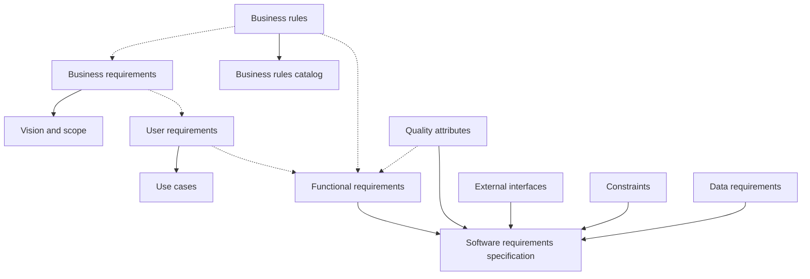

# Requirement Types

**Purpose:** the nine kinds of requirement, in full, with where each comes from, where it gets written down, and what it sounds like when a client says it out loud. [Requirements as the Contract](modules/spec-driven-requirements.md) summarizes this in a table and sends you here for the detail.

Every kind below carries one **example from Project Pulse**, so you can see the same system sliced nine ways. Comparing the nine examples is the fastest way to feel the difference between them.

Use it two ways. Before a client meeting, skim the "What it sounds like" entries so you recognize things as they go past. After a meeting, sort your notes: every line your client gave you is one of these, and knowing which one tells you which document it belongs in.

## Why sorting matters

A client talks in whatever order things occur to them. In a single minute you can hear a business objective, a rule that constrains it, a design they have already picked, and a complaint that turns out to be the real requirement. If it all lands in one undifferentiated list of "requirements", three things go wrong: the business objectives get lost among the details, the rules get written as if your software invented them, and the solution ideas get built.

## How they relate

Solid arrows mean "is written down in". Dotted arrows mean "is the origin of, or influences". Reading top to bottom takes you from high-level and abstract to low-level and detailed.

---

## 1. Business requirements

**Definition.** The information that, taken together, describes a need leading to one or more projects, and the business outcome wanted from them.

**Includes.** Business opportunities or problems, business objectives, success metrics, and the vision statement.

**Origin.** The project's executive sponsor, funding authority, business sponsor, corporate executives, the acquiring customer, the manager of the actual users, the marketing department, a product visionary, or a product manager.

**Written down in.** The vision and scope document.

**Example (Project Pulse).** `BO-PERF-instructor-efficiency`: reduce the instructor's effort to run weekly performance tracking (collection, parsing, scoring, comment compilation, result distribution) by automating the end-to-end cycle and eliminating the manual download, parse, and upload the instructor runs each week for the whole cohort. Its metric `SM-grading-time` targets a 50% reduction against the instructor-reported hours under the old spreadsheet process.

**What it sounds like.** "We need to cut the time we spend on...", "if we could get this down to a day...", "the audit is in five months".

### Business problem or opportunity

For a corporate information system, describe the business problem being solved or the process being improved, and the environment the system will be used in. For a commercial product, describe the business opportunity and the market the product will compete in.

### Business objectives

Summarize the business benefits quantitatively and measurably. Platitudes ("become recognized as a world-class provider") and vague improvements ("provide a more rewarding customer experience") are neither helpful nor verifiable.

The eight financial and eight nonfinancial objective shapes, with a note on which column a senior design client's objectives fall in, are in [Requirements as the Contract §4.5](modules/spec-driven-requirements.md#45-business-objectives-and-success-metrics).

### Success metrics

The indicators stakeholders will use to define and measure success on this project, plus the factors with the greatest impact on achieving it, including factors outside the organization's control.

Business objectives sometimes cannot be measured until well after a project is complete, and sometimes depend on projects beyond yours. Success metrics can be tracked during testing or shortly after release, so they tell you whether you are on track. A metric can restate an objective when the objective is measurable early: "reduce time spent ordering chemicals to 10 minutes on 80 percent of orders" works as both.

Examples: `SM-cafeteria-adoption`, 75% of employees who used the cafeteria at least 3 times per week during Q3 2013 use the Cafeteria Ordering System at least once a week within 6 months following initial release. `SM-satisfaction`, the average rating on the quarterly cafeteria satisfaction survey increases by 0.5 on a scale of 1 to 6 from the Q3 2013 rating within 3 months following initial release, and by 1.0 within 12 months.

**Choose success metrics that measure what is important to the business, not just what is easy to measure.** "Reduce product development costs by 20 percent" is easy to measure and easy to achieve by laying off employees or investing less in innovation, neither of which was the intended outcome.

### Vision statement

| | |
|---|---|
| **For** | target customer |
| **Who** | statement of the need or opportunity |
| **The** product name | product category |
| **That** | major capabilities, key benefit, compelling reason to use it |
| **Unlike** | primary competitive alternative, current system, or current business process |
| **Our product** | primary differentiation and advantage |

### Questions that elicit business requirements

Ask the client directly:

- What business problem are you trying to solve?
- What is the motivation for solving this problem?
- What would a highly successful solution do for you?
- How can we judge the success of the solution?
- What is a successful solution worth?
- Who are the individuals or groups that could influence this project, or be influenced by it?
- Are there related projects or systems that could influence this one, or that this project could affect?
- Which business activities and events should be included in the solution? Which should not?
- Can you think of any unexpected or adverse consequences the new system could cause?

---

## 2. User requirements

**Definition.** Goals or tasks users must be able to perform with the system that will provide value to someone, plus the product attributes that matter to user satisfaction.

**Origin.** The actual end user representatives of the system.

**Written down in.** Use cases, user story cards, and for some systems, state machine diagrams.

**What it sounds like.** A sentence starting "I need to..." followed by a task: "I need to print a mailing label for a package." "As the lead machine operator, I need to calibrate the pump controller first thing every morning."

**Example (Project Pulse).** `UC-RUB-create-rubric`, "the course admin creates a rubric". One goal, one actor, and a set of steps that get them there.

Use cases and user stories are not always sufficient on their own. For real-time and reactive systems, where the correct behavior depends on what state the system is in rather than on a sequence of user steps, a state machine expresses requirements that a use case cannot.

---

## 3. Business rules

**Definition.** Corporate policies, government regulations, laws, industry standards, and computational algorithms.

**Origin.** They are a property of the business. They are **not** software requirements in themselves, because they exist whether or not your software does.

**Written down in.** The business rules catalog.

**What it sounds like.** "Must comply with...", "if <condition>, then <something happens>", "must be calculated according to...", and any sentence where only certain people may do something under certain conditions. Examples: "a new client must pay 30 percent of the estimated consulting fee and travel expenses in advance", "time-off approvals must comply with the company's vacation policy".

**Example (Project Pulse).** `BR-evaluation-submission-window`: a student may submit a peer evaluation only for the previous week, and has that one week to complete it; both the initial submission and any later edits must occur within this window. The rule is the course's, not the software's. Project Pulse enforces it, but it would still be the policy on paper.

A rule is usually the origin of requirements of several other kinds:

| Requirement type | How the rule shows up | Example |
|---|---|---|
| Business requirement | Government regulations lead to business objectives | The system must enable compliance with all federal and state chemical usage and disposal reporting regulations within five months. |
| User requirement | Privacy policies dictate which users may perform which tasks | Only laboratory managers may generate chemical exposure reports for anyone other than themselves. |
| Functional requirement | Company policy about vendors | If an invoice is received from an unregistered vendor, the system shall email the vendor editable versions of the supplier intake form and the W-9. |
| Quality attribute | Safety regulations enforced through functionality | The system must maintain safety training records and check them before a user can request a hazardous chemical. |

---

## 4. Functional requirements

**Definition.** The observable behaviors the system will exhibit under given conditions, and the actions it lets users take.

**Origin.** Derived from user requirements, business rules, and quality attributes.

**Written down in.** The software requirements specification.

**How to find them.** Go over each use case action step, including the extensions, and specify enough detail that a developer knows how to implement the step and a tester knows how to derive test cases from it.

**Example (Project Pulse).** `FR-AI-no-auto-edit`: the system shall not modify student-authored content with assistant-generated text without an explicit confirmation action by the student. One condition, one observable behavior, and a tester can write the case from the sentence alone.

### EARS: a template that is hard to misread

Prose requirements are ambiguous in ways nobody notices until something is built wrong. The Easy Approach to Requirements Syntax gives five sentence shapes, and a requirement written in one of them is markedly harder for a human or an agent to misread.

| Shape | Template | Example |
|---|---|---|
| **Ubiquitous** (always active) | The `<component>` shall `<response>` | A small uncrewed aircraft shall not fly outside of the designated flight zone. |
| **Event driven** | When `<trigger>` the `<system>` shall `<response>` | When a low battery is detected in an aircraft, all registered user interface clients shall be notified. |
| **State driven** | While `<in a state>` the `<system>` shall `<response>` | While in flight, each managed aircraft shall report its current coordinates every `healthReportingPeriod` seconds. |
| **Optional** (feature-dependent) | Where `<feature is included>` the `<system>` shall `<response>` | Where an aircraft has collision avoidance capabilities, it shall adjust its own flight path to avoid obstacles in its immediate vicinity. |
| **Unwanted behavior** | If `<preconditions>`, then the `<system>` shall `<response>` | If an aircraft battery drops below `safeBatteryFlyingLevel`, the aircraft shall land at the nearest safe landing site. |
| **Hybrid** | Multiple keywords combined | If wind gusts are recorded above `desiredWindVelocity` when an aircraft is awaiting permission to take off, then the flight shall be delayed until no further gusts above `desiredWindVelocity` have been observed for `windWaitingPeriod` minutes. |

Source: <https://alistairmavin.com/ears/>

---

## 5. Quality attributes

**Definition.** Statements describing how *well* the system does something, as opposed to what it does.

**Origin.** Business rules, users, and the product manager.

**Written down in.** The software requirements specification.

**What it sounds like.** Adjectives: fast, easy, user-friendly, reliable, secure. "The mobile software must respond quickly to touch commands." "The shopping cart has to be simple to use so my new customers don't abandon the purchase." Every one of those is subjective as stated, and your job is to work with the user to find the verifiable goal underneath.

**Example (Project Pulse).** `PER-report-load`: Project Pulse shall return the instructor progress-monitoring dashboard and the report views within 500 milliseconds at the 95th percentile, under the peak near-deadline concurrency envelope. Compare it with "the dashboard should be fast", which is the same wish with nothing to test.

The attributes worth knowing by name:

| | | | |
|---|---|---|---|
| Availability | Installability | Integrity | Interoperability |
| Performance | Reliability | Robustness | Safety |
| Security | Usability | Efficiency | Modifiability |
| Portability | Reusability | Scalability | Verifiability |

Quality attributes are where a system that met every functional requirement can still be unusable. A heating system for a training room controlled temperature to within half a degree across its full range and had every profile-programming capability requested. It was also so loud the instructor could not be heard over it. Nobody had said anything about noise, so the cheapest unit meeting the stated requirements was bought, and by the time anyone noticed, replacing it was expensive.

---

## 6. External interface requirements

**Definition.** The connections between your system and the rest of the universe: interfaces to users, to hardware, and to other software systems.

**Origin.** Clients, users, and the current business process.

**Written down in.** Vision and scope, use case diagrams, the specification, interface specifications, and prototypes.

**What it sounds like.** "Must read signals from...", "must send messages to...", "must be able to read files in `<format>`", "user interface elements must conform to `<a standard>`". Examples: "the manufacturing execution system must control the wafer sorter", "the mobile app should send the check image to the bank after I photograph the check I'm depositing".

**Example (Project Pulse).** `SI-import-allowlist`: accept PDF (`.pdf`) and PowerPoint (`.pptx`, `.ppt`) uploads as project source material, and reject any file whose type is not on the allowlist or whose size exceeds a configurable per-file limit (default 25 MB). The boundary is the point: the allowlist says what the outside world is allowed to hand you.

**How they get represented.** A context diagram or use case diagram for the boundary. Input and output file formats, report layouts, and API documentation for system interfaces. Dialog maps, storyboards, and low- or high-fidelity prototypes for user interfaces.

---

## 7. Constraints

**Definition.** A restriction on the design and implementation choices available to the developers.

**Origin.** External stakeholders, and other systems that interact with the one you are building.

**Written down in.** The software requirements specification.

**What it sounds like.** "Must be written in `<a specific language>`", "cannot exceed `<some limit>`", "must use `<a specific control>`". Examples: "files submitted electronically cannot exceed 10 MB", "the browser must use 256-bit encryption for all secure transactions".

**Example (Project Pulse).** `CO-vue-spring-stack`: the client shall be implemented in Vue.js and the backend in Java using the Spring Boot framework. And `CO-ferpa`: Project Pulse shall comply with FERPA when storing and transmitting student educational records. Neither is a feature. Both remove options you would otherwise have had.

**Where constraints come from.**

- Specific technologies, tools, languages, and databases that must be used or avoided.
- Restrictions from the product's operating environment or platform, such as which browsers or operating systems are in use.
- Required development conventions or standards. If the customer's organization will maintain the software, they might specify design notations and coding standards.
- Backward compatibility with earlier products, and potential forward compatibility, such as knowing which version created a given data file.
- Limitations or compliance requirements imposed by regulations or business rules.
- Hardware limitations: timing, memory, processor, size, weight, materials, or cost.
- Physical restrictions from the operating environment or from characteristics of the users.
- Existing interface conventions to follow when enhancing an existing product.
- Standard data interchange formats that must be used.

For your project, the constraint that most often goes unasked is who maintains this after you graduate, and what that person already knows how to run.

---

## 8. Data requirements

**Definition.** The subject matter, business objects, entities, and classes relevant to the work being investigated.

**Origin.** The context diagram's external systems, existing reports and forms, the glossary, and users.

**Written down in.** The software requirements specification, as an entity-relationship diagram, a first-cut class model, or a data dictionary.

**What it sounds like.** Any description of format, data type, allowed values, or default value; the composition of a complex business structure; or a report to be generated. "The ZIP code has five digits, followed by an optional hyphen and four digits that default to 0000." "An order consists of the customer's identity, shipping information, and one or more products, each of which includes the product number, number of units, unit price, and total price."

**Example (Project Pulse).** A requirement document's status is one of `DRAFT`, `SUBMITTED`, `RETURNED`, or `ACCEPTED`; a submitted document is either returned for revision or accepted, and an accepted one is read-only. The allowed values and the transitions between them are data requirements, and guessing them wrong builds a workflow the client does not have.

---

## 9. Solution ideas

**Definition.** Not a requirement at all, but a solution the client has already chosen, described in the grammar of a requirement. The analyst's job is to probe underneath it and find the real need.

**Origin.** Expert users, most often. The people who know the current system best are the most likely to describe the next one in its terms.

**Written down in.** Nowhere, as stated. Once you find the need underneath, that goes in whichever document it belongs to.

**What it sounds like.** Anyone describing a specific way to interact with the system in order to perform an action. "Then I select the state where I want to send the package from a drop-down list." "The phone has to allow the user to swipe with a finger to navigate between screens."

**Example (not in the repository, and that is the point).** "Put a drop-down on the dashboard so I can pick which week to look at." The need underneath is that an instructor reads one week at a time. A drop-down is one way to serve it, and once you write it down as the requirement you have made a design decision on your client's behalf.

**How to get underneath it.** Ask why, repeatedly, until you reach something that is true regardless of implementation. A password is one way to implement an identity requirement, and it is not the only one; if you record "the system shall require a password" you have already made a design decision on the client's behalf.

---

## Other things clients say

Not everything in a meeting is a requirement of any kind. Sort the rest as it arrives:

- **A project requirement** unrelated to the software, such as the need to train users on the new system.
- **A project constraint**, such as a cost or schedule restriction.
- **An assumption or a dependency.**
- **Historical, context-setting, or descriptive information**, which belongs in the background section.
- **Extraneous information** that adds no value. There will be some, and recognizing it is a skill too.

---

## Related

- [Requirements as the Contract](modules/spec-driven-requirements.md): the module this page supports.
- [Studio](studio.md): where you apply it to your own project.
- The Project Pulse examples on this page are quoted from [`docs/requirements/`](https://github.com/Washingtonwei/project-pulse/tree/main/docs/requirements) on `main`, verified 2026-09-08.
