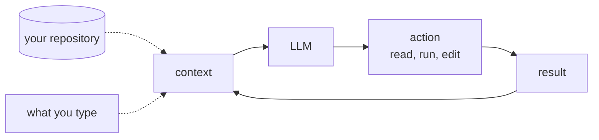
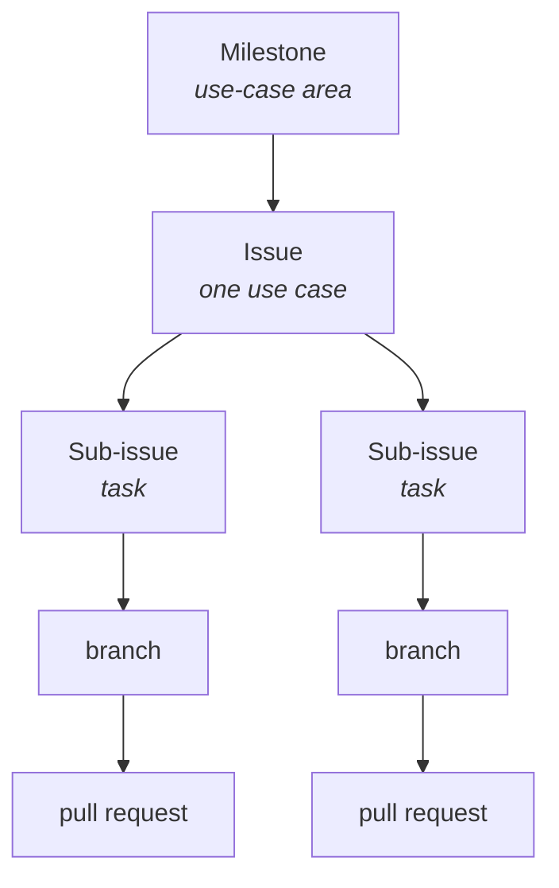

# The AI-Augmented Team

COSC 40943 · Senior Design · Week 2

## Last week you signed it {.center}

You are accountable for what the agent writes.

Today: **what you are signing into**, and who else is on the team.

::: note
Thirty seconds. This is the bridge from week 1's accountability rule to the machinery that makes accountability possible. Do not re-argue week 1.

Also say: Wednesday you get your team, your client, and your TA. Friday is your team's first hour together. Say it now and again at the end.
:::

## One line from a real repository

> The **glossary** fixes vocabulary. Use the defined term in code identifiers and UI text, never a synonym.

`CLAUDE.md`, root of Project Pulse

::: ask
Who decided this, and when?
:::

::: note
Let them answer. Somebody on the team, once, in a meeting, in about ten seconds. It is exactly the kind of decision nobody writes down.

Project it from the repo if the room is awake enough to care.
:::

## So what if it had stayed in the meeting?

::: steps
- A teammate asks an agent to add a peer-evaluation endpoint
- The agent has never attended a meeting
- It finds no rule, picks a reasonable word, ships `reviewee`
- The codebase says `evaluatee` everywhere else
:::

::: warn
Nothing fails. Tests pass. The pull request looks fine.

Six weeks later a query silently returns nothing, and the fix is a migration.
:::

::: note
This is the whole module in one example. Hold the pause after "nothing fails."
:::

## 1999: two teams, no bad code

Mars Climate Orbiter fires its engine to enter orbit and is never heard from again.

Ground software produced **pound-seconds**. Navigation software consumed **newton-seconds**.

::: key
$125M of spacecraft. Each team's code was correct under its own assumption.
:::

::: note
The assumption lived in one team's head and never reached the other team's. The interface carried numbers without carrying what the numbers meant.

Then the turn: adding an agent makes this more likely, not less. It has no hallway, no standup, and no memory of last Tuesday. That sets up the next five slides.
:::

## The brain is a language model

Trained by predicting the next token over an enormous corpus. It knows Spring Boot. It does not know **your project**, which was not in the training data.

And it is a **function, not a process**: text in, text out, then it stops. Nothing carries over.

::: ask
Then why does a chat conversation seem to remember?
:::

::: note
Do not teach transformers. Two load-bearing facts only: it knows Java in general and nothing about your repo, and it is not running between your messages.

Take one guess on the question, then reveal on the next slide. Most students assume there is a process somewhere holding a memory.

If someone asks how it works internally, promise week 5 and move.
:::

## The whole conversation is re-sent every turn

What looks like memory is **re-reading**.

- The block of text sent to the model is its **context**
- The size limit on that block is the **context window**, measured in tokens

::: key
Anything not in the context this turn does not exist this turn.
:::

## The agent is the loop around it



::: note
Two dotted arrows are the point: the repository and your typing are the only two ways anything gets in.
:::

## When the session ends, the context is discarded {.center}

Tomorrow starts empty and rebuilds from **what you type** and **what it reads from disk**.

::: key
The repository is the team's shared memory, and it is the only memory the agent has.
:::

::: note
This is the thesis. Say it, write it, and call back to it for the rest of the term.

Then the sharpener: "does the agent know about our decision?" is never a question about intelligence. It is a question about whether the decision is somewhere it reads.
:::

## What it can and cannot read

::: cols
**Can**

Files in the repo. The issue you point it at. Output of commands it runs.
|||
**Cannot**

What was said out loud. The client's tone. Anything a teammate has not written down.
:::

::: joke
Your Slack is not documentation. It is an oral tradition with search.
:::

::: note
The joke earns its place: it is the argument on the next slide, compressed.

Also worth saying: a teammate who was sick on Tuesday is in the position the agent is in permanently. The agent just makes an existing problem visible.

**If someone asks "could we just connect Slack to it?"** (they will): yes, connectors exist, you could do it this afternoon, and it would not help. Read access is not a source of truth. A chat log has no notion of *current* (git replaces, chat accumulates). Retrieval returns the argument, not the conclusion. A semester of Slack does not fit the window. And nothing in Slack was reviewed. More text is not better context, which is what week 5 is built on. Section 4.2 of the module has this written out if they want it.
:::

## Where the work lives



::: warn
The board displays the work. The issues hold it. Delete the board, lose a convenience. Delete the issues, lose the project.
:::

::: note
Use case, not user story. Weeks 3 and 4 say why. One line to plant now: every sub-issue has exactly one assignee, and on a team where the agent wrote the diff, the assignee is the person who *signs* it, not the one who typed it.
:::

## Well-formed means a stranger can tell it is done

::: cols
**Issue #33**, 124 lines

Scope, non-goals, and eight checkboxes. Including: *no horizontal scrolling at ~375px*.
|||
**Issue #37**, three sentences

"Show an error on invalid credentials." Plus a screenshot.
:::

::: ask
Everything in #37 is true. What is missing?
:::

::: note
Both are real, both from Project Pulse, both written by people on the project. Do not mock #37; it is an honest bug report.

Harvest three or four: wrong password vs unknown account vs locked? Toast or inline? How long does it stay? And the one they will miss: the third sentence proposes a *solution*, which quietly hands away the design decision.

#33 is not longer because its author was more thorough. It is longer because its author asked how a stranger would know it was done.
:::

## Now hand #37 to an agent

| | Given to a person | Given to an agent |
|---|---|---|
| What happens | They ask you a question | It picks an answer |
| You find out | Immediately, in Slack | At review, maybe |
| It looks like | An interruption | Finished work |

::: warn
Under-specification used to arrive as friction. Now it arrives as a completed pull request.
:::

::: note
The bottom-right cell is the whole slide. An agent has no mechanism for stopping: it infers your acceptance criteria, commits to them silently, and writes clean tested code against its own invention.

So "write acceptance criteria" is not hygiene. It is what stops your agent from designing your product.
:::

## What should a branch be?

A branch is not a unit of work. It is a **unit of integration**: one branch, one pull request, one merge.

::: key
The smallest change that leaves `main` green and is worth reviewing on its own.
:::

::: note
Two constraints generate the rule: small enough that a human actually reviews it, and `main` stays green after every merge.

Say the carve-out out loud or they will over-apply it: do not split a small use case. `UC-RUB-view-rubric` is one Vue call, one controller method, one service method, five tests. One branch. An hour.

And: the branch is the unit of *merge*; the use case is the unit of *done*.
:::

## Splitting for merge is not splitting for ownership

::: warn
"I'll take the front end." "I'll take login."

You saw this in week 1. It is fatal by November.
:::

::: key
One developer owns a use case end to end: front end, back end, tests, pipeline.
:::

::: note
This is the slide that changes what they do this week, so do not rush it.

Why: the defect that appears where two layers meet belongs to nobody, "done" needs two people to agree, and neither of them learns the stack.

There is no front-end person, no database person, no tester on this team. Parallelism happens across use cases, not inside one. Six people, up to six use cases moving at once.

The owner may still cut three branches. Same person, sequential.
:::

## Review used to be a second opinion

Now it is the **first read**.

Typing was a slow, involuntary review. The author understood every line because they wrote it.

::: ai
The agent wrote it. The author read the prompt and a summary. Nobody has read the diff.
:::

::: note
Then the part that unsettles them, and should: the signals you skim for have stopped carrying information. Consistent naming, structure, tests, doc comments. Those correlated with care because they used to take effort. Now they are free.

Fluent, well-structured, confidently wrong code is cheap.
:::

## LGTM

::: joke
Looks Generated To Me.
:::

::: steps
- Read the **issue** before the diff
- Ask what the agent **assumed**
- Look where **nobody prompted**: extensions, empty case, error path
- Explanation test: why is this line here, what does it do on empty input
:::

::: note
The merge gate is the last structural point where a human is required to look at all. Push straight to main and there is no such point. That is the real argument for branching, and it is not about conflicts.

This is why PR size is not a style preference. Four hundred lines can get all four. Twelve hundred gets "LGTM", and everyone in the room knows it.
:::

## First, what "done" means

**Issue #41** · `UC-TEA-assign-students` · the course admin assigns students to teams

::: steps
- An admin can add a student to a team in their section
- A student already on another team in that section is **moved**, not duplicated
- A student outside the section is **rejected**, with a message naming why
- The roster updates without a page reload
:::

::: note
Read the second and third aloud and let them land. Neither is obvious, both are decisions somebody made, and both are exactly what an agent would have invented differently if the issue had not said.

Milestone is TEA, the team-management use-case area. Mention it once; do not dwell.
:::

## One owner, three merges

Maya owns all of it. She is a full-stack owner of one use case, **not the team's backend person**.

| Sub-issue | Branch | `main` after |
|---|---|---|
| #42 endpoint, service, rejection | `feat/42-...-backend` | green, nothing calls it yet |
| #43 API function, the control | `feat/43-...-ui` | green, an admin can do it |
| #44 end-to-end coverage | `test/44-...-e2e` | green and verified |

::: key
Three reviewable merges beat one large one. Same person, sequential.
:::

::: note
The right-hand column is the slide. Each merge leaves main deployable, which is what makes short branches safe.

Meanwhile Devon and Priya own their own use cases end to end, and Maya reviews theirs. Parallelism across use cases, not inside one.
:::

## What Maya actually does on #42

::: steps
- Claims it; the card moves to In progress
- `git switch -c feat/42-assign-student-backend` off `main`
- Works it, agent or not. Commits carry the number
- Opens a pull request saying **`Closes #42`**, naming the criteria it satisfies
- **Devon reviews.** The issue first, then the diff against it
- Merge. #42 closes, the board moves, #41 stays open at one of three
:::

::: note
Step three: `feat: reject assignment when student is outside the section (#42)`. The number in the commit is what makes `git log` on a strange line lead back to the use case six months later.

Step five is the one to emphasize. Devon does not own this use case, and that is the whole value of review: a reader who was not there when the decisions were made.

When the third merges, #41 closes and the use case is built, tested, and shipped by one accountable person.
:::

## And the one that needs none of this

`UC-RUB-view-rubric`: one Vue call, one controller method, one service method, five tests.

One sub-issue. One branch. One hour.

::: key
Reaching for three sub-issues here is following a rule instead of thinking.
:::

::: note
Do not skip this slide. Without it they will decompose every trivial CRUD use case into ceremony, and blame you for it.

Half of any real system looks like this one.
:::

## Onboard the agent like a new hire

It re-onboards itself **every session**. So put it in a file.

```markdown
AGENTS.md      the real charter, read by ~two dozen tools
CLAUDE.md      one line: @AGENTS.md
```

::: note
What goes in yours this week: what the product is, how to run it, how to run the tests, conventions you actually agreed on, the workflow the agent must follow, and what it must not do. Write it thin. It grows every time the agent gets something wrong that was your fault for not saying.

Project Pulse layers it: root, backend, frontend, docs. Conventions live next to the code they govern.

Do not maintain two copies. That is this module's failure aimed at your own feet.
:::

## Your contract goes in the repo too

`docs/team-contract.md`, signed by all six.

::: steps
- **Recurring weekly meeting time**
- Communication channel and response time
- How decisions get made, how work gets claimed
- Git workflow, AI usage guidelines
- What happens when someone does not deliver
:::

::: key
Fix the meeting time first. It is the clause the others depend on.
:::

::: note
The most reliable predictor of a struggling senior design team is not weak technical skill. It is a team that never found a time to meet.

Agree the non-delivery clause in week 2, while nobody is angry.
:::

## This week {.center}

::: steps
- **Wednesday:** your team, your client, your TA. Read your brief before Friday
- **Friday:** your team's first hour. Contract signed, repo and board standing, Checkpoint 0
- **Friday:** *Hello, Project Pulse* is due
:::

::: warn
Wednesday is where you find out who you are working with for the next eight months.
:::
