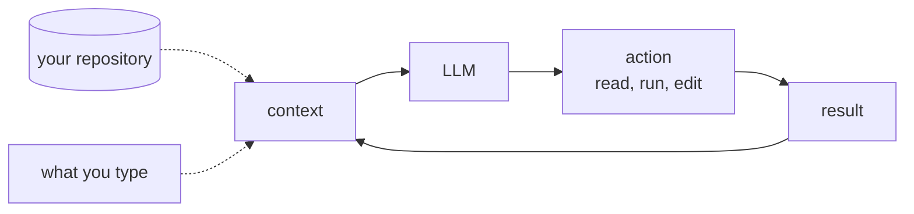
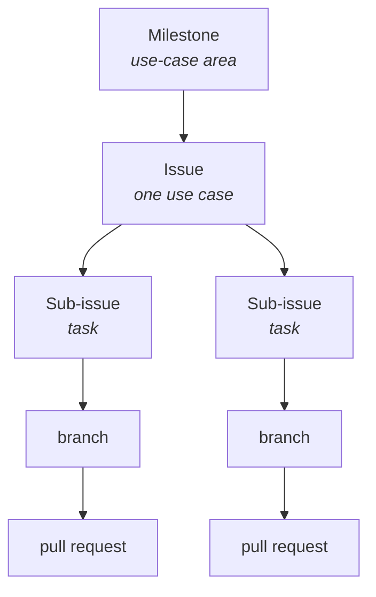
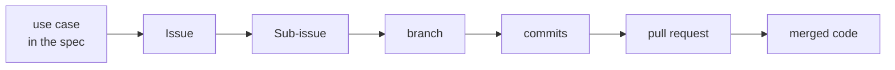

# The AI-Augmented Team

COSC 40943 · Senior Design · Week 2

## Last week you signed it {.center}

You are accountable for what the agent writes.

Today: **what you are signing into**, and who else is on the team.

::: note
Thirty seconds. This is the bridge from week 1's accountability rule to the machinery that makes accountability possible. Do not re-argue week 1.

Also say: Wednesday you get your team, your client, and your TA. Friday is your team's first hour together. Say it now and again at the end.
:::

## One line from a real repository

> The **glossary** fixes vocabulary. Use the defined term in code identifiers and UI text, never a synonym.

[`CLAUDE.md`, root of Project Pulse](https://github.com/Washingtonwei/project-pulse/blob/main/CLAUDE.md)

::: ask
Who decided this, and when?
:::

::: note
Let them answer. Somebody on the team, once, in a meeting, in about ten seconds. It is exactly the kind of decision nobody writes down.

Project it from the repo if the room is awake enough to care.
:::

## So what if it had stayed in the meeting?

::: steps
- A teammate asks an agent to add a peer-evaluation endpoint
- The agent has never attended a meeting
- It finds no rule, picks a reasonable word, ships `reviewee`
- The codebase says `evaluatee` everywhere else
:::

::: warn
Nothing fails. Tests pass. The pull request looks fine.

Six weeks later a query silently returns nothing, and the fix is a migration.
:::

::: note
This is the whole module in one example. Hold the pause after "nothing fails."
:::

## 1999: two teams, no bad code

Mars Climate Orbiter fires its engine to enter orbit and is never heard from again.

Ground software produced **pound-seconds**. Navigation software consumed **newton-seconds**.

::: key
$125M of spacecraft. Each team's code was correct under its own assumption.
:::

::: note
The assumption lived in one team's head and never reached the other team's. The interface carried numbers without carrying what the numbers meant.

Then the turn: adding an agent makes this more likely, not less. It has no hallway, no standup, and no memory of last Tuesday. That sets up the next five slides.
:::

## The brain is a language model

Trained by predicting the next token over an enormous corpus. It knows Spring Boot. It does not know **your project**, which was not in the training data.

And it is a **function, not a process**: text in, text out, then it stops. Nothing carries over.

::: ask
Then why does a chat conversation seem to remember?
:::

::: note
Do not teach transformers. Two load-bearing facts only: it knows Java in general and nothing about your repo, and it is not running between your messages.

Take one guess on the question, then reveal on the next slide. Most students assume there is a process somewhere holding a memory.

If someone asks how it works internally, promise week 5 and move.
:::

## The whole conversation is re-sent every turn

What looks like memory is **re-reading**.

- The block of text sent to the model is its **context**
- The size limit on that block is the **context window**, measured in tokens

::: key
Anything not in the context this turn does not exist this turn.
:::

## The agent is the loop around it



::: note
Two dotted arrows are the point: the repository and your typing are the only two ways anything gets in.
:::

## When the session ends, the context is discarded {.center}

Tomorrow starts empty and rebuilds from **what you type** and **what it reads from disk**.

::: key
The repository is the team's shared memory, and it is the only memory the agent has.
:::

::: note
This is the thesis. Say it, write it, and call back to it for the rest of the term.

Then the sharpener: "does the agent know about our decision?" is never a question about intelligence. It is a question about whether the decision is somewhere it reads.
:::

## What it can and cannot read

::: cols
**Can**

Files in the repo. The issue you point it at. Output of commands it runs.
|||
**Cannot**

What was said out loud. The client's tone. Anything a teammate has not written down.
:::

::: joke
Your Slack is not documentation. It is an oral tradition with search.
:::

::: note
The joke earns its place: it is the argument on the next slide, compressed.

Also worth saying: a teammate who was sick on Tuesday is in the position the agent is in permanently. The agent just makes an existing problem visible.

**If someone asks "could we just connect Slack to it?"** (they will): yes, connectors exist, you could do it this afternoon, and it would not help. Read access is not a source of truth. A chat log has no notion of *current* (git replaces, chat accumulates). Retrieval returns the argument, not the conclusion. A semester of Slack does not fit the window. And nothing in Slack was reviewed. More text is not better context, which is what week 5 is built on. Section 4.2 of the module has this written out if they want it.
:::

## GitHub as that memory

If the repository is the only memory, the **work** has to live there too. Not just the code.

| Artifact | What it is | What it represents |
|---|---|---|
| **Project** | a board that displays issues | your state, at a glance |
| **Issue** | a unit of customer value, with acceptance criteria | one **use case** |
| **Sub-issue** | a unit of implementation work | one **development task** |

::: warn
The board does not contain the work. Delete the board, lose a convenience. Delete the issues, lose the project.
:::

::: note
This is the hinge of the hour. Everything before it argued that the repository is the only memory; everything after it is how you put the work in there. Say the section title out loud.

Use case, not user story. Weeks 3 and 4 say why.
:::

## Where the work lives



::: key
Every sub-issue has exactly one assignee: the person who **signs** it, not the one who typed it.
:::

::: note
Milestone is the use-case area. In Project Pulse those are the codes inside `UC-<AREA>-<slug>`: TEA for teams, RUB for rubrics, WAR for weekly activity reports.

Pair on the hard ones. One name on it anyway, because somebody has to answer for the result. That is week 1's accountability rule landing somewhere concrete.
:::

## Well-formed means a stranger can tell it is done

That is what **acceptance criteria** are for. It is the only test worth remembering.

::: note
Two real issues, both from Project Pulse, both written by people on the project. Have both open in tabs.

Do not mock #37. It is an honest bug report, and that is the point: honest is not the same as specified.
:::

## Issue #33, 124 lines

**Make Project Pulse Mobile-Friendly for Student and Instructor Workflows**

Background · Summary · the exact pages in scope · Current behavior · Proposed improvement · **Non-goals** · **Acceptance criteria** · Risks · Rationale

::: key
- [ ] No horizontal scrolling on common phone widths (~375px)
:::

::: note
Project the real issue. The checkbox list is far more convincing on screen than quoted.

Two things to point at. The **non-goals** section: "no new features, no visual redesign, no native app." That is the author fencing the agent in. And the criterion on this slide names a number, so a stranger can check it without ever meeting the author.
:::

## Issue #37, three sentences

> When logging in, and the credentials are invalid/wrong, the application does not show an error on the page.
>
> The solution should be: creating a pop-up that gives feedback to the user. e.i, "invalid credentials."
>
> The console shows the error, but not the page.

::: ask
Everything here is true. What is missing?
:::

::: note
Take three or four answers. Then supply what they miss, in this order:

Does "invalid credentials" mean a wrong password, an unknown account, or a locked one? Does the message distinguish them? It had better not, for security reasons, but that is a decision and this issue does not make it.

Toast, inline under the field, or both? How long does it stay? What happens to the password field?

And the one they will not get: **the second sentence proposes a solution instead of stating a requirement.** It hands the design decision to whoever reads it first.

#33 is not longer because its author was more thorough. It is longer because its author asked how a stranger would know it was done.
:::

## Now hand #37 to an agent

| | Given to a person | Given to an agent |
|---|---|---|
| What happens | They ask you a question | It picks an answer |
| You find out | Immediately, in Slack | At review, maybe |
| It looks like | An interruption | Finished work |

::: warn
Under-specification used to arrive as friction. Now it arrives as a completed pull request.
:::

::: note
The bottom-right cell is the whole slide. An agent has no mechanism for stopping: it infers your acceptance criteria, commits to them silently, and writes clean tested code against its own invention.

So "write acceptance criteria" is not hygiene. It is what stops your agent from designing your product.
:::

## What should a branch be?

A branch is not a unit of work. It is a **unit of integration**: one branch, one pull request, one merge.

::: key
The smallest change that leaves `main` green and is worth reviewing on its own.
:::

::: note
Two constraints generate the rule: small enough that a human actually reviews it, and `main` stays green after every merge.

Say the carve-out out loud or they will over-apply it: do not split a small use case. `UC-RUB-view-rubric` is one Vue call, one controller method, one service method, five tests. One branch. An hour.

And: the branch is the unit of *merge*; the use case is the unit of *done*.
:::

## Splitting for merge is not splitting for ownership

::: warn
"I'll take the front end." "I'll take login."

You saw this in week 1. It is fatal by November.
:::

::: key
One developer owns a use case end to end: front end, back end, tests, pipeline.
:::

::: note
This is the slide that changes what they do this week, so do not rush it.

Why: the defect that appears where two layers meet belongs to nobody, "done" needs two people to agree, and neither of them learns the stack.

There is no front-end person, no database person, no tester on this team. Parallelism happens across use cases, not inside one. Six people, up to six use cases moving at once.

The owner may still cut three branches. Same person, sequential.
:::

## Review used to be a second opinion

Now it is the **first read**.

Typing was a slow, involuntary review. The author understood every line because they wrote it.

::: ai
The agent wrote it. The author read the prompt and a summary. Nobody has read the diff.
:::

::: note
Then the part that unsettles them, and should: the signals you skim for have stopped carrying information. Consistent naming, structure, tests, doc comments. Those correlated with care because they used to take effort. Now they are free.

Fluent, well-structured, confidently wrong code is cheap.
:::

## LGTM

::: joke
Looks Generated To Me.
:::

::: steps
- Read the **issue** before the diff
- Ask what the agent **assumed**
- Look where **nobody prompted**: extensions, empty case, error path
- Explanation test: why is this line here, what does it do on empty input
:::

::: note
The merge gate is the last structural point where a human is required to look at all. Push straight to main and there is no such point. That is the real argument for branching, and it is not about conflicts.

This is why PR size is not a style preference. Four hundred lines can get all four. Twelve hundred gets "LGTM", and everyone in the room knows it.
:::

## First, what "done" means

**Issue #41** · `UC-TEA-assign-students` · the course admin assigns students to teams

::: steps
- An admin can add a student to a team in their section
- A student already on another team in that section is **moved**, not duplicated
- A student outside the section is **rejected**, with a message naming why
- The roster updates without a page reload
:::

::: note
Read the second and third aloud and let them land. Neither is obvious, both are decisions somebody made, and both are exactly what an agent would have invented differently if the issue had not said.

Milestone is TEA, the team-management use-case area. Mention it once; do not dwell.
:::

## One owner, three merges

Maya owns all of it. She is a full-stack owner of one use case, **not the team's backend person**.

| Sub-issue | Branch | `main` after |
|---|---|---|
| #42 endpoint, service, rejection | `feat/42-...-backend` | green, nothing calls it yet |
| #43 API function, the control | `feat/43-...-ui` | green, an admin can do it |
| #44 end-to-end coverage | `test/44-...-e2e` | green and verified |

::: key
Three reviewable merges beat one large one. Same person, sequential.
:::

::: note
The right-hand column is the slide. Each merge leaves main deployable, which is what makes short branches safe.

Meanwhile Devon and Priya own their own use cases end to end, and Maya reviews theirs. Parallelism across use cases, not inside one.
:::

## What Maya actually does on #42

::: steps
- Claims it; the card moves to In progress
- `git switch -c feat/42-assign-student-backend` off `main`
- Works it, agent or not. Commits carry the number
- Opens a pull request saying **`Closes #42`**, naming the criteria it satisfies
- **Devon reviews.** The issue first, then the diff against it
- Merge. #42 closes, the board moves, #41 stays open at one of three
:::

::: note
Step three: `feat: reject assignment when student is outside the section (#42)`. The number in the commit is what makes `git log` on a strange line lead back to the use case six months later.

Step five is the one to emphasize. Devon does not own this use case, and that is the whole value of review: a reader who was not there when the decisions were made.

When the third merges, #41 closes and the use case is built, tested, and shipped by one accountable person.
:::

## And the one that needs none of this

`UC-RUB-view-rubric`: one Vue call, one controller method, one service method, five tests.

One sub-issue. One branch. One hour.

::: key
Reaching for three sub-issues here is following a rule instead of thinking.
:::

::: note
Do not skip this slide. Without it they will decompose every trivial CRUD use case into ceremony, and blame you for it.

Half of any real system looks like this one.
:::

## What that buys you



Answerable without asking anyone:

::: steps
- Which commits implemented this requirement?
- Which pull request completed this use case, and who reviewed it?
- This line is strange. **What asked for it?**
:::

::: note
The last question is the one that matters on an AI-augmented team. When a human typed the code, "why is this here?" has a witness. When it was generated, the witness is gone: the person who merged it read it once, and the agent has forgotten the session.

The chain replaces the witness. Week 8 makes it a standing discipline.

`Closes #42` in a pull request description closes the issue on merge and moves the card.
:::

## Your board's vocabulary

| Column | What it actually means |
|---|---|
| **Backlog** | agreed to, not started. Ordered, not a pile |
| **In progress** | someone is working on it *right now* |
| **Done** | merged and satisfying its acceptance criteria |
| **Iteration** | the span you pull work into. Yours is one week |

::: note
"In progress" with twelve cards and six people is a lie, and everyone on the team knows it is a lie, which is how a board stops being trusted and then stops being updated.

Your iteration ends at the Monday activity report. That is the whole planning vocabulary you need until there is enough work to plan properly.
:::

## Onboard the agent like a new hire

It re-onboards itself **every session**. So put it in a file.

```markdown
AGENTS.md      the real charter, read by ~two dozen tools
CLAUDE.md      one line: @AGENTS.md
```

::: note
Do not maintain two copies. Two files that say the same thing are two files that will stop saying the same thing, which is this module's failure aimed at your own feet.

Around two dozen tools read AGENTS.md: Codex, Gemini CLI, Cursor, Copilot's coding agent, Zed, Aider. Claude Code is the exception and reads CLAUDE.md, hence the one-line import.

Not a symlink: on Windows it needs Developer Mode, and a clone without symlink support checks it out as a text file containing the path, which the agent then reads as your whole charter.
:::

## Project Pulse layers it

| File | What it carries |
|---|---|
| [`CLAUDE.md`](https://github.com/Washingtonwei/project-pulse/blob/main/CLAUDE.md) (root) | what the product is, how to start all three services, build and test commands, the workflow |
| `backend/CLAUDE.md` | Java and Spring conventions, the package map, how tests are organized |
| `frontend/CLAUDE.md` | Vue conventions, where the per-domain API modules live |
| `docs/CLAUDE.md` | the identifier schemes for the specification itself |

::: key
Conventions live next to the code they govern.
:::

::: note
Project this from the repo. Open the root file and one nested file so they see the difference in altitude.

Someone will point out that this repo uses CLAUDE.md while you just told them to write AGENTS.md. Correct: it is developed with Claude Code and predates the advice. The layering is what to copy, not the filename.

What goes in yours this week: what the product is, how to run it, how to run the tests, conventions you actually agreed on, the workflow the agent must follow, and what it must not do. Write it thin. It grows every time the agent gets something wrong that was your fault for not saying.
:::

## Your contract goes in the repo too

`docs/team-contract.md`, signed by all six.

| Clause | Why it is there |
|---|---|
| **Recurring weekly meeting time** | the clause every other clause depends on |
| Channel, and expected response time | so "I did not see it" stops being an argument |
| How decisions get made | how you break a tie without a two-week standoff |
| How work gets claimed | so nothing is owned by everyone |
| Git workflow and coding standards | branch naming, what blocks a merge |
| AI usage guidelines | what you delegate, and who signs before merge |
| When someone does not deliver | agreed while nobody is angry |

::: key
Fix the meeting time first. It is the clause the others depend on.
:::

::: note
The most reliable predictor of a struggling senior design team is not weak technical skill. It is a team that never found a time to meet.

Agree the non-delivery clause in week 2, while nobody is angry.
:::

## This week {.center}

::: steps
- **Wednesday:** your team, your client, your TA. Read your brief before Friday
- **Friday:** your team's first hour. Contract signed, repo and board standing, Checkpoint 0
- **Friday:** *Hello, Project Pulse* is due
:::

::: warn
Wednesday is where you find out who you are working with for the next eight months.
:::
