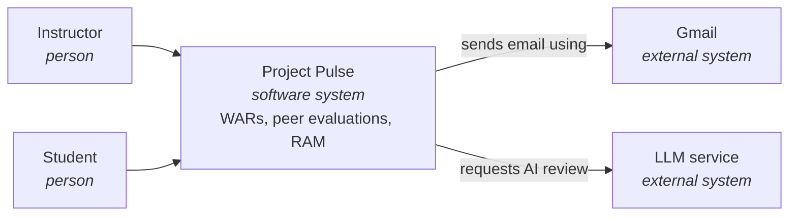

# Software Architecture, Just Enough

Week 6 · Decide what is expensive to change

## Two teams, one specification {.center}

::: cols
**Team A**

Seven services, seven databases, an API gateway, Kubernetes.
|||
**Team B**

One Spring Boot application, the Vue app bundled inside, one database, one container.
:::

::: ask
Both deliver every use case. Both pass every functional test. Which one should the client get?
:::

::: note
Take answers. Most rooms split, and some students pick A because it sounds more serious. Do not resolve it. The next slide gives the questions that resolve it.
:::

## The use cases cannot tell them apart

::: steps
- Who runs this after you graduate? **One instructor, no operations staff.**
- How many users? **About 75 a term.**
- What is the worst thing that can happen? **One student sees another's evaluations.**
- What changes most often? **Features, added by next year's students.**
:::

::: key
Team B is Project Pulse. Team A is what an agent proposes when nobody tells it those four answers.
:::

## Functionality tells you what components you need {.center}

::: key
Quality attributes tell you how to arrange them.
:::

::: note
This is the idea of the whole module. Say it, pause, and move on. Bass, Clements, and Kazman: the same features can be built on many architectures, and what separates good from bad, given both work, is how well each meets its quality attributes.
:::

## What architecture is

> The significant design decisions that shape a system, where significant is measured by cost of change.
>
> Grady Booch

::: note
Not boxes and arrows, not a technology list. Decisions. And the test for which decisions count is how much it costs to change your mind later.
:::

## The reversibility test

| Decide now | Decide later, against real code |
|---|---|
| One deployable or several | Class and method names |
| Where the data lives | Endpoint shapes |
| How users sign in | Table columns |
| Which external systems | Validation library |
| How code is divided into modules | Screen layout |
| Where the trust boundary sits | Error wording |

::: note
Left column is this week. Right column is week 7's design-of-record, one use case area at a time. Connect it to week 5: the pinning litmus. Pin what would be expensive to get wrong; derive the rest.
:::

## Breadth-complete, depth-shallow

::: cols
**Breadth-complete**

Every use case area, every component, every external system named. No holes in the map.
|||
**Depth-shallow**

Each part described to its responsibility and no further. Nothing designed before anyone has built against it.
:::

::: warn
The map with holes: two people build the same thing. The map that is too deep: you committed to guesses.
:::

## Quality attributes decide it

::: steps
- **Delivered by shape, not by a component.** No class makes Project Pulse secure.
- **They conflict.** One deployable buys simple operations and costs independent scaling.
:::

::: joke
An architecture that maximizes every quality attribute is like a car that is the fastest, the cheapest, and the safest. Ask to see it.
:::

## Architecturally significant requirements

The few where a wrong guess costs a **redesign**, not a bug fix.

Rank each on two axes:

::: cols
**Importance to the client**

A privacy breach: high. 1.5 seconds instead of 1: low.
|||
**Difficulty to achieve**

75 users: low. 75,000 concurrent: high.
:::

::: note
The SEI calls this a utility tree. High on both, plus any hard constraint (a mandated platform, a regulation, a system you must integrate with), is the list.
:::

## Project Pulse's top four

| Rank | Requirement | Handles |
|---|---|---|
| 1 | Student records stay confidential (FERPA) | `SEC-authorization`, `SEC-ferpa`, `CO-ferpa` |
| 2 | One instructor, no operations team | `AVL-uptime` |
| 3 | Next year's students can extend it | `MNT-feature-locality`, `MNT-service-layer` |
| 4 | No lost work under concurrent editing | `ROB-no-overwrite` |

::: key
Reuse the identifiers you already have. Include at least one `SEC-*`.
:::

::: note
From the architecture-of-record on main, under Architecture Decisions. Seven in total; these are the top four. The security rule: every client system this year stores something about a real person. If no security requirement makes the list, its protection was never designed.
:::

## Drawing it {.center}

::: ask
Who has seen an architecture diagram they could not read without its author in the room?
:::

## Abstractions before notation

::: steps
- **Software system:** the whole thing your team builds
- **Container:** anything that runs or stores data (not a Docker container)
- **Component:** related functionality behind one responsibility
- **Code:** the classes
:::

::: note
Simon Brown's C4 model. Agree on the things first, the shapes second. The four levels are zoom levels on a map: zoom out for context, zoom in for detail, and you only draw the zoom levels your conversation needs.
:::

## Level 1: context

Who uses it. What it talks to. Readable by your client.

## Level 2: containers

::: steps
- **SPA** [Vue.js]: the user interface in the browser
- **REST API application** [Java, Spring Boot]: the APIs, and it serves the SPA
- **Database** [relational]: WARs, evaluations, requirements
- **Blob storage** [Azure]: uploaded files
:::

::: key
What runs, what stores data, which technology. The shape of the system on one page.
:::

## Level 3 and 4

::: cols
**Components: a table, this week**

One row per use case area. Responsibility, dependencies, status.
|||
**Code: never by hand**

Your IDE and your agent draw it from the code when you need it.
:::

::: note
A component diagram with controllers and services is design. It belongs in the week 7 design-of-record for that area.
:::

## Diagrams that stand alone

::: steps
- A title that says what and which kind
- Every box: name, type, technology, one-line responsibility
- Every arrow labelled with what it does
- Strip the colors: does it still read?
- A key for anything beyond boxes and arrows
- Icons supplement text, never replace it
:::

::: joke
A diagram made of cloud-provider icons tells you exactly what was bought and nothing about why.
:::

## Monday, in one line {.center}

::: key
Architecture is the expensive decisions, chosen by quality attributes, drawn so it reads without you.
:::

::: note
Wednesday: how to divide it, how many deployables, how to write a decision down, and the trust boundary. Friday is Checkpoint 1, and you draft this document in the room.
:::

## Where components come from {.center}

::: key
Your use case areas.
:::

## Project Pulse, area by area

| Use case area | Package |
|---|---|
| `WAR`, `EVA`, `RUB` | `activity`, `evaluation`, `rubric` |
| `SEC`, `TEA`, `STU`, `INS` | `section`, `team`, `student`, `instructor` |
| Ten RAM areas | five packages under `ram/` |
| Cross-cutting | `security`, `system` |

::: note
From backend/src/main/java/team/projectpulse on main. Two lessons. Every area has a home, but not necessarily its own: ten RAM areas share five packages. And the cross-cutting components are named, or every area builds its own email sender and permission check.
:::

## By layer, or by domain?

::: cols
**By layer**

`web/`, `service/`, `repository/`

[spring-framework-petclinic](https://github.com/spring-petclinic/spring-framework-petclinic)
|||
**By domain**

`owner/`, `vet/`, `system/`

[spring-petclinic](https://github.com/spring-projects/spring-petclinic)
:::

::: ask
The most common change on any project is "change how this one feature works." How many packages does it touch in each?
:::

::: note
Three versus one. Layering is good, inside a domain. As the top-level division it spreads every feature across the tree. Project Pulse's activity package holds the whole slice: Activity, ActivityController, ActivityService, ActivityRepository, ActivitySecurityService. KD-7 records it.
:::

## Divide the team the same way

::: key
A defect where two layers meet belongs to nobody when the layers belong to different people.
:::

::: note
Conway, 1968: systems mirror the communication structure of the teams that build them. This is why every member is full stack and work is divided by use case.
:::

## One deployable or several? {.center}

::: ask
Your template requires exactly one decision by Friday. This is it.
:::

## What microservices buy

::: steps
- Scale one part without the rest
- Deploy one part without the rest
- One team per service, in any language
- One failure does not take down the rest
:::

## Where that pays off

**Tmall, Singles' Day, November 11, 2019**

::: key
544,000 orders per second at peak.
:::

::: note
At that load checkout and browsing have completely different traffic shapes, and hundreds of teams need to ship without coordinating releases. That is the problem microservices solve. Now ask how many orders per second your client has.
:::

## What they cost

::: steps
- Every call is a network call: slow, failing, or half done
- A transaction across three services is no longer a transaction
- A bug report needs tracing across services
- Every service needs its own pipeline, monitoring, and on-call
:::

::: warn
None of it delivers a use case.
:::

## Monolith first

::: cols
**Fowler**

Almost every successful microservice system started as a monolith that was split. Almost every one built as microservices from day one got into serious trouble.
|||
**Prime Video, 2023**

Moved a monitoring service from distributed serverless components into one process. Infrastructure cost fell by over 90%.
:::

::: note
Why: you cannot draw good service boundaries until you understand the domain, and you understand it by building it. In a monolith you move a boundary by moving a package. In microservices you move it by migrating data.
:::

## The one to aim for

::: key
A modular monolith: one deployable, divided inside by domain.
:::

::: note
Simple operations of a monolith, most of the maintainability of services, and the boundary already drawn if one module ever needs to scale alone. This is Project Pulse, KD-1 plus KD-7.
:::

## The question for your project {.center}

::: key
Which requirement would force several deployables?
:::

::: note
If nothing in the specification needs one part to scale, deploy, or fail independently, that is the answer and the rejected alternative. Your client has tens or hundreds of users, and someone has to run it next spring.
:::

## Patterns you will meet

::: steps
- **Layered:** inside every component you build
- **Model-view-controller:** Spring controllers, Vue components
- **Pipes and filters:** Spring Security is a filter chain
:::

::: note
The rest (broker, publish-subscribe, message queues, source-replica, main-worker, API gateway) are in the reading's table, each with "you need it when". Read that column as requirements. If your specification has none of them, you use none of them, and that is correct.
:::

## Writing a decision down

::: steps
- **Driving requirements:** by identifier
- **Context:** why this was a question at all
- **Decision:** one or two sentences
- **Rejected:** what you did not choose, and why
- **Trade-off:** what it costs
:::

::: key
Without a rejected alternative it is a description. Without a trade-off you have not understood it.
:::

## Rewrite this {.center}

> **KD-database:** We use PostgreSQL.

::: ask
What is missing? Rewrite it in two minutes with your neighbour.
:::

::: note
Take two or three. Then show Project Pulse's KD-3: one relational database, not relational plus a graph database for requirement links, because a second store is a second thing to back up, migrate, and secure, and a team's graph is small enough for SQL. Trade-off: deep traversals are joins. That tells next year's team what not to propose, and when it would become right.
:::

## The trust boundary

Between what you control and what you do not.

::: steps
- How does a user prove who they are?
- What may each role see, **beyond its role**?
- Where does sensitive data live?
:::

::: note
The second question is where real breaches happen. A student may read weekly activity reports, but only their own team's. Project Pulse checks it at the route and scopes the query to the team.
:::

## September 6, 2026

::: steps
- Security rules covered `/api/v1/**`
- Actuator lives at `/actuator/**`
- It fell through to `.anyRequest().permitAll()`
- One anonymous URL returned the production database and mail passwords
:::

::: warn
The secrets were in a vault and never in git. Every checklist item passed.
:::

::: note
Project Pulse, a real incident, found and fixed the same evening, credentials rotated. The full case is week 12 with observability. Today's point is only the boundary.
:::

## Nobody wrote a rule that made it public

It was the **absence** of a rule.

::: key
Deny by default. A new endpoint fails closed until someone writes its rule.
:::

::: note
Pull request 61 on Project Pulse. The final permitAll is still there, because the same jar serves the Vue app to every browser: a consequence of KD-1. A deployment decision shaped the security surface. Draw the boundary around everything the deployable exposes, framework endpoints included.
:::

## Ask the agent for an architecture

::: ai
Microservices, a message queue, Kubernetes, a cache, an API gateway. Fluent, correct, and confident.
:::

::: ask
For each part: which requirement forces it?
:::

::: note
It proposes the architecture it has read about most, which was built for a company a thousand times your size. This is the Napkin's stack and bottleneck prompts, slowly: a boring default unless a requirement you can cite says otherwise. Then check the other direction: does every requirement in your table drive at least one decision?
:::

## Friday: Checkpoint 1

::: steps
- Your TA reviews your **specification** with you, about eight minutes a team
- Your team **drafts the architecture-of-record** the rest of the hour
- Merged to `main` by **11:59 pm**
- Your TA checks it over the weekend, reply by **Sunday 8 pm**
:::

::: note
Assignment 2 is due before class the same morning. Before Friday: copy the template into docs/design, make sure every quality attribute in section 9 has a number, and read Project Pulse's quality goals and KD-1, KD-3, KD-7. The six-point checklist is on the Studio page; point at it, do not read it out.
:::

## Draft in this order

::: steps
- The ranked requirements table
- Context diagram, with the trust boundary
- Container diagram
- Component table, and its two checks
- `KD-deployment-shape`, last
:::

::: key
Your agent draws the diagrams. The ranking and the decision are yours.
:::

## Leave with this {.center}

::: key
Decide what is expensive to change. Let quality attributes choose. Cite the requirement, or cut the part.
:::
