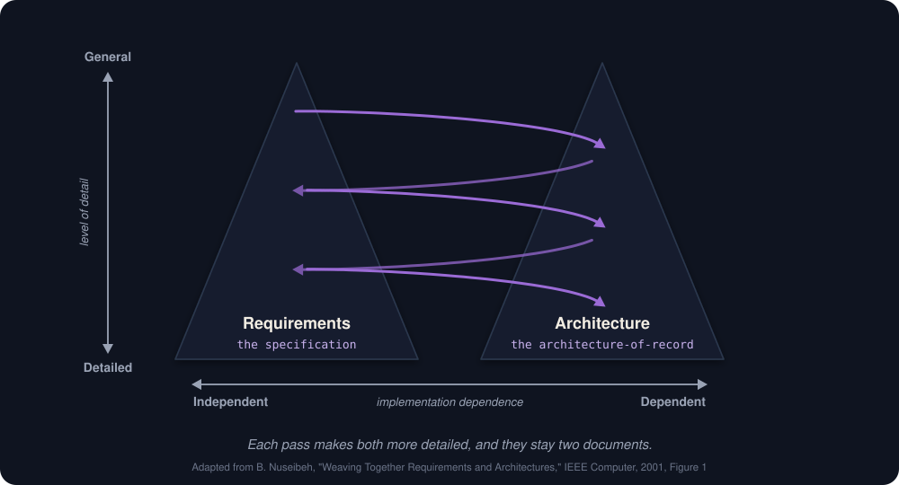
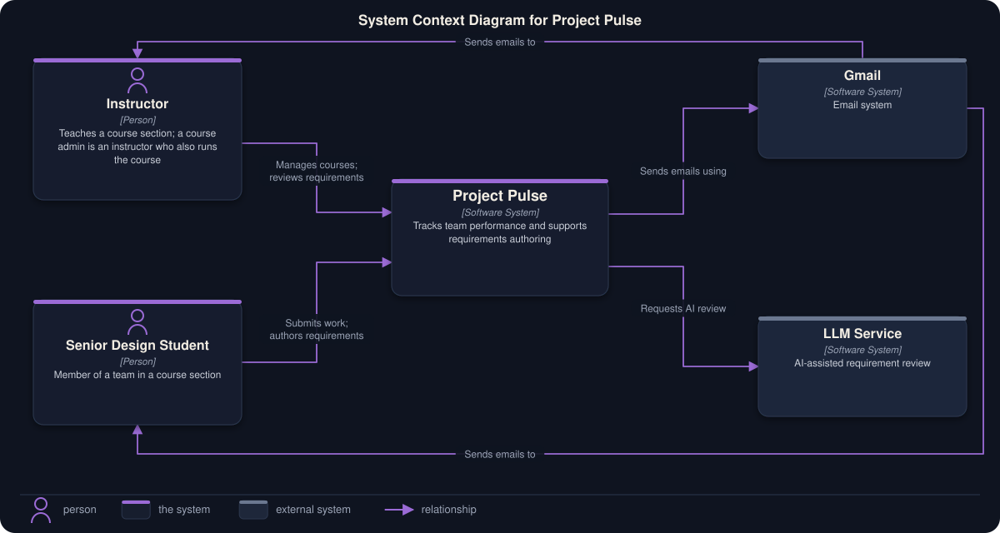
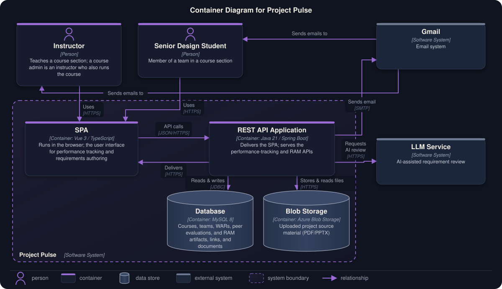
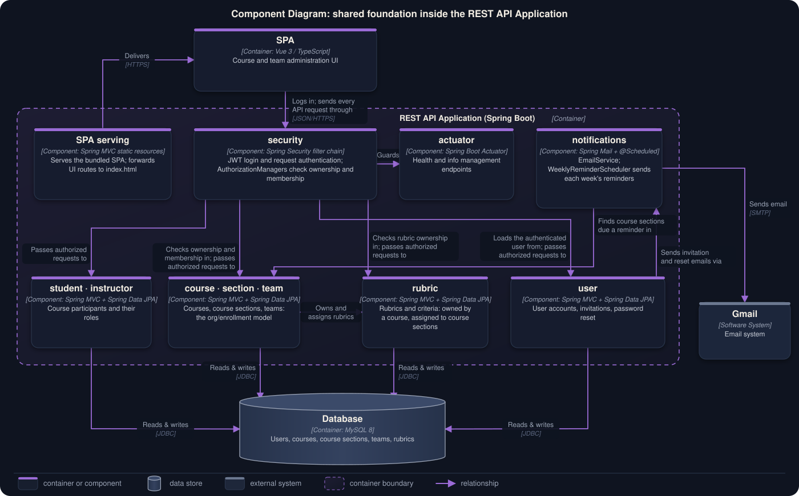
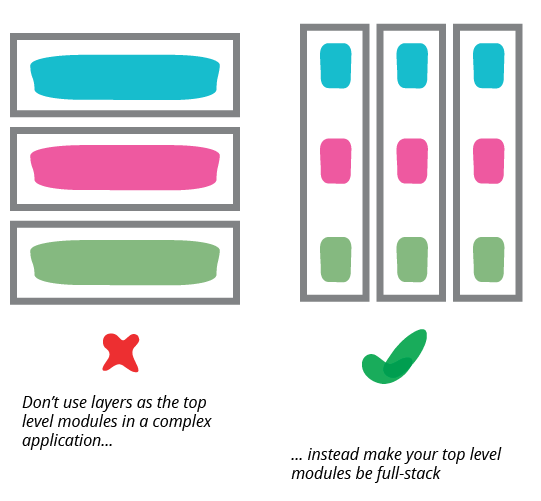
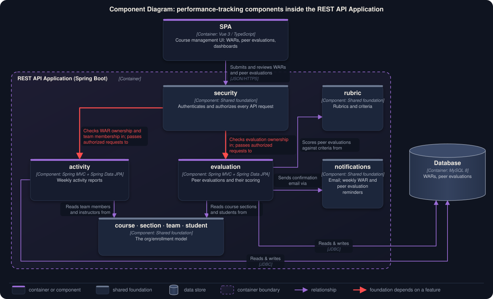
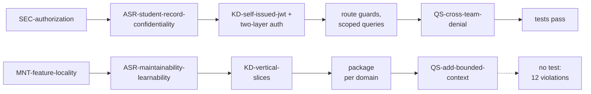

# Software Architecture, Just Enough

Week 6 · Decide what is expensive to change

## Team A: seven services

{ height="520" }

::: note
One service per use case area, each with its own database, behind a gateway, on Kubernetes. Each row is one service and the database it owns. Point at the four dotted amber arrows: each one is a network call that used to be a method call or a join.
:::

## Team B: one deployable

{ height="520" }

::: note
The same seven areas, as packages inside one application instead of services, and the same four calls, now method calls. Read the two counters in the top-right corners side by side. Gmail, the language model, and file storage are left off both because both designs use them the same way.
:::

## Two teams, one specification {.center}

::: ask
Both deliver every use case. Both pass every functional test. Which one should the client get?
:::

::: note
Take answers. Most rooms split, and some students pick A because it sounds more serious. Do not resolve it. The next slide gives the questions that resolve it.
:::

## The use cases cannot tell them apart

::: steps
- Who runs this after you graduate? **One instructor, no operations staff.**
- How many users? **About 75 a term.**
- What is the worst thing that can happen? **One student sees another's evaluations.**
- What changes most often? **Features, added by next year's students.**
:::

::: key
Team B is Project Pulse. Team A is what an agent proposes when nobody tells it those four answers.
:::

## Functionality tells you what components you need {.center}

::: key
Quality attributes tell you how to arrange them.
:::

::: note
This is the idea of the whole module. Say it, pause, and move on. Bass, Clements, and Kazman: the same features can be built on many architectures, and what separates good from bad, given both work, is how well each meets its quality attributes.
:::

## What architecture is

> The significant design decisions that shape a system, where significant is measured by cost of change.
>
> Grady Booch

::: note
Not boxes and arrows, not a technology list. Decisions. And the test for which decisions count is how much it costs to change your mind later.
:::

## The reversibility test

| Decide now | Decide later, against real code |
|---|---|
| One deployable or several | Class and method names |
| Where the data lives | Endpoint shapes |
| How users sign in | Table columns |
| Which external systems | Validation library |
| How code is divided into modules | Screen layout |
| Where the trust boundary sits | Error wording |

::: note
Left column is this week. Right column is week 7's design-of-record, one use case area at a time. Connect it to week 5: the pinning litmus. Pin what would be expensive to get wrong; derive the rest.
:::

## Breadth-complete, depth-shallow

::: cols
**Breadth-complete**

Every use case area, every component, every external system named. No holes in the map.
|||
**Depth-shallow**

Each part described to its responsibility and no further. Nothing designed before anyone has built against it.
:::

::: warn
The map with holes: two people build the same thing. The map that is too deep: you committed to guesses.
:::

## Twin Peaks

{ height="500" }

::: note
Nuseibeh, 2001. Requirements and architecture are built together, not in sequence, and each pass between them makes both more detailed. They stay two documents: the specification is the problem, the architecture-of-record is the solution. The first time you draw your context diagram you will find an external system no use case mentions. That sends you back to the specification with a question for your client. That is the process working.
:::

## Seven attributes, seven pushes

| Attribute | Project Pulse says | So the architecture has |
|---|---|---|
| Security | a student sees only their own team's work | a trust boundary; every query scoped |
| Maintainability | a new feature edits no sibling module | packages by domain |
| Availability | up 99% of a term | one instance, and that is enough |
| Performance | 500 ms at the 95th percentile | no needless network hops |
| Scalability | about 75 users, 100 at once | one deployable; uploads in object storage |
| Robustness | a crash loses at most 10 seconds | a save to the server at least every 10 seconds |
| Operability | one instructor, no operations team | one container, a staging slot |

::: note
Read it row by row: the left column is what students wrote in section 9 of their specification in week 4, the right column is the rest of this deck. Stop on availability: 99% of a term is about a day of downtime, and one instance passes. Ask what 99.99% would do (about 16 minutes a term; now you need redundancy). The number decides, not the adjective. Usability is the contrast: it is met screen by screen, so it rarely changes the structure.
:::

## Quality attributes decide it

::: steps
- **Delivered by shape, not by a component.** No class makes Project Pulse secure.
- **They conflict.** One deployable buys simple operations and costs independent scaling.
:::

::: joke
An architecture that maximizes every quality attribute is like a car that is the fastest, the cheapest, and the safest. Ask to see it.
:::

## Architecturally significant requirements

The few where a wrong guess costs a **redesign**, not a bug fix.

Rank each on two axes:

::: cols
**Importance to the client**

A privacy breach: high. 1.5 seconds instead of 1: low.
|||
**Difficulty to achieve**

75 users: low. 75,000 concurrent: high.
:::

::: note
The Software Engineering Institute calls this a utility tree. High on both, plus any hard constraint (a mandated platform, a regulation, a system you must integrate with), is the list.
:::

## Project Pulse's top four

| Rank | Requirement | Handles | Drives |
|---|---|---|---|
| 1 | Student records stay confidential (FERPA) | `SEC-authorization`, `SEC-ferpa`, `CO-ferpa` | `KD-ram-module`, `KD-self-issued-jwt` |
| 2 | One instructor, no operations team | `AVL-uptime`, `CO-no-ops-team` | `KD-modular-monolith`, `KD-relational-graph` |
| 3 | Next year's students can extend it | `MNT-feature-locality`, `MNT-service-layer` | `KD-ram-module`, `KD-no-codegen`, `KD-vertical-slices` |
| 4 | No lost work under concurrent editing | `ROB-no-overwrite` | `KD-section-locking` |

::: key
Reuse the identifiers you already have. Include at least one `SEC-*`.
:::

::: note
From the architecture-of-record on main, under Architecture Decisions. Seven in total; these are the top four. Not the same seven as the attribute slide: an ASR is a specific requirement, not a category, so availability feeds two ASRs and usability feeds none. Drives points at the key decisions each one forced, which is where Wednesday picks up. Row 4: real-time editing is deferred, so the MVP meets it with section locking, the simple way. The security rule: every client system this year stores something about a real person. If no security requirement makes the list, its protection was never designed.
:::

## Your architecture-of-record: arc42

::: cols
**You write**

1.2 Quality goals · 3 Context · 4 Solution strategy · 5 Building blocks · 6 Runtime · 7 Deployment · 8 Crosscutting · 9 Decisions · 10.2 Quality scenarios · 11 Technical risks
|||
**You link**

1.1 Requirements · 1.3 Stakeholders · 2 Constraints · 10.1 Quality attributes · 12 Glossary
:::

::: key
A fact written in two places is soon wrong in one.
:::

::: note
arc42, Gernot Starke and Peter Hruschka: a free template, twelve sections, each one question about the system. It says what to write, not how to draw; C4 is next. The template keeps arc42's order, numbering, and titles, so anyone who knows arc42 can find their way around yours, and Project Pulse's architecture-of-record fills every section. Five of the twelve overlap your requirements documents (sections 1, 2, 10, 11, 12): there the template cites by identifier or links, and adds only what the architecture needs. The order is by topic, not by when you write it: 6 and 7 wait for code and a pipeline. Each template section says when it is due.
:::

## One architecture, four views

| Template section | Answers | Drawn at |
|---|---|---|
| 3. Context and Scope | What is it, who uses it, what does it talk to? | Checkpoint 1 |
| 5. Building Block View | What is it made of, and who owns what? | Checkpoint 1 |
| 6. Runtime View | How do the parts carry out one use case? | Checkpoint 2 |
| 7. Deployment View | Where does it run, and how does a change get there? | Checkpoint 3 |

**arc42:** what to write · **C4:** how to draw it

::: note
Bridge from the ASR table: that says what the architecture must achieve; the rest of the document shows the shape that achieves it. A house has a floor plan, a wiring plan, and a site plan, one per trade. Kruchten's 4+1, 1995; arc42 inherits it. Template sections 8 and 9 are not views; they cut across all four. Security is Wednesday, the decisions are Wednesday.
:::

## Draw what you can know

::: cols
**Now, from the specification**

Context. Building blocks. These are the decisions you are making this week.
|||
**Later, from real code**

Runtime, after the proving slice. Deployment, after the pipeline.
:::

::: key
A sequence diagram of code nobody has written describes a guess.
:::

::: note
The reversibility test applied to diagrams, and Twin Peaks in practice. Project Pulse's versions of the two late views come after the C4 slides.
:::

## Drawing it {.center}

::: ask
Who has seen an architecture diagram they could not read without its author in the room?
:::

## C4: abstractions before notation

::: steps
- **Software system:** the whole thing your team builds
- **Container:** anything that runs or stores data (not a Docker container)
- **Component:** related functionality behind one responsibility
- **Code:** the classes
:::

One diagram per level: **Context · Containers · Components · Code**

::: note
Simon Brown's C4 model. Agree on the things first, the shapes second. The four levels are zoom levels on a map: zoom out for context, zoom in for detail, and you only draw the zoom levels your conversation needs. Level 1 draws template section 3; levels 2 and 3 draw section 5.
:::

## Level 1: context (template section 3)

{ height="520" }

::: note
Project Pulse's context diagram, from its architecture-of-record on main. Say this once, here: this slide, the next two, and the RAM and performance-tracking slides on Wednesday are the module's mermaid C4 diagrams redrawn as SVG for the projector, with every box, description, arrow, and label kept, because mermaid's own C4 layout is unreadable projected. In your project you write mermaid; it diffs in git and your agent can read it. The system is one box. Two kinds of person, two external systems, and every arrow says what it does. This is the diagram your client can read. The LLM service is planned: no code calls it yet, but it is on the map so nobody discovers it late.
:::

## Level 2: containers (template section 5.1)

{ height="430" }

::: key
What runs, what stores data, which technology, and the protocol on every arrow.
:::

::: note
Open the system box. Four containers. The SPA and the REST API are two containers although they ship in one jar: a container is something that runs, and the SPA runs in the browser while the API runs on the server. The Delivers arrow is the API handing the SPA to the browser. Blob Storage is its own container because uploaded files grow and the database should not. Blob Storage and the LLM service are planned, with no code yet: a real architecture runs ahead of its code, and an honest one says which parts are planned.
:::

## Level 3: components

{ height="520" }

::: note
Zoom into one container, the REST API application: its shared foundation. Point at the four ways in: API calls from the SPA, the static files that deliver the SPA, the actuator, and the reminder schedule, which fires on a clock with nobody asking. Those four are the attack surface, and the credential leak you will see on Wednesday came through one of them. Then the direction: every request reaches the org model, rubrics, and users only through security. Project Pulse draws two more of these, performance tracking and RAM, in its architecture-of-record.
:::

## Level 3 and 4

::: cols
**Components: a table, template section 5.2**

One row per use case area. Responsibility, dependencies, status.
|||
**Code: never by hand**

Your IDE and your agent draw it from the code when you need it.
:::

::: note
A component diagram with controllers and services is design. It belongs in the week 7 design-of-record for that area.
:::

## Diagrams that stand alone

::: steps
- A title that says what and which kind
- Every box: name, type, technology, one-line responsibility
- Every arrow labelled with what it does
- Strip the colors: does it still read?
- A key for anything beyond boxes and arrows
- Icons supplement text, never replace it
:::

::: joke
A diagram made of cloud-provider icons tells you exactly what was bought and nothing about why.
:::

## The two views that wait

::: cols
**Runtime**

Sign-in, a two-hour JWT, then an ownership or membership check on every request
|||
**Deployment**

One Azure Web App, one container, a staging slot swapped into production
:::

::: key
Real endpoints, real token lifetimes, real slots: facts that exist only once the code and the pipeline do.
:::

::: note
Project Pulse's runtime and deployment views, from its architecture-of-record on main; both diagrams are in the module. Neither could have been written before the code and the pipeline existed. One caution: Blob Storage and the LLM service appear on its diagrams with no code calling them yet. A real architecture runs ahead of its code; say which parts are planned, which is what the provisional status in the component table is for.
:::

## Monday, in one line {.center}

::: key
Architecture is the expensive decisions, chosen by quality attributes, drawn so it reads without you.
:::

::: note
Wednesday: how to divide it, how many deployables, the trust boundary, what every component does the same way, and how to write a decision down. Friday is Checkpoint 1, and you draft this document in the room.
:::

## Where components come from {.center}

::: key
Your use case areas.
:::

## Project Pulse, area by area

| Use case area | Package |
|---|---|
| `WAR`, `EVA`, `RUB` | `activity`, `evaluation`, `rubric` |
| `SEC`, `TEA`, `STU`, `INS` | `section`, `team`, `student`, `instructor` |
| The RAM areas | five packages under `ram/` |
| Cross-cutting | `security`, `system`, `course` |

::: note
From backend/src/main/java/team/projectpulse on main. Each component becomes a top-level package once its first use case is built (not a Vue component, which is a piece of the user interface). Two lessons. Every area has a home, but not necessarily its own: the RAM areas share five packages, and `course`, the root of the org model, belongs to no area. And the cross-cutting components are named, or every area builds its own email sender and permission check.
:::

## By layer, or by domain?

::: cols
**By domain: Project Pulse**

```text
activity/
├── Activity.java
├── ActivityCategory.java
├── ActivityController.java
├── ActivityRepository.java
├── ActivitySecurityService.java
├── ActivityService.java
├── ActivitySpecs.java
├── ActivityStatus.java
├── converter/
└── dto/
```
|||
**By layer: the same files, rearranged**

```text
controller/ActivityController.java
service/ActivityService.java
service/ActivitySecurityService.java
repository/ActivityRepository.java
repository/ActivitySpecs.java
model/Activity.java
model/ActivityCategory.java
model/ActivityStatus.java
dto/ActivityDto.java
converter/ActivityDtoToActivityConverter.java
converter/ActivityToActivityDtoConverter.java
```
:::

::: ask
The most common change on any project is "change how this one feature works." How many folders do you open in each?
:::

::: note
One versus six. The left is Project Pulse on main. The right is made up: the same weekly activity report files with only the folders moved, no code changed. At Project Pulse's size those layer folders would hold 19 controllers, 30 services, 37 data transfer objects (DTOs), and 50 converters. Layering is good, inside a domain; as the top-level division it spreads every feature across the tree. KD-vertical-slices records the choice. Same "vertical" as the proving slice: that slice is one use case through every layer, and this package holds all of an area's slices.
:::

## Nobody demos maintainability

::: key
60 to 90% of what software costs is spent changing it after it ships.
:::

::: note
Sommerville, ch. 9 (Lientz and Swanson 1980; Erlikh 2000). This is MNT-feature-locality from the attribute slide: a new feature edits no sibling module. The client never sees it, only its price, in how slowly each later feature arrives. Project Pulse ranks it third because next year's students extend the code. Yours: whoever runs it after you graduate, question 11 of the interview guide.
:::

## Domain first, layers inside

{ height="420" }

::: note
Martin Fowler, PresentationDomainDataLayering, 2015 (martinfowler.com). Layers are the right idea at a small scale and the wrong top-level division once any layer gets big: split the top level by domain and layer inside each module.
:::

## One slice of the cake

{ height="460" }

::: note
Project Pulse on main. The layers run across every package; each package is a slice cut straight down through them. Everything a weekly activity report needs, from the endpoint to the repository, sits in the activity column. A change to how reports work stays in that one slice.
:::

## The compiler can hold the line

```java
package team.projectpulse.activity;

interface ActivityRepository        // no "public"
        extends JpaRepository<Activity, Integer> { }
```

::: key
Package by domain, and the compiler keeps other features out of your repository.
:::

::: note
Package-private: no modifier, visible only inside the package. Packaged by layer, the repository must be public, because the service is in another package. Packaged by domain, it need not be, and Spring Data still finds it. Project Pulse's is public today; the only class outside activity that uses it is the seeder. Sub-packages are separate packages, so keep the domain package flat.
:::

## The deletion test

::: ask
Delete `activity/` from Project Pulse. What breaks?
:::

::: note
Three files: two authorization managers in security, which are TD-feature-locality debt, and the data seeder, exempt by design because it loads demo data for every feature. The test finds candidates; you decide which are debt. Backend only: its Vue views and migrations live elsewhere.
:::

## Features lean on the foundation

{ height="520" }

::: note
Project Pulse's performance-tracking component diagram, the module's C4 redrawn for the projector; the shared foundation is in grey. This is the rule KD-vertical-slices records, drawn out: a feature depends on the shared foundation, never on a sibling feature. activity and evaluation have no arrow between them, so either can change without touching the other. Project Pulse's QS-add-bounded-context makes that checkable, and its own code does not fully meet it yet: the two red security arrows are the catch, because three of security's authorization managers import the activity and evaluation security services, so the foundation depends on the features. TD-feature-locality records it, and the fix is to move those managers next to the feature they guard.
:::

## Divide the team the same way

::: key
A defect where two layers meet belongs to nobody when the layers belong to different people.
:::

::: note
Conway, 1968: systems mirror the communication structure of the teams that build them. This is why every member is full stack and work is divided by use case.
:::

## One deployable or several? {.center}

::: ask
Your template requires exactly one decision by Friday. This is it.
:::

## What microservices buy

::: steps
- Scale one part without the rest
- Deploy one part without the rest
- One team per service, in any language
- One failure does not take down the rest
:::

## Where that pays off

**Tmall, Singles' Day, November 11, 2019**

::: key
544,000 orders per second at peak.
:::

::: note
At that load checkout and browsing have completely different traffic shapes, and hundreds of teams need to ship without coordinating releases. That is the problem microservices solve. Now ask how many orders per second your client has.
:::

## What they cost

::: steps
- Every call is a network call: slow, failing, or half done
- A transaction across three services is no longer a transaction
- A bug report needs tracing across services
- Every service needs its own pipeline, monitoring, and on-call
:::

::: warn
None of it delivers a use case.
:::

## Monolith first

::: cols
**Fowler**

Almost every successful microservice system started as a monolith that was split. Almost every one built as microservices from day one got into serious trouble.
|||
**Prime Video, 2023**

Moved a monitoring service from distributed serverless components into one process. Infrastructure cost fell by over 90%.
:::

::: note
Why: you cannot draw good service boundaries until you understand the domain, and you understand it by building it. In a monolith you move a boundary by moving a package. In microservices you move it by migrating data.
:::

## The one to aim for

![Three deployment shapes side by side. Monolith: one deployable with no boundaries inside and one database; to move a boundary, untangle the code first. Modular monolith, marked as the one to aim for and as Project Pulse: one deployable divided into domain packages (activity, team, evaluation) that call each other in-process, one database; to move a boundary, move a package. Microservices: separate deployables with a database each, calling each other over the network; to move a boundary, migrate data between databases, and each service needs its own pipeline, monitoring, and on-call](img/deployment-shapes.svg){ height="480" }

::: note
A modular monolith: one deployable, divided inside by domain. Team A was the right-hand shape, Team B the middle one. Read the bottom strip: what it costs to move a boundary, and what it costs to run. Simple operations of a monolith, most of the maintainability of services, and the boundary already drawn if one module ever needs to scale alone. This is Project Pulse, KD-modular-monolith plus KD-vertical-slices.
:::

## The question for your project {.center}

::: key
Which requirement would force several deployables?
:::

::: note
If nothing in the specification needs one part to scale, deploy, or fail independently, that is the answer and the rejected alternative. Your client has tens or hundreds of users, and someone has to run it after your team hands it off.
:::

## Patterns you will meet

::: steps
- You have met two already: **layered** and **microservices**
- A **pattern**: a reusable solution to a problem that keeps occurring
- **Two you will use:** layered, pipes and filters
- **Six to recognize**, so you can tell when an agent reaches for one without a reason
:::

::: joke
Microservices: the shape Project Pulse will need on the day it becomes every capstone course's go-to tool. We expect that any semester now.
:::

## Layered

{ height="450" }

::: note
This is the activity package from the "area by area" slide, opened up. The red arc is the rule: each layer knows only the one below it.
:::

## Three layers, three jobs

| Layer | Its job | Never here |
|---|---|---|
| **Controller** | Translate HTTP to the application | Business logic |
| **Service** | Carry out a use case: the business logic, the transaction | HTTP |
| **Repository** | Load and store data | Business logic |

::: note
Most layering bugs are code in the wrong layer. In Project Pulse, the rule that a student must be on a team before submitting a weekly activity report lives in the service, so no endpoint can skip it.
:::

## Where layering goes wrong

::: steps
- **Fat controller:** business logic every other way in skips
- **Skipped layer:** controller calls the repository directly
- **Database row on the wire:** return a DTO instead
- **HTTP in the service:** callable only from a controller
- **Logic hidden in queries:** access rules where no reviewer looks
:::

::: note
An agent makes every one of these unless your context says otherwise. The skipped layer is the tempting one: the service only passes the call through today, but the next piece of business logic needs a home.
:::

## Pipes and filters

{ height="450" }

::: note
Spring Security is a filter chain. Plant the amber question, "no rule matched?", and leave it: the trust boundary slides answer it.
:::

## Suppose Project Pulse takes off

::: key
500 universities. 150,000 students. Every reminder at 9:00 a.m. Monday.
:::

::: warn
None of the next six slides exists in Project Pulse's code today.
:::

::: note
One scenario for all six catalog patterns: Project Pulse has split into services and gained a mobile app, and the last week of the semester is when every instructor grades at once. Each slide's note says what the real code does instead.
:::

## Broker

{ height="420" }

**You need it when:** Many services, located and replaced dynamically.

**In practice:** Kubernetes Services, Consul, Eureka.

::: note
Copies of each service start and stop with load, so evaluation asks the broker for the team service by name. Today: an ordinary method call inside one application.
:::

## Publish-subscribe

{ height="420" }

**You need it when:** Work that can wait, spikes to absorb, many independent consumers of one event.

**In practice:** Kafka, Azure Service Bus topics, Spring events.

::: note
Today evaluation calls the email service directly for the confirmation. At scale it publishes one event, and grades, audit, and next year's analytics subscribe. Adding analytics changes no line in evaluation.
:::

## Message queue

{ height="420" }

**You need it when:** A job longer than a user will wait, or bursts the database cannot absorb.

**In practice:** RabbitMQ, Amazon SQS, Azure Service Bus queues.

::: note
UC-EXP-export-bundle is specified, not built. A bundle can take a minute and thousands of teams ask in the last week, so the API queues the job, answers at once, and emails the file. A burst becomes a longer line instead of an outage.
:::

## Source-replica

{ height="420" }

**You need it when:** Reads far above writes, or an availability target one server cannot meet.

**In practice:** MySQL replication, Azure MySQL read replicas.

::: note
Grading week: dashboards and searches far outnumber writes. Writes go to the source, reads to the replicas, and a replica is promoted if the source fails. Today: one MySQL server.
:::

## Main-worker

{ height="420" }

**You need it when:** Batch computation that can be parallelized.

**In practice:** Apache Spark, Jenkins agents.

::: note
Today WeeklyReminderScheduler loops over every course section on one server, and TD-duplicate-scheduler warns that a second server would send every reminder twice. One main splitting the work among workers fixes both.
:::

## API gateway

{ height="420" }

**You need it when:** You have already chosen microservices.

**In practice:** Spring Cloud Gateway, Kong, Azure API Management.

::: note
Browser, mobile app, and each university's learning management system enter through one door that authenticates, rate-limits, logs, and routes. Team A, from the start of Monday, had one.
:::

## Read that line as a requirement {.center}

::: key
If your specification contains none of those needs, your system uses none of those patterns. That is a correct architecture, not an unambitious one.
:::

::: note
Six slides, one "you need it when" each. Read the six as requirements, then ask the room whether any of them are in their specification. For almost every team the answer is no. Project Pulse today meets none of them, which is why it uses none of them.
:::

## The trust boundary

Between what you control and what you do not.

::: steps
- How does a user prove who they are?
- What may each role see, **beyond its role**?
- Where does sensitive data live?
:::

::: note
The second question is where real breaches happen. A student may read weekly activity reports, but only their own team's. Project Pulse checks it at the route and scopes the query to the team.
:::

## September 6, 2026

::: steps
- Security rules covered `/api/v1/**`
- Actuator lives at `/actuator/**`
- It fell through to `.anyRequest().permitAll()`
- One anonymous URL returned the production database and mail passwords
:::

::: warn
The secrets were in a vault and never in git. Every checklist item passed.
:::

::: note
Project Pulse, a real incident, found and fixed the same evening, credentials rotated. The full case is week 12 with observability. Today's point is only the boundary.
:::

## Nobody wrote a rule that made it public

It was the **absence** of a rule.

::: key
Deny by default. A new API endpoint fails closed until someone writes its rule.
:::

::: note
Pull request 61 on Project Pulse. The final permitAll is still there, because the same jar serves the Vue app to every browser: a consequence of KD-modular-monolith. So deny by default covers only the API: a new path outside it still falls through to permitAll, as actuator did, and needs its own rule. A deployment decision shaped the security surface. Draw the boundary around everything the deployable exposes, framework endpoints included.
:::

## Every session is a new teammate

::: ai
Session 1: `{"error": "Not found"}`. Session 2: a bare 500. Session 3: `LocalDateTime.now()`.
:::

::: note
Section 8 of the template: crosscutting concepts, what every component does the same way. Security is 8.1, what we just did; 8.2 is the rest. Any one convention is cheap on day one and expensive after forty endpoints disagree. With an agent it arrives faster: each session starts with no memory, so it picks whatever looks plausible. Week 5 opened on the Clock version of this; say "you have seen this one."
:::

## Project Pulse's rules, in one table

| Concept | The rule |
|---|---|
| API shape | `/api/v1/<resource>`; search is `POST /<resource>/search` |
| Envelope | Every response is a `Result`: flag, code, message, data |
| Errors | Services throw; one handler answers for all of them |
| Caller | Who is calling comes from `UserUtils`, nowhere else |
| Time | Calendar time from the injected `Clock` |
| Schema | Every change is a new Flyway migration |
| Code | No Lombok, no MapStruct; constructor injection |
| Client | Every browser call goes through one shared HTTP client |

::: note
From Project Pulse's Crosscutting Concepts and its charters; the module's table adds the file that shows each rule. Every row is something an agent would guess differently in each session. Point at one: search is POST /search with the criteria in the body, which nobody would infer from REST conventions alone. The requirements never mention any of this, and that is why it needs a home of its own: section 8 of the architecture document.
:::

## One error shape, everywhere

```json
{ "flag": true,  "code": 200, "message": "Find activity successfully", "data": { "activityId": 7 } }
{ "flag": false, "code": 404, "message": "Could not find activity with Id 999 :(", "data": null }
{ "flag": false, "code": 500, "message": "A server internal error occurs.", "data": "<the exception's own message>" }
```

::: ask
Read the last one. What could be in `data`?
:::

::: note
Project Pulse, main. Services throw, and one class, ExceptionHandlerAdvice, turns each exception into this envelope, so the Vue app handles every failure in one place and a new endpoint gets it for free. The catch: the fallback sends an unanticipated exception's message to the browser, and a database error's message can name tables and columns. A crosscutting concept spreads its flaws everywhere too. Time is the other worked example: calendar time comes from one injected Clock, fixed in development at Sunday Aug 20, 2023, 11:30 pm, half an hour before a week ends; elapsed time (token expiry, lock leases) uses the real clock, because a frozen clock would stop it. The rule has to say which time.
:::

## Logging: the rule nobody wrote

::: key
What is logged, at what level, and what must never be?
:::

::: warn
Project Pulse: Spring Boot defaults, five log statements, no answer.
:::

::: note
So every agent session decides for itself, and no two decide alike. For a system holding student records, write the last part first: never a password, a token, or the text of a peer evaluation.
:::

## Three places, one owner

::: steps
- **8.2 owns the reasoning**, written before the agent builds its second component
- **Point at the file that does it right**: the agent copies code better than it reads prose
- **The charter carries the one-line rule** and cites 8.2: the charter is always in context
- **Let a tool apply or check it** where one can: a formatter, a lint rule, an ArchUnit test
:::

::: key
A convention nothing checks is one you are trusting the agent to remember.
:::

::: note
Project Pulse does exactly this: its architecture-of-record's Crosscutting Concepts calls itself the conventions' one normative home, the charters restate each rule as a short reminder that links back, and a rule changes there first. Start with API shape, error handling, and time; template 8.2 lists the rest, now including code conventions, with when each starts to matter. Formatting never needs a line there: a formatter owns it.
:::

## Writing a decision down

::: steps
- **Driving requirements:** by identifier
- **Context:** why this was a question at all
- **Decision:** one or two sentences
- **Rejected:** what you did not choose, and why
- **Trade-off:** what it costs
:::

::: key
Without a rejected alternative it is a description. Without a trade-off you have not understood it.
:::

## Rewrite this {.center}

> **KD-database:** We use PostgreSQL.

::: ask
What is missing? Rewrite it in two minutes with your neighbour.
:::

::: note
Take two or three. Then show Project Pulse's KD-relational-graph: one relational database, not relational plus a graph database for requirement links, because a second store is a second thing to back up, migrate, and secure, and a team's graph is small enough for SQL. Trade-off: deep traversals are joins. That tells next year's team what not to propose, and when it would become right.
:::

## Follow one requirement down


```mermaid
flowchart LR
    s1["SEC-authorization"] --> s2["ASR-student-record-<br/>confidentiality"] --> s3["KD-self-issued-jwt +<br/>two-layer auth"] --> s4["route guards,<br/>scoped queries"] --> s5["QS-cross-team-<br/>denial"] --> s6["tests pass"]
    m1["MNT-feature-locality"] --> m2["ASR-maintainability-<br/>learnability"] --> m3["KD-vertical-<br/>slices"] --> m4["package<br/>per domain"] --> m5["QS-add-bounded-<br/>context"] -.-> m6["no test:<br/>12 violations"]
```

::: key
A chain with no test at the end is a decision you are trusting people to remember.
:::

::: note
Two of Project Pulse's chains, from its architecture-of-record and traceability matrix. Forward: does every significant requirement reach a proof? Backward: does every part exist because a requirement asked? Security is proved on every build. Maintainability is proved by nothing: KD-vertical-slices is recorded, the packages are drawn, and the code breaks the rule 12 times (TD-feature-locality), because nothing fails when it drifts. The recorded fix is an ArchUnit test. Checkpoint 1 asks for the first four links; week 8 teaches the whole chain.
:::

## Ask the agent for an architecture

::: ai
Microservices, a message queue, Kubernetes, a cache, an API gateway. Fluent, correct, and confident.
:::

::: ask
For each part: which requirement forces it?
:::

::: note
It proposes the architecture it has read about most, which was built for a company a thousand times your size. This is the Napkin's stack and bottleneck prompts, slowly: a boring default unless a requirement you can cite says otherwise. Then check the other direction: does every requirement in your table drive at least one decision?
:::

## The right-sized spoon {.center}

{ height="520" }

::: note
Every label on the spoon is a real answer to a real problem. Multi-AZ runs copies in separate data centers so one can burn down without an outage; that is what 99.99% needs. Project Pulse's `AVL-uptime` asks for 99%. Meme made with imgflip, shared by Vishakha Sadhwani on LinkedIn, April 2026; the photo's original source is unknown.
:::

## Friday: Checkpoint 1

::: steps
- Your TA reviews your **specification** with you, about eight minutes a team
- Your team **drafts the architecture-of-record** the rest of the hour
- Merged to `main` by **11:59 pm**
- Your TA checks it over the weekend, reply by **Sunday 8 pm**
:::

::: note
Assignment 2 is due before class the same morning. Before Friday: copy the template into docs/design, make sure every quality attribute in section 9 of your specification has a number, and read Project Pulse's quality goals and KD-modular-monolith, KD-relational-graph, KD-vertical-slices. The six-point checklist is on the Studio page; point at it, do not read it out.
:::

## Draft in this order

::: steps
- The ranked requirements table
- Context diagram
- Container diagram
- Component table, and its two checks
- Security, 8.1: name the boundary, answer the three questions
- `KD-deployment-shape`, last
:::

::: key
Your agent draws the diagrams. The ranking and the decision are yours.
:::

## Leave with this {.center}

::: key
Decide what is expensive to change. Let quality attributes choose. Cite the requirement, or cut the part.
:::
