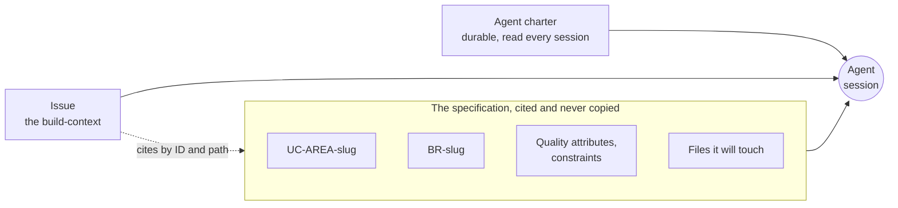

# Context Engineering

Week 5 · The specification is the context

## Hands up {.center}

::: ask
Who has pasted a whole file into a chat window this semester?

Who has pasted more than one?
:::

::: note
Let it land. Almost every hand goes up. Do not judge it, it is the natural move. The whole hour is about why it is the wrong instinct and what replaces it.
:::

## A small request

"Add a `createdAt` timestamp to the new entity."

The agent writes:

```java
this.artifact.setCreatedAt(LocalDateTime.now());
```

::: note
Ask the room: what is wrong with this line? Wait. Nobody will get it, and that is the point of the next slide. It is correct Java. It compiles. It passes review by eye.
:::

## Nothing is wrong with that line

Except in this repository.

::: steps
- Project Pulse's dev profile runs on a **frozen clock**: August 20, 2023, 23:30, `America/Chicago`
- Seeded weeks line up so a weekly activity report lands in the week the test expects
- `LocalDateTime.now()` bypasses all of it, silently
:::

::: warn
No comment at the call site. No compiler error. No failing lint.
:::

## The only thing standing in the way

From `backend/CLAUDE.md`:

> All time-dependent code must inject the `Clock` bean and use `LocalDateTime.now(clock)`, never `LocalDateTime.now()`.

::: key
That line is context engineering. No prompt would have produced it.
:::

## February 2024

::: cols
**Moffatt v. Air Canada**

Booking after his grandmother's death, he asks the airline's chatbot about bereavement fares.

The bot says: you can apply retroactively.
|||
**The airline's actual policy**

Said the opposite.

It was published on the same website.
:::

::: note
British Columbia Civil Resolution Tribunal, 2024 BCCRT 149, February 2024. Next slide is the airline's defence, so do not give it away here.
:::

## Air Canada's defence

The chatbot is **a separate legal entity**, responsible for its own actions.

---

The tribunal called this "a remarkable submission":

> While a chatbot has an interactive component, it is still just a part of Air Canada's website.

::: note
Read the tribunal's sentence out loud. It is the whole argument in nineteen words, and it is week 1's "you sign it" arriving from a court instead of from me.
:::

## Two lessons, and the second is ours

::: steps
- **You are accountable for what your agent says.** Week 1 settled this.
- **It was not a model failure.** The right answer existed, in writing, in the same system. Nobody put it where the agent would read it.
:::

## Where we are

::: cols
**Week 2**

The repository is the team's shared memory, and the only memory the agent has.
|||
**Weeks 3 and 4**

You wrote the glossary, use cases, business rules, and the specification.
:::

::: key
Week 5: that specification is the context. Now learn to aim it.
:::

## Week 2 ended on this

> Connecting Slack gives your agent **more text, not better context**.

The same is true of your repository.

::: note
This is the hinge from week 2 into week 5, and it is worth saying out loud that it was planted three weeks ago on purpose.
:::

## The window is a budget

Everything competes for the same fixed space:

::: steps
- your specification
- the code it has read
- the conversation so far
- the output it is generating
:::

## How big is the budget?

| Model | Advertised window |
|---|---|
| Claude Opus 5, Sonnet 5, Fable 5 | 1M |
| GPT-5.x | ~1M |
| Gemini 3.1 Pro | 1M |
| Gemini 3 Pro, Llama 4 Scout | 10M |
| Claude Haiku 4.5 | 200K |

As of September 2026. These move constantly.

::: note
A million tokens is roughly a novel and a half. Let the room conclude that selection no longer matters. The next slide takes it away.
:::

## The advertised window is not the usable window {.center}

::: key
Quality does not hold to the ceiling. Plan on 40 to 50 percent of the number on the box.
:::

On a 1M model, that is 400K to 500K.

::: joke
Every context window is advertised the way a laptop battery is. Technically ten hours. Bring the charger.
:::

## So two things follow

::: cols
**Selection is the work**

Somebody decides which lines this task needs.

If you do not, the agent does, by guessing.
|||
**Relevance decays with volume**

Padding makes the signal harder to find.

The cost lands on your most specific instruction.
:::

::: warn
"I gave it the whole repository" is not an answer to "did it have what it needed?"
:::

## Your session fills up

| | |
|---|---|
| `/context` | How much room is left |
| `/compact` | Summarize and keep going. `/compact focus on <topic>` keeps the detail you name |
| `/clear` | Wipe the conversation, keep your login |

Copilot CLI compacts on its own at about **80%**, and pauses at **95%** to finish.

## Two judgments, not two commands

::: steps
- **Compaction is lossy.** A summary of your session is not your session, and it chose what to drop.
- Finished a task? `/clear`. Do not carry a summary of unrelated work into the next one.
- **Anything that must survive does not belong in the session at all.**
:::

::: key
That last one is week 2's thesis, now with a keystroke attached.
:::

## The agent does not read your repository {.center}

::: key
It searches it.
:::

## Agentic search

Claude Code builds **no index**. It runs the tools you would:

::: steps
- **glob** to find files by pattern
- **grep** to find content
- **read** to open what looks relevant
- then repeats, because what it learned changed what it looks for
:::

::: note
Early versions did use a local vector database. The team found plain search beat it: exact matches rather than fuzzy ones, nothing to rebuild, and no index drifting out of date while you edit. Codex and the others work broadly the same way.
:::

## But search for what?

::: ask
Nothing hands it the query. Where does the query come from?
:::

---

::: key
The model writes the query, the same way it writes code. It guesses what string would appear in code that does this thing.
:::

::: cols
**What it knows generally**

A Spring Boot service is `*Service.java`. A getter is `getX`.

Training data, not your project.
|||
**What it has read this session**

Your charter. The directory listing. Its own last three results.
:::

## Watch it work

"Why does a student with no evaluations show 0.0?"

| Turn | Move | Where it came from |
|---|---|---|
| 0 | reads `CLAUDE.md` | automatic |
| 1 | `glob **/*Evaluation*` | your word "evaluations" |
| 2 | narrows to `EvaluationService` | logic lives in the service here |
| 3 | `grep "average"` | your other word |
| 4 | reads `getPeerEvaluationAverage` | found it |

::: note
Four turns. Walk them slowly. The reason it took four and not fifteen is the next slide, and it is the payoff for two weeks of their own work.
:::

## Now ask it slightly differently

::: cols
**"peer evaluation average"**

Turn 1 greps `PeerEvaluation`.

**83 hits.** Four turns to the method.
|||
**"peer review score"**

Turn 1 greps `peerReview`.

**0 hits.** The codebase says `PeerEvaluation`.
:::

::: warn
A miss does not stop it. It widens, reads five wrong files, and gets there with your window part full.
:::

::: note
Both numbers are real, searched against Project Pulse `main` on 20 September 2026. Run the search live if the projector allows; zero results landing in front of them beats a slide claiming zero results.
:::

## Your glossary is your search index {.center}

::: key
The query is assembled out of your vocabulary. Naming consistency *is* the hit rate.
:::

> The glossary fixes vocabulary. Use the defined term in code identifiers and UI text, never a synonym.

::: note
Week 3 taught the glossary as discipline. This is the mechanical reason for it. Say out loud that this is the first time the glossary pays them back.
:::

## The worst case is an abbreviation

Project Pulse's requirements module is the package `ram/`.

Ask about "requirements authoring" and the agent greps `requirementsAuthoring`. **0 hits.**

---

What repairs it, one line in the root charter:

> a Requirements Authoring & Management (**RAM**) module

::: key
That is a charter doing search-enablement. It is also why this course makes you spell abbreviations out.
:::

## Which gives you the cheapest tip in the course

::: key
If you know which file it needs, point at it. `@path/to/File.java`
:::

Naming the file **skips the search**.

---

The alternative: it guesses a grep pattern, reads three wrong files, and arrives at the right one with your window part full and your credits part spent.

::: warn
Every wrong guess costs tokens you paid for and context you now cannot use for the answer.
:::

## But know which situation you are in

::: cols
**Point at it**

"Fix the bug in `@EvaluationService.java`"

You know. Don't make it hunt.
|||
**Let it search**

"Find where peer evaluation averages are computed"

You don't know. Pretending you do costs more.
:::

::: key
The honest way to save tokens is not shorter prompts. It is fewer wrong guesses.
:::

## The inversion

::: cols
**Before**

Thin user story meets a human developer.

Gaps filled from hallway conversation, intuition, "we all know how this works."
|||
**Now**

Thin user story meets something that has none of those.

Gaps are not filled. They are **guessed**, fluently.
:::

::: key
A vague requirement used to cost you a conversation. Now it costs you code.
:::

## Context splits by lifespan

| | Durable | Per-task |
|---|---|---|
| **Artifact** | The agent charter | The issue for one use case |
| **Written** | Once, then grown | Every time |
| **Scope** | Everything true of the project | One unit of work |
| **Read** | Every session | When you point at it |

::: note
Week 2 owns the left column: what a charter carries, why conventions sit next to the code, the one file every tool reads. Do not re-teach it. Today is the right column.
:::

## A build-context

Everything the agent needs for **one unit of work**, gathered in one place.

In this course: the place is the **issue**, the unit is **one use case**.

## The rule

::: key
Cite the specification. Never copy it.
:::

## Why copying is a defect

::: steps
- Paste the use case into the issue, and you now have **two** use cases
- One gets edited Thursday. The other does not.
- Nothing tells you which one the agent read.
:::

::: warn
You have manufactured the exact drift the method exists to prevent.
:::

## Project Pulse does this to itself

From the root charter, pointing at the architecture document rather than restating it:

> When the architecture changes, update *that* doc; the summary below is just orientation for working in the code.

## What the agent actually reads



## So what does the issue say in its own words?

Only the residue:

::: steps
- the decision from this week's client meeting that has not reached the spec yet
- why this use case is being built before that one
- the file you already know it will have to touch
:::

::: key
Writing a paragraph that belongs in the specification? Put it in the specification. Then cite it.
:::

## Monday, in one line {.center}

::: key
Context engineering is a selection problem, not an accumulation problem.
:::

## Napkin, round 1 {.center}

Twenty minutes. You know the drill.

::: note
Wednesday opens here. Run it as usual: five minutes alone and silent, four reconciling with your neighbour, then the agent's napkin and the diff in both directions.
:::

## What the diff just showed you

::: key
Every line where you and the agent differ is a piece of context one of you had and the other did not.
:::

::: note
This is why round 1 moved into lecture this week. The napkin is a context exercise: your context against its context, and the gap list is the output.
:::

## Four questions the code cannot answer

::: steps
- How do I run it, and what is true about this environment?
- What must I not do?
- Which precedent do I copy, when the code disagrees with itself?
- What does this word mean here, and who may do what?
:::

## 1. Environment

The `Clock` rule from the start of the hour.

Also: the three services and their start order, the dev credentials, and the fact that dev recreates the schema on every restart while production runs Flyway migrations.

## 2. What must I not do

From `backend/CLAUDE.md`:

> Extend these packages, don't fork the architecture for RAM.

::: key
Code records what was built. It never records what was ruled out.
:::

::: note
An agent asked to add a module will build a clean new thing beside the old one. That instinct is not unreasonable. It is just wrong here, and only a human knows why.
:::

## 3. Which precedent?

An agent imitates what it sees. Two conventions in one codebase, and it copies the nearest one, confidently.

From `frontend/CLAUDE.md`:

> Use entity-first, PascalCase, multi-word names. **NOTE:** some existing pages use verb-first naming (e.g. `AddActivityForm.vue`, `EditStudentForm.vue`), these should be refactored to entity-first in the future.

::: note
The charter names its own inconsistency. Hold this slide, it comes back Wednesday as evidence.
:::

## 4. Vocabulary and policy

The glossary fixes what a word means. The business rules fix who may do what.

Both are **cited**, never restated. Which is why weeks 3 and 4 insisted on them.

::: key
And Monday gave you the mechanical reason: the glossary is what makes the agent's first search land.
:::

## The question this course keeps asking

::: ask
How do you know when you have supplied enough?
:::

## The bad answer

How thorough the prompt felt.

How long the issue is.

How confident you were.

::: warn
All three are uncorrelated with whether the agent had what it needed.
:::

::: key
Sufficiency is a property of the result. So measure it on the result.
:::

## Test 1: the questions test

::: cols
**Well-contexted**

Asks few questions. It can find the answers.
|||
**Badly contexted**

Asks none. It cannot tell what it is missing, so it invents.
:::

::: warn
Silence is ambiguous.
:::

---

Disambiguate it: **ask for its assumptions before it writes any code.**

Assumptions you did not supply and did not intend are your gap list.

## Tell it to push back

From Project Pulse's root charter:

> The spec is authoritative but not infallible. When a step is ambiguous, an assumption breaks against the existing code, or requirements contradict, ask a clarifying question or challenge the spec; don't silently comply or silently invent.

::: key
A question from the agent is the cheapest defect report you will ever get. It arrives before the code exists.
:::

## Your tool has a mode for this

**Shift+Tab** in Copilot CLI cycles: standard → **plan** → autopilot.

Plan mode works out what it intends to do, and shows you, **before it touches a file**.

::: note
Claude Code has the same thing. Demo it live if the room is with you: Shift+Tab, then hand it the issue from Monday.
:::

## Read the plan for the right thing

::: cols
**Not this**

"Is this plan safe?"

That is a code-review question, and you are not reviewing code yet.
|||
**This**

"What is in here that I never told it?"

A file you did not mention. A rule you never wrote down.
:::

::: key
The plan is a gap list that wrote itself.
:::

---

**When to use it:** multi-step work, context you are unsure of, changes that are expensive to unpick.

**When to skip it:** a one-line fix, where reading the plan costs more than reading the diff.

## Test 2: the diff test

Compare what it built against what you wrote. Every difference is one of two things:

::: cols
**A defect in the code**

Fix the code.
|||
**A gap in the context**

Fix the context.
:::

::: warn
The failure mode is fixing the code and leaving the gap. Then the next use case arrives with the same defect.
:::

## Test 3: the count

A written rule leaves a trace in what gets built. So audit it.

| Built | Pages | Convention |
|---|---|---|
| Foundation, **before** the charter | `AddActivityForm.vue`, `EditActivityForm.vue`, `CommentActivityForm.vue`, `EditStudentForm.vue`, `SubmitTeamsEvaluations.vue` | Verb-first |
| RAM, spec-first **under** the charter | `RamDocuments.vue`, `RamDocumentEditor.vue`, `RamGlossary.vue`, `RamUseCases.vue` | Entity-first, 4 of 4 |

::: note
Verified against Project Pulse `main` on 20 September 2026. Say out loud that they can run this check themselves in two minutes on their own repository, and that this is what a sufficiency claim looks like when it is evidence rather than a feeling.
:::

## The written line changed what got built {.center}

::: key
And the note warning that the old code disagreed is what stopped the agent copying the nearest precedent.
:::

## You can be wrong in two directions

## Under-specified

Plausible, and wrong.

::: steps
- Wrong premise in, and the wrong thing arrives complete, tested, and expensive to reverse
- The tell: review finds nothing, because it **is** good code
- It answers a question you did not ask
:::

## Over-specified

::: steps
- The issue dictates class names, method signatures, the order of the statements
- That is a design document, and you wrote it
- You did the expensive half and delegated the cheap half
- Nothing is left to review, because you already know what it says
:::

::: joke
An issue that specifies every method signature has a name. It is called "the code", and we already own a tool that turns that into a binary.
:::

## The line between them

::: key
If guessing it wrong would violate a requirement, the specification pins it. Otherwise the agent derives it.
:::

::: cols
**Derived**

Column lengths, indexing, nullability, the internal shape of a service.
|||
**Pinned**

Key formats, status transitions, validation rules, anything a business rule constrains.
:::

::: note
This is Principle 8 of the method. What matters in the room is that it is a test they can apply to a single line of an issue, right now.
:::

## Context is earned

Week 2 told you to write the charter thin, and said it would grow.

This is how it grows.

## Every rule in it is a scar

Project Pulse's backend charter, in its own margins:

> It had drifted. `PATCH /users/{userId}` was bound to a manager that recognised only `/students/`, `/instructors/` and `/evaluations/evaluators/`, so it denied every request from the day it was written.

---

> Every cross-team defect found in September 2026 was one of the two missing: the glossary routes had neither; the document-section GET had a scoped query but no rule; the artifact and use-case lookups had a rule but no scoping.

## And then it converts the lesson

Not a principle the agent can agree with. Something it can act on:

> **The smell to grep for:** a service method that accepts `Integer teamId` and never mentions it in the body.

::: key
A charter that never grows is a charter nobody is learning from.
:::

## Assembled the same thing three times?

Then the assembly is worth packaging: a custom command, or a skill file that carries the steps.

Week 7, where the design and implementation gates give one something to do.

::: warn
Write them by hand first. A wrapper around a thing you have never done teaches you the wrapper.
:::

## The loop {.center}

::: steps
- The agent gets something wrong
- You decide: was the fault in the code, or in the context?
- When it was the context, bank the lesson where the next session will read it
:::

## Friday studio

::: steps
- Your TA checks week 4's requirements work first, fifteen minutes
- Pick the use case your team will build first
- Write its issue as **citations**: the `UC-<AREA>-<slug>`, the `BR-*` rules, the attributes and constraints that bite, the paths
- Then run the questions test on it, and close the gaps it exposes
:::

## Assignment 2: Spec a feature

Write a use case with acceptance criteria for a feature Project Pulse is **missing**, turn it into a build-context, then evaluate what the agent produced against what you wrote.

::: note
Announce the date from the assignment page. Say plainly that it is graded on the specification and on your evaluation of the gap, not on whether the generated code ran.
:::

## Leave with this {.center}

::: key
Selection, not accumulation. Cite, never copy. Measure the result, not the prompt.
:::
