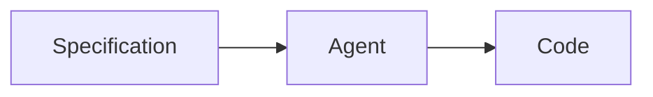
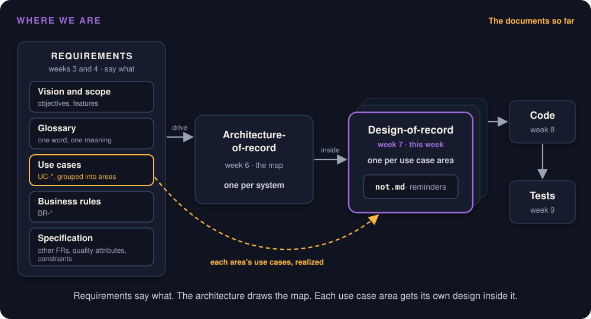
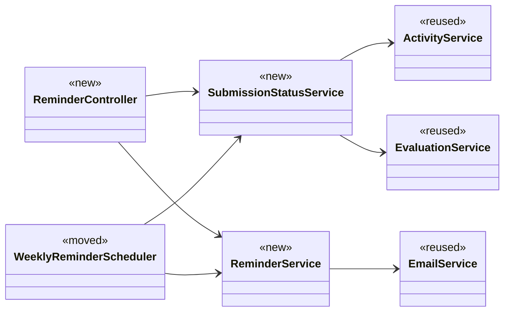
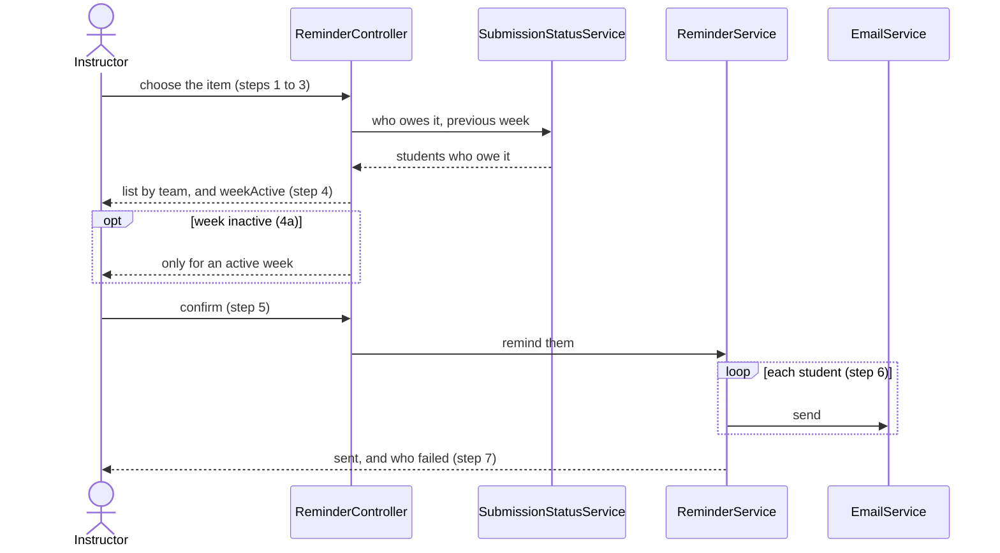
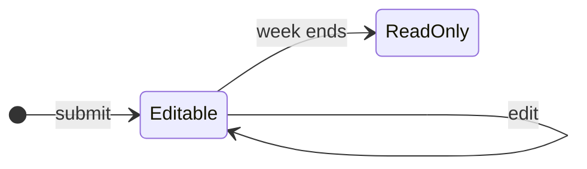
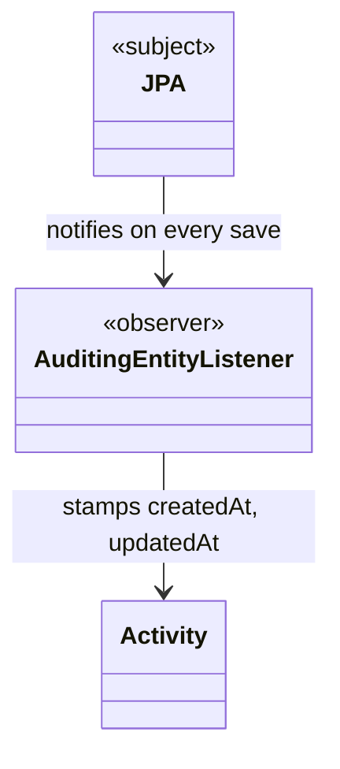

# Design-of-Record

Week 7 · The last document before the code

## Hands up {.center}

::: ask
Who got a Project Pulse reminder this term for something they had already submitted?
:::

::: note
Most hands go up. Assignment 2 asked you to specify the fix: remind only the students who have not submitted. You have the use case. Can an agent build from it?
:::

## The tutorial recipe

::: ask
What does your use case not decide?
:::

::: note
Many spec-driven tutorials stop here: write the requirements, hand them to the agent, take the code. The use case says what the system does. Take answers on what it leaves open before the next slide.
:::

## Five decisions the use case left open

::: steps
- Where is "has not submitted" computed: one shared service, or each feature on its own?
- Which part of the code owns the scheduler?
- May the request name the week, or does the server always compute it?
- Send during the request, or in the background?
- Keep a log of reminders sent?
:::

::: note
All five come from the Key decisions of Project Pulse's docs/design/not.md, each with the alternative it rejected. The scheduler question is not idle: the shared foundation may not depend on the activity and evaluation features.
:::

## ...and the shape of the code

::: steps
- **Classes:** which exist, which are reused.
- **Sequences:** who calls whom, in what order.
- **Contract:** the endpoints, their inputs, outputs, and errors.
- **Tests:** what counts as done.
:::

::: note
The use case decides none of these either. In not.md: a new SubmissionStatusService beside the reused EmailService; a sequence diagram for the on-demand reminder and one for the scheduled one; POST /api/v1/sections/{sectionId}/reminders takes only { item } and returns 400 for an inactive week; and test rows such as "students who reported are not emailed". The design pins them as a class diagram, sequence diagrams, an API contract, and a test list.
:::

## Without a design, the agent decides

::: key
You review decisions you did not know were made, after they were built. Ask twice, get two designs.
:::

::: note
The agent returns one pull request: a controller, services, the scheduler, a dialog, and their tests. You can read it line by line, but every one of those five decisions is buried in it. Written as a design, the same decisions take a few pages, name what was rejected and why, and can be argued over before any code exists. Code review then checks the code against decisions already approved.
:::

## The design keeps the why {.center}

::: key
The code says what it does. Only the design says why.
:::

::: note
Months later someone asks why the scheduler moved out of system, or why the request carries no week. The code cannot say. Project Pulse's traceability matrix links the reminder's use case to its section of not.md; from week 8 the chain runs on to the code and tests. Skip the design and the chain has a hole in the middle, which the next agent session fills with a guess. Point forward to week 8 and do not teach traceability here.
:::

## Eraser or sledgehammer {.center}

> ***You can use an eraser on the drafting table or a sledgehammer on the construction site.***
>
> Attributed to Frank Lloyd Wright, American architect

::: note
Bring it back to the reminder. Moving the scheduler out of system, or deciding the request carries no week, is an eraser in not.md: a line changed in a pull request a teammate reviews. After the agent has built it, the same change touches a controller, services, the scheduler, a dialog, and their tests. Wright knew the sledgehammer: Fallingwater's cantilevers sagged for decades and were reinforced in 2002.
:::

## The last document before the code {.center}

::: key
What the design leaves open, the agent decides. Silently.
:::

## Where we are

{ height="520" }

::: note
Walk it left to right. Weeks 3 and 4 wrote the requirements: vision and scope, the glossary, use cases, business rules, and the specification. Week 6 drew one architecture for the whole system. This week each use case area gets its own design inside that map; Project Pulse's first is not.md. Week 8 builds the code from it, and week 9 tests it. The chain from use case to test is week 8's traceability; here it is only the map. The design also becomes the agent's build-context in the week 8 studio, which is week 5's idea arriving on time.
:::

## Two levels of design

| | Architecture-of-record | Design-of-record |
|---|---|---|
| Covers | The whole system | One use case area |
| Stops at | Each component's job | What the agent can safely derive |
| How many | One | One per area |
| Written | Before any code | Before this area's code |

::: note
Week 6 drew the map and stopped at responsibilities. This week goes one level down, inside one area, against real code. Project Pulse's worked example is docs/design/not.md, the design for the reminder.
:::

## Code review before there is code

::: steps
- **Written first, approved first.** Nobody builds from it before then.
- **Cites, never restates.** The use case says what. The design says how.
- **One per area, revised in place.** Not a stack of per-use-case sections.
- **Stays true.** The code changed? The design changes in the same pull request.
:::

::: joke
Weeks of coding can save you hours of planning.
:::

## Old idea, new author

::: cols
**Industry: the RFC**

A proposal, reviewed and approved before it is built. IETF, Rust, Sourcegraph, Oxide.
|||
**Here: the design-of-record**

Usually drafted by the agent, after your sketch. Reviewed by you. The review is the skill.
:::

::: trace Trace: use case to design-of-record
The design's header names every use case it realizes. The traceability matrix's Design column points back.
:::

## How much to write?

::: key
If a wrong guess would break a requirement, pin it. Otherwise, let the agent derive it.
:::

::: note
Principle 8 of the method, applied to design. A requirement here includes a business rule, a quality attribute, and the contract between two parts of your own team.
:::

## Pin or derive?

| Detail | Wrong guess breaks something? |
|---|---|
| What "not submitted" means for a peer evaluation | Yes: wrong students reminded |
| Which week a WAR reminder is about | Yes: wrong week reported |
| Whether the request carries the week | Yes: a closed week reopened |
| The method's Java name | No |
| Column types and getters | No |

::: note
Do the first three as a room before revealing the right column if you have time. The JSON field names are the interesting middle case: harmless unless two sessions guess differently, which is why the contract names them.
:::

## Greenfield changes the answer

::: warn
"Keep it lean, link to the code" assumes the code exists. In your proving slice it does not.
:::

::: steps
- List the files the agent should create, at the paths your conventions give them.
- Never drop the contract, the decisions, or the tests.
:::

## Firm the problem first {.center}

::: key
Before designing the solution, check the problem is sound.
:::

::: note
The challenge loop. Read the use case against the code and the other documents. Look for ambiguous steps, assumptions the code contradicts, requirements that disagree. The agent is told to do this rather than comply. Doing it first is the RFC rhythm: review the problem, then review the solution.
:::

## Six things the use case did not settle

| Finding | The fix went to |
|---|---|
| Two definitions that disagree | A new business rule |
| Scheduler checks the wrong week | The amended FR |
| Emails students who cannot submit | The business rule |
| Which week the WAR covers | The use case |
| Half-finished peer evaluations | The business rule |
| Foundation calls a feature | The design |

::: note
All six came from reading Project Pulse's code. The wrong week: the scheduler checks whether the current week is active, but both items are about the previous week, so the last active week's evaluation was never reminded and the first active week reminded one that could not be submitted yet.
:::

## Row one: two definitions

| Where | Decides "has not submitted" as |
|---|---|
| Instructor's WAR page, in the browser | No activity that week |
| Peer evaluation report, on the server | Evaluated nobody that week |

::: ask
Two places, two definitions. What could go wrong?
:::

::: note
SectionsActivities.vue and EvaluationService.generateWeeklyPeerEvaluationReportForSection, in Project Pulse. Take answers before the next slide.
:::

## Both are wrong, differently

::: steps
- The WAR page reads the first **200 activities** and **100 students**. With 77 students filing several each, people who submitted show up as missing.
- The report counts a student as done after rating **one** teammate. The back end saves one rating at a time.
:::

::: key
Nobody wrote down the answer.
:::

::: note
The truncation is a plain bug. "Evaluated anyone" is a term nobody defined, and a reminder built from the use case alone would have been a third answer. The fix went to the specification: a business rule, BR-submission-owed, that the reminder and both reports cite. Two implementors, two contradictory solutions, one confused instructor.
:::

## Read the right column {.center}

::: key
Most of what the challenge loop finds belongs in the specification, not the design.
:::

::: note
A finding about what the system must do is a requirements defect. Only the last row, how the code is arranged, is a design matter. Project Pulse marks a use case Problem-validated once this loop has run and its fixes are merged, and Designed once the solution is approved.
:::

## Finding the classes

::: steps
- **Grammatical:** nouns are classes, verbs are operations.
- **Domain:** start from what the domain already has.
- **Scenario:** walk a flow; whatever has no owner is a missing class.
:::

::: note
Sommerville: there is no formula, it takes skill, domain knowledge, and more than one pass. The three approaches work best together. Project Pulse's domain already had Section, Team, Student, Activity, PeerEvaluation, so none of those is new.
:::

## Walk the reminder: three jobs with no owner

::: steps
- Decide who owes what. **SubmissionStatusService**
- Send a batch, surviving failures. **ReminderService**
- Take the instructor's request. **ReminderController**
:::

::: joke
There are two hard things in computer science: cache invalidation and naming things. Project Pulse had two names for one fact, which is both.
:::

## The class diagram

::: note
Simplified from not.md; the full one carries the key operations. Classes, important operations, dependencies. Fields and getters belong to the code.
:::

## Reused is the most valuable word {.center}

::: key
It tells the agent to extend what exists instead of writing a parallel copy.
:::

::: note
A parallel copy is exactly how Project Pulse ended up with two definitions of "has not submitted".
:::

## Reading a sequence diagram

| Notation | Means |
|---|---|
| Solid arrow | A call; the caller waits |
| Dashed arrow | A return |
| alt / else | Exactly one branch happens |
| opt | Happens only if its condition holds |
| loop | Repetition |

::: note
Participants across the top, a lifeline down from each, time runs down the page. An activation bar shows when an object is busy. This is the core of a design-of-record, because it shows the one thing no single file can: how the parts cooperate.
:::

## The rule this course adds {.center}

::: key
Label every message with the use case step it implements.
:::

::: note
Then a reviewer can check every step is realized, and an arrow with no step is either a missing requirement or scope nobody asked for.
:::

## The reminder, step by step

::: note
Simplified. The full version in not.md includes the browser, the route guard, and extension 6a inside the loop. Point at the labels: every arrow has a step.
:::

## When to draw a state diagram

::: cols
Most objects do not need one.

Draw it where the lifecycle is where the bugs live.
|||

:::

::: note
A Project Pulse peer evaluation. It has no status field at all: the clock is the state (BR-evaluation-editable-until-close). An agent that does not see this adds a submitted flag and a Finalize button, because most evaluation systems it has read have one.
:::

## Two sessions, one contract

::: cols
**Session A** builds the browser side.
|||
**Session B** builds the server side.
:::

::: ask
They never see each other's code. What do they both read?
:::

::: note
The contract. This was true before agents, when a team split work across people. It matters more now. The idea underneath is Parnas's information hiding: callers depend on what an interface promises, not how it is built. Java's HashMap has been reimplemented more than once, and code written against its interface did not notice.
:::

## A contract row

| | |
|---|---|
| Endpoint | POST /sections/{sectionId}/reminders |
| Who may | The section's instructor, or the course admin |
| Request | the item only |
| Success | 200: number sent, who failed |
| Errors | 403 anyone else; 400 week inactive (4a) |

::: note
Five things per row. Field types and exact JSON are left to the agent, unless another system depends on the format.
:::

## Three things to notice

::: steps
- **Every extension has an error.** Or someone invents one.
- **A scheduled job is a contract too.** It has a trigger and a promise.
- **What is left out is a decision.** No week in the request.
:::

::: ask
Why does the request not carry the week?
:::

::: note
Answer: the server always reminds for the week currently due. A week from the client could ask students to submit a peer evaluation whose window has closed (BR-evaluation-submission-window), and a scope-setting value in a caller-controlled body is a security smell. One omission closes both.
:::

## Monday, in one line {.center}

::: key
Pin what a wrong guess would break: in classes, in sequences, in the contract.
:::

## Decisions name what they rejected

> **Where "has not submitted" lives.** One service, used by the scheduler, the reminder, and both reports.
> Rejected: each page computing its own list.
> Rejected: the report calling the new service, which makes a cycle.

::: note
Wednesday opens here. From not.md. Same form as the architecture's key decisions in week 6, with a smaller reach: a design decision is local to this area. A decision that affects the whole system is a KD entry in the architecture-of-record. No rival considered means it probably was not a decision.
:::

## Design patterns

::: steps
- **Name:** a word the whole team shares
- **Problem:** when it applies
- **Solution:** the arrangement of classes
- **Consequences:** what it costs
:::

::: note
Gamma, Helm, Johnson, Vlissides, 1994, the Gang of Four. The name is most of the value: "use an Observer" says in three words what would take a paragraph.
:::

## Observer, already in Project Pulse

::: note
Intent: when one object changes, its dependents are notified without the changing object knowing who they are. Activity and PeerEvaluation declare @EntityListeners(AuditingEntityListener.class). The entity never knows the listener exists. Nobody on Project Pulse wrote this pattern by hand; the framework did.
:::

## Problem to pattern

| When you need to | Pattern | In Project Pulse |
|---|---|---|
| Tell others something changed | Observer | JPA auditing |
| One simple front for many classes | Facade | Each service |
| Swap an algorithm | Strategy | The injected Clock |
| Query from optional criteria | Specification | ActivitySpecs |
| Convert between interfaces | Adapter | The Converter beans |

## A pattern no requirement needs

::: warn
Gold-plating. Ask what problem it solves in this area.
:::

::: joke
When all you have is the Gang of Four, everything looks like an AbstractSingletonProxyFactoryBean. (That is a real Spring class.)
:::

::: note
Agents reach for patterns readily, because pattern-heavy code is everywhere in what they learned from. "It is more flexible" is not an answer unless something in the specification needs the flexibility.
:::

## The data model change

::: cols
Show only what this area **adds**: tables, columns, the migration.

Link the domain model; never redraw it.
|||
The reminder adds **nothing**.

Rejected: a reminder log. A table, a migration, and seed data, to guard a double send the confirmation already guards.
:::

::: key
"No change", with a reason, is a decision. A blank section is not.
:::

## The test list, before the code

| Flow | Asserts |
|---|---|
| Main, peer evaluation | Rated two of three: reminded. Rated all: not. |
| 4a | Week inactive: 400, no email |
| 6a | One failed send stops nothing |
| Last active week | Its reminder still goes out |

::: note
Eighteen rows in not.md, one per flow, each with a level. This is the definition of done the reviewer approves. A missing extension shows up as a missing row. An agent asked to add tests afterward tests what it built, which by then proves nothing.
:::

## When the design finds the map wrong

::: steps
- The scheduler lived in the shared foundation.
- Deciding who owes needs the activity and evaluation features.
- The foundation may not depend on a feature.
- So: a new **notification** feature slice.
:::

::: note
MNT-feature-locality. Rejected: leaving it in system and recording technical debt. Rejected: splitting reminders between activity and evaluation, which sends a student who owes both two emails. This is Twin Peaks from week 6, happening for real.
:::

## Change the map in the same pull request {.center}

::: key
A design that silently disagrees with the architecture leaves two maps. The agent follows whichever it reads last.
:::

::: note
not.md's pull request also edits the architecture-of-record: a new component on the performance-tracking view, new owners in the subsystems tables. The template's "Changes to the architecture-of-record" section lists each one.
:::

## Is it enough? {.center}

::: ask
Week 5: how do you know you supplied enough context?
:::

::: note
The questions test: make the agent state its assumptions before it writes code. The design-of-record is where it pays most, because it is the last chance to fix a gap on paper.
:::

## The questions test, one level down

::: steps
- A **fresh** session, in plan mode.
- Give it only the use case, its rules, your crosscutting concepts, and the design.
- Ask what it would still have to guess.
- Each guess: fix the design, or say why a wrong guess breaks nothing.
:::

::: note
Fresh, so it carries nothing from the session that drafted the design. The prompt is in the template and in Project Pulse's pull request description. If there is time, run it live on not.md now.
:::

## Ready when {.center}

::: key
Nothing on the list could break a requirement.
:::

::: note
The list, with an answer to each item, goes in the pull request description. That turns "we think it is complete" into evidence a reviewer can read. The next slide is what it found on not.md.
:::

## What it found on not.md

| Found | Answer |
|---|---|
| 3 contradictions in the design | All fixed |
| 7 guesses worth pinning | Fixed: 6 in the design, 1 in the spec |
| 9 guesses that break nothing | Kept, each with a reason |

::: ai
The author reads what they meant. A fresh reader reads what is on the page.
:::

::: note
Pull request 89 on Project Pulse. Contradiction 1: the sequence diagram returned 400 for an inactive week, the contract returned 200 with weekActive false. Guess 4: the design admitted only the section's assigned instructors, but BR-section-scoped-access also lets the course admin who owns the course in; the review fixed both routes. Guess 5 went to the specification: a student does not owe an evaluation of a deactivated teammate. That is the challenge loop again, one level down. Open the pull request and show the list.
:::

## Sketch first

::: steps
- **You** sketch the sequence and the contract. Twenty minutes.
- **The agent** drafts from the template, in plan mode.
- **Compare.** Decide which is right, and why.
- **Questions test**, then the pull request.
:::

::: note
The reason is anchoring, the same reason the Napkin has you answer before the agent. Read a fluent, complete design first and your judgment shrinks to proofreading.
:::

## What the comparison shows

::: cols
**It found, you missed**

Goes into the design.
|||
**You knew, it could not**

Context your specification lacks. Fix the specification too.
:::

::: ai
A gap the agent filled with something plausible your client never said is the most dangerous line in the draft.
:::

## When the agent asks

::: cols
**Yours, or already in the spec**

Check the use case and its rules. Then answer.
|||
**The client's**

Do not pick. Fix the use case, or `OPEN-ISSUES.md`.
:::

::: note
In plan mode the agent stops and asks. In Claude Code that is the AskUserQuestion tool: a few questions, two to four options each, plus a free-text Other. Copilot CLI's plan mode asks the same way.

The example: not.md's first draft let only a section's assigned instructors send reminders. Offered as an option, a student would accept it, and it is wrong: BR-section-scoped-access already admits the course admin who owns the course. Check the specification before you click.

The right column is week 3's rule again: you cannot answer for the client. Say it, and tell them to use the same move before their next client meeting: let the agent interview you on what you know, and every "ask the client" goes on the agenda.
:::

## The options are its guesses {.center}

::: key
Read every option. **Other** is always there.
:::

::: ai
Your answers stay in the terminal. The questions test still goes in the pull request.
:::

::: note
Four tidy options anchor you exactly as a finished draft does. If none is right, type what is.
:::

## The design gate

::: steps
- The design, the specification fixes, and any architecture change: **one pull request**.
- The questions-test list in its **description**.
- Approved by a teammate who **did not write it**.
- No implementation branch until it **merges**.
:::

::: note
Project Pulse's not.md went through exactly this gate: pull request 89, with the specification commit, the design commit, and three commits answering the questions test. Show it.
:::

## LGTM {.center}

::: joke
LGTM: Let's Gamble, Trust Me.
:::

::: warn
A long, polished, agent-drafted design invites approval on sight.
:::

## Review it with questions

::: steps
- Does every extension have a branch or a test row?
- Does every message name a use case step?
- Could two sessions build from the contract alone?
- Does every decision name what it rejected?
- Does anything disagree with the architecture?
- Is every questions-test item answered?
:::

## Review this {.center}

::: ask
A design's sequence diagram has an arrow "send analytics event". No use case step mentions analytics. What do you write in the review?
:::

::: note
Two minutes with a neighbour, then two or three read aloud. A good answer: either it is a requirement nobody wrote, which goes to the client as a question and into the specification, or it is scope nobody asked for, which comes out. "Looks good" is not a review.
:::

## The proving slice

::: key
Build one use case all the way through before building the rest. Its job is to test the architecture.
:::

::: note
Phase B of the method. Boundaries that looked clean on the week 6 diagram meet real code, and the architecture is corrected while that is cheap. An architecture proven by a working slice beats one proven by inspection.
:::

## Pick it by risk

::: cols
**Good slice**

Touches the external system you are least sure of, crosses the trust boundary, or carries your hardest quality attribute.
|||
**Bad slice**

The login page. A list screen. Nothing your architecture was unsure of.
:::

::: joke
The first 90 percent of the code takes the first 90 percent of the time. The remaining 10 percent takes the other 90 percent. Build the risky 10 percent first.
:::

::: note
Tom Cargill, quoted by Jon Bentley. Your team already chose the slice: the riskiest use case your TA reviewed with you in week 5's studio.
:::

## Vertical {.center}

::: key
From the screen to the database, once. Every later use case copies its shape.
:::

::: note
Each layer's conventions (the error format, the time handling, the authorization pattern from section 8 of your architecture) get exercised in real code at least once.
:::

## Where it goes

::: steps
- **This week:** its design-of-record, merged.
- **Week 8 studio:** it becomes your agent's build-context.
- **Weeks 8 and 9:** the agent builds it.
- **Checkpoint 2:** it runs. Not described. Runs.
:::

## Before the week 8 studio

::: steps
- Copy design-of-record.md to docs/design/ for your slice's area.
- Sketch, agent draft, compare, questions test.
- Pull request, approved by a teammate who did not write it.
- Merged by the date on the schedule.
:::

::: note
No studio Friday: fall break. Work over the break is optional; the two days after it are enough if the team sketches before Friday. The TAs read every design before the week 8 studio. The template is in tcu-cosc-40943/course-templates under design/.
:::

## Leave with this {.center}

::: key
What the design leaves open, the agent decides. Decide it first, and get someone else to check.
:::
