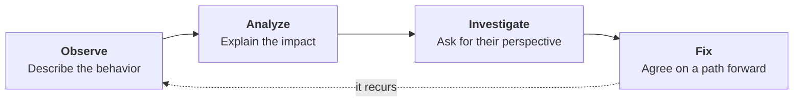

# Professionalism

COSC 40943 · Senior Design · Week 2

## You have a team now {.center}

Monday: the repository is your team's memory.

Today: **what happens when the problem is not in the repository.**

::: note
Thirty seconds. The turn from machinery to people. They just got their team, their client, and their TA, so the room is already thinking about teammates. Use that.

Do not re-argue Monday.
:::

## How senior design teams fail

::: steps
- **Week 4.** Somebody notices a teammate has stopped showing up
- **Week 4.** Nobody says anything
- **Week 7.** The team routes around them. It works
- **Week 12.** An integration nobody owns is late
- **Week 15.** *"X did nothing all semester"* appears on four peer evaluations
:::

::: note
The best slide in the deck, and it only works slowly. One beat per click. Let the pause sit between "nobody says anything" and "the team routes around them."

After the last beat, ask: when was this first said out loud?

Week 15. Let that land before you advance.
:::

## Eleven weeks too late {.center}

In week 15, every option I have is a bad one.

In week 4 the options were good, and cheap:

**one uncomfortable ten-minute conversation.**

::: note
Say plainly that this happens in this course every year, and that it is the most common way a senior design team goes wrong. Not talent. Not the stack.

Frame it as a prediction about them, not a moral.
:::

## Attack the problem, not the person

::: cols
**Not**

"You're lazy."
|||
**This**

"The endpoint wasn't done by Friday, as we agreed on the 12th."
:::

::: note
The left attacks motivation. Not observable, not arguable, and it puts them into defending themselves.

The line that lands: you already know how to do this. In code review you go after the diff and never the author. A teammate is not harder than a diff.

Two more pairs if the room wants them, from the module: "you don't care about this project" becomes "you've missed the last three meetings without telling anyone"; "your code is sloppy" becomes "this pull request has failed CI four times on the same lint rule."
:::

## A team problem is a defect

::: note
The spine of the hour. Write the four words on the board; they stay up for the rest of the segment.

Say what each skip costs. Skip Fix, you get "please do better." Skip Investigate, you fix the wrong root cause. Skip Observe, you get an argument.
:::

## Observe

> "You never do anything."

::: ask
What's wrong with this?
:::

::: note
Take two answers. What you want: it is a conclusion, not an observation, and the only available response is denial.

Somebody will say "it's rude." Push past that. The problem is not tone. There is nothing in it to check.
:::

---

> "#41 was assigned to you on Sep 14. It's Oct 2, the branch has no commits, and the demo is on the 9th."

::: key
Three facts and a date. None of it is arguable.
:::

::: note
Read it slowly. It sounds almost clinical, and that is the point: nobody defends themselves against a date.

Then the hinge into the next slide: where did every one of those facts come from?
:::

## You already have the evidence

::: steps
- The board
- `git log`
- The pull request
- The channel
:::

::: note
Monday's thesis paying a second dividend. The repository is the team's memory; it is also the team's record. Timestamped, neutral, and none of it written to settle an argument.

The contrast that makes it bite: a team that keeps its real plan in a group chat has nothing but impressions, and every conflict becomes one person's word against another's.

The module lists all six sources with what each one shows.
:::

## But not this

::: warn
**Volume is not contribution.**

Commit counts measure typing.

Typing is the part the agent does now.
:::

::: note
Two directions, both real. Someone can generate two thousand lines a week that never survive review. Someone who spends the week specifying, reviewing, and unblocking three people may have the lightest git log on the team and be the reason it shipped.

Measure commitments made against commitments met. Week 11 does metrics properly.
:::

::: joke
Any productivity metric you can game will be gamed. Your agent can now game them at two hundred lines a minute.
:::

## Analyze

::: cols
**Not**

"I'm the only one doing anything."
|||
**This**

"The front end had nothing to integrate against, so Checkpoint 2 missed the demo."
:::

::: note
The left invites a debate about who is doing more. Nobody wins it and no code changes. The right names a cost, and a cost is something two reasonable people can agree to avoid.

The hard part, say it directly: keep your feelings out of the sentence. Not because they don't matter, but because they are the one part of it the other person is entitled to dispute.
:::

## Investigate

::: steps
- What's going on with #41?
- Is something blocking you?
- Did I misunderstand what you'd taken on?
- What would help?
:::

Then stop talking.

::: note
Your evidence is a symptom. A stack trace tells you where it blew up, not why.

"Then stop talking" is the instruction that actually needs saying. Students ask the question and answer it themselves in the same breath.
:::

## What you will usually find {.center}

::: key
They're stuck, and embarrassed.
:::

::: note
The most useful thing in the hour. Slow down.

They took a use case they didn't know how to build, couldn't get it working, and every day of silence made the next day harder.

That person does not need accountability. They need somebody to sit with them for an hour, and they will be the most reliable member of your team for the rest of the term.

And: you cannot tell them apart from a teammate who checked out, without asking. That is the whole reason step three exists.
:::

## Fix

::: cols
**Not**

"Communicate more."
|||
**This**

"Reply in the channel within 24 hours on weekdays."
:::

An owner, an action, and a date. **Written down.**

::: note
"I'll try to do better" produces nothing you can check. Use that line as the test.

Written down in the issue or the channel, same rule as every other team decision. Give the humane reason too: the teammate who agreed to Friday and hit it now has evidence, and nobody's memory of the term gets to overwrite it.
:::

## Five rules

::: steps
- **Talk early.** Within 48 hours
- Use evidence
- Connect it to project goals
- Ask before assuming
- End with an agreement
:::

::: key
Waiting doesn't make the conversation easier. It makes it bigger.
:::

::: note
Rule 1 carries the other four. A two-day-old missed deadline is a scheduling question. A two-month-old pattern is an accusation about character.

If you are running short, this slide plus the four-step diagram is the segment.
:::

## Unread agent output

::: ai
The behavior is not "you used AI."

It's **submitting code you can't explain.**
:::

> "Walk me through why this swallows the exception."

::: note
Everything up to here would have been true in 2015. This slide and the next would not, and they are why this is a software engineering lecture rather than a communication lecture. Say that as you arrive.

Everyone here uses AI and the course requires it. Name that first, or the room hears a prohibition.

Clause 6 of the contract you sign Friday: every member can explain any line submitted under their name, and no agent output is merged that nobody has read.

The observation is a question asked in review, not an accusation made in a meeting. If they can walk you through it, there was never a problem.
:::

## "The agent wrote it"

::: warn
Not available as a defense.
:::

Your name on the pull request is the claim.

::: note
Week 1's rule: you are accountable for what the agent writes.

Say this out loud now, in week 2, before it happens, so nobody discovers in October that it was never going to work. The claim does not come apart later because the defect turned out to be embarrassing.
:::

::: joke
"The agent wrote it" has the same standing in code review that "the compiler wrote it" has in court.
:::

## When it's aimed at you

::: steps
- Ask what they observed
- Say what happened, undecorated
- Agree the action
:::

::: note
The harder half, and the half nobody teaches.

Everything in you wants to explain why it wasn't your fault. If they're right, say so plainly: owning a miss costs four seconds of discomfort and buys the one thing you can't get any other way, teammates who believe what you tell them.

And if you're the one behind, say so on day two, not week ten. Going quiet converts a technical problem your team can help with into a trust problem it cannot.
:::

## If it doesn't work

::: steps
- **Your team.** Almost everything ends here
- **Your TA.** Bring the evidence and the agreement that wasn't kept
- **Me.** Improvement plan, then professionalism review
:::

::: note
Your TA is with your team all semester and reads your repository. They can usually see what happened without being told.

State the expectation directly: before you ask me to intervene, have had one respectful conversation using this protocol, and be able to tell me what was agreed and what happened next.

The handbook on the site has the full process, including what level 3 can affect in their grade. Point at it; don't walk it.
:::

## Except these {.center}

::: warn
Academic integrity · harassment · discrimination · threats · anything unsafe

**Come to me immediately.**

No protocol. No 48 hours. Don't raise it with the person first.
:::

::: note
Slowly, and do not soften it. The one slide where the rest of the hour does not apply.

Repeat the last line.
:::

## Three minutes

A teammate took a use case three weeks ago, has missed two meetings, and hasn't answered the channel in nine days.

::: ask
Write the **first sentence** you say to them.
:::

::: note
Ninety seconds to write, ninety to trade with a neighbor and find the judgment hiding in theirs. Then take two or three out loud.

Almost everyone writes a version of "you never do anything," ten minutes after being told not to. Do not pre-empt that on the slide and do not soften it when you take answers. Ask the room what's unfalsifiable about the one you just read.
:::

## Friday

::: steps
- Your team's first hour together
- Fix the weekly meeting time you'll defend all term
- Sign the contract. **Clause 7 is this lecture, in your words**
- Your TA verifies Checkpoint 0 at your table
:::

::: key
Write clause 7 while nobody is angry. It's the only time anybody writes a fair one.
:::

::: note
Now project the contract page itself and walk the clauses.

Before they leave: read your client brief. It's on TCU Online, under your team number.
:::

## {.center}

::: key
Observe. Analyze. Investigate. Fix.

Attack the problem, not the person.

Talk within 48 hours.
:::

::: note
Three lines. Say them, then stop.
:::
