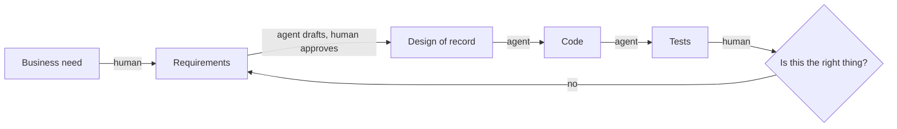

# SE and What AI Changes

COSC 40943 · Senior Design · Week 1

## Three constraints, one has to give

::: cols
**Scope**

What must be built.
|||
**Schedule**

When by.
|||
**Resources**

Who, and how much.
:::

Fix all three and quality is what gets spent.

::: key
Projects rarely fail at building. They fail because nobody renegotiated.
:::

::: note
The diagnosis of the story they just watched. That team did not lack skill. Ask the room: at which week should someone have said the scope was wrong, and to whom? Then: this is why the course has four checkpoints instead of one deadline.
:::

## The question this course is about {.center}

> What should software engineering become when AI is a permanent member of every development team?

Everything for the next fifteen weeks is an attempt to answer that on a real project, for a real client, with your name on it.

::: note
Say this once, clearly, and let it recur rather than over-explaining it now. Every later module gets revisited against this question.
:::

## You already know how to program

That is the prerequisite, not the course.

::: cols
**Programming**

Producing code that works.
|||
**Software engineering**

Everything that makes it the *right* code, keeps it right as it changes, and lets six people who do not share a brain build it together.
:::

::: note
Do not let this sound like a put-down. They are good programmers. The point is that the thing they are good at is now the cheap part.
:::

## What software engineering is responsible for

::: steps
- Deciding what to build, and what not to
- Agreeing what the words mean
- Choosing structures that survive year two
- Verifying that behavior matches intent
- Keeping the record honest as everything changes
:::

::: key
AI has become excellent at the transformations *between* these artifacts. It has not absorbed the decisions at either end.
:::

## What the job postings actually ask for

::: steps
- Code review, standards, source control, builds, testing, operations
- Scoping requirements through launch
- Communicating with users, other teams, and senior management
- Mentoring, and influencing how a team works
- Knowing when to adopt a technology and when to build one
:::

::: key
Not one of them is typing.
:::

::: note
Senior engineering postings at Amazon and Google, written before agents could code well. That is what makes them useful: the industry was already paying a premium for this half. They are job-hunting this year, so say that part out loud.
:::

## Three things changed

::: steps
1. **Transformation got cheap.** Anything whose difficulty was mostly typing is now nearly free.
2. **The cost of being wrong went up.** Slow code used to catch bad requirements by friction. That friction is gone.
3. **The economics of rigor inverted.** Practices were abandoned because *upkeep* cost human hours, not because they lacked value.
:::

::: note
Three beats, one per click. Beat 2 is the one they have not thought about: speed removed the accidental checkpoints that slow work used to provide.
:::

## Where the agent actually operates

::: ai
The agent is fluent on every arrow. It has no opinion whatsoever about the diamond.
:::

## The delegation boundary

| Stays human | Goes to the agent |
|---|---|
| Requirements quality, scope, vocabulary | Use case to design-of-record |
| Business constraints, domain knowledge | Approved design to code and tests |
| Quality attributes, "good enough" | Cross-document consistency checks |
| Decisions that are hard to reverse | Drafting, refactoring, explaining code |
| "Is this even a good idea?" | Mechanical transformations |

::: note
Do not read the table aloud. Put it up, then work the next slide live against tasks they call out.
:::

## The test

::: key
If guessing it wrong would violate a requirement, **the human pins it**. Otherwise the agent derives it.
:::

Both extremes are wrong answers. Delegate everything and you build the wrong product at speed. Keep everything human and you throw away the one advance that makes the rigor affordable.

## Your turn {.center}

::: ask
Call out a task from your project. We place it on the boundary together, and you defend the placement.
:::

::: note
Resist finishing the table for them. The placements they argue about are the ones they remember. Take three or four, no more.
:::

## This week

::: steps
- **Today:** the interest and skills survey. It closes **Friday**, and it is the only input to your team and your project.
- **Today:** apply for the GitHub Student Developer Pack. Verification takes days.
- **Wednesday:** the Napkin, and a live agent session that goes off the rails.
- **Friday:** studio. Project Pulse running on your machine, plus one AI-assisted task on real code.
- **Monday Aug 31:** teams, clients, and project briefs.
:::

::: warn
Friday is not optional, the MVP is not optional, and "the agent wrote it" is not a defense.
:::

::: note
Last slide of Monday. The next slide opens Wednesday.
:::

## Why specs are the scarce thing

::: joke
A programmer's spouse says: "Go to the store. Get a loaf of bread. If they have eggs, get a dozen."

He comes home with twelve loaves of bread.
:::

::: note
Land the punchline, wait for the laugh, then: that is not a bug in the husband. He executed the specification exactly. This is the single most useful mental model you will get for working with an agent.
:::

## Ambiguity used to be survivable

::: cols
**Before**

A vague requirement met a developer who asked a question, or built it slowly enough that someone noticed.
|||
**Now**

A vague requirement meets something that never asks, never stalls, and produces two thousand confident lines before lunch.
:::

::: warn
The gap in a specification does not disappear when you hand it to an agent. It gets filled, silently, by something with no stake in the outcome.
:::

## Two ways a session goes wrong

| | Automation bias | Agenda capture |
|---|---|---|
| **What happens** | You accept output you did not verify | You work competently on what does not matter yet |
| **The tell** | You cannot explain a line you shipped | The agent has asked you zero questions |
| **The move** | Verify against the spec, not the code | Kill the session, do not redirect it |

::: note
The "kill the session rather than redirect it" move is counterintuitive and worth an extra thirty seconds. Redirecting keeps the polluted context.
:::

## The Napkin: six prompts

Twenty minutes, an unfamiliar problem, a defensible rough judgment.

::: steps
1. **Shape** — what kind of system is this really?
2. **The hard part** — what makes it non-trivial?
3. **The bottleneck** — what breaks first at scale?
4. **Stack** — what would you build it on, and why that?
5. **Three kill risks** — as mechanisms, not categories
6. **Verdict** — feasible in the time you have?
:::

::: warn
Fixed order. Prompting the agent first destroys the exercise, because you cannot un-see its answer.
:::

## What scores, and what does not

::: cols
**Risk bingo**

"Scope creep." "Technical debt." "Integration issues."

Nouns. Unfalsifiable. Zero points.
|||
**A mechanism**

"The client's volunteer list is a shared spreadsheet, so two people editing it on Saturday silently overwrite each other."

Specific. Testable. Points.
:::

::: note
Ninety-second pair activity: have them rewrite one weak risk into a mechanism. Not a discussion.
:::

## Where the detail lives {.center}

These slides are the fast version.

The **SE and What AI Changes** module has the full argument, the reading list, and the discussion questions.

::: note
Point at the link in the corner. Say it exists once so they stop trying to photograph slides.
:::
