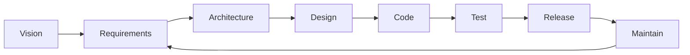
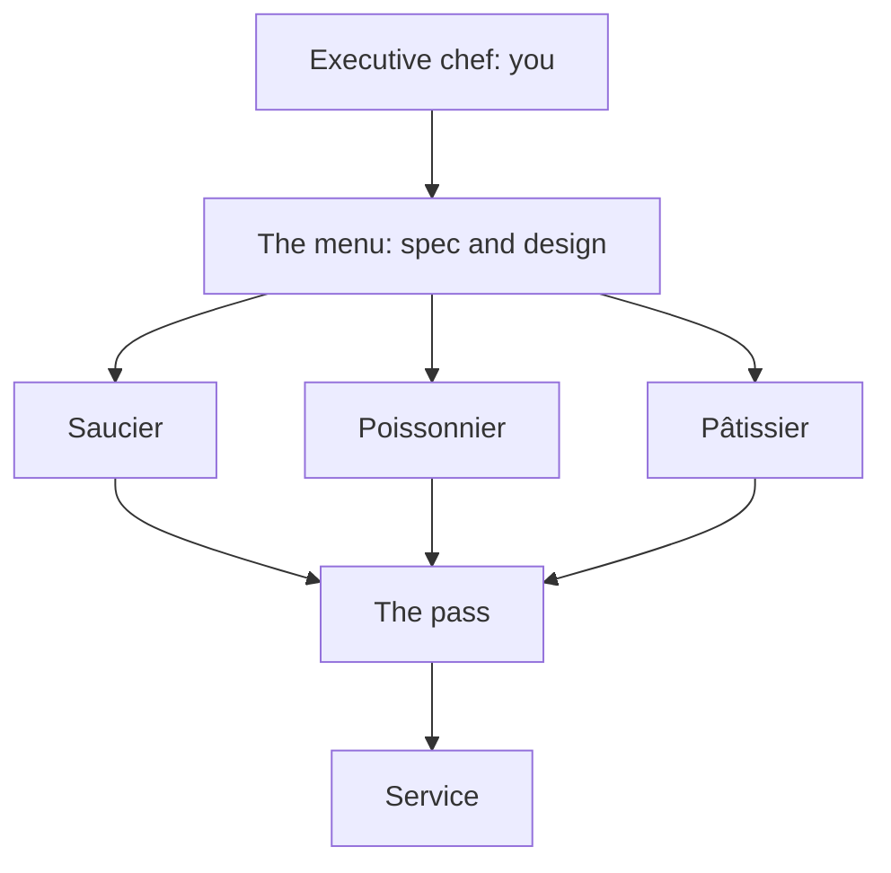
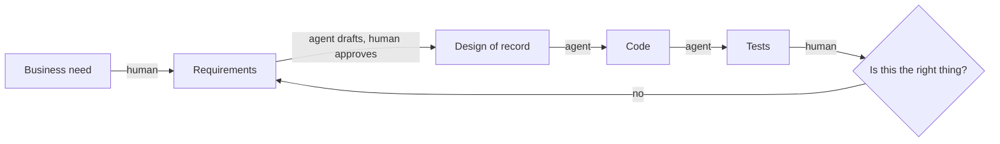

# SE and What AI Changes

COSC 40943 · Senior Design · Week 1

## The iron triangle

<svg viewBox="0 0 640 400" role="img" aria-label="The iron triangle: scope, resources, and schedule, with quality inside" style="width:100%;max-width:560px;margin:0 auto;display:block">
<text x="320" y="34" text-anchor="middle" fill="var(--ink)" style="font:700 23px var(--font-display)">Scope</text>
<text x="320" y="58" text-anchor="middle" fill="var(--ink-dim)" style="font:400 16px var(--font-body)">features, functionality</text>
<polygon points="320,84 550,330 90,330" fill="none" stroke="var(--accent)" stroke-width="3" stroke-linejoin="round"/>
<text x="320" y="258" text-anchor="middle" fill="var(--amber)" style="font:700 27px var(--font-display)">Quality</text>
<text x="90" y="360" text-anchor="middle" fill="var(--ink)" style="font:700 23px var(--font-display)">Resources</text>
<text x="90" y="383" text-anchor="middle" fill="var(--ink-dim)" style="font:400 16px var(--font-body)">cost, budget</text>
<text x="550" y="360" text-anchor="middle" fill="var(--ink)" style="font:700 23px var(--font-display)">Schedule</text>
<text x="550" y="383" text-anchor="middle" fill="var(--ink-dim)" style="font:400 16px var(--font-body)">time</text>
</svg>

::: key
Fix all three and quality is the only thing left to spend.
:::

::: note
The diagnosis of the story they just watched. That team did not lack skill. Ask the room: at which week should someone have said the scope was wrong, and to whom? Then: this is why the course has four checkpoints instead of one deadline. Projects rarely fail at building. They fail because nobody renegotiated.
:::

## The question this course is about {.center}

> What should software engineering become when AI is a permanent member of every development team?

Everything for the next fifteen weeks is an attempt to answer that on a real project, for a real client, with your name on it.

::: note
Say this once, clearly, and let it recur rather than over-explaining it now. Every later module gets revisited against this question.
:::

## Before I say anything else

::: ask
Hands up: who used a coding agent this summer?

Who interned?

And the one I actually want: **what is one thing you do not like about working with an agent?**
:::

::: note
Two minutes, hard stop. The third question is the one that pays. Their complaints are the delegation boundary in their own vocabulary, and you will call back to what they say for the rest of the week. Take one thirty-second story, not five.
:::

## You have read the headlines

::: steps
- Tech job cuts in the first half of 2026: **83% above** the same period in 2025
- Total US cuts across all sectors over that period: **down about 40%**
- The entry-level rung is the part that thinned
:::

::: warn
You are about to graduate into this. Pretending otherwise would waste your semester.
:::

::: note
Do not soften this and do not dwell. Fifty seconds. They already know; what they have not heard is a professor say it out loud and then explain it. The explanation is the next slide, so get there.
:::

## What actually happened

::: steps
1. **The hangover.** Companies hired through 2021 as if 2021 were normal.
2. **A convenient reason.** Sam Altman calls it *AI washing*: blaming AI for layoffs you would have done anyway.
3. **A lost bet.** Meta burned thirty billion dollars on Reality Labs in two years. Nobody laid off the metaverse.
:::

::: key
AI is part of this. It is not most of it.
:::

::: note
This is the slide that changes the temperature in the room. Deliver it as fact, not reassurance. The numbers if they ask: AI was named in about 5 percent of announced US cuts in 2025 and about 23 percent in the first half of 2026, Reality Labs lost about 13.7 billion in 2022 and 16.1 billion in 2023, and Andreessen puts overstaffing at 25 to 75 percent and calls AI a silver-bullet excuse. Then be honest about the part that is real: the entry-level rung genuinely is thinner, which is the argument for being the person who directs agents rather than the person competing with one.
:::

## That said, the agents really are that good

SWE-bench Verified: a real GitHub issue, a real repository, and a patch that has to pass the project's own tests.

::: steps
- 2023, when the benchmark was published: about 2%
- Today: the large majority, solved
- The top few models sit within about two points of each other
:::

::: ai
The benchmark is nearly saturated. That is the news, and we now have to go looking for tasks that are hard.
:::

::: note
As of August 2026; check before reusing this slide next year. Do not name a winner, the ranking changes monthly and the point is the ceiling, not the leaderboard.
:::

## Then they fall off a cliff

METR measures how *long* a task is, in human terms, and asks whether an agent can finish it.

::: cols
**Under four minutes of human work**

Agents succeed on nearly all of it.
|||
**Over four hours of human work**

Agents succeed on under ten percent.
:::

::: key
Task length is the single strongest predictor of failure. Everything this course teaches lives on the right-hand side.
:::

::: note
The hinge of the whole lecture. Say it plainly: nobody is paid for four-minute tasks. A semester-long project for a real client is the four-hour column, over and over. That gap is the job.

Date the numbers out loud: this is METR's March 2025 measurement, and they also found the horizon doubles about every seven months, so the boundary has moved right since and will move again. Teach the shape, not the constants. If a student says the four-hour figure must be stale, agree with them, then point out that the argument gets stronger as the curve slides, not weaker, because the work worth having is always to the right of the frontier.
:::

## So, honestly {.center}

::: ask
Will software engineers be replaced by AI?

Say what you actually think. I am not grading this.
:::

::: note
Take two or three answers and do not correct them. Let the disagreement sit unresolved for fifteen seconds, then go to Kent Beck. If the room is silent, ask instead: how many of you have thought about switching majors? Some hands will go up.
:::

## Kent Beck did the math

Kent Beck created Extreme Programming and popularized test-driven development. He wrote this the first day he used a language model:

> The value of 90% of my skills just dropped to $0. The leverage for the remaining 10% went up 1000x.

::: note
Wait after the quote. Then ask what the 10% is before you tell them, because they will guess wrong and the guessing is what makes the next slide land.
:::

---

The 10%, in his own words afterward:

::: steps
- Having a vision
- Breaking that vision into milestones
- Managing the design
- Controlling complexity
:::

::: key
This is the four-hour column. Beck said it two years before anyone measured it.
:::

::: note
Land the connection to the METR slide explicitly. Then: every one of those four is a syllabus line in this course, and none of them is typing.
:::

## The line I want you to leave with {.center}

::: key
You will not be replaced by AI. You will be replaced by someone who can use AI.
:::

AI is an amplifier. It multiplies whatever you feed it, and the sign matters.

::: warn
Zero in, zero out, faster. Wrong in, and the wrong thing arrives finished, tested, and everywhere.
:::

::: note
Say the key line twice. This is the sentence they repeat to their parents at Thanksgiving, so give it room. Then slow down for the warn block: the failure mode is not that the agent hands you nothing, it is that it hands you a great deal of the wrong thing, and a wrong thing that is complete and tested costs more to undo than one you never built. Call forward to Wednesday, where this is why the specification is the scarce thing.
:::

## You already know how to program

That is the prerequisite, not the course.

::: cols
**Programming**

Producing code that works.
|||
**Software engineering**

Everything that makes it the *right* code, keeps it right as it changes, and lets six people who do not share a brain build it together.
:::

::: note
Do not let this sound like a put-down. They are good programmers. The point is that the thing they are good at is now the cheap part. Algorithms, databases, and networks were the pieces; this is the course where the pieces meet a client.
:::

## What is the "engineering" doing there?

> The application of a systematic, disciplined, quantifiable approach to the development, operation, and maintenance of software.

IEEE Standard 610.12

::: key
The word was coined at a NATO conference in 1968, on purpose, because projects were failing and nobody could say why.
:::

::: note
Fifty-eight years later the failure rate is still the reason this course exists. Bridges had this argument first and settled it; we are still having it.
:::

## Coding is one box

::: key
One box of eight. Agents are strongest at that one. You are accountable for the loop.
:::

::: note
Point at Code and say: this is the box you have been graded on for three years. Say the full names as you trace them (vision and scope, requirements, architecture, detailed design, implementation, testing and QA, release and operations, maintenance); the module writes them out. Then trace the arrows. Every other box is a meeting, a decision, or a document, and every one of them can sink the project on its own.
:::

## What the job postings actually ask for

::: steps
- Code review, standards, source control, builds, testing, operations
- Scoping requirements through launch
- Communicating with users, other teams, and senior management
- Mentoring, and influencing how a team works
- Knowing when to adopt a technology and when to build one
:::

::: key
Not one of them is typing.
:::

::: note
Senior engineering postings at Amazon and Google, written before agents could code well. That is what makes them useful: the industry was already paying a premium for this half. They are job-hunting this year, so say that part out loud.
:::

## And now they ask for this

Postings in 2026 list AI-assisted development as a requirement, not a perk.

::: steps
- Named tools: Claude Code, Cursor, GitHub Copilot
- Evidence you have shipped real work with them, not that you have tried them
- Judgment about when *not* to use them
:::

::: ai
"Familiar with AI coding tools" is now the same kind of line "familiar with version control" was in 2010.
:::

::: note
This is the slide that converts anxiety into a to-do list. The course is the evidence: by December they will have shipped a client MVP with an agent on the team and can write that sentence honestly.
:::

## The kitchen you are about to run

::: key
Nothing leaves the kitchen without crossing the pass. The pass is code review, and you are standing at it.
:::

::: note
Escoffier's brigade: the executive chef writes the menu, tastes every plate, and owns the result, while the stations do the cooking. A future team is a few engineers and a brigade of agents. The joke and the warning are the same: a chef who cannot taste is not a chef. You still have to be able to tell a good plate from a bad one, which is why the exams have no agent in them.
:::

## This week

::: steps
- **Today:** the interest and skills survey. It closes **Friday**, and it is the only input to your team and your project.
- **Today:** apply for the GitHub Student Developer Pack. Verification takes days.
- **Wednesday:** the Napkin, and a live agent session that goes off the rails.
- **Friday:** studio. Project Pulse running on your machine, plus one AI-assisted task on real code.
- **Monday Aug 31:** teams, clients, and project briefs.
:::

::: warn
Friday is not optional, the MVP is not optional, and "the agent wrote it" is not a defense.
:::

::: note
Last slide of Monday. The next slide opens Wednesday.
:::

## Three things changed

::: steps
1. **Transformation got cheap.** Anything whose difficulty was mostly typing is now nearly free.
2. **The cost of being wrong went up.** Slow code used to catch bad requirements by friction. That friction is gone.
3. **The economics of rigor inverted.** Practices were abandoned because *upkeep* cost human hours, not because they lacked value.
:::

::: note
Wednesday opens here. Three beats, one per click. Beat 2 is the one they have not thought about: speed removed the accidental checkpoints that slow work used to provide.
:::

## Where the agent actually operates

::: ai
The agent is fluent on every arrow. It has no opinion whatsoever about the diamond.
:::

## The delegation boundary

| Stays human | Goes to the agent |
|---|---|
| Requirements quality, scope, vocabulary | Use case to design-of-record |
| Business constraints, domain knowledge | Approved design to code and tests |
| Quality attributes, "good enough" | Cross-document consistency checks |
| Decisions that are hard to reverse | Drafting, refactoring, explaining code |
| "Is this even a good idea?" | Mechanical transformations |

::: note
Do not read the table aloud. Put it up, then work the next slide live against tasks they call out. Call back to Monday's complaints: most of what they said they disliked is a task in the left-hand column that somebody put in the right-hand one.
:::

## The test

::: key
If guessing it wrong would violate a requirement, **the human pins it**. Otherwise the agent derives it.
:::

Both extremes are wrong answers. Delegate everything and you build the wrong product at speed. Keep everything human and you throw away the one advance that makes the rigor affordable.

## Your turn {.center}

::: ask
Call out a task from your project. We place it on the boundary together, and you defend the placement.
:::

::: note
Resist finishing the table for them. The placements they argue about are the ones they remember. Take three or four, no more.
:::

## Why specs are the scarce thing

::: joke
A programmer's spouse says: "Go to the store. Get a loaf of bread. If they have eggs, get a dozen."

He comes home with twelve loaves of bread.
:::

::: note
Land the punchline, wait for the laugh, then: that is not a bug in the husband. He executed the specification exactly. This is the single most useful mental model you will get for working with an agent.
:::

## Ambiguity used to be survivable

::: cols
**Before**

A vague requirement met a developer who asked a question, or built it slowly enough that someone noticed.
|||
**Now**

A vague requirement meets something that never asks, never stalls, and produces two thousand confident lines before lunch.
:::

::: warn
The gap in a specification does not disappear when you hand it to an agent. It gets filled, silently, by something with no stake in the outcome.
:::

## Two ways a session goes wrong

| | Automation bias | Agenda capture |
|---|---|---|
| **What happens** | You accept output you did not verify | You work competently on what does not matter yet |
| **The tell** | You cannot explain a line you shipped | You have stopped asking questions of your own |
| **The move** | Verify against the spec, not the code | Kill the session, do not redirect it |

::: note
The "kill the session rather than redirect it" move is counterintuitive and worth an extra thirty seconds. Redirecting keeps the polluted context.
:::

## The Napkin: six prompts

Twenty minutes, an unfamiliar problem, a defensible rough judgment.

::: steps
1. **Shape**: what kind of system is this really?
2. **The hard part**: what makes it non-trivial?
3. **The bottleneck**: what breaks first at scale?
4. **Stack**: what would you build it on, and why that?
5. **Three kill risks**: as mechanisms, not categories
6. **Verdict**: feasible in the time you have?
:::

::: warn
Fixed order. Prompting the agent first destroys the exercise, because you cannot un-see its answer.
:::

## What scores, and what does not

::: cols
**Risk bingo**

"Scope creep." "Technical debt." "Integration issues."

Nouns. Unfalsifiable. Zero points.
|||
**A mechanism**

"The client's volunteer list is a shared spreadsheet, so two people editing it on Saturday silently overwrite each other."

Specific. Testable. Points.
:::

::: note
Ninety-second pair activity: have them rewrite one weak risk into a mechanism. Not a discussion.
:::

## Where the detail lives {.center}

These slides are the fast version.

The **SE and What AI Changes** module has the full argument, the reading list, and the discussion questions.

::: note
Point at the link in the corner. Say it exists once so they stop trying to photograph slides.
:::
