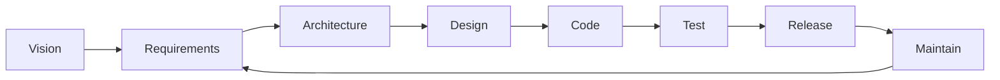
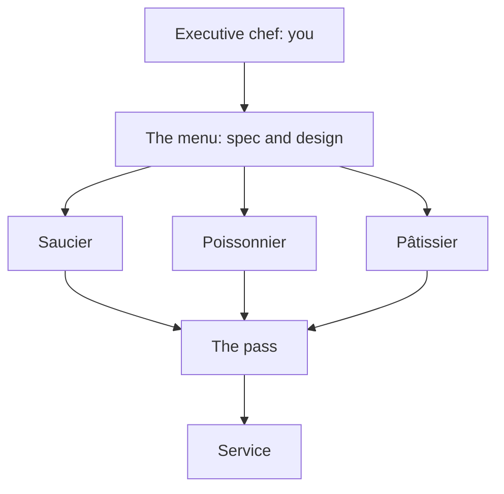
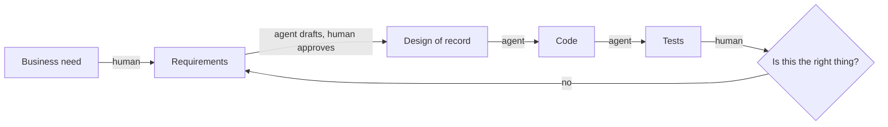

# SE and What AI Changes

COSC 40943 · Senior Design · Week 1

## The question this course is about {.center}

> What should software engineering become when AI is a permanent member of every development team?

Everything for the next fifteen weeks is an attempt to answer that on a real project, for a real client, with your name on it.

::: note
Say this once, clearly, and let it recur rather than over-explaining it now. Every later module gets revisited against this question.
:::

## Before I say anything else

::: ask
Hands up: who used a coding agent this summer?

Who interned?

And the one I actually want: **what is one thing you do not like about working with an agent?**
:::

::: note
Two minutes, hard stop. The third question is the one that pays. Their complaints are the delegation boundary in their own vocabulary, and you will call back to what they say for the rest of the week. Take one thirty-second story, not five.
:::

## You already know how to program

That is the prerequisite, not the course.

::: cols
**Programming**

Producing code that works.
|||
**Software engineering**

Everything that makes it the *right* code, keeps it right as it changes, and lets six people who do not share a brain build it together.
:::

::: note
Do not let this sound like a put-down. They are good programmers. The point is that the thing they are good at is now the cheap part. Algorithms, databases, and networks were the pieces; this is the course where the pieces meet a client.
:::

## What is the "engineering" doing there?

> The application of a systematic, disciplined, quantifiable approach to the development, operation, and maintenance of software.

IEEE Standard 610.12

::: key
The word was coined at a NATO conference in 1968, on purpose, because projects were failing and nobody could say why.
:::

::: note
Fifty-eight years later the failure rate is still the reason this course exists. Bridges had this argument first and settled it; we are still having it.
:::

## Coding is one box

::: key
One box of eight. Agents are strongest at that one. You are accountable for the loop.
:::

::: note
Point at Code and say: this is the box you have been graded on for three years. Say the full names as you trace them (vision and scope, requirements, architecture, detailed design, implementation, testing and QA, release and operations, maintenance); the module writes them out. Then trace the arrows. Every other box is a meeting, a decision, or a document, and every one of them can sink the project on its own.
:::

## The iron triangle

<svg viewBox="0 0 640 400" role="img" aria-label="The iron triangle: scope, resources, and schedule, with quality inside" style="width:100%;max-width:560px;margin:0 auto;display:block">
<text x="320" y="34" text-anchor="middle" fill="var(--ink)" style="font:700 23px var(--font-display)">Scope</text>
<text x="320" y="58" text-anchor="middle" fill="var(--ink-dim)" style="font:400 16px var(--font-body)">features, functionality</text>
<polygon points="320,84 550,330 90,330" fill="none" stroke="var(--accent)" stroke-width="3" stroke-linejoin="round"/>
<text x="320" y="258" text-anchor="middle" fill="var(--amber)" style="font:700 27px var(--font-display)">Quality</text>
<text x="90" y="360" text-anchor="middle" fill="var(--ink)" style="font:700 23px var(--font-display)">Resources</text>
<text x="90" y="383" text-anchor="middle" fill="var(--ink-dim)" style="font:400 16px var(--font-body)">cost, budget</text>
<text x="550" y="360" text-anchor="middle" fill="var(--ink)" style="font:700 23px var(--font-display)">Schedule</text>
<text x="550" y="383" text-anchor="middle" fill="var(--ink-dim)" style="font:400 16px var(--font-body)">time</text>
</svg>

::: key
Fix all three and quality is the only thing left to spend.
:::

::: note
Quality is not a fourth dial. Fix the three corners and quality is the residue, so it is what gets spent, silently, by tired people in week fourteen. Ask the room what they actually do when the client wants the demo a month early: every honest answer is a trade, and "yes" without one is a promise to spend quality. Then: this is why the course has four checkpoints rather than one deadline. Projects rarely fail at building; they fail because nobody renegotiated. They meet this again at the end of the hour, when three items in the autopsy turn out to be exactly this.
:::

## What a requirement is

::: steps
- A **capability** the system must provide, or a **constraint** it must satisfy
- **Agreed** with someone who can accept or reject the system
- **Verifiable**: there is an observation that settles the question
:::

::: key
"It needs to be fast" is a wish. "A dashboard page returns in under 400 ms at the ninetieth percentile with 200 concurrent users" is a requirement.
:::

::: note
Weeks 3 and 4 are this, all of it, so do not teach requirements here. Today they need the test and one consequence. Run the test out loud: what would I observe if this were satisfied, and what would I observe if it were not? If you cannot answer both halves, you are holding a wish. Then the consequence that matters this week: a requirement is what an agent can be held to. Ask an agent for a "user-friendly" anything and it will build something, confidently, and you will have no grounds to reject it. Give it the second sentence and it has a target and you have a basis.
:::

## You have read the headlines

::: steps
- Tech job cuts in the first half of 2026: **83% above** the same period in 2025
- Total US cuts across all sectors over that period: **down about 40%**
- The entry-level rung is the part that thinned
:::

::: warn
You are about to graduate into this. Pretending otherwise would waste your semester.
:::

::: note
Do not soften this and do not dwell. Fifty seconds. They already know; what they have not heard is a professor say it out loud and then explain it. The explanation is the next slide, so get there.
:::

## What actually happened

::: steps
1. **The hangover.** Companies hired through 2021 as if 2021 were normal.
2. **A convenient reason.** Sam Altman calls it *AI washing*: blaming AI for layoffs you would have done anyway.
3. **A lost bet.** Meta burned thirty billion dollars on Reality Labs in two years. Nobody laid off the metaverse.
:::

::: key
AI is part of this. It is not most of it.
:::

::: note
This is the slide that changes the temperature in the room. Deliver it as fact, not reassurance. The numbers if they ask: AI was named in about 5 percent of announced US cuts in 2025 and about 23 percent in the first half of 2026, Reality Labs lost about 13.7 billion in 2022 and 16.1 billion in 2023, and Andreessen puts overstaffing at 25 to 75 percent and calls AI a silver-bullet excuse. Do not resolve it here: the part that is real is the next slide.
:::

## The part that is about you

::: steps
- The tasks that used to train a new graduate (small specified changes, tests, boilerplate) are four-minute tasks
- So the worry is not that AI replaces software engineers
- It is that one senior engineer with agents replaces several juniors
:::

::: key
Those junior jobs were how people became senior. Nobody owns the problem of replacing them.
:::

::: note
The honest version of the worry, and sharper than the headline version, so do not rush it. Say it as your own concern rather than a fact about the industry: the ladder still works for everyone already above the missing rung, and for nobody below it.

Then give them the one move actually available to them. Ask it in interviews: how does this team make seniors now? A company with an answer is a different employer from one that has never thought about the question.

Do not resolve it, there is no resolution yet. The rest of the hour is about being worth hiring on the four-hour side of the line.
:::

## That said, the agents really are that good

SWE-bench: a real GitHub issue, a real repository, and a patch that has to pass the project's own tests. **Verified** is the 500-problem subset screened by hand in 2024.

::: steps
- 2023, on the original benchmark: about 2%
- Today, on Verified: the large majority, solved
- The top few models sit within about two points of each other
:::

::: ai
The benchmark is nearly saturated. That is the news, and we now have to go looking for tasks that are hard.
:::

::: note
As of August 2026; check before reusing this slide next year. Do not name a winner, the ranking changes monthly and the point is the ceiling, not the leaderboard.
:::

## Then they fall off a cliff

METR measures how *long* a task is, in human terms, and asks whether an agent can finish it.

::: cols
**Under four minutes of human work**

Agents succeed on nearly all of it.
|||
**Over four hours of human work**

Agents succeed on under ten percent.
:::

::: key
Task length is the single strongest predictor of failure. Everything this course teaches lives on the right-hand side.
:::

::: note
The hinge of the whole lecture. Say it plainly: nobody is paid for four-minute tasks. A semester-long project for a real client is the four-hour column, over and over. That gap is the job.

Date the numbers out loud: this is METR's March 2025 measurement, and they also found the horizon doubles about every seven months, so the boundary has moved right since and will move again. Teach the shape, not the constants. If a student says the four-hour figure must be stale, agree with them, then point out that the argument gets stronger as the curve slides, not weaker, because the work worth having is always to the right of the frontier.
:::

## So, honestly {.center}

::: ask
Will software engineers be replaced by AI?

Say what you actually think. I am not grading this.
:::

::: note
Take two or three answers and do not correct them. Let the disagreement sit unresolved for fifteen seconds, then go to Kent Beck. If the room is silent, ask instead: how many of you have thought about switching majors? Some hands will go up.
:::

## Kent Beck did the math

Kent Beck created Extreme Programming and popularized test-driven development. He wrote this the first day he used a language model:

> The value of 90% of my skills just dropped to $0. The leverage for the remaining 10% went up 1000x.

::: note
Wait after the quote. Then ask what the 10% is before you tell them, because they will guess wrong and the guessing is what makes the next slide land.
:::

---

The 10%, in his own words afterward:

::: steps
- Having a vision
- Breaking that vision into milestones
- Managing the design
- Controlling complexity
:::

::: key
This is the four-hour column. Beck said it two years before anyone measured it.
:::

::: note
Land the connection to the METR slide explicitly. Then: every one of those four is a syllabus line in this course, and none of them is typing.
:::

## The line I want you to leave with {.center}

::: key
You will not be replaced by AI. You will be replaced by someone who can use AI.
:::

::: note
Say it twice. This is the sentence they repeat to their parents at Thanksgiving, so give it room. Then the next two slides explain why it is not a threat.
:::

## AI is an amplifier

It multiplies whatever judgment you feed it.

::: steps
- A clear specification in: a great deal of good work, fast
- Nothing in: nothing, faster
:::

::: key
Zero multiplied is still zero.
:::

::: note
An amplifier adds nothing of its own; it scales what you bring. Ask what happens with a vague prompt. Someone will say "garbage out", which is the setup for the next slide, where it is worse than garbage.
:::

## And the sign matters

::: warn
A wrong premise in, and the wrong thing arrives complete, tested, documented, and spread through the codebase.
:::

Worse than nothing, because undoing it now costs more than building it did.

::: note
Slow down here. They expect "bad input, bad output". The point is sharper: the amplifier neither stalls nor argues, so a misread of what the client wanted comes back as a finished system with green tests. That is more expensive to reverse than an empty repository. Call forward to Wednesday, where this is why the specification is the scarce thing.
:::

## Execution, judgment, agency

::: steps
- **Execution.** Carry out a task someone already defined. Becoming cheap.
- **Judgment.** Decide what matters, and catch what is wrong even when it looks right.
- **Agency.** Own the problem. Take it from zero to one.
:::

::: key
Execution is abundant. Judgment is scarce. Agency is the differentiator.
:::

::: note
Slow down here. This is the answer to "what should I be building in myself this year," and it is the most marketable thing you will say all week. Execution is what they have been graded on for three years, and it is the part that just got commoditized. An agent can assist with judgment but never carries the consequences of the decision, and it never decides what is worth doing at all.

The next two slides take judgment apart: what the trainable half of it is, and what happens to people who skip it.
:::

## Taste

Knowing what good looks like without needing a rubric.

::: steps
- Which abstraction will hurt in six months
- Which test is theater
- Which explanation is fluent and hollow
:::

::: key
Taste is what lets you **reject** work. Without it you approve whatever arrives.
:::

::: note
The trainable half of judgment, and the reason the chef metaphor works later: a chef who cannot taste is not a chef. Where it comes from: making decisions rather than generating answers, catching the agent when it is wrong, and seeing enough good and bad work to tell them apart. Strong judgment holds several perspectives at once; weak judgment applies one model to everything. Say plainly that this is what interviewers probe for and what they cannot fake.
:::

## Easy to look competent

::: warn
AI makes it easy to look competent without being competent.
:::

Polished output. Shallow thinking. Confidence growing faster than competence.

::: note
The gap does not show up in a demo. It shows up in the first interview question that goes one level deeper than the artifact they brought. This is the honest reason the exams have no agent in them and every assignment is graded on judgment rather than output.
:::

## What the job postings actually ask for

::: steps
- Code review, standards, source control, builds, testing, operations
- Scoping requirements through launch
- Communicating with users, other teams, and senior management
- Mentoring, and influencing how a team works
- Knowing when to adopt a technology and when to build one
:::

::: key
Not one of them is typing.
:::

::: note
Senior engineering postings at Amazon and Google, written before agents could code well. That is what makes them useful: the industry was already paying a premium for this half. They are job-hunting this year, so say that part out loud.
:::

## And now they ask for this

Postings in 2026 list AI-assisted development as a requirement, not a perk.

::: steps
- Named tools: Claude Code, Cursor, GitHub Copilot
- Evidence you have shipped real work with them, not that you have tried them
- Judgment about when *not* to use them
:::

::: ai
"Familiar with AI coding tools" is now the same kind of line "familiar with version control" was in 2010.
:::

::: note
This is the slide that converts anxiety into a to-do list. The course is the evidence: by December they will have shipped a client MVP with an agent on the team and can write that sentence honestly.
:::

## The kitchen you are about to run

::: key
Nothing leaves the kitchen without crossing the pass. The pass is code review, and you are standing at it.
:::

::: note
Escoffier's brigade: the executive chef writes the menu, tastes every plate, and owns the result, while the stations do the cooking. A future team is a few engineers and a brigade of agents. The joke and the warning are the same: a chef who cannot taste is not a chef. You still have to be able to tell a good plate from a bad one, which is why the exams have no agent in them.
:::

## You sign it

::: key
An agent can write it. You are the one who signs it.
:::

::: steps
- The commit carries your name, the pull request carries your approval, the outage carries your explanation
- The standard is **reviewed and good**, not "no AI"
- Fluent output nobody read is slop, and the name on it is yours
:::

::: warn
The explanation test: if you cannot explain it, you did not review it, you forwarded it.
:::

::: note
Say this one in your own voice, and slow down for it. The line to give them: I am glad to receive work an agent drafted, provided you read it, checked it against the spec, and it is good. What I will not take is slop, meaning plausible, confident, and unexamined. The explanation test is from the syllabus and it is the rule that actually gets applied all term: submitting work you cannot explain is the violation. Add that reviewing agent output is engineering and it takes real time, which is where part of the time saved on typing goes. Last argument of Monday; the next slide's "the agent wrote it is not a defense" echoes it on purpose.
:::

## Fifteen weeks to demo day

[Six students. A real client. An agent on the team from day one.](fifteen-weeks-to-demo-day.html)

::: ask
Watch what happens to them, and hold one question: which of it would a better programmer have fixed?
:::

::: note
Hand off to the story deck here and run the **tight cut**, about fourteen minutes, `S` to skip the amber-ticked optional scenes, `N` for the narration. It lands differently in this slot than it would have cold at minute three: they now know what the eight life-cycle boxes are, what a requirement is, and who signs the agent's work, so they can see the team stepping on each one. End on the nine-item autopsy, take two or three answers, and do not diagnose it. Come back here for the next slide, which is the diagnosis.
:::

## Nine things, four frames

| The autopsy said | You have a name for it now |
|---|---|
| Nobody wrote down what "done" meant. The client was there once. Features nobody asked for. | A requirement is agreed and verifiable. Anything else is a wish. |
| No plan, so nothing could be behind. One person's absence stopped it. Quality is what got spent. | Fix all three corners and quality is the only thing left to spend. |
| Six branches, one integration. Nobody read anyone else's code. "Almost done" was never checked. | Nothing leaves the kitchen without crossing the pass, and you sign what leaves. |
| Every one of them arrived sooner and bigger. | The amplifier does not check whether the premise was right. |

::: key
Not one of the nine is a programming mistake, and every one of them has a name you learned this hour.
:::

::: note
The payoff of the whole hour, so do not read the table aloud; they have just watched the autopsy. Put it up, give them fifteen seconds, then take answers on one question: which of the nine would have been cheapest to prevent, and in which week? Land it plainly at the end. None of this is exotic. It is the ordinary way a semester gets lost, and the next fifteen weeks are an argument about how not to lose it that way.
:::

## This week

::: steps
- **Today:** the interest and skills survey. It closes **Friday**, and it is the only input to your team and your project.
- **Today:** apply for the GitHub Student Developer Pack. Verification takes days.
- **Wednesday:** the Napkin, and a live agent session that goes off the rails.
- **Friday:** studio. Project Pulse running on your machine, plus one AI-assisted task on real code.
- **Monday Aug 31:** teams, clients, and project briefs.
:::

::: warn
Friday is not optional, the MVP is not optional, and "the agent wrote it" is not a defense.
:::

::: note
Last slide of Monday. The next slide opens Wednesday.
:::

## Three things changed

::: steps
1. **Transformation got cheap.** Anything whose difficulty was mostly typing is now nearly free.
2. **The cost of being wrong went up.** Slow code used to catch bad requirements by friction. That friction is gone.
3. **The economics of rigor inverted.** Practices were abandoned because *upkeep* cost human hours, not because they lacked value.
:::

::: note
Wednesday opens here. Three beats, one per click. Beat 2 is the one they have not thought about: speed removed the accidental checkpoints that slow work used to provide.
:::

## Where the agent actually operates

::: ai
The agent is fluent on every arrow. It has no opinion whatsoever about the diamond.
:::

## The delegation boundary

| Stays human | Goes to the agent |
|---|---|
| Requirements quality, scope, vocabulary | Use case to design-of-record |
| Business constraints, domain knowledge | Approved design to code and tests |
| Quality attributes, "good enough" | Cross-document consistency checks |
| Decisions that are hard to reverse | Mechanical transformations |
| "Is this even a good idea?" | Drafting, refactoring, explaining code |

::: note
Do not read the table aloud. Put it up, then work the next slide live against tasks they call out. Call back to Monday's complaints: most of what they said they disliked is a task in the left-hand column that somebody put in the right-hand one.
:::

## The test

::: key
If guessing it wrong would violate a requirement, **the human pins it**. Otherwise the agent derives it.
:::

Both extremes are wrong answers. Delegate everything and you build the wrong product at speed. Keep everything human and you throw away the one advance that makes the rigor affordable.

## Your turn {.center}

::: ask
Call out a task from your project. We place it on the boundary together, and you defend the placement.
:::

::: note
Resist finishing the table for them. The placements they argue about are the ones they remember. Take three or four, no more.
:::

## Why specs are the scarce thing

::: joke
A programmer's spouse says: "Go to the store. Get a loaf of bread. If they have eggs, get a dozen."

He comes home with twelve loaves of bread.
:::

::: note
Land the punchline, wait for the laugh, then: that is not a bug in the husband. He executed the specification exactly. This is the single most useful mental model you will get for working with an agent.
:::

## Ambiguity used to be survivable

::: cols
**Before**

A vague requirement met a developer who asked a question, or built it slowly enough that someone noticed.
|||
**Now**

A vague requirement meets something that never asks, never stalls, and produces two thousand confident lines before lunch.
:::

::: warn
The gap in a specification does not disappear when you hand it to an agent. It gets filled, silently, by something with no stake in the outcome.
:::

## A session, in nine turns

**You:** Peer evaluations submitted after midnight save with the wrong week number. Find it.

**Agent:** Found it, the week is resolved from the server's local date. I can fix that. This class also has no tests and mixes date logic with persistence. Refactor it first?

**You:** Sure, that sounds cleaner.

**Agent:** Done, date logic extracted. While I was in there, the repository runs an N+1 query on every submission. Add a caching layer?

**You:** Go ahead.

**Agent:** Cache added, with eviction. This needs per-environment configuration. Set up the profiles?

**You:** Yes.

**Agent:** Profiles added. Note that Docker Compose does not pass the new variables yet...

::: warn
Forty minutes. Six hundred lines. Three new abstractions. Evaluations after midnight still save the wrong week.
:::

::: note
Read it out loud, two voices if you can get a volunteer. Then ask the room one question and wait: **what should have happened at turn three?** Every individual step is competent, every answer is correct, and nothing is defective. Count the questions out loud: after the first turn, the agent asked three and you asked zero. The class names are illustrative, so swap in real Project Pulse ones if you know them cold. This slide replaces the live demo, and the count at the bottom is the whole point of it.
:::

## Two ways a session goes wrong

| | Automation bias | Agenda capture |
|---|---|---|
| **What happens** | You accept output you did not verify | You work competently on what does not matter yet |
| **The tell** | You cannot explain a line you shipped | You have stopped asking questions of your own |
| **The move** | Verify against the spec, not the code | Kill the session, do not redirect it |

::: note
The "kill the session rather than redirect it" move is counterintuitive and worth an extra thirty seconds. Redirecting keeps the polluted context.
:::

## The Napkin: six prompts

Twenty minutes, an unfamiliar problem, a defensible rough judgment.

::: steps
1. **Shape**: what kind of system is this really?
2. **The hard part**: what makes it non-trivial?
3. **The bottleneck**: what breaks first at scale?
4. **Stack**: what would you build it on, and why that?
5. **Three kill risks**: as mechanisms, not categories
6. **Verdict**: feasible in the time you have?
:::

::: warn
Fixed order. Prompting the agent first destroys the exercise, because you cannot un-see its answer.
:::

## Napkin round: the parking app

TCU Facilities wants a page showing students which campus lots have open spaces right now. Eleven lots, about 7,000 permit holders. Every lot already has entry and exit gates that count vehicles for the parking office, and those counts land as a CSV on a Facilities file share every fifteen minutes. There is no budget for sensors and the gates cannot be changed. They want it live before spring registration, and a Dean has already promised it in a newsletter.

::: warn
Five minutes. Alone, silently. No agent, no neighbor, no phone. Six lines: shape, hard part, bottleneck, stack, three kill risks, verdict.
:::

::: note
Read the paragraph once, then say nothing for five minutes and let it be uncomfortable. Enforce the silence, since the exercise dies the moment someone prompts. At five, "turn to the person next to you and reconcile, four minutes" and let the room get loud. Teams do not exist until Monday, so pairs are the unit this once. Adjust the numbers to whatever you know about the real lots.
:::

## What the agent said

**Shape:** real-time parking availability platform, mobile app plus web dashboard, live map view.

**Stack:** React Native, Node, WebSockets for live updates, Redis cache, Postgres, deployed on AWS with autoscaling.

**Risks:** scalability under peak load; user adoption; integration issues with Facilities systems.

**Verdict:** feasible, an MVP in 8 to 10 weeks.

::: ask
Where is it right, where is it wrong, and what did you know that it could not?
:::

::: note
**Regenerate this before class** from your own agent and paste in what it actually produced. What is here is a stand-in, and the segment is more honest with a real run. Diff in both directions, five minutes minimum, and protect it if you are running late. Where it named something they missed, ask whether the mechanism is real. Where they beat it, ask why, and drive at the answer: nothing in the paragraph said the counters miss tailgating cars, that gates are propped open on event days, or that motorcycles slip through. Those facts live in the parking garage, not in the prompt. That is context engineering, arriving in week 1. Then land the shape: eleven lots and 7,000 users is not a scaling problem, and "user adoption" is not a risk, it is a category. The real one is that the counters drift low over a day, so the page reports openings in a full lot and the student who circled for ten minutes never opens it again.
:::

## What scores, and what does not

::: cols
**Risk bingo**

"Scope creep." "Technical debt." "Integration issues."

Nouns. Unfalsifiable. Zero points.
|||
**A mechanism**

"The client's volunteer list is a shared spreadsheet, so two people editing it on Saturday silently overwrite each other."

Specific. Testable. Points.
:::

::: note
Ninety-second pair activity: have them rewrite one weak risk into a mechanism. Not a discussion.
:::

## Where the detail lives {.center}

These slides are the fast version.

The **SE and What AI Changes** module has the full argument, the reading list, and the discussion questions.

::: note
Point at the link in the corner. Say it exists once so they stop trying to photograph slides.
:::
